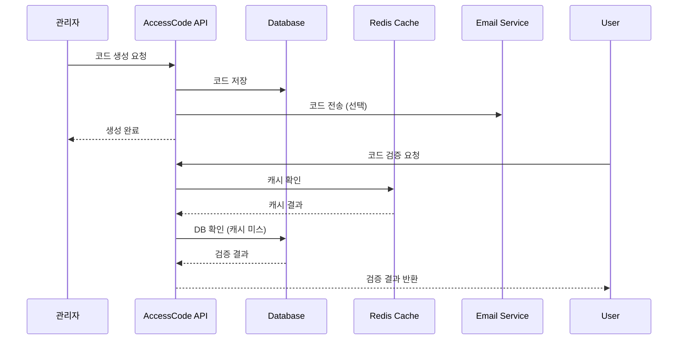
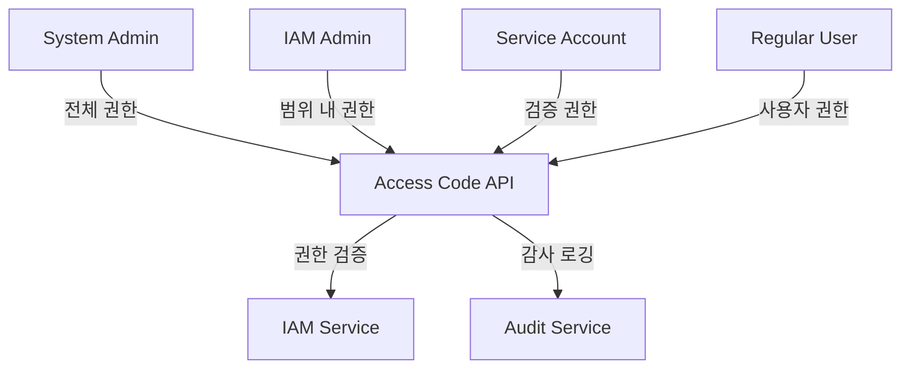

# Access Code API 개요

## 관련 문서
- [API 엔드포인트](./endpoints.md)
- [API 구현 가이드](./implementation.md)
- [API 요구사항](./requirements.md)
- [API 테스트 명세](./test-spec.md)

## 1. 소개
Access Code API는 WELT 앱 등록 및 인증을 위한 코드를 생성, 검증, 관리하는 API입니다. 이 API를 통해 관리자는 코드를 생성하고, 사용자는 발급받은 코드를 통해 앱을 등록할 수 있습니다.

## 2. 주요 기능
- 코드 생성 및 관리 ([엔드포인트](./endpoints.md#1-코드-생성-api), [구현 가이드](./implementation.md#api-구현-예제))
- 코드 유효성 검증 ([엔드포인트](./endpoints.md#2-코드-검증-api))
- 코드 사용 및 상태 관리 ([엔드포인트](./endpoints.md#3-코드-상태-관리-api))
- 일괄 코드 생성 ([엔드포인트](./endpoints.md#4-일괄-코드-생성-api))
- 코드 사용 이력 관리 ([엔드포인트](./endpoints.md#5-코드-이력-조회-api))

## 3. 기술 스택
- NestJS 프레임워크
- TypeScript
- PostgreSQL 데이터베이스
- Redis 캐싱
- JWT 인증

## 4. 아키텍처

### 4.1 시스템 구성도


### 4.2 권한 관리 구조


## 5. 권한 및 보안

### 5.1 사용자 유형별 권한
#### System Admin
- 액세스 코드 정책 관리
- 모든 액세스 코드 관리
- 액세스 코드 발급 이력 조회
- 액세스 코드 만료 정책 관리
- 긴급 액세스 코드 발급

#### IAM Admin
- 할당된 범위 내 액세스 코드 관리
- 액세스 코드 생성/재발급
- 액세스 코드 상태 관리
- 발급 이력 조회

#### Service Account
- 액세스 코드 검증
- 액세스 코드 상태 조회
- 대량 액세스 코드 검증
- 만료된 액세스 코드 조회

#### Regular User
- 자신의 액세스 코드 관리
- 액세스 코드 요청
- 액세스 코드 사용 이력 조회
- 액세스 코드 재발급 요청

### 5.2 API 사용 제한
| 사용자 유형 | 시간당 요청 제한 |
|------------|----------------|
| System Admin | 제한 없음 |
| IAM Admin | 1,000 요청 |
| Service Account | 10,000 요청 |
| Regular User | 100 요청 |

### 5.3 보안 정책
- 액세스 코드 유효 기간: 최대 24시간
- 시도 횟수 제한: 5회
- 동시 사용 불가
- 재사용 불가
- 모든 통신은 HTTPS 사용
- 코드 생성 시 암호학적으로 안전한 난수 사용
- 민감 정보 로깅 제외
- 접근 권한 엄격한 관리

## 6. 데이터 모델
> 상세 데이터 모델 정의는 [요구사항 문서의 데이터 구조 섹션](./requirements.md#api-데이터-구조)과 [데이터베이스 스키마 섹션](./requirements.md#데이터베이스-스키마)을 참조하세요.

```typescript
interface AccessCode {
  id: string;            // UUID
  code: string;          // 16자리 고유 코드
  type: AccessCodeType;  // TREATMENT, CLINICAL_TRIAL, DEMO 등
  status: CodeStatus;    // UNUSED, USED, EXPIRED, REVOKED
  expiresAt: Date;      // 만료 일시
  userId?: string;       // 사용자 ID (사용 시 기록)
  deviceId?: string;     // 디바이스 ID (사용 시 기록)
  creatorId: string;     // 생성자 ID
  createdAt: Date;      // 생성 일시
  updatedAt: Date;      // 수정 일시
  usedAt?: Date;        // 사용 일시
  scope?: string;       // 액세스 코드 범위 (GLOBAL, ORGANIZATION, TEAM)
}
```

## 7. TimeMachine 통합
> 상세 구현 가이드는 [구현 문서의 TimeMachine 통합 섹션](./implementation.md#timemachine-통합)을 참조하세요.

- 모든 시간 관련 처리는 TimeMachine 서비스를 통해 수행
- 코드 생성 및 만료 시간 계산에 TimeMachine 사용
- 코드 검증 시 현재 시간 확인에 TimeMachine 사용
- 테스트 환경에서 시간 조작을 위한 TimeMachine 옵션 지원
- 시스템 시간(new Date(), Date.now())을 직접 사용하지 않음

```typescript
// 잘못된 예
const now = new Date();
const expiresAt = new Date(now.getTime() + 30 * 24 * 60 * 60 * 1000);

// 올바른 예
const now = await timeMachineService.getCurrentDate();
const expiresAt = await timeMachineService.addDays(now, 30);
```

## 8. 에러 처리
> 상세 에러 코드 및 처리 방법은 [엔드포인트 문서의 오류 코드 섹션](./endpoints.md#7-오류-코드)과 [구현 문서의 에러 핸들링 섹션](./implementation.md#에러-핸들링)을 참조하세요.

- 표준화된 에러 응답 형식 사용
- 상황별 적절한 HTTP 상태 코드 반환
- 상세한 에러 메시지 제공
- 에러 로깅 및 모니터링

## 9. 성능 고려사항
> 상세 구현 가이드는 [구현 문서의 성능 섹션](./implementation.md#성능)을 참조하세요.

- Redis를 통한 검증 결과 캐싱
- 데이터베이스 인덱스 최적화
- 일괄 처리 API 제공
- 응답 시간 모니터링

## 10. 모니터링
> 상세 구현 가이드는 [구현 문서의 모니터링 섹션](./implementation.md#모니터링)을 참조하세요.

- API 응답 시간 모니터링
- 코드 생성/사용 현황 모니터링
- 에러 발생 현황 모니터링
- 캐시 히트율 모니터링
- 권한 검증 및 접근 시도 모니터링
- 사용자 유형별 API 사용량 추적

## 11. 변경 이력
| 버전 | 날짜 | 작성자 | 변경 내용 |
|------|------|--------|-----------|
| 0.1.0 | 2025-03-16 | bok@weltcorp.com | 최초 작성 |
| 0.1.1 | 2025-03-17 | bok@weltcorp.com | 관련 문서 링크 추가 |
| 0.2.0 | 2025-03-17 | bok@weltcorp.com | TimeMachine 통합 섹션 추가 |
| 0.3.0 | 2025-03-29 | bok@weltcorp.com | IAM 권한 관리 구조 추가 |