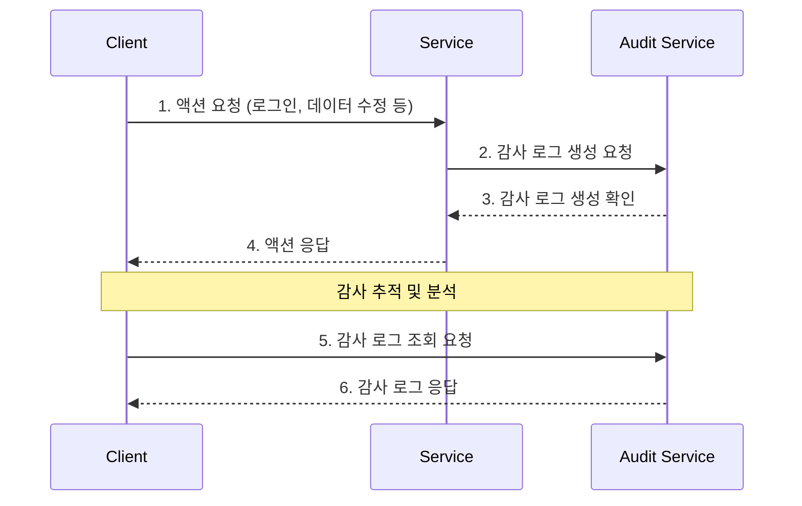
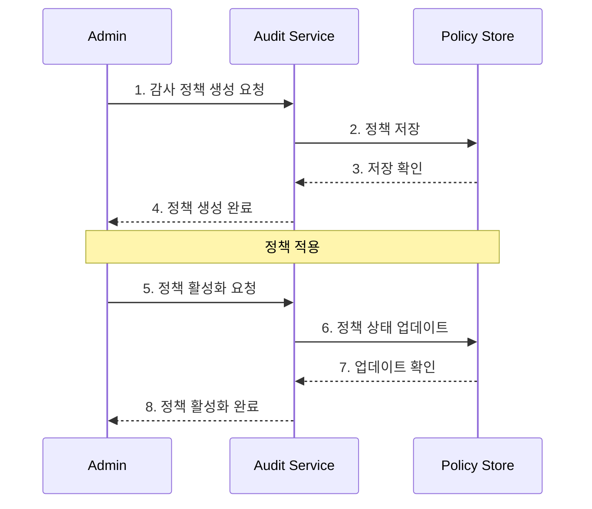
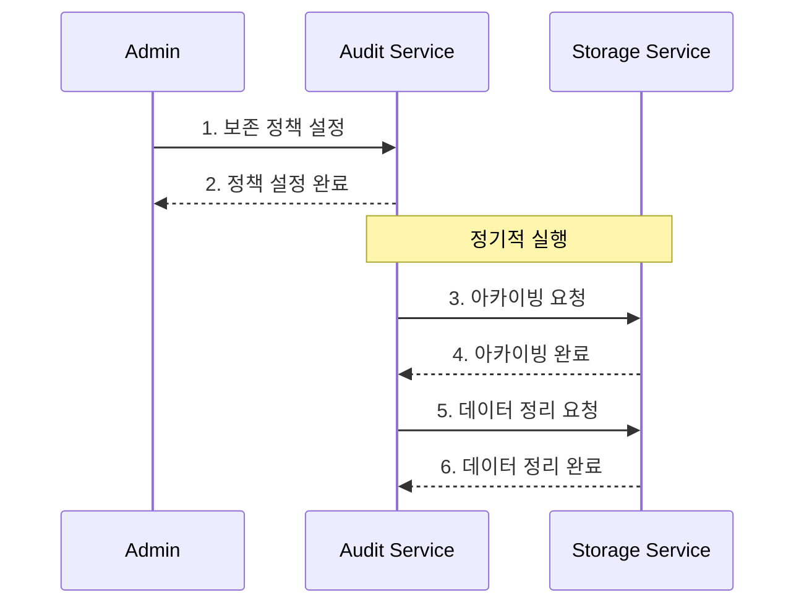
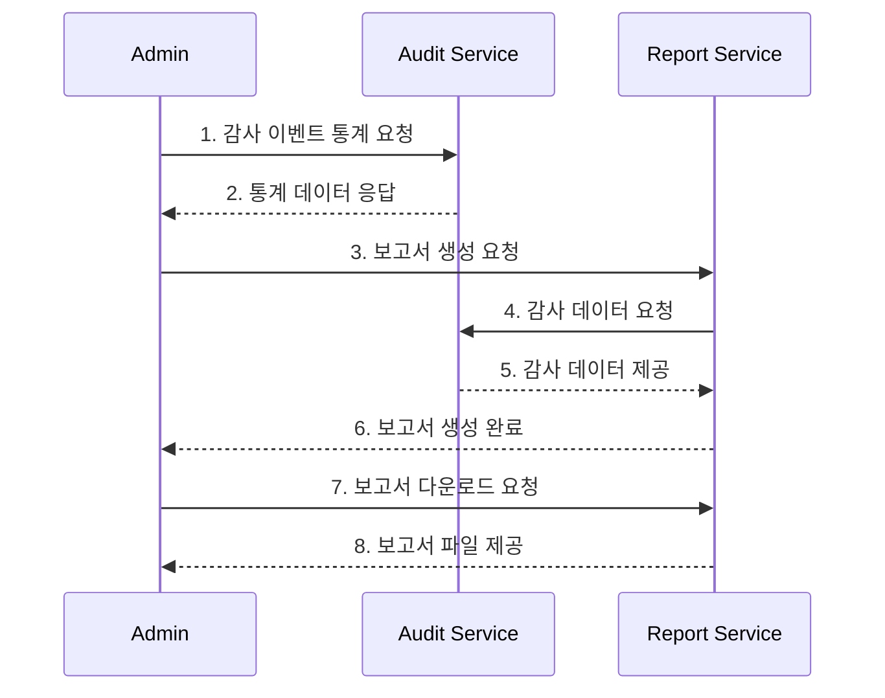

# Audit API 엔드포인트

## 목차
1. [개요](#개요)
2. [프로세스 개요](#프로세스-개요)
3. [권한 모델](#권한-모델)
4. [감사 로그 관리](#감사-로그-관리)
5. [감사 정책 관리](#감사-정책-관리)
6. [데이터 보존 관리](#데이터-보존-관리)
7. [분석 및 보고](#분석-및-보고)
8. [감사 이벤트 유형](#감사-이벤트-유형)
9. [상태 코드 및 오류 처리](#상태-코드-및-오류-처리)
10. [관련 문서](#관련-문서)
11. [변경 이력](#변경-이력)

## 개요

Audit API는 시스템 내의 모든 중요 활동을 추적하고 기록하기 위한 통합 감사 로깅 시스템을 제공합니다. 다음과 같은 주요 프로세스를 지원합니다:

1. **감사 로그 관리 프로세스**
   - 감사 로그 생성 → 감사 로그 조회 → 감사 추적 분석
   - 모든 중요 이벤트에 대한 상세 기록 유지
   - 실시간 로그 생성 및 조회 지원

2. **감사 정책 관리 프로세스**
   - 정책 생성 → 정책 관리 → 정책 적용
   - 유연한 감사 정책 설정 기능
   - 세분화된 이벤트 필터링 지원

3. **데이터 보존 관리 프로세스**
   - 보존 정책 설정 → 아카이빙 → 데이터 정리
   - 규정 준수를 위한 데이터 보존 기간 관리
   - 자동화된 아카이빙 및 정리 프로세스

4. **분석 및 보고 프로세스**
   - 통계 분석 → 보고서 생성 → 보고서 다운로드
   - 실시간 감사 데이터 분석
   - 맞춤형 보고서 생성 기능

각 프로세스별 API 엔드포인트는 아래에서 자세히 설명합니다.

## 프로세스 개요

### 1. 감사 로그 관리 프로세스

감사 로그 관리 프로세스는 시스템 내 모든 중요 작업에 대한 기록을 생성하고 조회하는 기능을 제공합니다:

1. 감사 로그 생성: 중요 이벤트 발생 시 감사 로그를 생성합니다.
2. 감사 로그 조회: 다양한 필터를 통해 감사 로그를 검색합니다.
3. 감사 추적 조회: 연관된 이벤트들의 시퀀스를 추적합니다.
4. 세션별 감사 로그 조회: 특정 세션 내 활동을 추적합니다.



### 2. 감사 정책 관리 프로세스

감사 정책 관리 프로세스는 시스템의 어떤 이벤트를 기록할지 정의하고 관리하는 기능을 제공합니다:

1. 정책 생성: 새로운 감사 정책을 정의합니다.
2. 정책 조회 및 관리: 기존 정책을 조회하고 필요에 따라 수정합니다.
3. 정책 적용: 정책을 활성화하거나 비활성화합니다.



### 3. 데이터 보존 관리 프로세스

데이터 보존 관리 프로세스는 감사 로그의 장기 보존과 데이터 수명주기 관리 기능을 제공합니다:

1. 보존 정책 설정: 데이터 유형별 보존 기간을 설정합니다.
2. 아카이빙: 오래된 데이터를 저비용 저장소로 이동합니다.
3. 데이터 정리: 보존 기간이 만료된 데이터를 안전하게 삭제합니다.



### 4. 분석 및 보고 프로세스

분석 및 보고 프로세스는 감사 데이터를 기반으로 통계 분석과 보고서 생성 기능을 제공합니다:

1. 통계 분석: 이벤트 유형, 사용자, 리소스 등에 대한 통계를 수집합니다.
2. 보고서 생성: 감사 이벤트 데이터를 기반으로 보고서를 생성합니다.
3. 보고서 다운로드: 생성된 보고서를 다운로드합니다.



## 권한 모델

> **보안 중요 사항**: 감사 로그(Audit Log) 시스템은 민감한 보안 정보를 포함하고 있으므로 적절한 접근 제어가 필수적입니다.

### 권한 레벨
1. **AUDIT_WRITE**: 감사 로그 생성 권한 (서비스 계정만 가능)
2. **AUDIT_READ**: 감사 로그 조회 권한 (관리자 이상)
3. **AUDIT_ADMIN**: 감사 정책 관리 및 데이터 보존 관리 권한 (상위 관리자)
4. **AUDIT_EXPORT**: 감사 데이터 내보내기 및 보고서 생성 권한 (관리자 이상)

### 사용자 유형별 권한

#### System Admin
- 전체 감사 로그 조회/관리
- 감사 로그 보관 정책 관리
- 감사 로그 익스포트
- 감사 알림 설정 관리
- 감사 로그 삭제 (법적 요구사항 준수)

#### IAM Admin
- 할당된 범위 내 감사 로그 조회
- 감사 로그 필터링 및 검색
- IAM 관련 감사 로그 전체 조회

#### Audit Admin
- 할당된 범위 내 감사 로그 조회/관리
- 감사 정책 관리
- 데이터 보존 정책 관리
- 보고서 생성 및 조회

#### Service Account
- 감사 로그 생성만 가능
- 자신이 생성한 로그 조회 불가
- 정책 관리 불가

#### Regular User
- 자신의 활동 로그만 조회 가능
- 정책 조회/관리 불가
- 보고서 생성 불가

### 권한 범위
- **글로벌 범위**: 시스템 관리자만 접근 가능
- **조직 범위**: 해당 조직의 관리자와 감사 관리자가 접근 가능
- **팀 범위**: 해당 팀의 관리자와 감사 관리자가 접근 가능
- **개인 범위**: 자신의 활동 로그만 접근 가능

### 접근 제한
- 모든 Audit API 엔드포인트는 인증된 사용자만 접근 가능
- 권한 부족 시 403 Forbidden 응답 반환
- 서비스 계정은 로그 생성만 가능, 조회 불가
- 기록된 감사 로그는 수정 또는 삭제 불가 (불변성 보장)
- IAM 관련 감사 로그는 추가 보안 검증 필요

### API 사용 제한
- System Admin: 제한 없음
- IAM Admin: 시간당 5,000 요청
- Service Account: 시간당 50,000 요청
- Regular User: 시간당 100 요청

### 데이터 보존 정책
- 일반 로그: 1년
- 보안 관련 로그: 3년
- 개인정보 관련 로그: 5년
- 법적 요구사항 관련 로그: 10년

### 엔드포인트 접근 권한 매트릭스

| 엔드포인트 | System Admin | IAM Admin | Audit Admin | Service Account | Regular User |
|------------|--------------|-----------|-------------|-----------------|--------------|
| POST /v1/audit/logs | ✓ | ✓ | ✓ | ✓ | ✘ |
| GET /v1/audit/logs | ✓ | 범위 내 | 범위 내 | ✘ | 자신만 |
| GET /v1/audit/trails/{correlationId} | ✓ | 범위 내 | 범위 내 | ✘ | 자신만 |
| GET /v1/audit/sessions/{sessionId}/logs | ✓ | 범위 내 | 범위 내 | ✘ | 자신만 |
| POST /v1/audit/policies | ✓ | ✘ | 범위 내 | ✘ | ✘ |
| GET /v1/audit/policies | ✓ | 범위 내 | 범위 내 | ✘ | ✘ |
| PUT /v1/audit/policies/{policyId} | ✓ | ✘ | 범위 내 | ✘ | ✘ |
| DELETE /v1/audit/policies/{policyId} | ✓ | ✘ | ✘ | ✘ | ✘ |

> 참고:
> - ✓: 접근 가능
> - ✘: 접근 불가
> - (범위 내): 할당된 조직/팀 범위 내에서만 접근 가능
> - (자신만): 자신의 데이터에만 접근 가능

## 감사 로그 관리

### 1. 감사 로그 생성

#### 요청 (Request)
- HTTP 메서드: POST
- 경로: /v1/audit/logs
- Headers:
  - Authorization: Bearer {token}
  - Content-Type: application/json
- 필요 권한: **AUDIT_WRITE**
- Body:
```json
{
  "eventType": "USER_LOGIN",
  "source": "auth-service",
  "actor": {
    "type": "USER",
    "id": "user123",
    "name": "John Doe",
    "attributes": {
      "role": "admin"
    }
  },
  "target": {
    "type": "RESOURCE",
    "id": "system",
    "name": "Admin Portal",
    "resourceType": "APPLICATION"
  },
  "action": "LOGIN",
  "details": {
    "ipAddress": "192.168.1.1",
    "loginMethod": "password"
  },
  "metadata": {
    "correlationId": "corr-123",
    "requestId": "req-456",
    "ipAddress": "192.168.1.1",
    "userAgent": "Mozilla/5.0",
    "sessionId": "sess-789"
  },
  "status": "SUCCESS"
}
```

#### 응답 (Response)
- 성공 응답 (201 Created):
```json
{
  "status": 201,
  "data": {
    "id": "audit-log-123",
    "timestamp": "2025-03-19T09:30:45.123Z",
    "eventType": "USER_LOGIN",
    "source": "auth-service",
    "actor": {
      "type": "USER",
      "id": "user123",
      "name": "John Doe",
      "attributes": {
        "role": "admin"
      }
    },
    "target": {
      "type": "RESOURCE",
      "id": "system",
      "name": "Admin Portal",
      "resourceType": "APPLICATION"
    },
    "action": "LOGIN",
    "details": {
      "ipAddress": "192.168.1.1",
      "loginMethod": "password"
    },
    "metadata": {
      "correlationId": "corr-123",
      "requestId": "req-456",
      "ipAddress": "192.168.1.1",
      "userAgent": "Mozilla/5.0",
      "sessionId": "sess-789"
    },
    "status": "SUCCESS"
  }
}
```

- 실패 응답 (400 Bad Request):
```json
{
  "status": 400,
  "code": 1001,
  "message": "INVALID_INPUT",
  "detail": "Invalid input parameters",
  "errors": [
    {
      "field": "eventType",
      "message": "Event type is required"
    }
  ]
}
```

### 2. 감사 로그 조회

#### 요청 (Request)
- HTTP 메서드: GET
- 경로: /v1/audit/logs
- Headers:
  - Authorization: Bearer {token}
- 필요 권한: **AUDIT_READ**
- Query Parameters:
  - startDate: 시작 날짜 (ISO 형식, 예: 2025-03-01T00:00:00Z)
  - endDate: 종료 날짜 (ISO 형식, 예: 2025-03-19T23:59:59Z)
  - eventType: 이벤트 유형 (예: USER_LOGIN)
  - source: 이벤트 소스
  - actorId: 액터 ID
  - actorType: 액터 유형
  - targetId: 타겟 ID
  - targetType: 타겟 유형
  - action: 수행된 작업
  - status: 상태 (SUCCESS, FAILURE)
  - page: 페이지 번호 (기본값: 1)
  - size: 페이지 크기 (기본값: 20)
  - sort: 정렬 필드 (기본값: timestamp)
  - order: 정렬 방향 (asc, desc, 기본값: desc)

#### 응답 (Response)
- 성공 응답 (200 OK):
```json
{
  "status": 200,
  "data": {
    "items": [
      {
        "id": "audit-log-123",
        "timestamp": "2025-03-19T09:30:45.123Z",
        "eventType": "USER_LOGIN",
        "source": "auth-service",
        "actor": {
          "type": "USER",
          "id": "user123",
          "name": "John Doe"
        },
        "target": {
          "type": "RESOURCE",
          "id": "system",
          "name": "Admin Portal"
        },
        "action": "LOGIN",
        "details": {
          "ipAddress": "192.168.1.1",
          "loginMethod": "password"
        },
        "metadata": {
          "correlationId": "corr-123",
          "sessionId": "sess-789"
        },
        "status": "SUCCESS"
      }
    ],
    "pagination": {
      "page": 1,
      "size": 20,
      "total": 145,
      "totalPages": 8
    }
  }
}
```

### 3. 감사 추적(Audit Trail) 조회

#### 요청 (Request)
- HTTP 메서드: GET
- 경로: /v1/audit/trails/{correlationId}
- Headers:
  - Authorization: Bearer {token}
- 필요 권한: **AUDIT_READ**
- Path Parameters:
  - correlationId: 연관 이벤트를 추적하기 위한 ID

#### 응답 (Response)
- 성공 응답 (200 OK):
```json
{
  "status": 200,
  "data": {
    "correlationId": "corr-123",
    "startTimestamp": "2025-03-19T09:30:45.123Z",
    "endTimestamp": "2025-03-19T09:35:12.456Z",
    "events": [
      {
        "id": "audit-log-123",
        "timestamp": "2025-03-19T09:30:45.123Z",
        "eventType": "USER_LOGIN",
        "source": "auth-service",
        "action": "LOGIN",
        "status": "SUCCESS"
      },
      {
        "id": "audit-log-124",
        "timestamp": "2025-03-19T09:32:10.789Z",
        "eventType": "ROLE_CHANGE",
        "source": "user-service",
        "action": "UPDATE",
        "status": "SUCCESS"
      },
      {
        "id": "audit-log-125",
        "timestamp": "2025-03-19T09:35:12.456Z",
        "eventType": "USER_LOGOUT",
        "source": "auth-service",
        "action": "LOGOUT",
        "status": "SUCCESS"
      }
    ]
  }
}
```

### 4. 세션별 감사 로그 조회

#### 요청 (Request)
- HTTP 메서드: GET
- 경로: /v1/audit/sessions/{sessionId}/logs
- Headers:
  - Authorization: Bearer {token}
- 필요 권한: **AUDIT_READ**
- Path Parameters:
  - sessionId: 클라이언트 세션 ID
- Query Parameters:
  - page: 페이지 번호 (기본값: 1)
  - size: 페이지 크기 (기본값: 20)

#### 응답 (Response)
- 성공 응답 (200 OK):
```json
{
  "status": 200,
  "data": {
    "sessionId": "sess-789",
    "startTimestamp": "2025-03-19T09:30:45.123Z",
    "endTimestamp": "2025-03-19T09:35:12.456Z",
    "userId": "user123",
    "userName": "John Doe",
    "ipAddress": "192.168.1.1",
    "userAgent": "Mozilla/5.0",
    "events": [
      {
        "id": "audit-log-123",
        "timestamp": "2025-03-19T09:30:45.123Z",
        "eventType": "USER_LOGIN",
        "action": "LOGIN",
        "status": "SUCCESS"
      },
      {
        "id": "audit-log-125",
        "timestamp": "2025-03-19T09:35:12.456Z",
        "eventType": "USER_LOGOUT",
        "action": "LOGOUT",
        "status": "SUCCESS"
      }
    ]
  }
}
```

## 감사 정책 관리

### 1. 감사 정책 생성

#### 요청 (Request)
- HTTP 메서드: POST
- 경로: /v1/audit/policies
- Headers:
  - Authorization: Bearer {token}
  - Content-Type: application/json
- 필요 권한: **AUDIT_ADMIN**
- Body:
```json
{
  "name": "User Authentication Policy",
  "description": "Audit policy for user authentication events",
  "eventTypes": ["USER_LOGIN", "USER_LOGOUT", "PASSWORD_CHANGE"],
  "sources": ["auth-service"],
  "enabled": true,
  "retentionPeriod": "P1Y" // ISO 8601 기간 형식 (1년)
}
```

#### 응답 (Response)
- 성공 응답 (201 Created):
```json
{
  "status": 201,
  "data": {
    "id": "policy-123",
    "name": "User Authentication Policy",
    "description": "Audit policy for user authentication events",
    "eventTypes": ["USER_LOGIN", "USER_LOGOUT", "PASSWORD_CHANGE"],
    "sources": ["auth-service"],
    "enabled": true,
    "retentionPeriod": "P1Y",
    "createdAt": "2025-03-19T10:15:30.123Z",
    "updatedAt": "2025-03-19T10:15:30.123Z"
  }
}
```

### 2. 감사 정책 조회

#### 요청 (Request)
- HTTP 메서드: GET
- 경로: /v1/audit/policies
- Headers:
  - Authorization: Bearer {token}
- 필요 권한: **AUDIT_READ** 또는 **AUDIT_ADMIN**
- Query Parameters:
  - name: 정책 이름 (부분 일치)
  - enabled: 활성화 상태 (true/false)
  - page: 페이지 번호 (기본값: 1)
  - size: 페이지 크기 (기본값: 20)

#### 응답 (Response)
- 성공 응답 (200 OK):
```json
{
  "status": 200,
  "data": {
    "items": [
      {
        "id": "policy-123",
        "name": "User Authentication Policy",
        "description": "Audit policy for user authentication events",
        "eventTypes": ["USER_LOGIN", "USER_LOGOUT", "PASSWORD_CHANGE"],
        "sources": ["auth-service"],
        "enabled": true,
        "retentionPeriod": "P1Y",
        "createdAt": "2025-03-19T10:15:30.123Z",
        "updatedAt": "2025-03-19T10:15:30.123Z"
      }
    ],
    "pagination": {
      "page": 1,
      "size": 20,
      "total": 5,
      "totalPages": 1
    }
  }
}
```

### 3. 감사 정책 수정

#### 요청 (Request)
- HTTP 메서드: PUT
- 경로: /v1/audit/policies/{policyId}
- Headers:
  - Authorization: Bearer {token}
  - Content-Type: application/json
- 필요 권한: **AUDIT_ADMIN**
- Path Parameters:
  - policyId: 정책 ID
- Body:
```json
{
  "name": "User Authentication Policy",
  "description": "Updated audit policy for user authentication events",
  "eventTypes": ["USER_LOGIN", "USER_LOGOUT", "PASSWORD_CHANGE", "MFA_VERIFICATION"],
  "sources": ["auth-service"],
  "enabled": true,
  "retentionPeriod": "P2Y" // 2년으로 변경
}
```

#### 응답 (Response)
- 성공 응답 (200 OK):
```json
{
  "status": 200,
  "data": {
    "id": "policy-123",
    "name": "User Authentication Policy",
    "description": "Updated audit policy for user authentication events",
    "eventTypes": ["USER_LOGIN", "USER_LOGOUT", "PASSWORD_CHANGE", "MFA_VERIFICATION"],
    "sources": ["auth-service"],
    "enabled": true,
    "retentionPeriod": "P2Y",
    "createdAt": "2025-03-19T10:15:30.123Z",
    "updatedAt": "2025-03-19T11:45:22.456Z"
  }
}
```

### 4. 감사 정책 삭제

#### 요청 (Request)
- HTTP 메서드: DELETE
- 경로: /v1/audit/policies/{policyId}
- Headers:
  - Authorization: Bearer {token}
- 필요 권한: **AUDIT_ADMIN**
- Path Parameters:
  - policyId: 정책 ID

#### 응답 (Response)
- 성공 응답 (204 No Content)

### 5. 감사 정책 활성화/비활성화

#### 요청 (Request)
- HTTP 메서드: PATCH
- 경로: /v1/audit/policies/{policyId}/status
- Headers:
  - Authorization: Bearer {token}
  - Content-Type: application/json
- 필요 권한: **AUDIT_ADMIN**
- Path Parameters:
  - policyId: 정책 ID
- Body:
```json
{
  "enabled": false
}
```

#### 응답 (Response)
- 성공 응답 (200 OK):
```json
{
  "status": 200,
  "data": {
    "id": "policy-123",
    "enabled": false,
    "updatedAt": "2025-03-19T12:30:15.789Z"
  }
}
```

## 데이터 보존 관리 API

### 1. 보존 정책 적용

- HTTP 메서드: POST
- 경로: /v1/audit/retention/apply
- Headers:
  - Authorization: Bearer {token}
  - Content-Type: application/json
- 필요 권한: **AUDIT_ADMIN**

#### 요청 (Request)
```json
{
  "policyId": "policy-123"
}
```

#### 응답 (Response)
- 성공 응답 (202 Accepted):
```json
{
  "status": 202,
  "data": {
    "taskId": "task-123",
    "policyId": "policy-123",
    "status": "SCHEDULED",
    "scheduledAt": "2025-03-19T13:00:00.000Z",
    "estimatedCompletionTime": "2025-03-19T13:15:00.000Z"
  }
}
```

### 2. 아카이빙 요청

- HTTP 메서드: POST
- 경로: /v1/audit/retention/archive
- Headers:
  - Authorization: Bearer {token}
  - Content-Type: application/json
- 필요 권한: **AUDIT_ADMIN**

#### 요청 (Request)
```json
{
  "startDate": "2024-01-01T00:00:00Z",
  "endDate": "2024-12-31T23:59:59Z",
  "destination": "GCS",
  "bucketName": "audit-archives",
  "compressionEnabled": true
}
```

#### 응답 (Response)
- 성공 응답 (202 Accepted):
```json
{
  "status": 202,
  "data": {
    "taskId": "task-456",
    "type": "ARCHIVE",
    "status": "SCHEDULED",
    "params": {
      "startDate": "2024-01-01T00:00:00Z",
      "endDate": "2024-12-31T23:59:59Z",
      "destination": "GCS",
      "bucketName": "audit-archives"
    },
    "scheduledAt": "2025-03-19T14:00:00.000Z",
    "estimatedCompletionTime": "2025-03-19T15:30:00.000Z"
  }
}
```

### 3. 데이터 정리 요청

- HTTP 메서드: POST
- 경로: /v1/audit/retention/purge
- Headers:
  - Authorization: Bearer {token}
  - Content-Type: application/json
- 필요 권한: **AUDIT_ADMIN**

#### 요청 (Request)
```json
{
  "endDate": "2023-12-31T23:59:59Z",
  "confirmationCode": "PURGE-DATA"
}
```

#### 응답 (Response)
- 성공 응답 (202 Accepted):
```json
{
  "status": 202,
  "data": {
    "taskId": "task-789",
    "type": "PURGE",
    "status": "SCHEDULED",
    "params": {
      "endDate": "2023-12-31T23:59:59Z"
    },
    "scheduledAt": "2025-03-19T16:00:00.000Z",
    "estimatedCompletionTime": "2025-03-19T16:30:00.000Z"
  }
}
```

## 분석 및 보고 API

### 1. 감사 이벤트 통계 조회

- HTTP 메서드: GET
- 경로: /v1/audit/analytics/statistics
- Headers:
  - Authorization: Bearer {token}
- 필요 권한: **AUDIT_READ** 또는 **AUDIT_EXPORT**
- Query Parameters:
  - startDate: 시작 날짜 (ISO 형식, 예: 2025-03-01T00:00:00Z)
  - endDate: 종료 날짜 (ISO 형식, 예: 2025-03-19T23:59:59Z)
  - groupBy: 통계 그룹화 기준 (eventType, source, action, status)
  - interval: 시간 간격 (hour, day, week, month)

#### 응답 (Response)
- 성공 응답 (200 OK):
```json
{
  "status": 200,
  "data": {
    "startDate": "2025-03-01T00:00:00Z",
    "endDate": "2025-03-19T23:59:59Z",
    "totalCount": 1542,
    "groupBy": "eventType",
    "interval": "day",
    "series": [
      {
        "key": "USER_LOGIN",
        "count": 843,
        "timeSeries": [
          { "timestamp": "2025-03-01T00:00:00Z", "count": 42 },
          { "timestamp": "2025-03-02T00:00:00Z", "count": 51 }
        ]
      },
      {
        "key": "USER_LOGOUT",
        "count": 699,
        "timeSeries": [
          { "timestamp": "2025-03-01T00:00:00Z", "count": 35 },
          { "timestamp": "2025-03-02T00:00:00Z", "count": 45 }
        ]
      }
    ]
  }
}
```

### 2. 보고서 생성

- HTTP 메서드: POST
- 경로: /v1/audit/reports
- Headers:
  - Authorization: Bearer {token}
  - Content-Type: application/json
- 필요 권한: **AUDIT_EXPORT**

#### 요청 (Request)
```json
{
  "name": "Monthly User Activity Report",
  "description": "User login/logout activities for March 2025",
  "criteria": {
    "startDate": "2025-03-01T00:00:00Z",
    "endDate": "2025-03-31T23:59:59Z",
    "eventTypes": ["USER_LOGIN", "USER_LOGOUT"],
    "sources": ["auth-service"]
  },
  "format": "PDF",
  "schedule": {
    "type": "ONCE",
    "scheduledAt": "2025-04-01T09:00:00Z"
  }
}
```

#### 응답 (Response)
- 성공 응답 (201 Created):
```json
{
  "status": 201,
  "data": {
    "id": "report-123",
    "name": "Monthly User Activity Report",
    "description": "User login/logout activities for March 2025",
    "criteria": {
      "startDate": "2025-03-01T00:00:00Z",
      "endDate": "2025-03-31T23:59:59Z",
      "eventTypes": ["USER_LOGIN", "USER_LOGOUT"],
      "sources": ["auth-service"]
    },
    "format": "PDF",
    "status": "SCHEDULED",
    "schedule": {
      "type": "ONCE",
      "scheduledAt": "2025-04-01T09:00:00Z"
    },
    "createdAt": "2025-03-19T17:15:30.123Z"
  }
}
```

### 3. 보고서 다운로드

- HTTP 메서드: GET
- 경로: /v1/audit/reports/{reportId}/download
- Headers:
  - Authorization: Bearer {token}
- 필요 권한: **AUDIT_EXPORT**
- Path Parameters:
  - reportId: 보고서 ID

#### 응답 (Response)
- 성공 응답 (200 OK):
  - Content-Type: application/pdf
  - Content-Disposition: attachment; filename="report-123.pdf"
  - 파일 내용 (이진 데이터)

## 감사 이벤트 유형

### 사용자 활동
- `USER_LOGIN` - 사용자 로그인
- `USER_LOGOUT` - 사용자 로그아웃
- `USER_PROFILE_VIEW` - 사용자 프로필 조회
- `USER_PROFILE_UPDATE` - 사용자 프로필 업데이트
- `PASSWORD_CHANGE` - 비밀번호 변경
- `PASSWORD_RESET` - 비밀번호 재설정

### 데이터 변경
- `DATA_CREATE` - 데이터 생성
- `DATA_UPDATE` - 데이터 업데이트
- `DATA_DELETE` - 데이터 삭제
- `DATA_ACCESS` - 데이터 접근

### 권한 관리
- `PERMISSION_GRANT` - 권한 부여
- `PERMISSION_REVOKE` - 권한 취소
- `ROLE_CHANGE` - 역할 변경
- `CONSENT_CHANGE` - 동의 변경

### IAM 이벤트
- `IAM_ROLE_CREATE` - IAM 역할 생성
- `IAM_ROLE_UPDATE` - IAM 역할 수정
- `IAM_ROLE_DELETE` - IAM 역할 삭제
- `IAM_POLICY_CREATE` - IAM 정책 생성
- `IAM_POLICY_UPDATE` - IAM 정책 수정
- `IAM_POLICY_DELETE` - IAM 정책 삭제
- `IAM_USER_ROLE_ASSIGN` - 사용자에게 역할 할당
- `IAM_USER_ROLE_REVOKE` - 사용자의 역할 회수
- `IAM_GROUP_CREATE` - IAM 그룹 생성
- `IAM_GROUP_UPDATE` - IAM 그룹 수정
- `IAM_GROUP_DELETE` - IAM 그룹 삭제
- `IAM_USER_GROUP_ADD` - 사용자를 그룹에 추가
- `IAM_USER_GROUP_REMOVE` - 사용자를 그룹에서 제거
- `IAM_SCOPE_CHANGE` - IAM 범위 변경
- `IAM_PERMISSION_VERIFY` - IAM 권한 검증

### 시스템 이벤트
- `SERVICE_START` - 서비스 시작
- `SERVICE_STOP` - 서비스 중지
- `CONFIG_CHANGE` - 설정 변경
- `POLICY_CHANGE` - 정책 변경
- `AUDIT_POLICY_CHANGE` - 감사 정책 변경

### 보안 이벤트
- `LOGIN_FAILURE` - 로그인 실패
- `ACCESS_DENIED` - 접근 거부
- `SUSPICIOUS_ACTIVITY` - 의심스러운 활동
- `RATE_LIMIT_EXCEEDED` - 요청 제한 초과

## 상태 코드 및 오류 처리

### HTTP 상태 코드 요약
| 상태 코드 | 설명 | 상황 |
|----------|------|------|
| 200 | OK | 요청 성공 |
| 201 | Created | 리소스 생성 성공 |
| 202 | Accepted | 비동기 작업 요청 수락 |
| 400 | Bad Request | 잘못된 요청 |
| 401 | Unauthorized | 인증 필요 |
| 403 | Forbidden | 권한 없음 |
| 404 | Not Found | 리소스 없음 |
| 500 | Internal Server Error | 서버 오류 |
| 503 | Service Unavailable | 서비스 불가 |

## 오류 코드
> 상세 에러 처리 구현은 [구현 문서의 에러 핸들링 섹션](./implementation.md#에러-핸들링)을 참조하세요.

| HTTP 상태 코드 | 오류 코드 | 메시지 | 설명 | 대응 방법 |
|--------------|---------|--------|------|---------|
| 400 | 3001 | INVALID_EVENT_TYPE | 유효하지 않은 이벤트 유형 | 지원되는 이벤트 유형으로 다시 요청 |
| 400 | 3002 | INVALID_AUDIT_POLICY | 유효하지 않은 감사 정책 | 정책 설정 확인 |
| 400 | 3003 | INVALID_DATE_RANGE | 유효하지 않은 날짜 범위 | 올바른 날짜 범위로 다시 요청 |
| 400 | 3004 | INVALID_RETENTION_PERIOD | 유효하지 않은 보존 기간 | ISO 8601 기간 형식 확인 |
| 400 | 3005 | MISSING_REQUIRED_FIELD | 필수 필드 누락 | 필수 필드 포함하여 다시 요청 |
| 401 | 3101 | INVALID_SERVICE_TOKEN | 유효하지 않은 서비스 토큰 | 서비스 토큰 재발급 |
| 401 | 3102 | EXPIRED_SERVICE_TOKEN | 만료된 서비스 토큰 | 서비스 토큰 갱신 |
| 403 | 3201 | AUDIT_PERMISSION_DENIED | 감사 로그 접근 권한 없음 | 필요한 권한 확인 |
| 403 | 3202 | POLICY_PERMISSION_DENIED | 감사 정책 관리 권한 없음 | AUDIT_ADMIN 권한 확인 |
| 403 | 3203 | RETENTION_PERMISSION_DENIED | 데이터 보존 관리 권한 없음 | AUDIT_ADMIN 권한 확인 |
| 404 | 3301 | AUDIT_LOG_NOT_FOUND | 감사 로그를 찾을 수 없음 | 로그 ID 확인 |
| 404 | 3302 | AUDIT_POLICY_NOT_FOUND | 감사 정책을 찾을 수 없음 | 정책 ID 확인 |
| 404 | 3303 | REPORT_NOT_FOUND | 보고서를 찾을 수 없음 | 보고서 ID 확인 |
| 409 | 3401 | DUPLICATE_POLICY_NAME | 중복된 정책 이름 | 다른 정책 이름 사용 |
| 409 | 3402 | POLICY_IN_USE | 사용 중인 정책 삭제 시도 | 정책 비활성화 후 삭제 |
| 410 | 3501 | REPORT_EXPIRED | 보고서 다운로드 기간 만료 | 보고서 재생성 |
| 429 | 3601 | RATE_LIMIT_EXCEEDED | API 호출 한도 초과 | 잠시 후 다시 시도 |

### 오류 응답 예시
```json
{
  "status": 400,
  "code": 3001,
  "message": "INVALID_EVENT_TYPE",
  "detail": "Provided event type is not supported",
  "errors": [
    {
      "field": "eventType",
      "message": "Must be one of: USER_LOGIN, USER_LOGOUT, ..."
    }
  ]
}
```

## 관련 문서
- [API 개요](./overview.md)
- [API 구현 가이드](./implementation.md)
- [API 요구사항](./requirements.md)
- [API 테스트 명세](./test-spec.md)

## 변경 이력
| 버전 | 날짜 | 작성자 | 변경 내용 |
|------|------|--------|-----------|
| 0.1.0 | 2025-03-19 | bok@weltcorp.com | 최초 작성 |