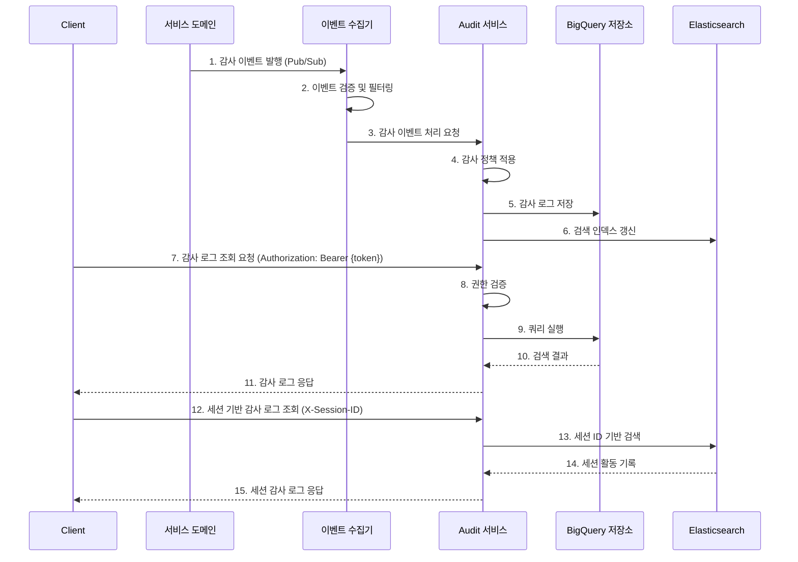

# Audit API 개요

## 관련 문서
- [API 엔드포인트](./endpoints.md)
- [API 구현 가이드](./implementation.md)
- [API 요구사항](./requirements.md)
- [API 테스트 명세](./test-spec.md)

## 1. 소개
Audit API는 WELT 서비스 내 모든 중요 활동과 변경사항을 기록하고 추적하는 감사 시스템을 위한 API입니다. 규제 준수, 보안 모니터링, 문제 해결 및 사용자 활동 추적을 위한 통합 감사 로그 관리 기능을 제공합니다.

## 2. 주요 기능
- 감사 로그 생성 및 수집 ([엔드포인트](./endpoints.md#1-감사-로그-수집))
- 감사 로그 조회 및 검색 ([엔드포인트](./endpoints.md#2-감사-로그-조회))
- 감사 정책 관리 ([엔드포인트](./endpoints.md#3-감사-정책-관리))
- 보존 정책 관리 ([엔드포인트](./endpoints.md#4-보존-관리))
- 세션 기반 감사 추적 ([엔드포인트](./endpoints.md#5-세션-기반-추적))

## 3. 기술 스택
- NestJS 프레임워크
- TypeScript
- BigQuery (데이터 스토리지)
- GCP Pub/Sub (이벤트 수집)
- Redis (캐싱 및 임시 데이터)

## 4. 아키텍처


## 5. 감사 로깅 흐름

### 1. [감사 로그 수집](./endpoints.md#1-감사-로그-수집)
- 다양한 서비스 도메인에서 감사 이벤트 발행 (Pub/Sub 사용)
- 이벤트 수집기가 이벤트를 수신하여 검증 및 필터링
- 감사 정책에 따라 로그 저장 및 인덱싱

### 2. [감사 로그 조회](./endpoints.md#2-감사-로그-조회)
- 권한이 있는 사용자만 감사 로그 조회 가능
- 다양한 필터 조건으로 검색 지원 (시간, 이벤트 유형, 소스, 사용자 등)
- 집계 데이터 및 통계 정보 제공

### 3. [감사 정책 관리](./endpoints.md#3-감사-정책-관리)
- 감사 대상 이벤트 유형과 소스 설정
- 이벤트별 보존 기간 정의
- 민감 정보 마스킹 규칙 설정

### 4. [보존 관리](./endpoints.md#4-보존-관리)
- 데이터 보존 정책 관리
- 만료된 데이터 아카이빙
- 법적 보존(Legal Hold) 설정

### 5. [세션 기반 추적](./endpoints.md#5-세션-기반-추적)
- 클라이언트 세션 ID 기반 활동 추적
- 특정 세션의 전체 활동 이력 조회
- 세션 기반 이상 행동 탐지

## 6. 데이터 모델
> 상세 데이터 모델 정의는 [요구사항 문서의 데이터 구조 섹션](./requirements.md#api-데이터-구조)과 [데이터베이스 스키마 섹션](./requirements.md#데이터베이스-스키마)을 참조하세요.

```typescript
interface AuditLog {
  id: string;              // 감사 로그 고유 식별자
  timestamp: string;       // 이벤트 발생 시간 (ISO 8601 형식)
  eventType: string;       // 이벤트 유형
  source: string;          // 이벤트 발생 소스
  actor?: Actor;           // 이벤트를 발생시킨 주체
  target?: Target;         // 이벤트의 대상
  action: string;          // 수행된 작업
  details?: object;        // 이벤트 상세 정보
  metadata?: AuditMetadata; // 감사 관련 메타데이터
  status: 'SUCCESS' | 'FAILURE'; // 감사 로그 상태
}

interface Actor {
  type: 'USER' | 'SYSTEM' | 'SERVICE'; // 주체 유형
  id: string;              // 주체 식별자
  name?: string;           // 주체 이름
  attributes?: object;     // 추가 속성
}

interface Target {
  type: 'USER' | 'RESOURCE' | 'SYSTEM'; // 대상 유형
  id: string;              // 대상 식별자
  name?: string;           // 대상 이름
  resourceType?: string;   // 리소스 유형
  attributes?: object;     // 추가 속성
}

interface AuditMetadata {
  correlationId?: string;  // 연관 이벤트 추적 ID
  requestId?: string;      // 요청 식별자
  ipAddress?: string;      // 이벤트 발생 IP 주소
  userAgent?: string;      // 사용자 에이전트 정보
  sessionId?: string;      // 클라이언트 세션 식별자
}

interface AuditPolicy {
  id: string;              // 정책 고유 식별자
  name: string;            // 정책 이름
  description?: string;    // 정책 설명
  eventTypes: string[];    // 수집할 이벤트 유형 목록
  sources: string[];       // 대상 소스 목록
  enabled: boolean;        // 정책 활성화 여부
  retentionPeriod: number; // 데이터 보존 기간 (일)
  createdAt: string;       // 정책 생성 시간
  updatedAt: string;       // 정책 수정 시간
}
```

## 7. 보안 고려사항
> 상세 구현 가이드는 [구현 문서의 보안 섹션](./implementation.md#보안)을 참조하세요.

- 모든 통신은 HTTPS 사용
- JWT 기반 API 접근 제어
- 적절한 권한 검증
- 감사 데이터 불변성 보장
- 개인정보 마스킹
- Rate Limiting
- 감사 로그 조회 권한 엄격 관리

## 8. 성능 고려사항
> 상세 구현 가이드는 [구현 문서의 성능 섹션](./implementation.md#성능)을 참조하세요.

- BigQuery 파티셔닝 및 인덱싱
- 효율적인 이벤트 수집 및 처리
- 검색 최적화
- 캐싱 전략
- 비동기 처리

## 9. 모니터링
> 상세 구현 가이드는 [구현 문서의 모니터링 섹션](./implementation.md#모니터링)을 참조하세요.

- 이벤트 수집 지연 모니터링
- 쿼리 성능 모니터링
- 저장 용량 모니터링
- 감사 정책 변경 감사

## 10. 에러 처리
> 상세 에러 코드 및 처리 방법은 [엔드포인트 문서의 오류 코드 섹션](./endpoints.md#8-오류-코드)과 [구현 문서의 에러 핸들링 섹션](./implementation.md#에러-핸들링)을 참조하세요.

- 표준화된 에러 응답
- 상세한 에러 메시지
- 이벤트 수집 오류 처리 전략
- 데이터 무결성 보장

## 11. 감사 이벤트 유형

Audit 시스템은 다음과 같은 주요 이벤트 유형을 지원합니다:

### 사용자 활동
- `USER_LOGIN` - 사용자 로그인
- `USER_LOGOUT` - 사용자 로그아웃
- `USER_PROFILE_VIEW` - 사용자 프로필 조회
- `USER_PROFILE_UPDATE` - 사용자 프로필 업데이트
- `PASSWORD_CHANGE` - 비밀번호 변경
- `PASSWORD_RESET` - 비밀번호 재설정

### 데이터 변경
- `DATA_CREATE` - 데이터 생성
- `DATA_UPDATE` - 데이터 업데이트
- `DATA_DELETE` - 데이터 삭제
- `DATA_ACCESS` - 데이터 접근

### 권한 관리
- `PERMISSION_GRANT` - 권한 부여
- `PERMISSION_REVOKE` - 권한 취소
- `ROLE_CHANGE` - 역할 변경
- `CONSENT_CHANGE` - 동의 변경

### 시스템 이벤트
- `SERVICE_START` - 서비스 시작
- `SERVICE_STOP` - 서비스 중지
- `CONFIG_CHANGE` - 설정 변경
- `POLICY_CHANGE` - 정책 변경
- `AUDIT_POLICY_CHANGE` - 감사 정책 변경

### 보안 이벤트
- `LOGIN_FAILURE` - 로그인 실패
- `ACCESS_DENIED` - 접근 거부
- `SUSPICIOUS_ACTIVITY` - 의심스러운 활동
- `RATE_LIMIT_EXCEEDED` - 요청 제한 초과

## 권한 및 제한 사항

감사 로그 시스템은 민감한 정보를 다루므로 적절한 접근 제어가 필수적입니다. 
사용자 유형별 권한, API 사용 제한, 데이터 보존 정책에 대한 자세한 내용은 [Audit API 엔드포인트 문서](./endpoints.md#권한-모델)를 참조하세요.

## 변경 이력
| 버전 | 날짜 | 작성자 | 변경 내용 |
|------|------|--------|-----------|
| 0.1.0 | 2025-03-19 | bok@weltcorp.com | 최초 작성 |
| 0.1.1 | 2025-03-20 | bok@weltcorp.com | 권한 모델 섹션 통합 