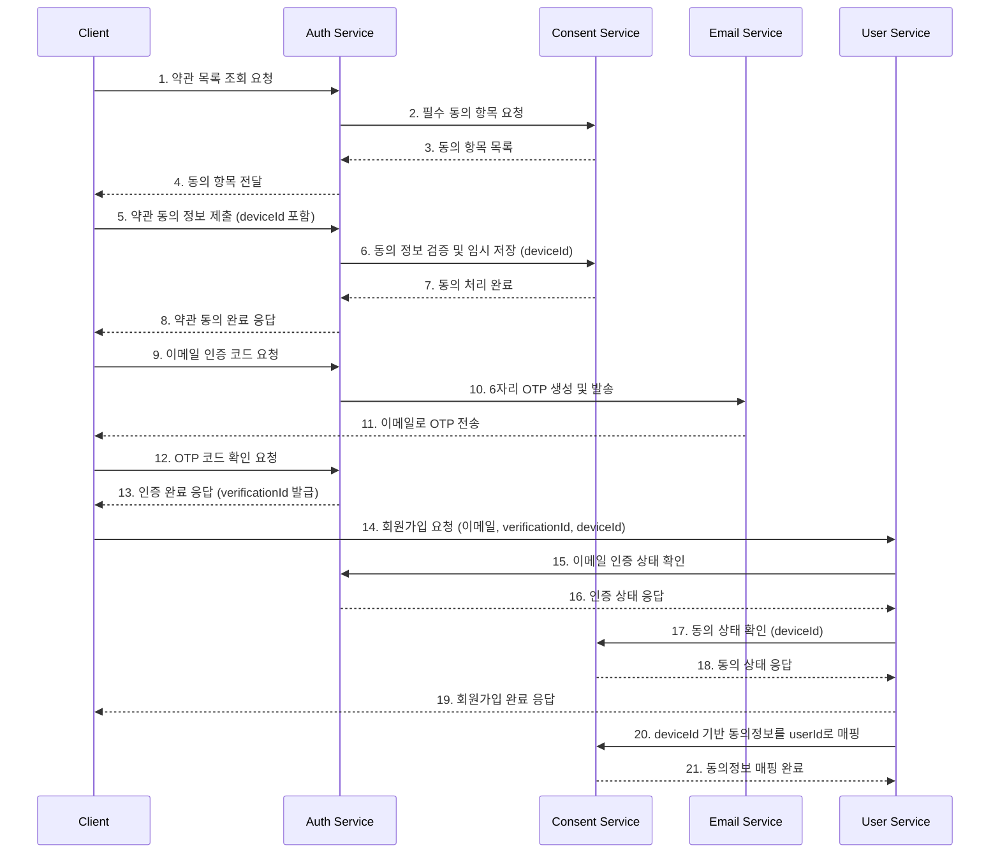
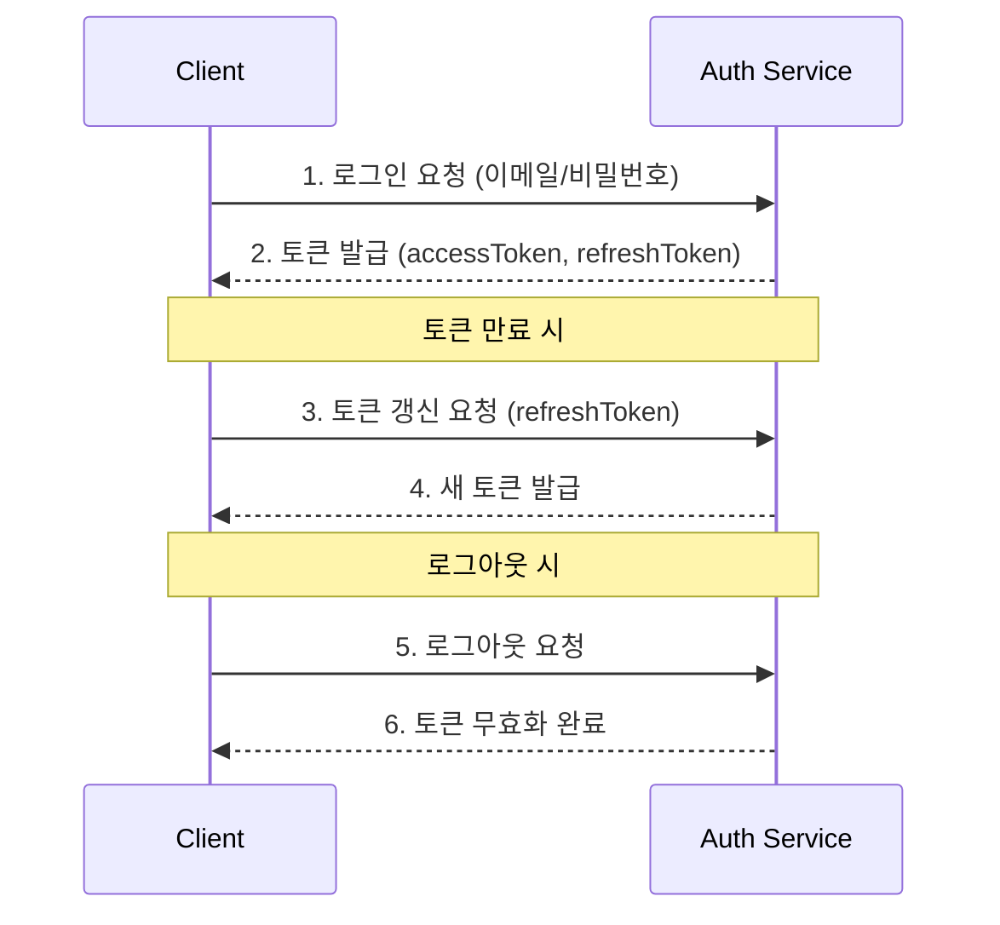
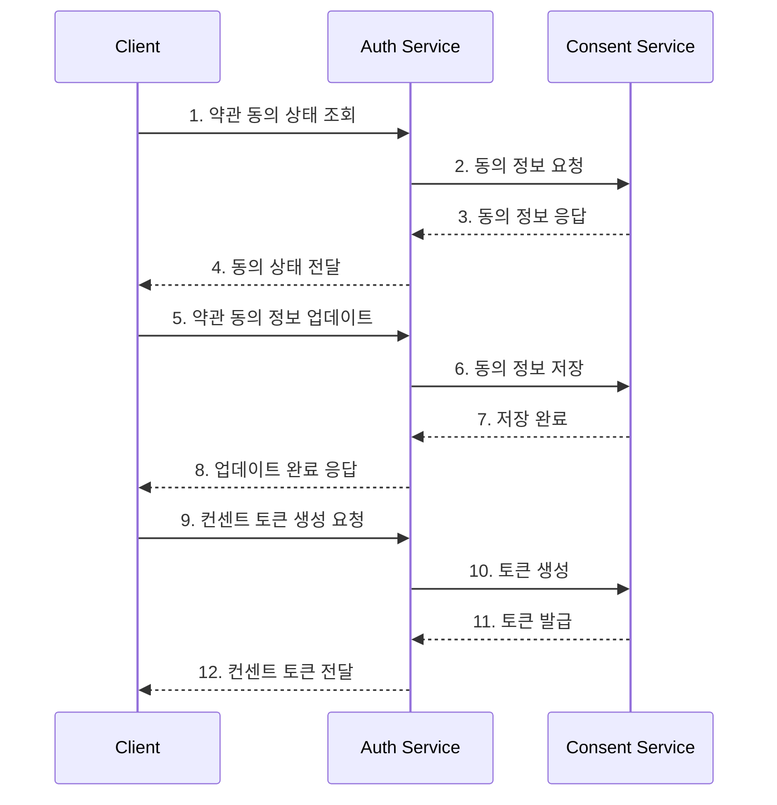

# Auth API 엔드포인트

## 관련 문서
- [API 개요](./overview.md)
- [API 구현 가이드](./implementation.md)
- [API 요구사항](./requirements.md)
- [API 테스트 명세](./test-spec.md)

## 1. 엔드포인트 접근 권한 매트릭스

| 엔드포인트 | System Admin | IAM Admin | Service Account | Regular User |
|------------|--------------|-----------|-----------------|--------------|
| POST /v1/auth/login | ✓ | ✓ | ✓ | ✓ |
| POST /v1/auth/logout | ✓ | ✓ | ✓ | ✓ |
| POST /v1/auth/refresh | ✓ | ✓ | ✓ | ✓ |
| GET /v1/auth/me | ✓ | ✓ | ✓ | ✓ |
| POST /v1/auth/2fa/enable | ✓ | ✓ | ✘ | ✓ |
| POST /v1/auth/2fa/verify | ✓ | ✓ | ✘ | ✓ |
| POST /v1/auth/2fa/disable | ✓ | ✓ | ✘ | ✓ |
| GET /v1/auth/sessions | ✓ | ✓ | ✓ | 자신만 |
| DELETE /v1/auth/sessions/{id} | ✓ | ✓ | ✘ | 자신만 |
| GET /v1/auth/consent | ✓ | ✓ | ✓ | 자신만 |
| PUT /v1/auth/consent | ✓ | ✓ | ✘ | 자신만 |
> 참고:
> - ✓: 접근 가능
> - ✘: 접근 불가
> - (범위 내): 할당된 조직/팀 범위 내에서만 접근 가능
> - (자신만): 자신의 데이터에만 접근 가능


## 2. 앱 토큰 관리 API

### 2.1 앱 토큰 발급
- HTTP 메서드: POST
- 경로: /v1/auth/app-token
- Content-Type: application/json

#### 요청 (Request)
```json
{
  "appId": "app_123",
  "permissions": ["read:users", "write:users"],
  "expiresIn": 86400,
  "deviceId": "encrypted_device_id_string"
}
```

> **참고**: deviceId는 클라이언트에서 ChaCha20 알고리즘을 사용하여 암호화되어야 합니다. 서버는 동일한 알고리즘으로 복호화하여 검증 후 appToken을 발급합니다.

#### 응답 (Response)
- 성공 응답 (201 Created)
```json
{
  "status": 201,
  "data": {
    "appToken": "eyJhbGciOiJIUzI1NiIs...",
    "expiresIn": 86400,
    "permissions": ["read:users", "write:users"],
    "createdAt": "2024-03-21T09:00:00Z"
  }
}
```

### 2.2 앱 토큰 조회
- HTTP 메서드: GET
- 경로: /v1/auth/app-token/{appId}
- Headers:
  - Authorization: Bearer {admin_token}

#### 응답 (Response)
- 성공 응답 (200 OK)
```json
{
  "status": 200,
  "data": {
    "appId": "app_123",
    "permissions": ["read:users", "write:users"],
    "issuedAt": "2024-03-21T09:00:00Z",
    "expiresAt": "2024-03-22T09:00:00Z",
    "lastUsedAt": "2024-03-21T09:05:00Z"
  }
}
```

## 3. 인증 프로세스 개요

Auth API는 다음과 같은 주요 사용자 프로세스를 지원합니다:

0. **앱 인증 프로세스** (모든 API 호출 전 필수)
   - 앱 토큰 발급 → 앱 토큰으로 API 접근

1. **회원가입 프로세스**
   - 약관 동의 → 이메일 인증 → 회원가입

2. **로그인 및 인증 프로세스**
   - 로그인 → 토큰 관리 → 로그아웃

3. **동의 관리 프로세스**
   - 약관 동의 관리 → 컨센트 토큰 관리 → 동의 이력 관리

각 프로세스별 API 엔드포인트는 아래에서 자세히 설명합니다.

### 3.1 회원가입 프로세스

회원가입은 다음과 같은 단계로 진행됩니다:

1. 약관 목록 조회 및 동의: 필요한 서비스 약관에 동의합니다.
2. 이메일 인증 코드 발송: 사용자가 입력한 이메일로 6자리 OTP 번호를 발송합니다.
3. 이메일 인증 코드 확인: 사용자가 수신한 OTP 번호를 입력하여 이메일 유효성을 검증합니다.
4. 회원가입: 약관 동의 정보와 인증이 완료된 이메일을 사용하여 회원가입을 진행합니다.



> **중요**: 회원가입은 반드시 약관 동의와 이메일 인증이 모두 완료된 후에만 가능합니다. 필수 약관에 동의하지 않은 경우 `REQUIRED_TERMS_NOT_AGREED` 오류가 발생하며, 인증되지 않은 이메일로 회원가입을 시도할 경우 `EMAIL_NOT_VERIFIED` 오류가 발생합니다. 이메일 인증은 완료 후 30분 동안 유효합니다.

#### 1.1 약관 목록 조회
- HTTP 메서드: GET
- 경로: /v1/auth/terms
- Headers:
  - Accept-Language: ko-KR (기본값) 또는 en-US
  - Authorization: Bearer {appToken}
- Query Parameters:
  - type: 약관 유형 (선택 사항, 예: 'service', 'privacy', 'marketing')

#### 응답 (Response)
- 성공 응답 (200 OK):
```json
{
  "status": 200,
  "data": {
    "terms": [
      {
        "id": 1,
        "version": "1.0",
        "title": "서비스 이용약관",
        "type": "service",
        "required": true,
        "createdAt": "2023-01-01T00:00:00Z",
        "updatedAt": "2023-01-01T00:00:00Z"
      }
    ]
  }
}
```

#### 1.2 약관 동의 저장
- HTTP 메서드: POST
- 경로: /v1/auth/terms/agreement
- Headers:
  - Content-Type: application/json
  - Authorization: Bearer {appToken}
- Body:
```json
{
  "deviceId": "device_123",
  "agreements": [
    {
      "termsId": 1,
      "version": "1.0",
      "agreed": true
    }
  ]
}
```

#### 응답 (Response)
- 성공 응답 (200 OK):
```json
{
  "status": 200,
  "data": {
    "deviceId": "device_123",
    "agreements": [
      {
        "termsId": 1,
        "version": "1.0",
        "agreed": true,
        "agreedAt": "2023-03-15T10:25:00Z"
      }
    ]
  }
}
```

> **참고**: 회원가입 전에는 `deviceId`를 기준으로 약관 동의 정보가 임시 저장됩니다. 회원가입 완료 후 해당 정보는 생성된 `userId`로 매핑됩니다.

#### 1.3 이메일 인증 코드 발송
- HTTP 메서드: POST
- 경로: /v1/auth/email/verification-code
- Headers:
  - Content-Type: application/json
  - Authorization: Bearer {appToken}

#### 요청 (Request)
```json
{
  "email": "user@example.com"
}
```

#### 응답 (Response)
- 성공 응답 (200 OK)
```json
{
  "status": 200,
  "data": {
    "email": "user@example.com",
    "expiresIn": 300,
    "requestId": "req_123"
  }
}
```

> **참고**: 이메일로 6자리 OTP 번호가 발송됩니다. `expiresIn`은 인증 코드의 유효 시간(초)입니다. `requestId`는 인증 코드 확인 시 필요합니다.

#### 1.4 이메일 인증 코드 확인
- HTTP 메서드: POST
- 경로: /v1/auth/email/verify
- Headers:
  - Content-Type: application/json
  - Authorization: Bearer {appToken}

#### 요청 (Request)
```json
{
  "email": "user@example.com",
  "code": "123456",
  "requestId": "req_123"
}
```

#### 응답 (Response)
- 성공 응답 (200 OK)
```json
{
  "status": 200,
  "data": {
    "verified": true,
    "verificationId": "ver_456",
    "verifiedAt": "2024-03-21T09:05:00Z",
    "expiresAt": "2024-03-21T09:35:00Z"
  }
}
```

> **참고**: 인증이 성공하면 `verificationId`가 발급됩니다. 이 ID는 회원가입 API 호출 시 필요합니다. 인증은 `expiresAt`까지 유효합니다(일반적으로 인증 후 30분).

### 3.2 로그인 및 인증 프로세스

로그인 및 인증 프로세스는 다음과 같은 단계로 진행됩니다:

1. 로그인: 사용자 인증 정보로 로그인하여 액세스 토큰과 리프레시 토큰을 발급받습니다.
2. 토큰 관리: 액세스 토큰 만료 시 리프레시 토큰을 사용하여 새로운 토큰을 발급받습니다.
3. 로그아웃: 토큰을 무효화합니다.



#### 2.1 로그인
- HTTP 메서드: POST
- 경로: /v1/auth/login
- Headers:
  - Content-Type: application/json
  - Authorization: Bearer {appToken}

#### 요청 (Request)
```json
{
  "email": "user@example.com",
  "password": "StrongPassword123!",
  "deviceId": "device_123"
}
```

#### 응답 (Response)
- 성공 응답 (200 OK)
```json
{
  "status": 200,
  "data": {
    "accessToken": "eyJhbGciOiJIUzI1NiIs...",
    "refreshToken": "eyJhbGciOiJIUzI1NiIs...",
    "expiresIn": 3600,
    "tokenType": "Bearer",
    "user": {
      "userId": "user_123",
      "email": "user@example.com",
      "name": "John Doe"
    }
  }
}
```

#### 2.2 토큰 갱신
- HTTP 메서드: POST
- 경로: /v1/auth/token/refresh
- Headers:
  - Content-Type: application/json
  - Authorization: Bearer {appToken}

#### 요청 (Request)
```json
{
  "refreshToken": "eyJhbGciOiJIUzI1NiIs...",
  "deviceId": "device_123"
}
```

#### 응답 (Response)
- 성공 응답 (200 OK)
```json
{
  "status": 200,
  "data": {
    "accessToken": "eyJhbGciOiJIUzI1NiIs...",
    "refreshToken": "eyJhbGciOiJIUzI1NiIs...",
    "expiresIn": 3600,
    "tokenType": "Bearer"
  }
}
```

#### 2.3 토큰 검증
- HTTP 메서드: POST
- 경로: /v1/auth/token/validate
- Headers:
  - Content-Type: application/json
  - Authorization: Bearer {appToken}

#### 요청 (Request)
```json
{
  "token": "eyJhbGciOiJIUzI1NiIs..."
}
```

#### 응답 (Response)
- 성공 응답 (200 OK)
```json
{
  "status": 200,
  "data": {
    "valid": true,
    "expiresIn": 1800
  }
}
```

#### 2.4 로그아웃
- HTTP 메서드: POST
- 경로: /v1/auth/logout
- Headers:
  - Authorization: Bearer {token}

#### 요청 (Request)
```json
{
  "deviceId": "device_123"
}
```

#### 응답 (Response)
- 성공 응답 (200 OK)
```json
{
  "status": 200,
  "data": {
    "message": "Successfully logged out"
  }
}
```

### 3.3 동의 관리 프로세스

동의 관리 프로세스는 사용자의 약관 동의와 컨센트 토큰을 관리하는 기능을 제공합니다:

1. 약관 동의 관리: 사용자의 약관 동의 상태를 관리합니다.
2. 컨센트 토큰 관리: 특정 목적을 위한 사용자 동의를 토큰화하여 관리합니다.
3. 동의 이력 관리: 사용자의 약관 동의 이력을 추적합니다.



#### 3.1 약관 동의 관리

##### 약관 동의 상태 조회
- HTTP 메서드: GET
- 경로: /v1/auth/terms/agreement/{userId}
- Headers:
  - Authorization: Bearer {accessToken}

##### 응답 (Response)
- 성공 응답 (200 OK)
```json
{
  "status": 200,
  "data": {
    "userId": "user_123",
    "agreements": [
      {
        "termsId": 1,
        "version": "1.0",
        "title": "서비스 이용약관",
        "agreed": true,
        "agreedAt": "2024-03-21T09:00:00Z"
      }
    ]
  }
}
```

##### 약관 동의 상태 업데이트
- HTTP 메서드: PUT
- 경로: /v1/auth/terms/agreement/{userId}
- Headers:
  - Authorization: Bearer {accessToken}
  - Content-Type: application/json

##### 요청 (Request)
```json
{
  "agreements": [
    {
      "termsId": 1,
      "version": "1.0",
      "agreed": true
    }
  ]
}
```

##### 응답 (Response)
- 성공 응답 (200 OK)
```json
{
  "status": 200,
  "data": {
    "userId": "user_123",
    "agreements": [
      {
        "termsId": 1,
        "version": "1.0",
        "agreed": true,
        "agreedAt": "2024-03-21T09:00:00Z"
      }
    ]
  }
}
```

#### 3.2 컨센트 토큰 관리

##### 컨센트 토큰 생성
- HTTP 메서드: POST
- 경로: /v1/auth/consent/token
- Headers:
  - Authorization: Bearer {accessToken}
  - Content-Type: application/json

##### 요청 (Request)
```json
{
  "userId": "user_123",
  "purpose": "data_sharing",
  "scope": ["profile", "email"],
  "expiresIn": 3600
}
```

##### 응답 (Response)
- 성공 응답 (201 Created)
```json
{
  "status": 201,
  "data": {
    "consentToken": "ct_123abc",
    "userId": "user_123",
    "purpose": "data_sharing",
    "scope": ["profile", "email"],
    "issuedAt": "2024-03-21T09:00:00Z",
    "expiresAt": "2024-03-21T10:00:00Z"
  }
}
```

##### 컨센트 토큰 검증
- HTTP 메서드: POST
- 경로: /v1/auth/consent/token/verify
- Headers:
  - Authorization: Bearer {accessToken}
  - Content-Type: application/json

##### 요청 (Request)
```json
{
  "consentToken": "ct_123abc"
}
```

##### 응답 (Response)
- 성공 응답 (200 OK)
```json
{
  "status": 200,
  "data": {
    "valid": true,
    "userId": "user_123",
    "purpose": "data_sharing",
    "scope": ["profile", "email"],
    "issuedAt": "2024-03-21T09:00:00Z",
    "expiresAt": "2024-03-21T10:00:00Z"
  }
}
```

##### 3.3 동의 이력 관리

#### 동의 이력 조회
- HTTP 메서드: GET
- 경로: /v1/auth/consent/history/{userId}
- Headers:
  - Authorization: Bearer {accessToken}
- Query Parameters:
  - page: 페이지 번호 (기본값: 1)
  - size: 페이지 크기 (기본값: 10)
  - type: 동의 유형 (선택 사항, 예: 'terms', 'consent')

#### 응답 (Response)
- 성공 응답 (200 OK)
```json
{
  "status": 200,
  "data": {
    "items": [
      {
        "id": "history_123",
        "userId": "user_123",
        "type": "terms",
        "termsId": 1,
        "version": "1.0",
        "action": "agree",
        "timestamp": "2024-03-21T09:00:00Z"
      }
    ],
    "pagination": {
      "page": 1,
      "size": 10,
      "total": 1
    }
  }
}
```

## 4. API 엔드포인트 상세

### 4.1 회원가입 API
// ... existing code ...

### 4.2 로그인 및 인증 API
// ... existing code ...

### 4.3 동의 관리 API
// ... existing code ...

## 5. 오류 코드
> 상세 에러 처리 구현은 [구현 문서의 에러 핸들링 섹션](./implementation.md#에러-핸들링)을 참조하세요.

| HTTP 상태 코드 | 오류 코드 | 메시지 | 설명 | 대응 방법 |
|--------------|---------|--------|------|---------|
| 400 | 2001 | INVALID_CREDENTIALS | 잘못된 인증 정보 | 이메일과 비밀번호 확인 |
| 401 | 2002 | INVALID_TOKEN | 유효하지 않은 토큰 | 토큰 재발급 |
| 401 | 2003 | EXPIRED_TOKEN | 만료된 토큰 | 토큰 갱신 |
| 403 | 2004 | INSUFFICIENT_PERMISSIONS | 권한 부족 | 필요한 권한 확인 |
| 404 | 2005 | APP_NOT_FOUND | 앱을 찾을 수 없음 | 앱 ID 확인 |
| 400 | 2006 | INVALID_CONSENT_TOKEN | 유효하지 않은 컨센트 토큰 | 토큰 재발급 |
| 401 | 2007 | EXPIRED_CONSENT_TOKEN | 만료된 컨센트 토큰 | 토큰 재발급 |
| 403 | 2008 | INSUFFICIENT_SCOPE | 불충분한 권한 범위 | 권한 확인 |
| 400 | 2009 | INVALID_DEVICE_ID | 유효하지 않은 deviceId | deviceId 암호화 확인 |
| 400 | 2010 | DEVICE_ID_DECRYPTION_FAILED | deviceId 복호화 실패 | ChaCha20 암호화 설정 확인 |
| 400 | 1101 | INVALID_TERMS_TYPE | 유효하지 않은 약관 유형 | 올바른 약관 유형으로 다시 요청 |
| 400 | 1103 | REQUIRED_TERMS_NOT_AGREED | 필수 약관에 동의하지 않음 | 모든 필수 약관에 동의 후 다시 요청 |
| 400 | 1104 | INVALID_TERMS_VERSION | 유효하지 않은 약관 버전 | 최신 약관 버전으로 다시 요청 |
| 404 | 1105 | DEVICE_AGREEMENTS_NOT_FOUND | 기기의 약관 동의 정보를 찾을 수 없음 | 약관 동의 절차를 다시 진행 |
| 409 | 1106 | USER_AGREEMENTS_ALREADY_EXISTS | 사용자 계정에 이미 약관 동의 정보가 존재 | 기존 약관 동의 정보 확인 |
| 400 | 2011 | INVALID_VERIFICATION_CODE | 잘못된 인증 코드 | 정확한 인증 코드 입력 |
| 410 | 2012 | VERIFICATION_CODE_EXPIRED | 인증 코드 만료 | 새로운 인증 코드 요청 |
| 403 | 2013 | EMAIL_NOT_VERIFIED | 인증되지 않은 이메일 | 이메일 인증 진행 |
| 410 | 2014 | VERIFICATION_EXPIRED | 이메일 인증 만료 | 이메일 인증 다시 진행 |

## 6. 변경 이력
| 버전 | 날짜 | 작성자 | 변경 내용 |
|------|------|--------|-----------|
| 0.1.0 | 2025-03-15 | bok@weltcorp.com | 최초 작성 |
| 0.2.0 | 2025-03-16 | bok@weltcorp.com | 앱 토큰 인증 관련 내용 추가 |
| 0.3.0 | 2025-03-17 | bok@weltcorp.com | 인증 흐름 업데이트 |
| 0.4.0 | 2025-03-19 | bok@weltcorp.com | 권한 관련 내용을 IAM 도메인으로 이전 |