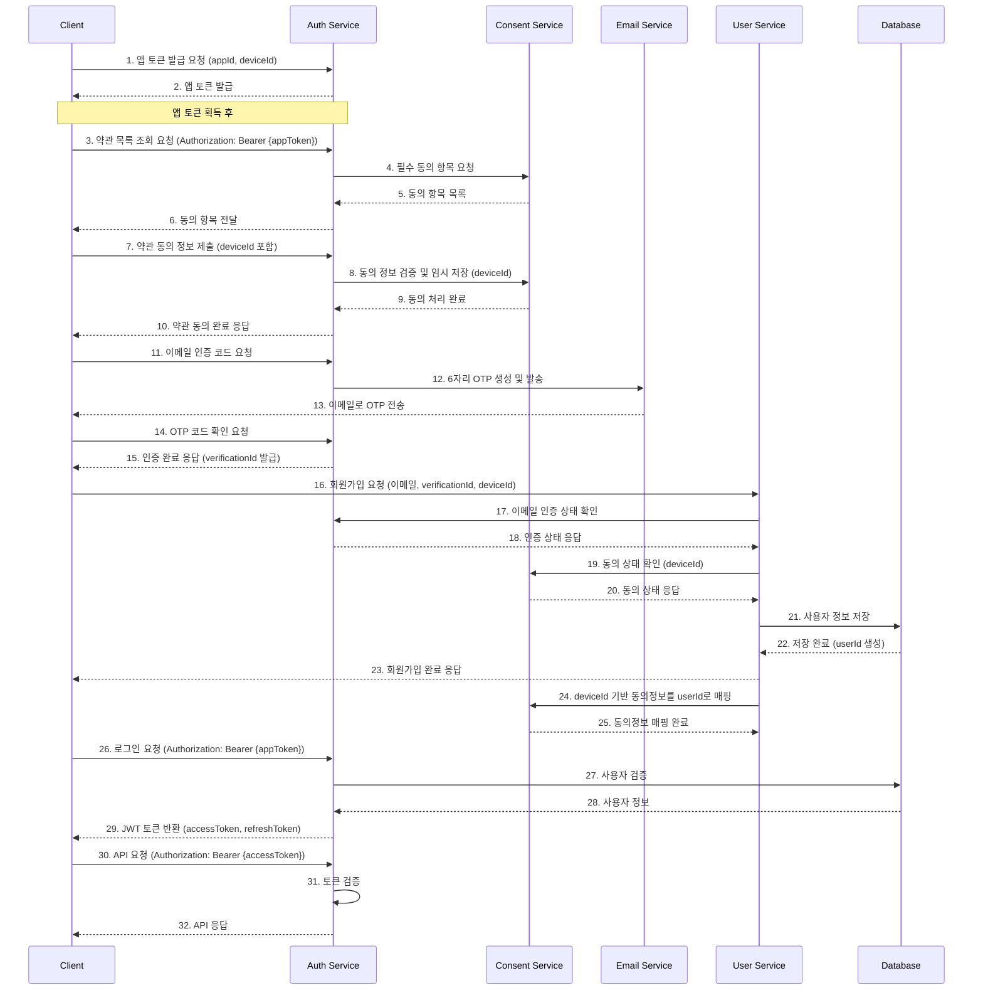

# Auth API 개요

## 관련 문서
- [API 엔드포인트](./endpoints.md)
- [API 구현 가이드](./implementation.md)
- [API 요구사항](./requirements.md)
- [API 테스트 명세](./test-spec.md)

## 1. 소개
Auth API는 WELT 서비스의 사용자 인증을 담당하는 API입니다. JWT 기반의 토큰 인증을 제공하며, 사용자와 디바이스의 인증을 처리합니다.

## 2. 주요 기능
- 앱 토큰 발급 및 검증 ([엔드포인트](./endpoints.md#0-앱-인증-프로세스))
- JWT 토큰 발급 및 검증 ([엔드포인트](./endpoints.md#2-로그인-및-인증-프로세스))
- 사용자 인증 ([엔드포인트](./endpoints.md#2-로그인-및-인증-프로세스))
- 디바이스 인증 ([요구사항](./requirements.md#1-토큰-관리))
- 동의 관리 ([엔드포인트](./endpoints.md#3-동의-관리-프로세스))
  - 약관 동의 관리
  - 동의 이력 관리
  - 컨센트 토큰 관리

## 3. 기술 스택
- NestJS 프레임워크
- TypeScript
- PostgreSQL 데이터베이스
- JWT 인증

## 4. 아키텍처


## 5. 인증 흐름

### 0. [앱 인증 프로세스](./endpoints.md#0-앱-인증-프로세스) (모든 API 호출 전 필수)
> **중요**: 모든 API 호출(회원가입, 로그인 포함)은 앱 토큰(appToken)이 필요합니다. 다른 API를 호출하기 전에 먼저 앱 토큰을 발급받아야 합니다.

- [앱 토큰 발급](./endpoints.md#01-앱-토큰-발급): 디바이스 ID를 암호화하여 서버에 전송
- 서버는 디바이스 ID를 검증하고 앱 토큰을 발급
- 클라이언트는 모든 API 요청의 Authorization 헤더에 앱 토큰을 포함시켜 전송
- 서버는 앱 토큰을 검증하고 요청을 처리

### 1. [회원가입 프로세스](./endpoints.md#1-회원가입-프로세스)
- [약관 목록 조회 및 동의](./endpoints.md#11-약관-목록-조회): 필요한 서비스 약관에 동의
- [이메일 인증 코드 발송](./endpoints.md#13-이메일-인증-코드-발송): 사용자가 입력한 이메일로 6자리 OTP 번호를 발송
- [이메일 인증 코드 확인](./endpoints.md#14-이메일-인증-코드-확인): 사용자가 수신한 OTP 번호를 입력하여 이메일 유효성을 검증
- 회원가입: 약관 동의 정보와 인증이 완료된 이메일을 사용하여 회원가입을 진행
- deviceId 기반 동의정보를 userId로 매핑

### 2. [로그인 및 인증 프로세스](./endpoints.md#2-로그인-및-인증-프로세스)
- [로그인](./endpoints.md#21-로그인): 사용자 인증 정보로 로그인하여 액세스 토큰과 리프레시 토큰을 발급받음
- [토큰 갱신](./endpoints.md#22-토큰-갱신): 액세스 토큰 만료 시 리프레시 토큰을 사용하여 새로운 토큰을 발급받음
- [토큰 검증](./endpoints.md#23-토큰-검증): 발급된 토큰의 유효성을 검증
- [로그아웃](./endpoints.md#24-로그아웃): 토큰을 무효화

### 3. [동의 관리 프로세스](./endpoints.md#3-동의-관리-프로세스)
- [약관 동의 관리](./endpoints.md#31-약관-동의-관리): 사용자의 약관 동의 상태를 관리
- [컨센트 토큰 관리](./endpoints.md#32-컨센트-토큰-생성-deviceid-기반): 특정 목적을 위한 사용자 동의를 토큰화하여 관리
- 약관 동의 이력: 사용자의 약관 동의 이력을 관리

## 6. 데이터 모델
> 상세 데이터 모델 정의는 [요구사항 문서의 데이터 구조 섹션](./requirements.md#api-데이터-구조)과 [데이터베이스 스키마 섹션](./requirements.md#데이터베이스-스키마)을 참조하세요.

```typescript
interface AuthToken {
  accessToken: string;    // JWT 액세스 토큰
  refreshToken: string;   // 리프레시 토큰
  expiresIn: number;     // 만료 시간 (초)
  tokenType: string;     // 토큰 타입 (Bearer)
}

interface ConsentToken {
  id: string;           // 토큰 ID
  userId: string;       // 사용자 ID
  deviceId: string;     // 디바이스 ID (회원가입 전 동의 시 사용)
  scope: string[];      // 동의 범위
  purpose: string;      // 동의 목적
  token: string;        // 암호화된 토큰
  issuedAt: Date;      // 발급 시간
  expiresAt: Date;     // 만료 시간
  metadata: object;     // 메타데이터
}

interface AppToken {
  appToken: string;     // JWT 앱 토큰
  expiresIn: number;    // 만료 시간 (초)
  permissions: string[]; // 권한 목록
  createdAt: string;    // 생성 시간
}
```

## 7. 보안 고려사항
> 상세 구현 가이드는 [구현 문서의 보안 섹션](./implementation.md#보안)을 참조하세요.

- 모든 통신은 HTTPS 사용
- 토큰 암호화 및 서명
- CSRF 방어
- Rate Limiting
- 디바이스 ID 암호화 (ChaCha20 알고리즘)
- 컨센트 토큰 보안
  - 토큰 암호화 (AES-256-GCM)
  - 범위 기반 접근 제어
  - 만료 시간 자동 관리
  - 동의 이력 감사

### 사용자 유형별 권한

#### System Admin
- 인증 시스템 전체 설정 관리
- 인증 정책 생성 및 수정
- 모든 사용자의 인증 상태 관리
- 2단계 인증 정책 관리
- 전체 동의 항목 관리

#### IAM Admin
- 인증 정책 관리 (삭제 제외)
- 할당된 범위 내 사용자의 인증 상태 관리
- 2단계 인증 상태 조회
- 동의 항목 관리 (삭제 제외)

#### Service Account
- 토큰 검증
- 세션 검증
- 사용자 인증 상태 조회
- 동의 상태 조회

#### Regular User
- 자신의 인증 관련 작업
- 자신의 2단계 인증 관리
- 자신의 동의 항목 조회/동의

### API 사용 제한
- System Admin: 제한 없음
- IAM Admin: 시간당 10,000 요청
- Service Account: 시간당 100,000 요청
- Regular User: 시간당 1,000 요청

## 8. 성능 고려사항
> 상세 구현 가이드는 [구현 문서의 성능 섹션](./implementation.md#성능)을 참조하세요.

- 토큰 검증 최적화
- 데이터베이스 인덱싱
- 응답 시간 최적화

## 9. 모니터링
> 상세 구현 가이드는 [구현 문서의 모니터링 섹션](./implementation.md#모니터링)을 참조하세요.

- 인증 시도 모니터링
- 토큰 발급/검증 모니터링
- 실패한 인증 시도 모니터링

## 10. 에러 처리
> 상세 에러 코드 및 처리 방법은 [엔드포인트 문서의 오류 코드 섹션](./endpoints.md#7-오류-코드)과 [구현 문서의 에러 핸들링 섹션](./implementation.md#에러-핸들링)을 참조하세요.

- 표준화된 에러 응답
- 상세한 에러 메시지
- 보안 관련 에러 로깅
- 인증 실패 추적

## 11. 인증 방식

### JWT 기반 인증
JWT(JSON Web Token)는 사용자 인증 후 발급되는 토큰으로, 사용자의 신원과 권한 정보를 안전하게 전달합니다. 액세스 토큰과 리프레시 토큰으로 구성되며, 액세스 토큰은 짧은 유효 기간을 가지고 리프레시 토큰은 새로운 액세스 토큰을 발급받는 데 사용됩니다.

### 앱 토큰 인증
앱 토큰은 사용자 로그인 전 API 호출에 필요한 인증 메커니즘입니다. 모든 API 호출은 인증이 필요하며, 사용자 로그인 전에는 앱 토큰을 사용하고 로그인 후에는 액세스 토큰을 사용합니다.

#### 앱 토큰 발급 및 사용 흐름
1. 클라이언트는 디바이스 ID를 암호화하여 서버에 전송합니다.
2. 서버는 디바이스 ID를 검증하고 앱 토큰을 발급합니다.
3. 클라이언트는 모든 API 요청의 Authorization 헤더에 앱 토큰을 포함시켜 전송합니다.
4. 서버는 앱 토큰을 검증하고 요청을 처리합니다.
5. 앱 토큰이 만료되면 클라이언트는 갱신 API를 호출하여 새로운 앱 토큰을 발급받습니다.

#### 앱 토큰 구조
앱 토큰은 JWT 형식으로 발급되며, 다음과 같은 페이로드를 포함합니다:

```json
{
  "sub": "app-id",
  "jti": "token-uuid",
  "permissions": ["read:terms", "create:user"],
  "deviceId": "decrypted-device-id",
  "iat": 1615884730,
  "exp": 1615971130
}
```

## 12. 변경 이력
| 버전 | 날짜 | 작성자 | 변경 내용 |
|------|------|--------|-----------|
| 0.1.0 | 2025-03-15 | bok@weltcorp.com | 최초 작성 |
| 0.2.0 | 2025-03-16 | bok@weltcorp.com | 앱 토큰 인증 관련 내용 추가 |
| 0.3.0 | 2025-03-17 | bok@weltcorp.com | 인증 흐름 업데이트 및 endpoints.md와 일관성 유지 |
| 0.4.0 | 2025-03-19 | bok@weltcorp.com | 권한 관련 내용을 IAM 도메인으로 이전 |