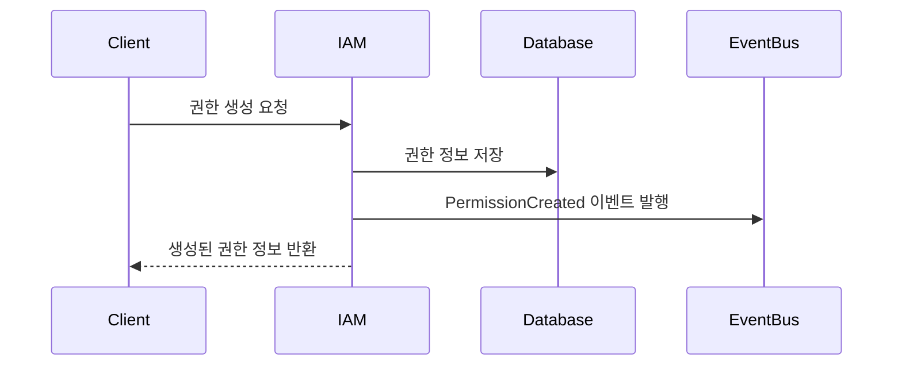
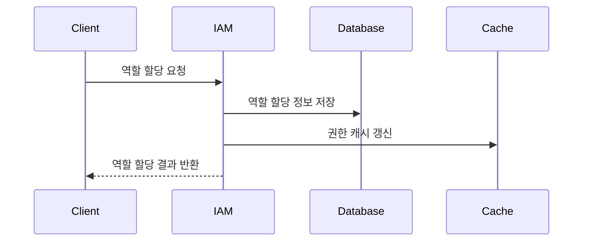
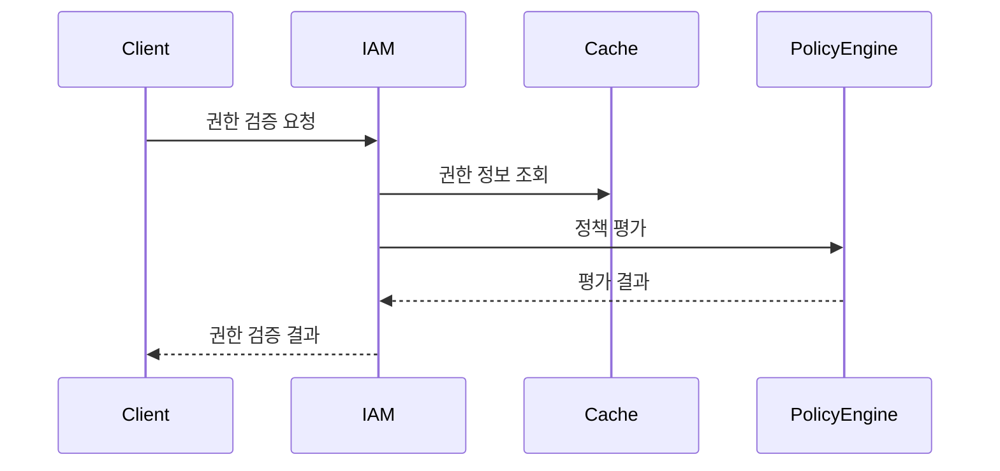

# IAM API

## 관련 문서
- [API 요구사항](./requirements.md)
- [API 엔드포인트](./endpoints.md)
- [API 구현 가이드](./implementation.md)

## 개요
IAM(Identity and Access Management) API는 사용자 권한, 역할, 정책을 관리하는 인터페이스를 제공합니다. 이 API를 통해 시스템의 접근 제어와 권한 관리를 효율적으로 수행할 수 있습니다.

## 사용자 유형별 권한

### 1. 시스템 관리자 (System Admin)
- 모든 IAM 리소스에 대한 완전한 접근 권한
- 권한 생성, 수정, 삭제
- 역할 생성, 수정, 삭제
- 정책 생성, 수정, 삭제
- 모든 사용자의 권한 할당/해제
- 시스템 수준의 정책 관리

### 2. IAM 관리자 (IAM Admin)
- IAM 리소스에 대한 관리 권한
- 권한 생성, 수정 (삭제 제외)
- 역할 생성, 수정 (삭제 제외)
- 정책 생성, 수정 (삭제 제외)
- 할당된 범위 내 사용자 권한 관리
- 감사 로그 조회

### 3. 서비스 계정 (Service Account)
- API를 통한 권한 검증
- 할당된 범위 내 권한 조회
- 권한 캐시 관리
- 제한된 범위의 정책 평가
- 실시간 권한 검증

### 4. 일반 사용자 (Regular User)
- 자신의 권한 조회
- 할당된 역할 확인
- 권한 검증 요청
- 제한된 범위의 권한 위임

## 제약사항

### 1. 시스템 관리자
- 시스템 수준 변경은 감사 로그 필수
- 중요 작업은 2단계 인증 필요
- 권한 삭제 시 영향도 분석 필수
- 정책 변경 시 백업 필수

### 2. IAM 관리자
- 할당된 범위 내에서만 작업 가능
- 시스템 수준 정책 수정 불가
- 관리자 권한 위임 불가
- 서비스 계정 생성 권한 없음

### 3. 서비스 계정
- API 호출 빈도 제한 적용
- 권한 검증 캐시 TTL 제한
- 권한 위임 기능 사용 불가
- 관리 기능 접근 불가

### 4. 일반 사용자
- 자신의 권한만 조회 가능
- 권한 위임은 제한된 범위에서만 가능
- 관리 기능 접근 불가
- 정책 조회 제한

## 기능 요구사항

### 1. 권한 관리 (Permission Management)
- 권한 생성, 조회, 수정, 삭제
- 권한 그룹 관리
- 권한 위임 및 상속
- 권한 검증

### 2. 역할 관리 (Role Management)
- 역할 생성, 조회, 수정, 삭제
- 역할 계층 구조 관리
- 역할 기반 접근 제어 (RBAC)
- 역할 할당 및 해제

### 3. 정책 관리 (Policy Management)
- 정책 생성, 조회, 수정, 삭제
- 정책 평가 및 우선순위
- 조건부 정책 관리
- 정책 버전 관리

## API 명세

### 기본 URL 구조
```
https://api.example.com/v1/iam
```

### API 버전
- 현재 버전: v1
- 버전 관리: URL 경로에 버전 명시 (/v1, /v2 등)

### 인증
모든 API 요청은 JWT 토큰을 통한 인증이 필요합니다.
```http
Authorization: Bearer {token}
```

### 응답 형식
#### 성공 응답
```json
{
  "status": 200,
  "data": {
    // 응답 데이터
  }
}
```

#### 에러 응답
```json
{
  "status": 400,
  "code": "INVALID_PERMISSION",
  "message": "권한이 유효하지 않습니다.",
  "detail": "요청한 권한에 대한 접근 권한이 없습니다."
}
```

## API 사용 흐름

### 1. 권한 관리 흐름


### 2. 역할 관리 흐름


### 3. 정책 평가 흐름


## 구현 시 고려사항

### 1. 보안
- 모든 API 엔드포인트는 인증 필수
- 권한 변경은 감사 로그 기록
- 중요 작업은 2단계 인증 고려

### 2. 성능
- 권한 정보 캐싱 전략
- 정책 평가 성능 최적화
- 대량 데이터 처리 방안

### 3. 확장성
- 멀티 테넌트 지원
- 커스텀 정책 엔진 지원
- 외부 시스템 통합

## 변경 이력
| 버전 | 날짜 | 작성자 | 변경 내용 |
|-----|---|-----|-----|
| 0.1.0 | 2025-03-19 | bok@weltcorp.com | 최초 작성 | 