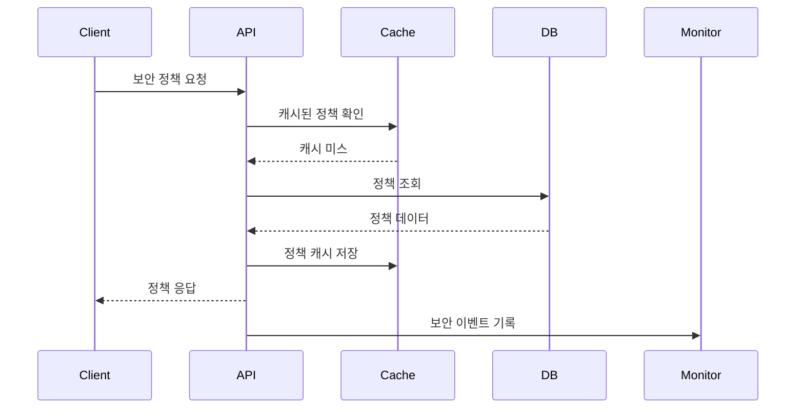

# Security API 개요

## 소개
Security API는 WELT 서비스의 보안 정책을 관리하고 적용하는 API입니다. 이 API는 사용자 인증, 권한 관리, 보안 정책 설정 및 모니터링을 담당합니다.

## 주요 기능
1. 보안 정책 관리
   - 비밀번호 정책 설정
   - 세션 관리 정책 설정
   - IP 차단 정책 설정
   - 2단계 인증 정책 설정

2. 보안 모니터링
   - 로그인 시도 모니터링
   - 비정상 접근 탐지
   - 보안 이벤트 로깅
   - 실시간 알림

3. 보안 감사
   - 보안 이벤트 기록
   - 감사 로그 관리
   - 보안 정책 변경 이력
   - 접근 기록 관리

## 기술 스택
- Backend: NestJS, TypeScript
- Database: PostgreSQL
- Cache: Redis
- 모니터링: ELK Stack
- 알림: AWS SNS

## 아키텍처



## 인증 및 권한
- 모든 API 요청은 JWT 토큰 기반 인증 필요
- 관리자 권한이 필요한 엔드포인트 구분
- Role 기반 접근 제어 (RBAC) 적용

## 데이터 모델

```typescript
interface SecurityPolicy {
  id: number;
  type: SecurityPolicyType;
  name: string;
  value: string;
  description: string;
  isActive: boolean;
  createdAt: Date;
  updatedAt: Date;
}

interface SecurityEvent {
  id: number;
  type: SecurityEventType;
  severity: SecurityEventSeverity;
  source: string;
  description: string;
  metadata: Record<string, any>;
  timestamp: Date;
}

enum SecurityPolicyType {
  PASSWORD = 'PASSWORD',
  SESSION = 'SESSION',
  IP_BLOCK = 'IP_BLOCK',
  TWO_FACTOR = 'TWO_FACTOR'
}

enum SecurityEventType {
  LOGIN_ATTEMPT = 'LOGIN_ATTEMPT',
  POLICY_CHANGE = 'POLICY_CHANGE',
  SUSPICIOUS_ACCESS = 'SUSPICIOUS_ACCESS',
  SYSTEM_ALERT = 'SYSTEM_ALERT'
}

enum SecurityEventSeverity {
  LOW = 'LOW',
  MEDIUM = 'MEDIUM',
  HIGH = 'HIGH',
  CRITICAL = 'CRITICAL'
}
```

## 에러 처리
- 표준화된 에러 응답 형식 사용
- 보안 관련 에러는 상세 정보 노출 최소화
- 모든 보안 이벤트는 로깅 처리

```typescript
interface SecurityErrorResponse {
  status: number;
  code: string;
  message: string;
  timestamp: string;
}
```

## 성능 고려사항
1. 캐시 전략
   - 보안 정책은 Redis에 캐시
   - 캐시 TTL 설정으로 최신성 보장
   - 정책 변경 시 캐시 무효화

2. 데이터베이스 최적화
   - 보안 이벤트 파티셔닝
   - 인덱스 최적화
   - 주기적 데이터 아카이빙

## 보안 고려사항
1. 데이터 보안
   - 민감 정보 암호화
   - 전송 구간 HTTPS 적용
   - 데이터 접근 로깅

2. API 보안
   - Rate Limiting 적용
   - CORS 설정
   - API 키 관리

3. 모니터링
   - 실시간 보안 이벤트 모니터링
   - 임계치 기반 알림
   - 주기적 보안 감사

## 모니터링
1. 모니터링 지표
   - API 응답 시간
   - 보안 이벤트 발생 빈도
   - 정책 적용 현황
   - 시스템 리소스 사용량

2. 알림 설정
   - 심각도별 알림 설정
   - 알림 채널 다각화
   - 에스컬레이션 정책

## 변경 이력
| 버전 | 날짜 | 작성자 | 변경 내용 |
|-----|------|--------|-----------|
| 0.1.0 | 2025-03-16 | bok@weltcorp.com | 최초 작성 | 