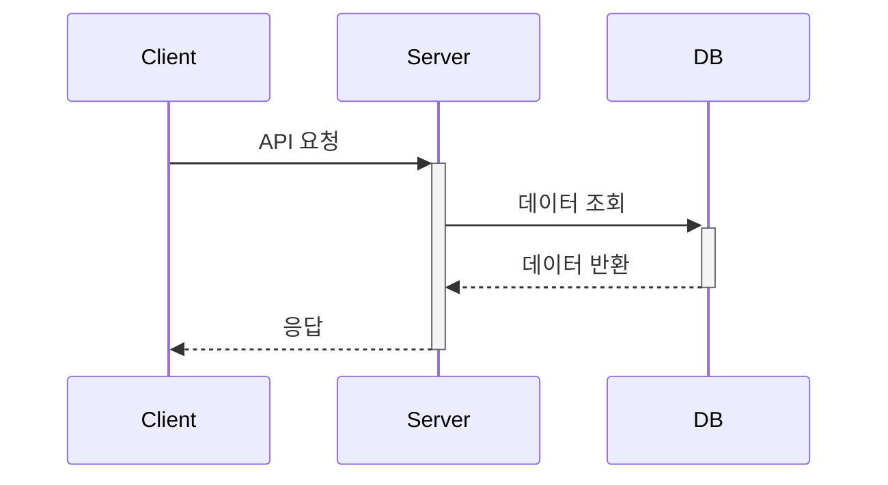

# API 명세서 템플릿

## 개요
이 문서는 [모듈명] 모듈의 API를 정의합니다.

## 기능 요구사항
- 요구사항 1
- 요구사항 2
- 요구사항 3

## API 명세

### [API 이름]

#### 요청 (Request)
- HTTP 메서드: [GET/POST/PUT/DELETE]
- 경로: /v1/[리소스명]
- Headers:
  ```json
  {
    "Authorization": "Bearer {token}",
    "Content-Type": "application/json"
  }
  ```
- Query Parameters:
  ```json
  {
    "page": "페이지 번호 (기본값: 1)",
    "size": "페이지 크기 (기본값: 10)"
  }
  ```
- Body:
  ```json
  {
    "field1": "값1",
    "field2": "값2"
  }
  ```

#### 응답 (Response)
- 성공 응답 (200 OK):
  ```json
  {
    "status": 200,
    "data": {
      "field1": "값1",
      "field2": "값2"
    }
  }
  ```

- 실패 응답 (400 Bad Request):
  ```json
  {
    "status": 400,
    "code": "ERROR_CODE",
    "message": "에러 메시지",
    "detail": "상세 설명"
  }
  ```

### 상태 코드
| 상태 코드 | 설명 | 발생 조건 |
|-----------|------|-----------|
| 200 | 성공 | 요청이 정상적으로 처리됨 |
| 201 | 생성됨 | 새 리소스가 생성됨 |
| 400 | 잘못된 요청 | 요청 파라미터가 유효하지 않음 |
| 401 | 인증 필요 | 인증 토큰이 없거나 유효하지 않음 |
| 403 | 권한 없음 | 인증은 되었으나 접근 권한이 없음 |
| 404 | 찾을 수 없음 | 요청한 리소스가 존재하지 않음 |
| 500 | 서버 오류 | 서버 내부 오류 발생 |

## 오류 코드 및 메시지 요약
| HTTP 상태 코드 | 오류 코드 | 메시지 | 설명 | 대응 방법 |
|---------------|-----------|---------|------|-----------|
| 400 | INVALID_INPUT | 잘못된 입력값 | 요청 파라미터가 유효하지 않음 | 요청 파라미터 검증 |
| 401 | UNAUTHORIZED | 인증 필요 | 인증되지 않은 요청 | 토큰 재발급 |
| 403 | FORBIDDEN | 권한 없음 | 접근 권한이 없음 | 권한 확인 |

## 구현 시 고려사항
1. **보안**:
   - JWT 토큰 검증
   - 입력값 검증
   - GDPR 준수

2. **성능**:
   - 캐시 사용
   - 데이터베이스 쿼리 최적화
   - 응답 시간 1초 이내

3. **모니터링**:
   - 요청/응답 로깅
   - 에러 로깅
   - 성능 메트릭스 수집

## API 사용 흐름


## 예시 및 코드
### curl 예시
```bash
curl -X POST http://api.example.com/v1/[리소스명] \
  -H "Authorization: Bearer {token}" \
  -H "Content-Type: application/json" \
  -d '{"field1": "값1", "field2": "값2"}'
```

### TypeScript 예시
```typescript
// API 호출 예시
const response = await api.post('/v1/[리소스명]', {
  field1: '값1',
  field2: '값2'
});
```

## 변경 이력
| 날짜 | 버전 | 설명 | 작성자 |
|------|------|------|--------|
| 2025-03-16 | 0.2 | 용어 통일 및 모듈형 모놀리스 반영 | bok@weltcorp.com |
| 2025-03-15 | 0.1 | 최초 작성 | bok@weltcorp.com | 