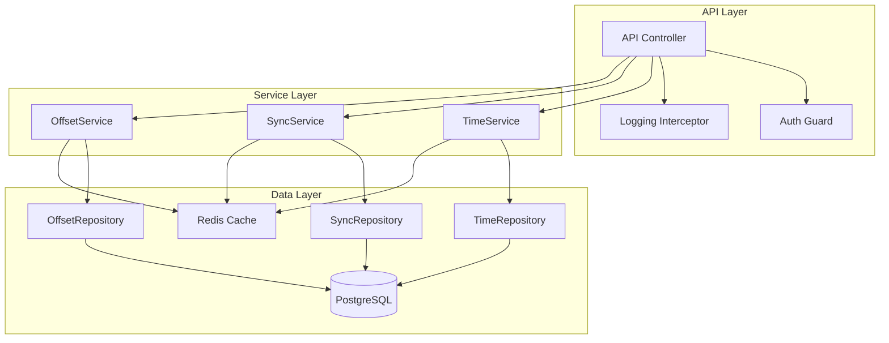

# TimeMachine 구현 가이드

## 개요
이 문서는 TimeMachine 서비스의 구현에 필요한 상세 가이드라인을 제공합니다.

## 아키텍처

### 1. 컴포넌트 구조


## 구현 상세

### 1. 엔티티 정의

#### TimeContext 엔티티
```typescript
@Entity()
export class TimeContext {
  @PrimaryGeneratedColumn('uuid')
  id: string;

  @Column({ type: 'bigint' })
  timestamp: number;

  @Column({ nullable: true })
  userId?: string;

  @Column({ default: 'UTC' })
  timezone: string;

  @Column({ type: 'int', default: 0 })
  offset: number;

  @CreateDateColumn()
  createdAt: Date;

  @UpdateDateColumn()
  updatedAt: Date;
}
```

#### TimeSync 엔티티
```typescript
@Entity()
export class TimeSync {
  @PrimaryGeneratedColumn('uuid')
  id: string;

  @Column({ type: 'bigint' })
  syncTimestamp: number;

  @Column()
  nodeId: string;

  @Column({ type: 'int', default: 0 })
  drift: number;

  @Column()
  status: string;

  @CreateDateColumn()
  syncedAt: Date;
}
```

### 2. DTO 정의

#### 시간 조회 응답 DTO
```typescript
export class TimeResponseDto {
  @ApiProperty()
  timestamp: number;

  @ApiProperty()
  iso8601: string;

  @ApiProperty()
  timezone: string;

  @ApiProperty()
  offset: number;
}
```

#### 시간 설정 요청 DTO
```typescript
export class SetTimeRequestDto {
  @ApiProperty()
  @IsNumber()
  timestamp: number;

  @ApiProperty()
  @IsString()
  reason: string;
}
```

### 3. 서비스 구현

#### TimeService
```typescript
@Injectable()
export class TimeService {
  constructor(
    @InjectRepository(TimeContext)
    private timeRepository: Repository<TimeContext>,
    private cacheManager: Cache
  ) {}

  async getCurrentTime(timezone: string = 'UTC'): Promise<TimeResponseDto> {
    // 1. 캐시에서 시간 정보 조회
    const cachedTime = await this.cacheManager.get('current_time');
    if (cachedTime) {
      return this.formatTimeResponse(cachedTime, timezone);
    }

    // 2. DB에서 시간 정보 조회
    const timeContext = await this.timeRepository.findOne({
      where: { timezone }
    });

    // 3. 응답 생성 및 캐시 저장
    const response = this.formatTimeResponse(timeContext, timezone);
    await this.cacheManager.set('current_time', response, 60000); // 1분 캐시

    return response;
  }

  private formatTimeResponse(
    time: any,
    timezone: string
  ): TimeResponseDto {
    return {
      timestamp: time.timestamp,
      iso8601: new Date(time.timestamp).toISOString(),
      timezone,
      offset: time.offset || 0
    };
  }
}
```

#### SyncService
```typescript
@Injectable()
export class SyncService {
  constructor(
    @InjectRepository(TimeSync)
    private syncRepository: Repository<TimeSync>,
    private cacheManager: Cache
  ) {}

  async syncTime(nodeId: string): Promise<void> {
    // 1. 현재 노드의 시간 정보 조회
    const currentSync = await this.syncRepository.findOne({
      where: { nodeId }
    });

    // 2. 드리프트 계산
    const drift = this.calculateDrift(currentSync);

    // 3. 동기화 상태 업데이트
    await this.syncRepository.save({
      ...currentSync,
      drift,
      status: this.determineSyncStatus(drift)
    });

    // 4. 캐시 무효화
    await this.cacheManager.del(`sync_status:${nodeId}`);
  }

  private calculateDrift(sync: TimeSync): number {
    // 드리프트 계산 로직
    return 0; // 구현 필요
  }

  private determineSyncStatus(drift: number): string {
    return drift < 100 ? 'synchronized' : 'drifted';
  }
}
```

### 4. 컨트롤러 구현

```typescript
@Controller('v1/time-machine')
@ApiTags('time-machine')
export class TimeMachineController {
  constructor(
    private readonly timeService: TimeService,
    private readonly syncService: SyncService
  ) {}

  @Get('current-time')
  @ApiOperation({ summary: '현재 시간 조회' })
  @ApiResponse({
    status: 200,
    description: '성공',
    type: TimeResponseDto
  })
  async getCurrentTime(
    @Query('timezone') timezone: string = 'UTC'
  ): Promise<SuccessResponse<TimeResponseDto>> {
    const time = await this.timeService.getCurrentTime(timezone);
    return {
      status: 200,
      data: time
    };
  }

  @Post('system-time')
  @Roles('admin')
  @ApiOperation({ summary: '시스템 시간 설정' })
  async setSystemTime(
    @Body() dto: SetTimeRequestDto
  ): Promise<SuccessResponse<void>> {
    await this.timeService.setSystemTime(dto);
    return {
      status: 200,
      data: null
    };
  }
}
```

### 5. 캐시 전략

#### 캐시 설정
```typescript
@Module({
  imports: [
    CacheModule.registerAsync({
      useFactory: () => ({
        store: redisStore,
        host: process.env.REDIS_HOST,
        port: process.env.REDIS_PORT,
        ttl: 60, // 기본 TTL 60초
        max: 100 // 최대 캐시 항목 수
      })
    })
  ]
})
export class TimeMachineModule {}
```

#### 캐시 키 정책
- 시스템 시간: `current_time`
- 사용자별 시간: `user_time:{userId}`
- 동기화 상태: `sync_status:{nodeId}`

### 6. 에러 처리

#### 에러 코드 정의
```typescript
export enum TimeMachineErrorCodes {
  // 컨트롤러 계층 (1001-1099)
  INVALID_TIMESTAMP = 1001,
  INVALID_TIMEZONE = 1002,
  INVALID_OFFSET = 1003,

  // 서비스 계층 (1101-1199)
  SYNC_ERROR = 1101,
  TIME_NOT_FOUND = 1102,
  INVALID_TIME_RANGE = 1103,

  // 리포지토리 계층 (1201-1299)
  DATABASE_ERROR = 1201,
  CACHE_ERROR = 1202
}
```

#### 에러 필터
```typescript
@Catch(HttpException)
export class TimeMachineExceptionFilter implements ExceptionFilter {
  catch(exception: HttpException, host: ArgumentsHost) {
    const ctx = host.switchToHttp();
    const response = ctx.getResponse<Response>();
    const status = exception.getStatus();
    const error = exception.getResponse() as string | ErrorResponse;

    response.status(status).json({
      status,
      code: error.code || TimeMachineErrorCodes.DATABASE_ERROR,
      message: error.message || 'Internal server error',
      detail: error.detail
    });
  }
}
```

### 7. 로깅

#### 로깅 인터셉터
```typescript
@Injectable()
export class TimeMachineLoggingInterceptor implements NestInterceptor {
  private readonly logger = new Logger('TimeMachine');

  intercept(context: ExecutionContext, next: CallHandler): Observable<any> {
    const now = Date.now();
    const request = context.switchToHttp().getRequest();

    return next.handle().pipe(
      tap(() => {
        const response = context.switchToHttp().getResponse();
        const delay = Date.now() - now;
        
        this.logger.log({
          method: request.method,
          url: request.url,
          statusCode: response.statusCode,
          duration: `${delay}ms`
        });
      })
    );
  }
}
```

### 8. 모니터링

#### 메트릭스 수집
```typescript
@Injectable()
export class TimeMachineMetricsService {
  private readonly timeRequestCounter: Counter;
  private readonly timeResponseHistogram: Histogram;

  constructor() {
    this.timeRequestCounter = new Counter({
      name: 'time_machine_requests_total',
      help: 'Total number of TimeMachine requests'
    });

    this.timeResponseHistogram = new Histogram({
      name: 'time_machine_response_time_seconds',
      help: 'TimeMachine response time in seconds',
      buckets: [0.1, 0.5, 1, 2, 5]
    });
  }

  recordRequest() {
    this.timeRequestCounter.inc();
  }

  recordResponseTime(seconds: number) {
    this.timeResponseHistogram.observe(seconds);
  }
}
```

## 테스트 가이드

### 1. 단위 테스트
```typescript
describe('TimeService', () => {
  let service: TimeService;
  let repository: Repository<TimeContext>;
  let cache: Cache;

  beforeEach(async () => {
    // 테스트 설정
  });

  it('should return current time', async () => {
    const result = await service.getCurrentTime();
    expect(result).toBeDefined();
    expect(result.timezone).toBe('UTC');
  });

  it('should handle invalid timezone', async () => {
    await expect(
      service.getCurrentTime('INVALID')
    ).rejects.toThrow(BadRequestException);
  });
});
```

### 2. 통합 테스트
```typescript
describe('TimeMachine Integration', () => {
  let app: INestApplication;

  beforeEach(async () => {
    // 테스트 앱 설정
  });

  it('should sync time across nodes', async () => {
    // 통합 테스트 시나리오
  });
});
```

## 성능 최적화

### 1. 캐시 최적화
- 적절한 TTL 설정
- 캐시 무효화 전략
- 캐시 프리페칭

### 2. 데이터베이스 최적화
- 인덱스 설정
- 쿼리 최적화
- 커넥션 풀 관리

### 3. 동시성 처리
- 락 메커니즘
- 경쟁 상태 방지
- 데드락 방지

## 변경 이력
| 날짜 | 버전 | 설명 | 작성자 |
|------|------|------|--------|
| 2024-03-20 | 1.0 | 최초 작성 | System Team | 