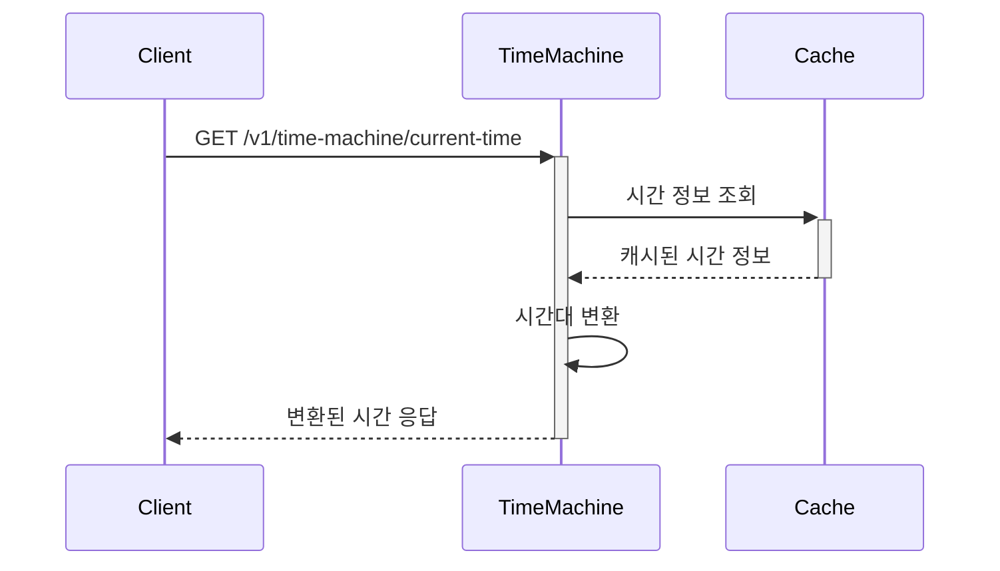
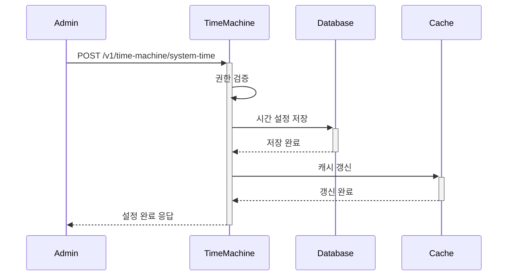

# TimeMachine API

## 개요
TimeMachine API는 시스템 전체의 시간을 중앙에서 관리하는 서비스입니다. 모든 시스템 컴포넌트는 시간 정보를 직접 생성하지 않고 TimeMachine을 통해 조회해야 합니다. 또한 시간 변환, 계산, 포맷팅 등의 시간 관련 유틸리티 기능도 제공합니다.

## 사용자 유형별 권한

### System Admin
- 시스템 시간 관리
- 시간 정책 설정
- 시간대 관리
- 시스템 시간 동기화 관리
- 시간 관련 이벤트 관리

### IAM Admin
- 시간 관련 정책 관리
- 시간대 설정 관리
- 시간 동기화 상태 모니터링
- 시간 관련 로그 조회

### Service Account
- 시간 조회/검증
- 시간대 변환
- 시간 포맷 변환
- 배치 시간 처리

### Regular User
- 현재 시간 조회
- 자신의 시간대 설정
- 시간 포맷 설정
- 시간대 목록 조회

## API 사용 제한
- System Admin: 제한 없음
- IAM Admin: 시간당 1,000 요청
- Service Account: 시간당 100,000 요청
- Regular User: 시간당 1,000 요청

## 시간 정책
- 표준 시간대: UTC
- 시간 동기화 주기: 1시간
- 허용 오차 범위: ±1초
- 일광절약시간 자동 적용

## 기능 요구사항

1. 현재 시간 관리
   - 시스템 현재 시간 조회
   - 사용자별 시간 조회
   - 시간대별 시간 조회
   - 시스템 시간 설정 (관리자)
   - 사용자별 시간 오프셋 설정

2. 시간 변환 및 계산
   - 시간대 변환
   - 포맷 변환
   - 타임스탬프 변환
   - ISO 8601 변환
   - 시간 간격 계산
   - 기간 계산
   - 날짜 차이 계산
   - 영업일 계산

3. 시간 동기화
   - 시스템 간 시간 동기화
   - 클러스터 노드 간 시간 동기화
   - 시간 드리프트 보정
   - NTP 동기화 관리

## 데이터 모델

```typescript
interface TimeZoneInfo {
  id: number;
  code: string;
  name: string;
  offset: number;
  dstOffset: number;
  region: string;
  isActive: boolean;
}

interface TimeResponse {
  timestamp: number;
  iso8601: string;
  timezone: string;
  offset: number;
  isDst: boolean;
}

interface TimeCalculation {
  startTime: string;
  endTime: string;
  duration: number;
  unit: TimeUnit;
  workingDays: boolean;
}

enum TimeUnit {
  MILLISECONDS = 'MILLISECONDS',
  SECONDS = 'SECONDS',
  MINUTES = 'MINUTES',
  HOURS = 'HOURS',
  DAYS = 'DAYS',
  WEEKS = 'WEEKS',
  MONTHS = 'MONTHS',
  YEARS = 'YEARS'
}
```

## API 명세

### 1. 시간 조회 API

#### 현재 시간 조회
- HTTP 메서드: GET
- 경로: /v1/time-machine/current-time
- Headers:
  - Authorization: Bearer {token}
  - Content-Type: application/json
- Query Parameters:
  - timezone: 시간대 (선택, 기본값: UTC)
  - user_id: 사용자 ID (선택)

##### 응답
- 성공 응답 (200 OK):
```json
{
  "status": 200,
  "data": {
    "timestamp": 1647832800000,
    "iso8601": "2024-03-21T00:00:00Z",
    "timezone": "UTC",
    "offset": 0
  }
}
```

- 실패 응답 (400 Bad Request):
```json
{
  "status": 400,
  "code": "INVALID_TIMEZONE",
  "message": "Invalid timezone specified",
  "detail": "The timezone 'XYZ' is not valid"
}
```

#### 사용자별 시간 조회
- HTTP 메서드: GET
- 경로: /v1/time-machine/users/{userId}/current-time
- Headers:
  - Authorization: Bearer {token}
  - Content-Type: application/json

##### 응답
- 성공 응답 (200 OK):
```json
{
  "status": 200,
  "data": {
    "userId": "user123",
    "timestamp": 1647832800000,
    "iso8601": "2024-03-21T00:00:00Z",
    "timezone": "Asia/Seoul",
    "offset": 32400000
  }
}
```

### 2. 시간 설정 API

#### 시스템 시간 설정 (관리자)
- HTTP 메서드: POST
- 경로: /v1/time-machine/system-time
- Headers:
  - Authorization: Bearer {token}
  - Content-Type: application/json
- Body:
```json
{
  "timestamp": 1647832800000,
  "reason": "시스템 시간 조정"
}
```

##### 응답
- 성공 응답 (200 OK):
```json
{
  "status": 200,
  "data": {
    "previousTimestamp": 1647832700000,
    "newTimestamp": 1647832800000,
    "appliedAt": "2024-03-21T00:00:00Z"
  }
}
```

#### 사용자 시간 오프셋 설정
- HTTP 메서드: POST
- 경로: /v1/time-machine/users/{userId}/offset
- Headers:
  - Authorization: Bearer {token}
  - Content-Type: application/json
- Body:
```json
{
  "offset": 3600000,
  "reason": "사용자 시간대 변경"
}
```

##### 응답
- 성공 응답 (200 OK):
```json
{
  "status": 200,
  "data": {
    "userId": "user123",
    "previousOffset": 0,
    "newOffset": 3600000,
    "appliedAt": "2024-03-21T00:00:00Z"
  }
}
```

### 3. 시간 변환 API

#### 시간대 변환
- HTTP 메서드: POST
- 경로: /v1/time-machine/convert
- Headers:
  - Authorization: Bearer {token}
  - Content-Type: application/json
- Body:
```json
{
  "timestamp": 1647832800000,
  "fromTimezone": "UTC",
  "toTimezone": "Asia/Seoul"
}
```

##### 응답
- 성공 응답 (200 OK):
```json
{
  "status": 200,
  "data": {
    "timestamp": 1647832800000,
    "iso8601": "2024-03-21T09:00:00+09:00",
    "timezone": "Asia/Seoul",
    "offset": 32400000
  }
}
```

### 4. 시간 계산 API

#### 기간 계산
- HTTP 메서드: POST
- 경로: /v1/time-machine/calculate-duration
- Headers:
  - Authorization: Bearer {token}
  - Content-Type: application/json
- Body:
```json
{
  "startTime": "2024-03-21T00:00:00Z",
  "endTime": "2024-03-22T00:00:00Z",
  "unit": "HOURS",
  "workingDays": true
}
```

##### 응답
- 성공 응답 (200 OK):
```json
{
  "status": 200,
  "data": {
    "duration": 24,
    "unit": "HOURS",
    "workingHours": 8
  }
}
```

## 에러 코드

| HTTP 상태 코드 | 에러 코드 | 메시지 | 설명 | 대응 방법 |
|-----|---|-----|---|----|
| 400 | 1001 | INVALID_TIMESTAMP | 유효하지 않은 타임스탬프 | 타임스탬프 형식 확인 |
| 400 | 1002 | INVALID_TIMEZONE | 유효하지 않은 시간대 | 시간대 형식 확인 |
| 400 | 1003 | INVALID_OFFSET | 유효하지 않은 오프셋 | 오프셋 범위 확인 |
| 400 | 1004 | INVALID_FORMAT | 유효하지 않은 시간 형식 | 시간 형식 확인 |
| 400 | 1005 | INVALID_DURATION | 유효하지 않은 기간 | 기간 설정 확인 |
| 401 | 1101 | UNAUTHORIZED | 인증 필요 | 토큰 재발급 |
| 403 | 1102 | FORBIDDEN | 권한 없음 | 권한 확인 |
| 404 | 1103 | USER_NOT_FOUND | 사용자를 찾을 수 없음 | 사용자 ID 확인 |
| 500 | 1201 | SYNC_ERROR | 동기화 오류 | 시스템 관리자 문의 |
| 500 | 1202 | CALCULATION_ERROR | 계산 오류 | 입력값 확인 |

## 구현 시 고려사항

1. **성능**:
   - 응답 시간: 50ms 이내
   - 캐시 사용으로 성능 최적화
   - 동시 요청 처리 능력 확보
   - 시간대 정보는 Redis에 캐시
   - 캐시 TTL 설정으로 최신성 보장
   - 시간대 변경 시 캐시 무효화

2. **확장성**:
   - 수평적 확장 가능한 설계
   - 상태 없는(Stateless) 서비스
   - 분산 환경 지원

3. **신뢰성**:
   - 고가용성 보장
   - 장애 복구 전략
   - 데이터 정합성 유지
   - NTP 동기화 상태 모니터링
   - 시간 드리프트 보정

4. **보안**:
   - 인증/인가 필수
   - 감사 로그 기록
   - 입력값 검증
   - Rate Limiting 적용
   - SQL Injection 방지

## API 사용 흐름

### 시간 조회 및 변환 시나리오


### 시간 설정 시나리오


## 변경 이력
| 버전 | 날짜 | 작성자 | 변경 내용 |
|-----|------|--------|-----------|
| 0.1.0 | 2025-03-16 | bok@weltcorp.com | 최초 작성 |