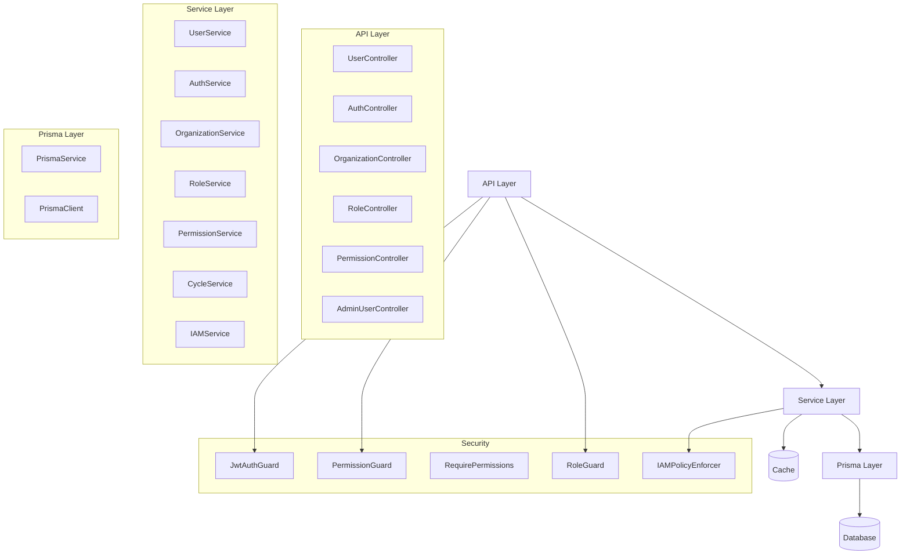

# User Domain 구현 가이드

## 개요
User Domain은 사용자 관리, 인증, 인가(IAM)를 담당하는 핵심 도메인입니다. 본 문서는 User Domain의 구현 상세 사항과 IAM(Identity and Access Management) 구현 방법을 설명합니다.

## 아키텍처

### 전체 구조


## IAM 구성 요소

### IAM 주요 컴포넌트
IAM은 다음과 같은 주요 컴포넌트로 구성됩니다:

1. **주체(Principal)**: 시스템에 접근하는 엔티티(사용자, 서비스 계정 등)
2. **역할(Role)**: 주체에 할당되는 권한 집합
3. **권한(Permission)**: 특정 리소스에 대한 접근 권한
4. **정책(Policy)**: 주체, 리소스, 조건에 따른 권한 부여 규칙
5. **리소스(Resource)**: 접근 제어 대상

## 엔티티 정의

### User 엔티티
```prisma
// schema.prisma
model User {
  id          String      @id @default(uuid())
  email       String      @unique
  password    String
  name        String
  profile     Json?
  lastLoginAt DateTime
  createdAt   DateTime
  updatedAt   DateTime
  isActive    Boolean     @default(true)
  
  roles       Role[]      @relation("UserToRole")
  organization Organization? @relation(fields: [organizationId], references: [id])
  organizationId String?
  
  policies    UserPolicy[]
  cycles      UserCycle[]
}
```

### Organization 엔티티
```prisma
// schema.prisma
model Organization {
  id          String      @id @default(uuid())
  name        String      @unique
  description String?
  type        String
  createdAt   DateTime
  createdById String
  
  users       User[]
}
```

### Role 엔티티
```prisma
// schema.prisma
model Role {
  id          String       @id @default(uuid())
  name        String       @unique
  description String?
  createdAt   DateTime
  updatedAt   DateTime
  createdById String?
  
  permissions Permission[] @relation("RoleToPermission")
  users       User[]       @relation("UserToRole")
}
```

### Permission 엔티티
```prisma
// schema.prisma
model Permission {
  id          String     @id @default(uuid())
  name        String     @unique
  description String?
  resource    String
  action      String
  scope       String     @default("*")
  createdAt   DateTime
  updatedAt   DateTime
  
  roles       Role[]     @relation("RoleToPermission")
}
```

### UserPolicy 엔티티
```prisma
// schema.prisma
model UserPolicy {
  id          String     @id @default(uuid())
  userId      String
  resource    String
  action      String
  conditions  Json?
  isAllow     Boolean    @default(true)
  createdAt   DateTime
  updatedAt   DateTime
  createdById String?
  
  user        User       @relation(fields: [userId], references: [id])
}
```

### UserCycle 엔티티
```prisma
// schema.prisma
model UserCycle {
  id                    String          @id @default(uuid())
  userId                String
  siteId                String
  status                UserCycleStatus @default(PENDING)
  startAt               DateTime
  endAt                 DateTime
  lastStatusChangeAt    DateTime?
  lastStatusChangeReason String?
  createdAt             DateTime
  updatedAt             DateTime
  
  user                  User            @relation(fields: [userId], references: [id])
  
  @@index([userId, status])
  @@index([userId, siteId])
  @@index([startAt, endAt])
}

enum UserCycleStatus {
  PENDING
  ACTIVE
  COMPLETED
  SUSPENDED
  CANCELLED
}
```

## DTO 정의

### 사용자 관련 DTO
```typescript
export class CreateUserDto {
  @ApiProperty()
  @IsEmail()
  email: string;

  @ApiProperty()
  @IsString()
  @MinLength(8)
  password: string;

  @ApiProperty()
  @IsString()
  name: string;

  @ApiProperty()
  @IsString()
  deviceId: string;

  @ApiProperty()
  @IsString()
  verificationId: string;

  @ApiProperty()
  @ValidateNested()
  @Type(() => PrivacyConsentDto)
  privacyConsent: PrivacyConsentDto;
}

export class PrivacyConsentDto {
  @ApiProperty()
  @IsBoolean()
  termsAndConditions: boolean;

  @ApiProperty()
  @IsBoolean()
  privacyPolicy: boolean;

  @ApiProperty()
  @IsBoolean()
  marketingConsent: boolean;
}

export class UserResponseDto {
  id: string;
  email: string;
  name: string;
  profile?: {
    nickname?: string;
    imageUrl?: string;
    organization?: string;
    position?: string;
  };
  lastLoginAt: Date;
  createdAt: Date;
}
```

### IAM 관련 DTO
```typescript
export class CreateRoleDto {
  @ApiProperty()
  @IsString()
  @Length(3, 30)
  name: string;

  @ApiProperty({ required: false })
  @IsString()
  @IsOptional()
  description?: string;

  @ApiProperty({ type: [String] })
  @IsArray()
  @IsOptional()
  permissionIds?: string[];
}

export class RoleResponseDto {
  id: string;
  name: string;
  description?: string;
  permissions: PermissionResponseDto[];
  createdAt: Date;
  updatedAt: Date;
}

export class CreatePermissionDto {
  @ApiProperty()
  @IsString()
  @Length(3, 30)
  name: string;

  @ApiProperty()
  @IsString()
  resource: string;

  @ApiProperty()
  @IsString()
  @IsIn(['create', 'read', 'update', 'delete', 'manage', '*'])
  action: string;

  @ApiProperty({ required: false })
  @IsString()
  @IsOptional()
  scope?: string;

  @ApiProperty({ required: false })
  @IsString()
  @IsOptional()
  description?: string;
}

export class PermissionResponseDto {
  id: string;
  name: string;
  description?: string;
  resource: string;
  action: string;
  scope: string;
  createdAt: Date;
}

export class CreateUserPolicyDto {
  @ApiProperty()
  @IsString()
  resource: string;

  @ApiProperty()
  @IsString()
  @IsIn(['create', 'read', 'update', 'delete', 'manage', '*'])
  action: string;

  @ApiProperty({ required: false })
  @IsObject()
  @IsOptional()
  conditions?: any;

  @ApiProperty({ default: true })
  @IsBoolean()
  @IsOptional()
  isAllow?: boolean;
}

export class UserPolicyResponseDto {
  id: string;
  userId: string;
  resource: string;
  action: string;
  conditions?: any;
  isAllow: boolean;
  createdAt: Date;
}

export class AssignRoleDto {
  @ApiProperty({ type: [String] })
  @IsArray()
  @IsUUID('4', { each: true })
  roleIds: string[];
}
```

### 인증 관련 DTO
```typescript
export class LoginDto {
  @IsEmail()
  email: string;

  @IsString()
  password: string;
}

export class TokenResponseDto {
  accessToken: string;
  refreshToken: string;
  expiresIn: number;
}
```

### 주기 관련 DTO
```typescript
export class CreateCycleDto {
  @IsUUID()
  @ApiProperty()
  siteId: string;

  @IsDate()
  @ApiProperty()
  startAt: Date;

  @IsDate()
  @ApiProperty()
  endAt: Date;
}

export class UpdateCycleStatusDto {
  @IsEnum(UserCycleStatus)
  @ApiProperty({ enum: UserCycleStatus })
  status: UserCycleStatus;

  @IsString()
  @IsOptional()
  @ApiProperty({ required: false })
  reason?: string;
}

export class CycleResponseDto {
  id: string;
  userId: string;
  siteId: string;
  status: UserCycleStatus;
  startAt: Date;
  endAt: Date;
  lastStatusChangeAt?: Date;
  lastStatusChangeReason?: string;
  createdAt: Date;
}
```

## 서비스 구현

### IAMService
```typescript
@Injectable()
export class IAMService {
  constructor(
    private readonly prisma: PrismaService,
    private readonly cacheService: CacheService,
    private readonly timeMachineService: TimeMachineService,
  ) {}

  async createRole(dto: CreateRoleDto, createdBy?: string): Promise<RoleResponseDto> {
    // 역할 이름 중복 확인
    const existingRole = await this.prisma.role.findUnique({
      where: { name: dto.name },
    });

    if (existingRole) {
      throw new ErrorResponseDto({
        code: 'IAM001',
        message: 'ROLE_NAME_EXISTS',
        detail: '이미 존재하는 역할 이름입니다.',
      });
    }

    const now = await this.timeMachineService.getCurrentDate();
    
    const role = await this.prisma.role.create({
      data: {
        name: dto.name,
        description: dto.description,
        createdAt: now,
        updatedAt: now,
        createdById: createdBy,
        ...(dto.permissionIds?.length && {
          permissions: {
            connect: dto.permissionIds.map(id => ({ id })),
          },
        }),
      },
      include: {
        permissions: true,
      },
    });

    return this.mapToRoleDto(role);
  }

  async assignRolesToUser(userId: string, dto: AssignRoleDto): Promise<void> {
    const user = await this.prisma.user.findUnique({
      where: { id: userId },
      include: { roles: true },
    });

    if (!user) {
      throw new ErrorResponseDto({
        code: 'USER004',
        message: 'USER_NOT_FOUND',
        detail: '사용자를 찾을 수 없습니다.',
      });
    }

    // 역할 존재 확인
    const roles = await this.prisma.role.findMany({
      where: { id: { in: dto.roleIds } },
    });

    if (roles.length !== dto.roleIds.length) {
      throw new ErrorResponseDto({
        code: 'IAM002',
        message: 'INVALID_ROLE_IDS',
        detail: '일부 역할을 찾을 수 없습니다.',
      });
    }

    // 기존 역할 연결 해제 후 새 역할 연결
    await this.prisma.user.update({
      where: { id: userId },
      data: {
        roles: {
          set: dto.roleIds.map(id => ({ id })),
        },
      },
    });

    await this.invalidateUserPermissionsCache(userId);
  }

  async createPermission(dto: CreatePermissionDto): Promise<PermissionResponseDto> {
    // 권한 이름 중복 확인
    const existingPermission = await this.prisma.permission.findUnique({
      where: { name: dto.name },
    });

    if (existingPermission) {
      throw new ErrorResponseDto({
        code: 'IAM003',
        message: 'PERMISSION_NAME_EXISTS',
        detail: '이미 존재하는 권한 이름입니다.',
      });
    }

    const now = await this.timeMachineService.getCurrentDate();
    
    const permission = await this.prisma.permission.create({
      data: {
        name: dto.name,
        description: dto.description,
        resource: dto.resource,
        action: dto.action,
        scope: dto.scope || '*',
        createdAt: now,
        updatedAt: now,
      },
    });

    return this.mapToPermissionDto(permission);
  }

  async createUserPolicy(userId: string, dto: CreateUserPolicyDto, createdBy?: string): Promise<UserPolicyResponseDto> {
    const user = await this.prisma.user.findUnique({
      where: { id: userId },
    });

    if (!user) {
      throw new ErrorResponseDto({
        code: 'USER004',
        message: 'USER_NOT_FOUND',
        detail: '사용자를 찾을 수 없습니다.',
      });
    }

    const now = await this.timeMachineService.getCurrentDate();
    
    const policy = await this.prisma.userPolicy.create({
      data: {
        userId,
        resource: dto.resource,
        action: dto.action,
        conditions: dto.conditions,
        isAllow: dto.isAllow ?? true,
        createdAt: now,
        updatedAt: now,
        createdById: createdBy,
      },
    });

    await this.invalidateUserPermissionsCache(userId);
    return this.mapToUserPolicyDto(policy);
  }

  async checkPermission(userId: string, resource: string, action: string): Promise<boolean> {
    const cacheKey = `permissions:${userId}:${resource}:${action}`;
    const cached = await this.cacheService.get(cacheKey);
    
    if (cached !== undefined) {
      return cached;
    }

    // 사용자 조회 (역할 포함)
    const user = await this.prisma.user.findUnique({
      where: { 
        id: userId,
        isActive: true,
      },
      include: {
        roles: {
          include: {
            permissions: true,
          },
        },
        policies: true,
      },
    });

    if (!user) {
      await this.cacheService.set(cacheKey, false, 300);
      return false;
    }

    // 사용자 정책 확인
    const directPolicy = user.policies?.find(
      policy => policy.resource === resource && policy.action === action
    );

    if (directPolicy) {
      const hasPermission = directPolicy.isAllow;
      await this.cacheService.set(cacheKey, hasPermission, 300);
      return hasPermission;
    }

    // 역할 기반 권한 확인
    const hasPermission = user.roles.some(role =>
      role.permissions.some(
        perm =>
          (perm.resource === resource || perm.resource === '*') &&
          (perm.action === action || perm.action === '*')
      )
    );

    await this.cacheService.set(cacheKey, hasPermission, 300);
    return hasPermission;
  }

  private async invalidateUserPermissionsCache(userId: string): Promise<void> {
    const pattern = `permissions:${userId}:*`;
    await this.cacheService.deletePattern(pattern);
  }

  private mapToRoleDto(role: Role): RoleResponseDto {
    return {
      id: role.id,
      name: role.name,
      description: role.description,
      permissions: role.permissions?.map(perm => this.mapToPermissionDto(perm)) || [],
      createdAt: role.createdAt,
      updatedAt: role.updatedAt,
    };
  }

  private mapToPermissionDto(permission: Permission): PermissionResponseDto {
    return {
      id: permission.id,
      name: permission.name,
      description: permission.description,
      resource: permission.resource,
      action: permission.action,
      scope: permission.scope,
      createdAt: permission.createdAt,
    };
  }

  private mapToUserPolicyDto(policy: UserPolicy): UserPolicyResponseDto {
    return {
      id: policy.id,
      userId: policy.userId,
      resource: policy.resource,
      action: policy.action,
      conditions: policy.conditions,
      isAllow: policy.isAllow,
      createdAt: policy.createdAt,
    };
  }
}
```

### UserService
```typescript
@Injectable()
export class UserService {
  constructor(
    private readonly prisma: PrismaService,
    private readonly roleService: RoleService,
    private readonly authService: AuthService,
    private readonly cacheService: CacheService,
  ) {}

  async create(dto: CreateUserDto): Promise<UserResponseDto> {
    // 이메일 인증 확인
    const isEmailVerified = await this.authService.checkEmailVerification(
      dto.email,
      dto.verificationId
    );

    if (!isEmailVerified) {
      throw new ErrorResponseDto({
        code: 'USER008',
        message: 'EMAIL_NOT_VERIFIED',
        detail: '이메일 인증이 완료되지 않았습니다.',
      });
    }

    // 이메일 중복 확인
    const existingUser = await this.prisma.user.findUnique({
      where: { email: dto.email },
    });

    if (existingUser) {
      throw new ErrorResponseDto({
        code: 'USER002',
        message: 'EMAIL_EXISTS',
        detail: '이미 존재하는 이메일입니다.',
      });
    }

    // 필수 약관 동의 확인
    if (!dto.privacyConsent.termsAndConditions || !dto.privacyConsent.privacyPolicy) {
      throw new ErrorResponseDto({
        code: 'USER003',
        message: 'REQUIRED_CONSENT_MISSING',
        detail: '필수 약관에 동의해야 합니다.',
      });
    }

    // 비밀번호 해싱
    const hashedPassword = await bcrypt.hash(dto.password, 10);
    
    // 사용자 생성
    const now = new Date();
    const user = await this.prisma.user.create({
      data: {
        email: dto.email,
        password: hashedPassword,
        name: dto.name,
        lastLoginAt: now,
        createdAt: now,
        updatedAt: now,
      },
    });
    
    // 이벤트 발행
    this.eventEmitter.emit('user.created', {
      userId: user.id,
      email: user.email,
      deviceId: dto.deviceId,
      marketingConsent: dto.privacyConsent.marketingConsent
    });
    
    return this.mapToDto(user);
  }

  private mapToDto(user: User): UserResponseDto {
    return {
      id: user.id,
      email: user.email,
      name: user.name,
      profile: user.profile,
      lastLoginAt: user.lastLoginAt,
      createdAt: user.createdAt,
    };
  }
}
```

### AuthService
```typescript
@Injectable()
export class AuthService {
  constructor(
    private readonly userService: UserService,
    private readonly jwtService: JwtService,
    private readonly cacheManager: Cache,
  ) {}

  async validateUser(email: string, password: string): Promise<User> {
    const user = await this.userService.findByEmail(email);
    if (!user) {
      throw new ErrorResponseDto({
        code: 'AUTH001',
        message: 'INVALID_CREDENTIALS',
        detail: '잘못된 인증 정보입니다.',
      });
    }

    const isPasswordValid = await bcrypt.compare(password, user.password);
    if (!isPasswordValid) {
      throw new ErrorResponseDto({
        code: 'AUTH001',
        message: 'INVALID_CREDENTIALS',
        detail: '잘못된 인증 정보입니다.',
      });
    }

    return user;
  }

  async login(user: User): Promise<TokenResponseDto> {
    const payload = { sub: user.id, email: user.email };
    const accessToken = this.jwtService.sign(payload);
    const refreshToken = this.jwtService.sign(payload, { expiresIn: '7d' });

    await this.cacheManager.set(
      `refresh_token:${user.id}`,
      refreshToken,
      { ttl: 7 * 24 * 60 * 60 }, // 7 days
    );

    return {
      accessToken,
      refreshToken,
      expiresIn: 3600,
    };
  }
}
```

### CycleService
```typescript
@Injectable()
export class CycleService {
  constructor(
    @InjectRepository(UserCycle)
    private cycleRepository: Repository<UserCycle>,
    private readonly timeMachineService: TimeMachineService,
    private readonly cacheService: CacheService,
  ) {}

  async create(userId: string, dto: CreateCycleDto): Promise<CycleResponseDto> {
    // 중복 주기 검사
    const existingCycle = await this.findOverlappingCycle(userId, dto.siteId, dto.startAt, dto.endAt);
    if (existingCycle) {
      throw new ErrorResponseDto({
        code: 'CYCLE005',
        message: 'OVERLAPPING_CYCLE',
        detail: '중복된 기간의 주기가 존재합니다.',
      });
    }

    // 활성 주기 검사
    const activeCycle = await this.findActiveCycle(userId, dto.siteId);
    if (activeCycle) {
      throw new ErrorResponseDto({
        code: 'CYCLE004',
        message: 'ACTIVE_CYCLE_EXISTS',
        detail: '활성 주기가 이미 존재합니다.',
      });
    }

    const cycle = this.cycleRepository.create({
      userId,
      ...dto,
      status: UserCycleStatus.PENDING,
      createdAt: await this.timeMachineService.getCurrentDate(),
      updatedAt: await this.timeMachineService.getCurrentDate(),
    });

    const savedCycle = await this.cycleRepository.save(cycle);
    await this.invalidateCycleCache(userId);
    return this.mapToDto(savedCycle);
  }

  async updateStatus(userId: string, cycleId: string, dto: UpdateCycleStatusDto): Promise<CycleResponseDto> {
    const cycle = await this.cycleRepository.findOne({
      where: { id: cycleId, userId },
    });

    if (!cycle) {
      throw new ErrorResponseDto({
        code: 'CYCLE003',
        message: 'CYCLE_NOT_FOUND',
        detail: '주기를 찾을 수 없습니다.',
      });
    }

    // 상태 전이 검증
    if (!this.isValidStatusTransition(cycle.status, dto.status)) {
      throw new ErrorResponseDto({
        code: 'CYCLE002',
        message: 'INVALID_STATUS_TRANSITION',
        detail: '잘못된 상태 전환입니다.',
      });
    }

    const now = await this.timeMachineService.getCurrentDate();
    cycle.status = dto.status;
    cycle.lastStatusChangeAt = now;
    cycle.lastStatusChangeReason = dto.reason;
    cycle.updatedAt = now;

    const updatedCycle = await this.cycleRepository.save(cycle);
    await this.invalidateCycleCache(userId);
    return this.mapToDto(updatedCycle);
  }

  async findById(userId: string, cycleId: string): Promise<CycleResponseDto> {
    const cacheKey = `cycle:${cycleId}`;
    const cached = await this.cacheService.get(cacheKey);
    if (cached) {
      return cached;
    }

    const cycle = await this.cycleRepository.findOne({
      where: { id: cycleId, userId },
    });

    if (!cycle) {
      throw new ErrorResponseDto({
        code: 'CYCLE003',
        message: 'CYCLE_NOT_FOUND',
        detail: '주기를 찾을 수 없습니다.',
      });
    }

    const dto = this.mapToDto(cycle);
    await this.cacheService.set(cacheKey, dto, 300); // 5분 캐시
    return dto;
  }

  async findAll(userId: string, query: {
    status?: UserCycleStatus[];
    siteId?: string;
    page?: number;
    size?: number;
  }): Promise<PaginatedResponse<CycleResponseDto>> {
    const { status, siteId, page = 1, size = 20 } = query;
    
    const queryBuilder = this.cycleRepository.createQueryBuilder('cycle')
      .where('cycle.userId = :userId', { userId });

    if (status?.length) {
      queryBuilder.andWhere('cycle.status IN (:...status)', { status });
    }

    if (siteId) {
      queryBuilder.andWhere('cycle.siteId = :siteId', { siteId });
    }

    const [items, total] = await queryBuilder
      .orderBy('cycle.createdAt', 'DESC')
      .skip((page - 1) * size)
      .take(size)
      .getManyAndCount();

    return {
      items: items.map(cycle => this.mapToDto(cycle)),
      pagination: {
        page,
        size,
        totalItems: total,
        totalPages: Math.ceil(total / size),
      },
    };
  }

  private async findOverlappingCycle(
    userId: string,
    siteId: string,
    startAt: Date,
    endAt: Date,
  ): Promise<UserCycle | null> {
    return this.cycleRepository
      .createQueryBuilder('cycle')
      .where('cycle.userId = :userId', { userId })
      .andWhere('cycle.siteId = :siteId', { siteId })
      .andWhere(
        '(cycle.startAt <= :endAt AND cycle.endAt >= :startAt)',
        { startAt, endAt },
      )
      .getOne();
  }

  private async findActiveCycle(userId: string, siteId: string): Promise<UserCycle | null> {
    return this.cycleRepository.findOne({
      where: {
        userId,
        siteId,
        status: UserCycleStatus.ACTIVE,
      },
    });
  }

  private isValidStatusTransition(currentStatus: UserCycleStatus, newStatus: UserCycleStatus): boolean {
    const allowedTransitions = {
      [UserCycleStatus.PENDING]: [UserCycleStatus.ACTIVE, UserCycleStatus.CANCELLED],
      [UserCycleStatus.ACTIVE]: [UserCycleStatus.COMPLETED, UserCycleStatus.SUSPENDED],
      [UserCycleStatus.SUSPENDED]: [UserCycleStatus.ACTIVE, UserCycleStatus.CANCELLED],
      [UserCycleStatus.COMPLETED]: [],
      [UserCycleStatus.CANCELLED]: [],
    };

    return allowedTransitions[currentStatus]?.includes(newStatus) ?? false;
  }

  private async invalidateCycleCache(userId: string): Promise<void> {
    const pattern = `cycle:*:${userId}`;
    await this.cacheService.deletePattern(pattern);
  }

  private mapToDto(cycle: UserCycle): CycleResponseDto {
    return {
      id: cycle.id,
      userId: cycle.userId,
      siteId: cycle.siteId,
      status: cycle.status,
      startAt: cycle.startAt,
      endAt: cycle.endAt,
      lastStatusChangeAt: cycle.lastStatusChangeAt,
      lastStatusChangeReason: cycle.lastStatusChangeReason,
      createdAt: cycle.createdAt,
    };
  }
}
```

## 인증 및 인가 구현

### JwtAuthGuard
```typescript
@Injectable()
export class JwtAuthGuard implements CanActivate {
  constructor(
    private readonly jwtService: JwtService,
    private readonly cacheManager: Cache,
  ) {}

  async canActivate(context: ExecutionContext): Promise<boolean> {
    const request = context.switchToHttp().getRequest();
    const token = this.extractTokenFromHeader(request);
    
    if (!token) {
      throw new UnauthorizedException('인증 토큰이 필요합니다.');
    }

    try {
      const payload = this.jwtService.verify(token);
      
      // 토큰 블랙리스트 확인
      const isBlacklisted = await this.cacheManager.get(`blacklist:${token}`);
      if (isBlacklisted) {
        throw new UnauthorizedException('만료된 토큰입니다.');
      }
      
      request.user = payload;
      return true;
    } catch (error) {
      throw new UnauthorizedException('유효하지 않은 토큰입니다.');
    }
  }

  private extractTokenFromHeader(request: Request): string | undefined {
    const authorization = request.headers?.authorization;
    if (!authorization || !authorization.startsWith('Bearer ')) {
      return undefined;
    }
    return authorization.substring(7);
  }
}
```

### PermissionGuard
```typescript
@Injectable()
export class PermissionGuard implements CanActivate {
  constructor(
    private readonly reflector: Reflector,
    private readonly iamService: IAMService,
  ) {}

  async canActivate(context: ExecutionContext): Promise<boolean> {
    const requiredPermissions = this.reflector.getAllAndOverride<{
      resource: string;
      action: string;
    }>('permissions', [context.getHandler(), context.getClass()]);

    if (!requiredPermissions) {
      return true;
    }

    const request = context.switchToHttp().getRequest();
    const user = request.user;

    if (!user) {
      return false;
    }

    const { resource, action } = requiredPermissions;
    return this.iamService.checkPermission(user.sub, resource, action);
  }
}
```

### RequirePermissions 데코레이터
```typescript
export const RequirePermissions = (resource: string, action: string) =>
  SetMetadata('permissions', { resource, action });
```

### RoleGuard
```typescript
@Injectable()
export class RoleGuard implements CanActivate {
  constructor(
    private readonly reflector: Reflector,
    private readonly userRepository: Repository<User>,
  ) {}

  async canActivate(context: ExecutionContext): Promise<boolean> {
    const requiredRoles = this.reflector.getAllAndOverride<string[]>('roles', [
      context.getHandler(),
      context.getClass(),
    ]);

    if (!requiredRoles) {
      return true;
    }

    const request = context.switchToHttp().getRequest();
    const user = request.user;

    if (!user) {
      return false;
    }

    const userEntity = await this.userRepository.findOne({
      where: { id: user.sub },
      relations: ['roles'],
    });

    if (!userEntity) {
      return false;
    }

    return requiredRoles.some(role =>
      userEntity.roles.some(userRole => userRole.name === role)
    );
  }
}
```

### Roles 데코레이터
```typescript
export const Roles = (...roles: string[]) => SetMetadata('roles', roles);
```

## 컨트롤러 구현

### RoleController
```typescript
@Controller('v1/iam/roles')
@UseGuards(JwtAuthGuard, PermissionGuard)
export class RoleController {
  constructor(private readonly iamService: IAMService) {}

  @Post()
  @RequirePermissions('roles', 'create')
  @ApiOperation({ summary: '역할 생성' })
  @ApiResponse({ status: 201, type: RoleResponseDto })
  async create(
    @Body() dto: CreateRoleDto,
    @Request() req,
  ): Promise<ApiResponse<RoleResponseDto>> {
    const role = await this.iamService.createRole(dto, req.user.sub);
    return {
      status: 201,
      data: role,
    };
  }

  @Post(':roleId/permissions')
  @RequirePermissions('roles', 'update')
  @ApiOperation({ summary: '역할에 권한 할당' })
  @ApiResponse({ status: 200, type: RoleResponseDto })
  async assignPermissions(
    @Param('roleId') roleId: string,
    @Body() dto: { permissionIds: string[] },
  ): Promise<ApiResponse<RoleResponseDto>> {
    const role = await this.iamService.assignPermissionsToRole(roleId, dto.permissionIds);
    return {
      status: 200,
      data: role,
    };
  }

  @Get(':roleId')
  @RequirePermissions('roles', 'read')
  @ApiOperation({ summary: '역할 조회' })
  @ApiResponse({ status: 200, type: RoleResponseDto })
  async findById(
    @Param('roleId') roleId: string,
  ): Promise<ApiResponse<RoleResponseDto>> {
    const role = await this.iamService.findRoleById(roleId);
    return {
      status: 200,
      data: role,
    };
  }

  @Get()
  @RequirePermissions('roles', 'read')
  @ApiOperation({ summary: '역할 목록 조회' })
  @ApiResponse({ status: 200, type: [RoleResponseDto] })
  async findAll(): Promise<ApiResponse<RoleResponseDto[]>> {
    const roles = await this.iamService.findAllRoles();
    return {
      status: 200,
      data: roles,
    };
  }
}
```

### PermissionController
```typescript
@Controller('v1/iam/permissions')
@UseGuards(JwtAuthGuard, PermissionGuard)
export class PermissionController {
  constructor(private readonly iamService: IAMService) {}

  @Post()
  @RequirePermissions('permissions', 'create')
  @ApiOperation({ summary: '권한 생성' })
  @ApiResponse({ status: 201, type: PermissionResponseDto })
  async create(
    @Body() dto: CreatePermissionDto,
  ): Promise<ApiResponse<PermissionResponseDto>> {
    const permission = await this.iamService.createPermission(dto);
    return {
      status: 201,
      data: permission,
    };
  }

  @Get(':permissionId')
  @RequirePermissions('permissions', 'read')
  @ApiOperation({ summary: '권한 조회' })
  @ApiResponse({ status: 200, type: PermissionResponseDto })
  async findById(
    @Param('permissionId') permissionId: string,
  ): Promise<ApiResponse<PermissionResponseDto>> {
    const permission = await this.iamService.findPermissionById(permissionId);
    return {
      status: 200,
      data: permission,
    };
  }

  @Get()
  @RequirePermissions('permissions', 'read')
  @ApiOperation({ summary: '권한 목록 조회' })
  @ApiResponse({ status: 200, type: [PermissionResponseDto] })
  async findAll(): Promise<ApiResponse<PermissionResponseDto[]>> {
    const permissions = await this.iamService.findAllPermissions();
    return {
      status: 200,
      data: permissions,
    };
  }
}
```

### UserController
```typescript
@Controller('v1/users')
export class UserController {
  constructor(private readonly userService: UserService) {}

  @Post('register')
  @ApiOperation({ summary: '사용자 등록' })
  @ApiResponse({ status: 201, type: UserResponseDto })
  async register(@Body() dto: CreateUserDto): Promise<ApiResponse<UserResponseDto>> {
    try {
      const user = await this.userService.create(dto);
      return {
        status: 201,
        data: user,
      };
    } catch (error) {
      if (error instanceof ErrorResponseDto) {
        throw error;
      }
      throw new ErrorResponseDto({
        code: 'USER001',
        message: 'INVALID_INPUT',
        detail: '사용자 등록 중 오류가 발생했습니다.',
      });
    }
  }

  @Post(':userId/roles')
  @RequirePermissions('users', 'update')
  @ApiOperation({ summary: '사용자에게 역할 할당' })
  @ApiResponse({ status: 204 })
  @HttpCode(204)
  async assignRoles(
    @Param('userId') userId: string,
    @Body() dto: AssignRoleDto,
  ): Promise<void> {
    await this.iamService.assignRolesToUser(userId, dto);
  }

  @Post(':userId/policies')
  @RequirePermissions('users', 'update')
  @ApiOperation({ summary: '사용자 정책 생성' })
  @ApiResponse({ status: 201, type: UserPolicyResponseDto })
  async createPolicy(
    @Param('userId') userId: string,
    @Body() dto: CreateUserPolicyDto,
    @Request() req,
  ): Promise<ApiResponse<UserPolicyResponseDto>> {
    const policy = await this.iamService.createUserPolicy(userId, dto, req.user.sub);
    return {
      status: 201,
      data: policy,
    };
  }
}
```

### AuthController
```typescript
@Controller('v1/auth')
export class AuthController {
  constructor(private readonly authService: AuthService) {}

  @Post('login')
  @ApiOperation({ summary: '로그인' })
  @ApiResponse({ status: 200, type: TokenResponseDto })
  async login(@Body() dto: LoginDto): Promise<ApiResponse<TokenResponseDto>> {
    try {
      const user = await this.authService.validateUser(dto.email, dto.password);
      const tokens = await this.authService.login(user);
      return {
        status: 200,
        data: tokens,
      };
    } catch (error) {
      if (error instanceof ErrorResponseDto) {
        throw error;
      }
      throw new ErrorResponseDto({
        code: 'AUTH001',
        message: 'INVALID_CREDENTIALS',
        detail: '로그인 중 오류가 발생했습니다.',
      });
    }
  }
}
```

## 캐싱 전략

### 캐시 설정
```typescript
@Module({
  imports: [
    CacheModule.registerAsync({
      useFactory: () => ({
        store: redisStore,
        host: process.env.REDIS_HOST,
        port: process.env.REDIS_PORT,
        ttl: 3600,
      }),
    }),
  ],
})
export class UserModule {}
```

### 캐시 키 정책
- 사용자 정보: `user:${userId}`
- 리프레시 토큰: `refresh_token:${userId}`
- 권한 정보: `roles:${userId}`
- 권한 검사 결과: `permissions:${userId}:${resource}:${action}`
- 토큰 블랙리스트: `blacklist:${token}`

## 에러 처리

### ErrorResponseDto
```typescript
export class ErrorResponseDto extends HttpException {
  constructor({
    code,
    message,
    detail,
    status = HttpStatus.BAD_REQUEST,
  }: {
    code: string;
    message: string;
    detail: string;
    status?: number;
  }) {
    super(
      {
        status,
        code,
        message,
        detail,
      },
      status,
    );
  }
}
```

### IAM 관련 에러 코드
| 코드 | 메시지 | 설명 |
|------|--------|------|
| IAM001 | ROLE_NAME_EXISTS | 역할 이름이 이미 존재합니다 |
| IAM002 | INVALID_ROLE_IDS | 유효하지 않은 역할 ID입니다 |
| IAM003 | PERMISSION_NAME_EXISTS | 권한 이름이 이미 존재합니다 |
| IAM004 | PERMISSION_NOT_FOUND | 권한을 찾을 수 없습니다 |
| IAM005 | ROLE_NOT_FOUND | 역할을 찾을 수 없습니다 |
| IAM006 | INSUFFICIENT_PERMISSIONS | 접근 권한이 부족합니다 |
| IAM007 | POLICY_NOT_FOUND | 정책을 찾을 수 없습니다 |

### 에러 필터
```typescript
@Catch()
export class GlobalExceptionFilter implements ExceptionFilter {
  catch(exception: unknown, host: ArgumentsHost) {
    const ctx = host.switchToHttp();
    const response = ctx.getResponse<Response>();

    if (exception instanceof ErrorResponseDto) {
      const error = exception.getResponse() as any;
      response.status(error.status).json(error);
      return;
    }

    response.status(500).json({
      status: 500,
      code: 'INTERNAL_SERVER_ERROR',
      message: 'INTERNAL_SERVER_ERROR',
      detail: '서버 내부 오류가 발생했습니다.',
    });
  }
}
```

## 로깅

### 로깅 인터셉터
```typescript
@Injectable()
export class LoggingInterceptor implements NestInterceptor {
  private readonly logger = new Logger('HTTP');

  intercept(context: ExecutionContext, next: CallHandler): Observable<any> {
    const request = context.switchToHttp().getRequest();
    const { method, url, body } = request;
    const userAgent = request.get('user-agent') || '';
    const { ip } = request;

    this.logger.log(
      `${method} ${url} - ${userAgent} ${ip}\n${JSON.stringify(body)}`,
    );

    const now = Date.now();
    return next.handle().pipe(
      tap((data) => {
        const response = context.switchToHttp().getResponse();
        const { statusCode } = response;
        const contentLength = response.get('content-length');

        this.logger.log(
          `${method} ${url} ${statusCode} ${contentLength} - ${Date.now() - now}ms`,
        );
      }),
    );
  }
}
```

## 모니터링

### 메트릭 수집
```typescript
@Injectable()
export class MetricsService {
  private readonly counter = new Counter({
    name: 'http_requests_total',
    help: 'Total number of HTTP requests',
    labelNames: ['method', 'path', 'status'],
  });

  private readonly histogram = new Histogram({
    name: 'http_request_duration_seconds',
    help: 'HTTP request duration in seconds',
    labelNames: ['method', 'path', 'status'],
  });

  recordMetrics(method: string, path: string, status: number, duration: number) {
    this.counter.inc({ method, path, status });
    this.histogram.observe({ method, path, status }, duration);
  }
}
```

## 성능 최적화

### 데이터베이스 최적화
- 인덱스 설정
```typescript
@Entity()
@Index(['email'])
@Index(['organization'])
export class User {
  // ... existing code ...
}
```

### N+1 문제 해결
```typescript
async findUserWithRoles(userId: string): Promise<User> {
  return this.userRepository
    .createQueryBuilder('user')
    .leftJoinAndSelect('user.roles', 'roles')
    .leftJoinAndSelect('user.organization', 'organization')
    .where('user.id = :userId', { userId })
    .getOne();
}
```

## 변경 이력

| 버전 | 날짜 | 작성자 | 변경 내용 |
|------|------|--------|-----------|
| 0.1.0 | 2025-03-19 | bok@weltcorp.com | 최초 작성 |
| 0.1.1 | 2025-03-20 | bok@weltcorp.com | IAM 기능 추가 |