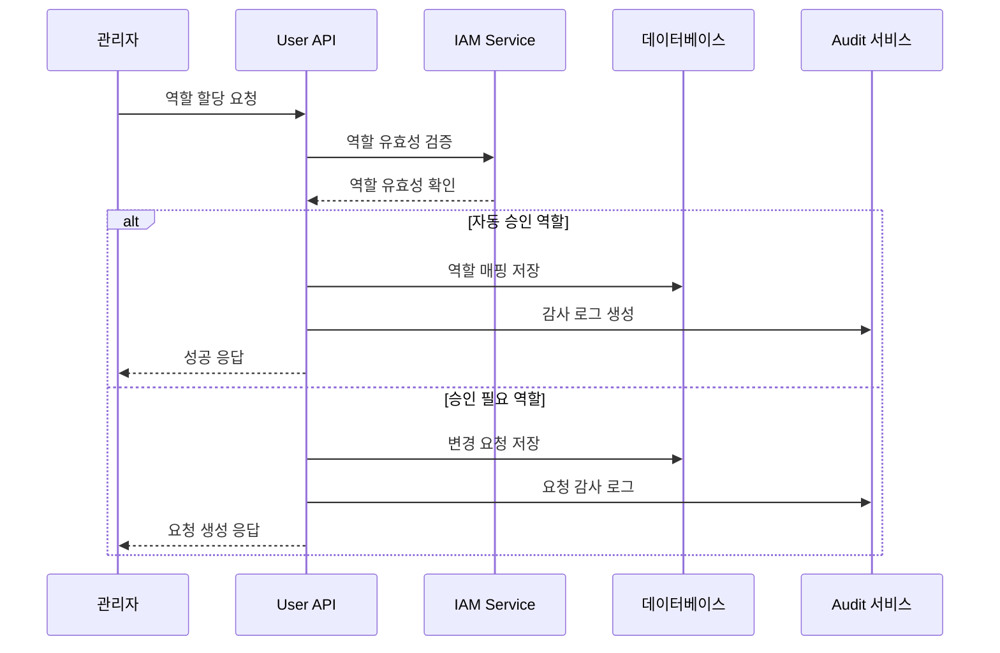
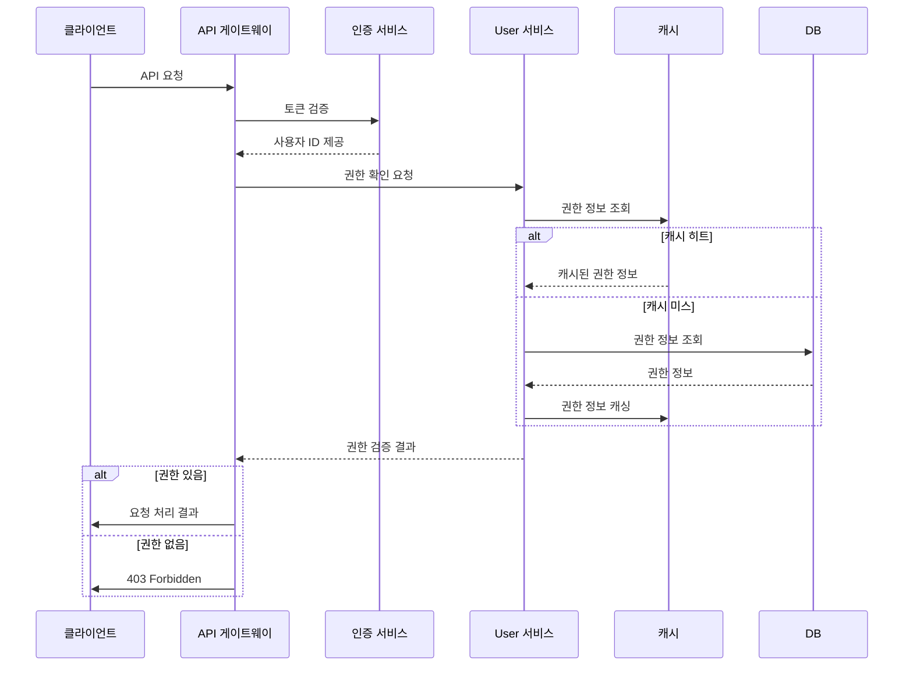

# User API 개요

## 1. 소개
User API는 사용자 관리, 사용자 관련 리소스 관리, 그리고 IAM 역할 관리를 위한 RESTful 엔드포인트를 제공합니다. 이 API는 SleepQ 앱의 사용자 관리 기능과 권한 제어를 지원합니다.

## 2. API 버전
- 현재 버전: v1
- 기본 URL: `https://api.example.com/v1`
- 프로토콜: HTTPS only

## 3. 인증
- Bearer 토큰 인증 사용 (Auth API에서 발급된 토큰)
- 자세한 인증 관련 내용은 [Auth API 문서](../auth/overview.md) 참조

## 4. 공통 사항

### 4.1 요청 헤더
```http
Authorization: Bearer {token}
Content-Type: application/json
Accept: application/json
```

### 4.2 응답 형식
#### 성공 응답
```json
{
  "status": 200,
  "data": {
    // Response data
  }
}
```

#### 에러 응답
```json
{
  "status": 400,
  "code": "ERROR_CODE",
  "message": "Error message",
  "detail": "Detailed error description"
}
```

## 5. API 그룹

### 5.1 사용자 관리 API
- 사용자 정보 조회
- 사용자 정보 수정
- 사용자 삭제
- 비밀번호 변경

> **참고**: 회원가입 및 사용자 등록 관련 기능은 [Auth API 문서](../auth/endpoints.md#1-회원가입-프로세스)를 참조하세요.

### 5.2 디바이스 관리 API
- 디바이스 등록
- 디바이스 목록 조회
- 디바이스 상태 관리

### 5.3 IAM 역할 관리 API
- 사용자 역할 목록 조회
- 사용자 역할 할당
- 사용자 역할 회수
- 역할 변경 요청 관리
- 권한 검증
- 임시 권한 부여

#### 5.3.1 IAM 역할 시스템 구조
User API와 IAM 시스템의 통합은 다음과 같은 구조로 설계되었습니다:

```
┌─────────────────┐     ┌──────────────────┐     ┌──────────────────┐
│                 │     │                  │     │                  │
│    User API     │────▶│   IAM Service    │────▶│  Audit Service   │
│                 │     │                  │     │                  │
└─────────────────┘     └──────────────────┘     └──────────────────┘
        │                        │
        │                        │
        ▼                        ▼
┌─────────────────┐     ┌──────────────────┐
│                 │     │                  │
│  User Database  │     │  IAM Database    │
│                 │     │                  │
└─────────────────┘     └──────────────────┘
```

#### 5.3.2 역할 할당 흐름
1. 관리자가 사용자에게 역할 할당 요청
2. 사용자 API는 요청을 IAM 서비스에 전달
3. 역할 타입에 따라 자동 승인 또는 승인 워크플로우 시작
4. 승인 완료 시 역할 할당 및 감사 로그 기록
5. 할당된 역할 정보 캐싱

#### 5.3.3 권한 검증 흐름
1. 클라이언트가 리소스 접근 요청
2. API 게이트웨이는 사용자 권한 검증 요청
3. 캐시된 권한 정보 확인 (캐시 미스 시 DB 조회)
4. 권한 검증 결과에 따라 요청 허용 또는 거부
5. 검증 결과 감사 로깅

#### 5.3.4 임시 권한 메커니즘
- 기간 제한 임시 권한 부여 기능
- 권한 위임 메커니즘
- 자동 만료 처리
- 임시 권한 추적 및 감사

## 6. 보안 요구사항

### 6.1 인증 및 인가
- 모든 요청은 HTTPS를 통해 전송
- 민감한 데이터는 암호화하여 전송
- API 키는 안전하게 관리

### 6.2 접근 제어
- Rate Limiting 적용
- IP 기반 접근 제한
- 세션 관리

## 7. 성능 요구사항

### 7.1 응답 시간
- 평균 응답 시간: 300ms 이하
- 95 퍼센타일: 1초 이하
- 타임아웃: 5초

### 7.2 처리량
- 초당 최대 요청: 1000 TPS
- 동시 접속자: 10,000명

## 8. 모니터링

### 8.1 메트릭스
- 응답 시간
- 에러율
- 요청 빈도
- 상태 코드 분포

### 8.2 알림
- 5xx 에러 발생 시
- 응답 시간 임계치 초과 시
- 비정상적인 트래픽 발생 시

## 9. API 흐름도

### 9.1 사용자 등록 흐름
> **참고**: 회원가입 흐름은 [Auth API 문서](../auth/endpoints.md#1-회원가입-프로세스)를 참조하세요.

### 9.2 IAM 역할 할당 흐름


### 9.3 권한 검증 흐름


## 10. 사용자 유형별 권한

### System Admin
- 모든 사용자 계정 관리
- 사용자 계정 생성/수정/삭제
- 사용자 정책 관리
- 사용자 그룹 관리
- 대량 사용자 관리 작업
- **모든 IAM 역할 관리**
- **다중 승인 권한 대상 역할 승인**
- **사용자 권한 감사 및 리포트**

### IAM Admin
- 할당된 범위 내 사용자 관리
- 사용자 계정 생성/수정 (삭제 제외)
- 사용자 속성 관리
- 사용자 상태 관리
- **특정 범위(조직/팀)의 IAM 역할 관리**
- **일반 역할 승인 권한**
- **권한 변경 요청 처리**

### Service Account
- 사용자 정보 조회
- 사용자 존재 여부 확인
- 사용자 속성 조회
- 벌크 사용자 정보 조회
- **권한 검증 API 호출**
- **사용자 역할 조회**

### Regular User
- 자신의 프로필 조회/수정
- 자신의 설정 관리
- 자신의 알림 설정
- 개인정보 다운로드
- **자신의 역할 목록 조회**
- **역할 요청 생성**
- **자신의 요청 상태 확인**

## 11. API 사용 제한
- System Admin: 제한 없음
- IAM Admin: 시간당 5,000 요청
- Service Account: 시간당 50,000 요청
- Regular User: 시간당 500 요청

## 12. 사용자 데이터 처리
- 개인정보 암호화 저장
- GDPR 준수
- 데이터 보존 기간 준수
- 사용자 동의 기반 처리
- **권한 변경 이력 감사 로그 유지**
- **RBAC(역할 기반 접근 제어) 적용**
- **최소 권한 원칙 준수**

## 13. IAM 보안 고려사항

### 13.1 권한 부여 원칙
- 최소 권한 원칙(Principle of Least Privilege)
- 작업 분리(Separation of Duties)
- 직무 기반 접근 제어(Role-Based Access Control)
- 다중 인증 및 승인(Multi-Factor Authentication)

### 13.2 권한 감사 및 모니터링
- 모든 권한 변경 이력 추적
- 비정상 권한 사용 패턴 감지
- 권한 변경 알림 시스템
- 주기적 권한 검토 및 정화

### 13.3 권한 관리 자동화
- 규칙 기반 자동 승인/거부
- 시간 기반 권한 만료
- 미사용 권한 자동 회수
- 조직 변경에 따른 권한 조정

## 14. 변경 이력
| 버전 | 날짜 | 설명 | 작성자 |
|------|------|------|--------|
| 0.1.0 | 2025-03-17 | 최초 작성 | bok@weltcorp.com |
| 0.2.0 | 2025-03-19 | IAM 역할 관리 기능 상세화 | bok@weltcorp.com |