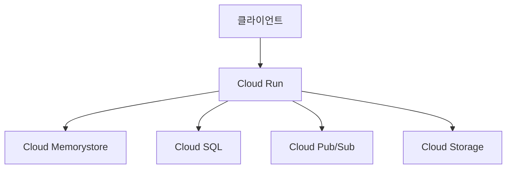
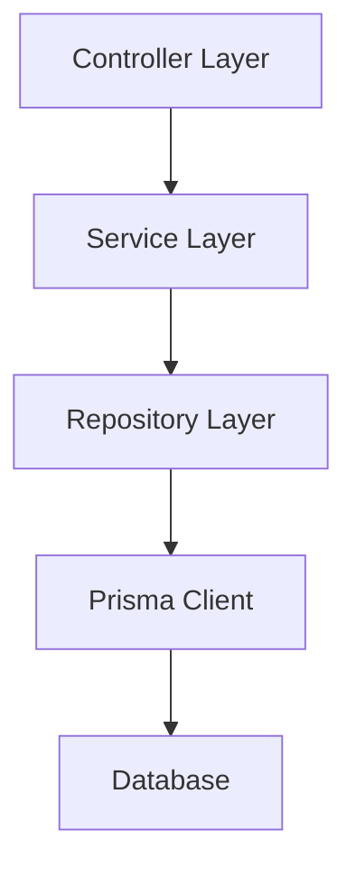

# 아키텍처 개요

## 1. 시스템 아키텍처

### 1.1 전체 구조


### 1.2 주요 컴포넌트
- **Cloud Run**: 서버리스 컨테이너 플랫폼
- **Cloud SQL**: PostgreSQL 데이터베이스
- **Cloud Memorystore**: Redis 캐시
- **Cloud Pub/Sub**: 이벤트 메시징
- **Cloud Storage**: 파일 저장소

## 2. 애플리케이션 아키텍처

### 2.1 계층 구조


### 2.2 주요 기술 스택
- **프레임워크**: NestJS
- **언어**: TypeScript
- **ORM**: Prisma
- **데이터베이스**: PostgreSQL
- **캐시**: Redis
- **메시징**: GCP Pub/Sub

## 3. 데이터 계층

### 3.1 Prisma ORM
- Schema-first 개발 방식
- 타입 안전성 보장
- 자동 생성된 타입과 클라이언트
- 마이그레이션 자동화

```prisma
// schema.prisma 예시
datasource db {
  provider = "postgresql"
  url      = env("DATABASE_URL")
}

generator client {
  provider = "prisma-client-js"
}

model User {
  id        String   @id @default(uuid())
  email     String   @unique
  name      String
  createdAt DateTime @default(now())
  updatedAt DateTime @updatedAt
}
```

### 3.2 데이터베이스 설계
- 도메인 중심 스키마 설계
- 관계형 데이터 모델링
- 인덱스 전략
- 샤딩 고려사항

## 4. 서비스 계층

### 4.1 도메인 서비스
- 비즈니스 로직 캡슐화
- 트랜잭션 관리
- 이벤트 발행
- 도메인 규칙 적용

```typescript
@Injectable()
export class UserService {
  constructor(
    private prisma: PrismaService,
    private eventEmitter: EventEmitter2
  ) {}

  async createUser(data: CreateUserDto): Promise<User> {
    const user = await this.prisma.user.create({
      data: {
        email: data.email,
        name: data.name
      }
    });

    this.eventEmitter.emit('user.created', user);
    return user;
  }
}
```

### 4.2 인프라 서비스
- 캐시 관리
- 이벤트 처리
- 외부 서비스 통합
- 파일 저장소 관리

## 5. API 계층

### 5.1 REST API
- 리소스 기반 설계
- 버전 관리
- 응답 형식 표준화
- 에러 처리

```typescript
@Controller('v1/users')
export class UserController {
  constructor(private userService: UserService) {}

  @Post()
  async createUser(@Body() data: CreateUserDto): Promise<ApiResponse<User>> {
    const user = await this.userService.createUser(data);
    return {
      status: 201,
      data: user
    };
  }
}
```

### 5.2 GraphQL API (선택적)
- 스키마 정의
- 리졸버 구현
- 타입 안전성
- N+1 문제 해결

## 6. 보안 계층

### 6.1 인증
- JWT 기반 인증
- 토큰 갱신

### 6.2 인가
- RBAC 구현
- 권한 검증
- API 보안
- 데이터 접근 제어

## 7. 모니터링

### 7.1 애플리케이션 모니터링
- 성능 메트릭
- 에러 추적
- 로그 수집
- 알림 설정

### 7.2 인프라 모니터링
- 리소스 사용량
- 가용성 모니터링
- 비용 모니터링
- 보안 감사

## 8. 개발 환경

### 8.1 로컬 개발
- Docker Compose 환경
- 개발 데이터베이스
- 테스트 데이터
- 디버깅 도구

### 8.2 CI/CD
- Cloud Build 파이프라인
- 자동화된 테스트
- 자동 배포
- 환경 분리

## 변경 이력
| 버전 | 날짜 | 작성자 | 변경 내용 |
|-----|------|--------|-----------|
| 0.1.0 | 2025-03-17 | bok@weltcorp.com | 최초 작성 | 