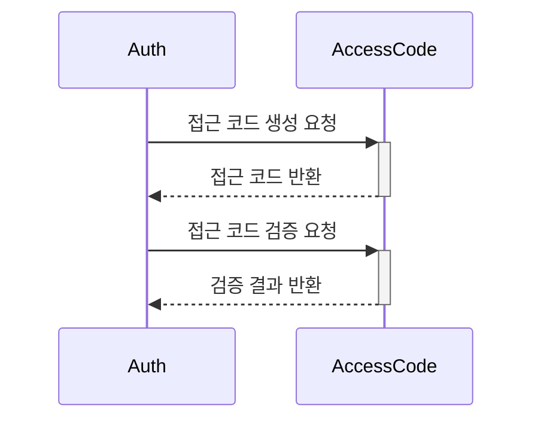
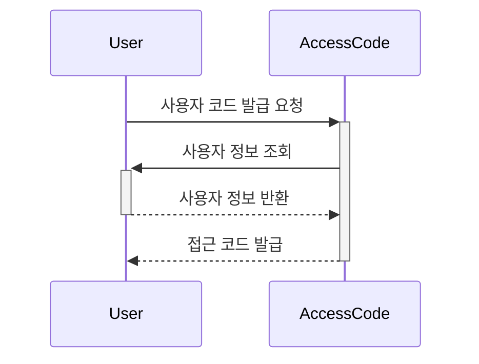
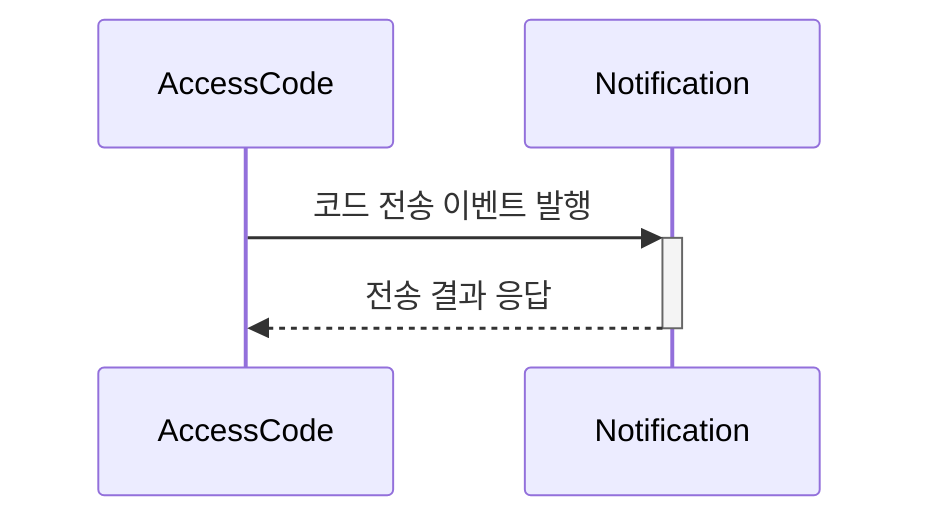

# Access Code 바운디드 컨텍스트

## 1. 컨텍스트 정의
Access Code 도메인은 일회성 또는 제한된 시간 동안 유효한 접근 코드의 생성, 관리, 검증을 담당하는 바운디드 컨텍스트입니다.

### 1.1 주요 책임
- 접근 코드 생성 및 발급
- 접근 코드 유효성 검증
- 접근 코드 만료 관리
- 접근 코드 사용 이력 관리
- 접근 코드 정책 관리

### 1.2 도메인 용어
- Access Code: 시스템 접근을 위한 일회성 또는 시간 제한 코드
- Code Policy: 코드 생성 및 관리 정책
- Code Status: 코드의 현재 상태 (active, used, expired)
- Usage History: 코드 사용 이력
- Code Type: 코드의 유형 (one-time, time-limited, multi-use)

## 2. 컨텍스트 경계

### 2.1 상위 컨텍스트
- Auth Domain: 인증/인가 처리
- User Domain: 사용자 관리

### 2.2 하위 컨텍스트
- Notification Domain: 코드 전송
- Audit Domain: 사용 이력 기록

### 2.3 외부 시스템
- SMS Gateway: SMS를 통한 코드 전송
- Email Service: 이메일을 통한 코드 전송
- TimeMachine: 코드 만료 시간 관리

## 3. 컨텍스트 매핑

### 3.1 Auth Domain과의 관계 (Customer-Supplier)

### 3.2 User Domain과의 관계 (Conformist)

### 3.3 Notification Domain과의 관계 (Published Language)

## 4. 도메인 이벤트

### 4.1 발행하는 이벤트
- AccessCodeGenerated: 새로운 접근 코드 생성
- AccessCodeValidated: 접근 코드 검증 완료
- AccessCodeExpired: 접근 코드 만료
- AccessCodeUsed: 접근 코드 사용 완료

### 4.2 구독하는 이벤트
- UserCreated: 새로운 사용자 생성
- UserDeactivated: 사용자 비활성화
- NotificationDelivered: 알림 전송 완료
- NotificationFailed: 알림 전송 실패

## 5. 기술 스택
- NestJS
- TypeScript
- PostgreSQL (코드 저장 및 관리)
- Redis (코드 캐싱 및 만료 관리)
- GCP Pub/Sub (이벤트 메시징)

## 6. 변경 이력
| 버전 | 날짜 | 작성자 | 변경 내용 |
|-----|------|--------|-----------|
| 0.1.0 | 2025-03-16 | bok@weltcorp.com | 최초 작성 |