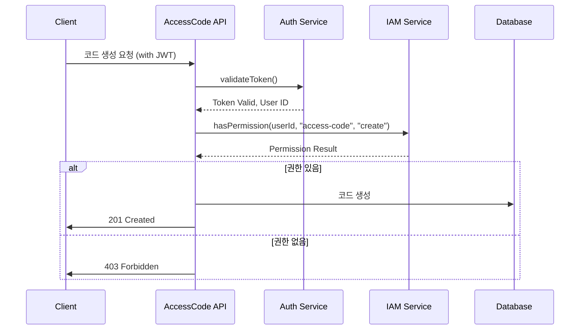

# AccessCode 도메인 개요

## 1. 도메인 책임
AccessCode 도메인은 불면증 진단을 받은 환자의 앱 회원가입을 위한 인증 코드의 생성, 검증, 관리를 담당하는 핵심 도메인입니다.

## 2. 주요 개념

### 2.1 AccessCode
- 앱 회원가입을 위한 인증 코드
- 생성 시점부터 정해진 기간 동안만 유효
- 한 번만 사용 가능
- 특정 사용자와 디바이스에 연결됨

### 2.2 코드 상태
- UNUSED: 미사용
- USED: 사용됨
- EXPIRED: 만료됨
- REVOKED: 취소됨

### 2.3 코드 유형
- TREATMENT: 치료 목적 코드
- TRIAL: 시험용 코드
- DEMO: 데모용 코드

### 2.4 IAM 권한 구조
- ACCESS_CODE_ADMIN: 코드 생성, 삭제, 취소 권한
- ACCESS_CODE_MANAGER: 코드 생성, 사용 이력 조회 권한
- ACCESS_CODE_READER: 코드 조회 권한

## 3. 서브도메인
- 코드 생성 및 관리
- 코드 검증
- 코드 사용 이력 관리
- 코드 만료 관리
- 코드 접근 권한 관리

## 4. 기술 스택
- NestJS
- TypeScript
- PostgreSQL
- Redis (캐싱)
- GCP Pub/Sub (이벤트)

## 5. 외부 시스템 통합
### 5.1 User Domain
- 코드 사용 시 사용자 정보 검증
- 사용자 생성 이벤트 구독

### 5.2 TimeMachine
- 코드 만료 시간 계산
- 코드 사용 시간 기록

### 5.3 Email Service
- 코드 발송

### 5.4 IAM Service
- 코드 관리자 권한 검증
- 코드 생성/취소 권한 관리
- 사용자 역할 기반 접근 제어

## 6. 도메인 이벤트
### 발행 이벤트
- AccessCodeCreated
- AccessCodeUsed
- AccessCodeExpired
- AccessCodeRevoked

### 구독 이벤트
- UserCreated
- UserDeleted
- EmailDelivered
- EmailBounced

## 7. 성능 요구사항
- 코드 생성: 500ms 이내
- 코드 검증: 200ms 이내
- 코드 사용: 300ms 이내
- 일괄 코드 생성: 최대 100개/초

## 8. 보안 요구사항
- 모든 개인정보는 암호화하여 저장
- 코드는 해시하여 저장
- 관리자 작업은 감사 로그 기록
- 코드 생성/검증 시도 횟수 제한

## 9. 확장성 고려사항
- 코드 생성 규칙의 유연한 확장
- 새로운 코드 유형 추가 용이성
- 다국어 메시지 지원
- 다중 인증 방식 지원

## 변경 이력
| 버전 | 날짜 | 작성자 | 변경 내용 |
|------|------|--------|-----------|
| 0.1.0 | 2025-03-16 | bok@weltcorp.com | 최초 작성 |

## 7. IAM 통합

### 7.1 역할 기반 접근 제어
```typescript
// AccessCode 도메인에 대한 권한 정의
enum AccessCodePermission {
  CREATE = 'access-code:create',
  READ = 'access-code:read',
  UPDATE = 'access-code:update',
  DELETE = 'access-code:delete',
  REVOKE = 'access-code:revoke',
  EXPORT = 'access-code:export'
}

// IAM 역할과 AccessCode 권한 매핑
const IAM_ROLE_ACCESS_CODE_PERMISSIONS = {
  'SYSTEM_ADMIN': [
    AccessCodePermission.CREATE,
    AccessCodePermission.READ,
    AccessCodePermission.UPDATE,
    AccessCodePermission.DELETE,
    AccessCodePermission.REVOKE,
    AccessCodePermission.EXPORT
  ],
  'ACCESS_CODE_ADMIN': [
    AccessCodePermission.CREATE,
    AccessCodePermission.READ,
    AccessCodePermission.UPDATE,
    AccessCodePermission.REVOKE,
    AccessCodePermission.EXPORT
  ],
  'ACCESS_CODE_MANAGER': [
    AccessCodePermission.CREATE,
    AccessCodePermission.READ,
    AccessCodePermission.EXPORT
  ],
  'SITE_ADMIN': [
    AccessCodePermission.CREATE,
    AccessCodePermission.READ,
    AccessCodePermission.REVOKE
  ],
  'REGULAR_USER': [
    AccessCodePermission.READ
  ]
};
```

### 7.2 권한 검증 흐름


### 7.3 코드 생성 권한 정책
- 사이트 관리자는 자신의 사이트에 대한 코드만 생성 가능
- 시스템 관리자는 모든 사이트의 코드 생성 가능
- 일반 사용자는 코드 생성 불가
- 코드 대량 생성(100개 이상)은 ACCESS_CODE_ADMIN 권한 필요

### 7.4 코드 관리 감사
- 모든 코드 생성/취소/사용 이벤트는 감사 로그에 기록
- 권한 없이 접근 시도한 이력 모니터링
- 특정 임계값(5분 내 3회) 이상 실패 시 알림 발송