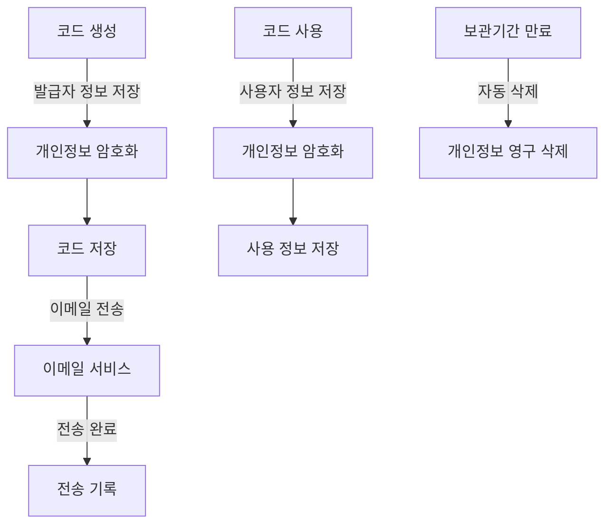
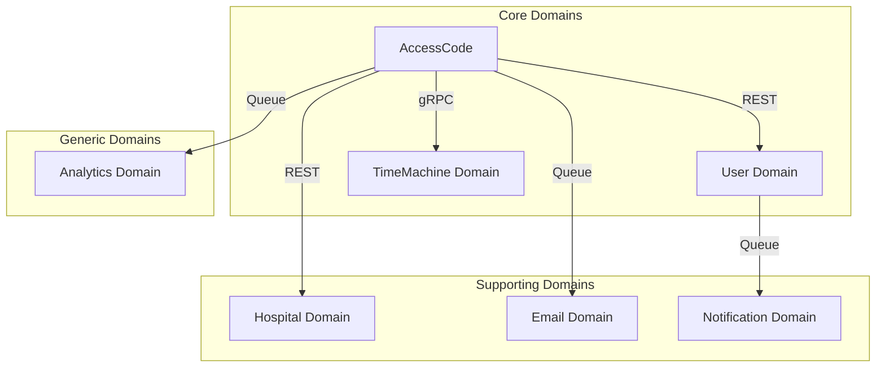
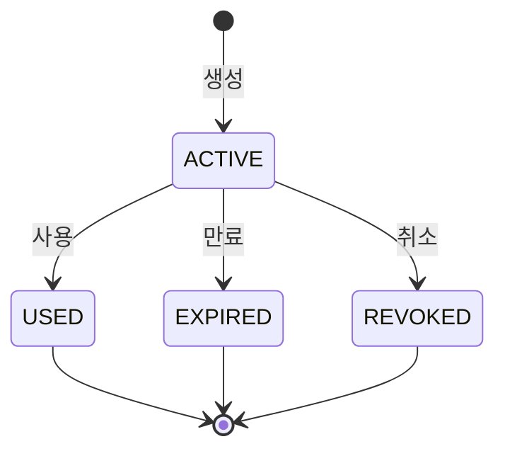

# AccessCode 도메인 요구사항 명세서

## 1. 개요
AccessCode 도메인은 불면증 진단을 받은 환자가 SleepQ 앱에 회원가입할 때 사용하는 인증 코드를 관리하는 핵심 도메인입니다. 이 도메인은 코드의 생성, 검증, 사용 및 만료 관리를 담당하며, 안전하고 신뢰할 수 있는 사용자 등록 프로세스를 제공합니다.

### 비즈니스 규칙
- 접근 코드는 고유한 값을 가짐
- 접근 코드는 유효 기간을 가질 수 있음
- 접근 코드는 특정 계정, 그룹, 사이트에 연결될 수 있음
- 접근 코드는 사용 기간과 치료 기간을 설정할 수 있음
- 접근 코드는 이메일 등록 기능을 제공할 수 있음

### 다른 도메인과의 관계
- UserCycle: 접근 코드를 통한 주기 생성
- RegistrationChannel: 등록 채널 정보 참조
- User: 사용자 정보 연동
- Hospital: 병원 정보 연동
- TimeMachine: 시간 관리
- Email: 이메일 전송
- Analytics: 사용 통계

## 2. 용어 정의

| 용어 | 설명 | 비고 |
|------|------|------|
| AccessCode | 앱 회원가입을 위한 16자리 인증 코드 | 영문자/숫자 조합 |
| Creator | Access Code를 발급하는 병원 관계자나 관리자 | 의사, 간호사 등 |
| User | Access Code를 사용하여 회원가입하는 환자 | 최종 사용자 |
| TreatmentPeriod | 환자의 예상 치료 기간 | 일 단위로 관리 |
| UsagePeriod | Access Code의 유효 기간 | 일 단위로 관리 |
| RegistrationChannel | 코드가 발급된 채널 정보 | 웹, 모바일 등 |
| RandomizationCode | 임상시험 등에서 사용되는 무작위 배정 코드 | 선택적 사용 |
| CodeStatus | Access Code의 현재 상태 | Unused, Used, Expired 등 |
| TestTime | TimeMachine에서 사용되는 테스트용 시간 | 테스트 환경 전용 |
| SystemTime | 실제 시스템 시간 | 운영 환경 전용 |
| PersonalData | GDPR에서 정의하는 개인정보 | 이메일, 사용자 ID 등 |
| DataRetentionPeriod | 개인정보 보관 기간 | GDPR 준수 |

## 3. 개인정보 처리 명세

### 3.1 처리하는 개인정보 항목
```json
{
  "personalData": {
    "fields": [
      "email",
      "userId",
      "creatorUserId",
      "accountId"
    ],
    "purpose": "사용자 인증 및 서비스 접근 권한 부여",
    "retention": "서비스 이용 종료 후 30일",
    "legalBasis": "계약 이행 및 정당한 이익",
    "thirdParties": ["이메일 서비스 제공자"],
    "security": [
      "전송 시 TLS 1.3 암호화",
      "저장 시 AES-256 암호화",
      "접근 제어 및 감사 로그"
    ],
    "subjectRights": [
      "열람권",
      "정정권",
      "삭제권",
      "처리 제한권",
      "이동권",
      "반대권"
    ]
  }
}
```

### 3.2 개인정보 처리 흐름


## 4. 기능 요구사항

### 4.1 코드 관리
1. 코드 생성
   - 16자리 고유 코드 생성
   - 발급자 정보 연결
   - 사용 기간 설정
   - 치료 기간 지정
   - 등록 채널 설정
   - TimeMachine 시간 옵션 처리

2. 코드 검증
   - 코드 유효성 검사
   - 만료 여부 확인 (TimeMachine 시간 기준)
   - 사용 여부 확인
   - 권한 검증
   - 테스트 시간 적용 검증

3. 코드 사용
   - 회원가입 연동
   - 사용 상태 관리
   - 사용자 정보 연결
   - 사용 이력 기록
   - TimeMachine 시간 기록

### 4.2 이메일 관리
1. 코드 전송
   - 이메일 주소 검증
   - 코드 전송 처리
   - 전송 상태 관리
   - GDPR 동의 여부 확인

2. 전송 이력
   - 전송 시간 기록 (TimeMachine 시간 기준)
   - 전송 결과 관리
   - 재전송 처리
   - 개인정보 보호 준수

### 4.3 만료 관리
1. 만료 처리
   - 만료 시간 계산 (TimeMachine 시간 기준)
   - 자동 만료 처리
   - 만료 상태 관리
   - 테스트 시간 기반 만료 처리

2. 만료 알림
   - 만료 예정 알림
   - 만료 처리 알림
   - 관련자 통보
   - 알림 시간 TimeMachine 연동

## 5. 비기능 요구사항

### 5.1 성능 요구사항
1. 응답 시간
   - 코드 생성: 200ms 이내
   - 코드 검증: 100ms 이내
   - 이메일 전송: 500ms 이내
   - TimeMachine 시간 조회: 50ms 이내

2. 처리량
   - 동시 요청: 100 TPS
   - 일일 코드 생성: 10,000건
   - 이메일 전송: 1,000건/시간
   - 시간 조회: 1,000 TPS

### 5.2 보안 요구사항
1. 데이터 보안
   - 코드 정보 암호화 (AES-256)
   - 개인정보 보호 (GDPR 준수)
   - 접근 권한 관리
   - 민감 정보 마스킹
   - 개인정보 처리 로그 기록
   - 데이터 암호화 키 관리

2. 시스템 보안
   - HTTPS 필수 (TLS 1.3)
   - 인증/인가 필수
   - 감사 로그 기록
   - OWASP Top 10 대응
   - IP 접근 제한
   - 세션 관리

3. GDPR 준수
   - 개인정보 수집 동의 획득 및 관리
   - 데이터 보관 기간 준수 (30일)
   - 데이터 삭제 권한 보장
   - 개인정보 이동권 보장
   - 처리 제한권 보장
   - 반대권 행사 보장
   - 개인정보 처리 기록 유지
   - 데이터 유출 대응 계획

4. 개인정보 처리 로그
   - 수집 시점 기록
   - 접근 이력 기록
   - 수정 이력 기록
   - 삭제 이력 기록
   - 동의 이력 관리
   - 제3자 제공 기록

### 5.3 가용성 요구사항
- 서비스 가용성: 99.9%
- 데이터 백업: 일 1회
- 장애 복구: 10분 이내
- 다중화 구성: Active-Active

## 6. 도메인 규칙

### 6.1 코드 생성 규칙
- 16자리 영문자/숫자 조합
- 중복 코드 생성 불가
- 발급자 정보 필수
- 사용 기간 설정 필수
- 치료 기간 설정 필수
- TimeMachine 옵션 처리

### 6.2 코드 사용 규칙
- 일회성 사용만 가능
- 만료된 코드 사용 불가
- 사용자 정보 연결 필수
- TimeMachine 시간 적용 필수
- 사용 후 상태 변경 필수
- 테스트 시간 검증 필수

### 6.3 만료 규칙
- 생성 시점부터 사용 기간 계산
- TimeMachine 시간 기준 필수 적용
- 만료 시 자동 상태 변경
- 만료 후 복구 불가
- 만료 이벤트 발생 필수
- 테스트 시간 기반 만료 처리

### 6.4 TimeMachine 규칙
- 시스템 시간 직접 사용 금지
- TimeMachine 서비스 통한 시간 조회
- 테스트 시간 우선 적용
- 시간 의존성 있는 모든 로직에 적용
- 이벤트 발생 시간 기록에 사용
- 만료 시간 계산에 사용

### 6.5 개인정보 처리 규칙
- 수집 시 명시적 동의 필수
- 목적 외 사용 금지
- 보관 기간 초과 시 자동 삭제
- 암호화 저장 필수
- 접근 권한 최소화
- 처리 기록 유지
- 제3자 제공 시 동의 필수
- 이메일 마스킹 처리
- 로그에서 개인정보 제외
- 테스트 데이터 가명처리

## 7. 도메인 이벤트

### 7.1 코드 이벤트
| 이벤트 이름 | 설명 | 구독자 | 페이로드 |
|------------|------|--------|----------|
| AccessCodeCreated | 코드 생성 완료 | Email, Analytics | 코드정보, 생성시간(TM) |
| AccessCodeUsed | 코드 사용됨 | User, Analytics | 코드정보, 사용시간(TM) |
| AccessCodeExpired | 코드 만료됨 | Notification, Analytics | 코드정보, 만료시간(TM) |
| AccessCodeEmailSent | 이메일 전송 완료 | Notification | 전송정보, 전송시간(TM) |

### 7.2 이메일 이벤트
| 이벤트 이름 | 설명 | 구독자 | 페이로드 |
|------------|------|--------|----------|
| EmailSendRequested | 이메일 전송 요청 | Email | 이메일정보, 요청시간(TM) |
| EmailSendSucceeded | 이메일 전송 성공 | Notification | 전송결과, 성공시간(TM) |
| EmailSendFailed | 이메일 전송 실패 | Notification | 실패정보, 실패시간(TM) |

### 7.3 개인정보 처리 이벤트
| 이벤트 이름 | 설명 | 구독자 | 페이로드 |
|------------|------|--------|----------|
| PersonalDataCollected | 개인정보 수집됨 | Audit, Analytics | 수집항목, 수집시간(TM) |
| PersonalDataUpdated | 개인정보 수정됨 | Audit, Analytics | 수정항목, 수정시간(TM) |
| PersonalDataDeleted | 개인정보 삭제됨 | Audit, Analytics | 삭제항목, 삭제시간(TM) |
| ConsentObtained | 동의 획득됨 | Audit, Analytics | 동의항목, 동의시간(TM) |
| ConsentWithdrawn | 동의 철회됨 | Audit, Analytics | 철회항목, 철회시간(TM) |

## 8. 바운디드 컨텍스트

### 8.1 컨텍스트 맵


### 8.2 컨텍스트 간 통신
| 소스 | 대상 | 통신 방식 | 데이터 형식 | 실패 처리 |
|------|------|-----------|-------------|------------|
| AccessCode | User | REST | JSON | Retry + Circuit Breaker |
| AccessCode | Hospital | REST | JSON | Circuit Breaker |
| AccessCode | TimeMachine | gRPC | Protocol Buffers | Fallback to System Time |
| AccessCode | Email | Queue | JSON | DLQ + Retry |
| AccessCode | Analytics | Queue | JSON | DLQ |
| User | Notification | Queue | JSON | DLQ + Retry |

### 8.3 컨텍스트 간 계약
- AccessCode ↔ User: 회원가입 연동 (동기)
- AccessCode ↔ Hospital: 발급자/기관 정보 (동기)
- AccessCode ↔ TimeMachine: 시간 관리 (동기)
- AccessCode ↔ Email: 코드 전송 (비동기)
- AccessCode ↔ Analytics: 사용 통계 (비동기)
- User ↔ Notification: 알림 발송 (비동기)

## 9. 구현 우선순위

### 9.1 Phase 1 - MVP (2주)
- 기본 코드 생성/검증
- TimeMachine 통합
- 회원가입 연동
- 기본 만료 처리

### 9.2 Phase 2 - 확장 (2주)
- 이메일 전송 기능
- GDPR 대응
- 고급 만료 관리
- 사용 통계 기능

### 9.3 Phase 3 - 고도화 (2주)
- 성능 최적화
- 보안 강화
- 모니터링 고도화
- 운영 자동화

## 10. 데이터 모델

### 10.1 AccessCode 엔티티
```typescript
interface AccessCode {
  id: string;                    // UUID
  code: string;                  // 16자리 인증 코드
  type: AccessCodeType;          // 코드 유형
  status: CodeStatus;            // 상태
  creatorUserId: string;         // 생성자 ID
  accountId: string;             // 계정 ID
  treatmentPeriodDays: number;   // 치료 기간(일)
  usagePeriodDays: number;       // 사용 가능 기간(일)
  createdAt: Date;              // 생성 시간 (TM)
  expiresAt: Date;              // 만료 시간 (TM)
  usedAt?: Date;                // 사용 시간 (TM)
  userId?: string;              // 사용자 ID
  email?: string;               // 이메일
  sentTo?: string;              // 전송 대상
  channel: string;              // 등록 채널
  randomizationCode?: string;   // 무작위 배정 코드
  timeMachineOptions?: {        // TimeMachine 옵션
    useTimeMachine: boolean;    // TM 사용 여부
    testTime?: string;          // 테스트 시간
    timeZone?: string;          // 시간대
  };
}

enum AccessCodeType {
  TREATMENT = 'TREATMENT',      // 치료용
  TRIAL = 'TRIAL',             // 임상시험용
  DEMO = 'DEMO'                // 데모용
}

enum CodeStatus {
  ACTIVE = 'ACTIVE',           // 활성
  USED = 'USED',              // 사용됨
  EXPIRED = 'EXPIRED',         // 만료됨
  REVOKED = 'REVOKED'         // 취소됨
}
```

### 10.2 상태 다이어그램


### 10.3 TimeMachineOptions 객체
```typescript
interface TimeMachineOptions {
  useTimeMachine: boolean;     // TimeMachine 사용 여부
  testTime?: string;           // 테스트용 시간 (ISO 8601)
  timeZone?: string;           // 시간대 (IANA 형식)
}
```

## 11. 에러 처리 정책

### 11.1 에러 코드 시스템
| 계층 | 코드 범위 | 설명 |
|------|-----------|------|
| 컨트롤러 | 1001-1099 | API 요청 처리 관련 오류 |
| 서비스 | 1101-1199 | 비즈니스 로직 관련 오류 |
| 리포지토리 | 1201-1299 | 데이터 접근 관련 오류 |

### 11.2 주요 에러 코드
| HTTP 상태 | 에러 코드 | 메시지 | 설명 | 대응 방법 |
|-----------|-----------|--------|------|-----------|
| 400 | 1001 | INVALID_CODE_FORMAT | 잘못된 코드 형식 | 코드 형식 검증 |
| 400 | 1002 | INVALID_EMAIL | 잘못된 이메일 형식 | 이메일 형식 검증 |
| 404 | 1101 | CODE_NOT_FOUND | 존재하지 않는 코드 | 코드 재확인 |
| 409 | 1102 | CODE_ALREADY_USED | 이미 사용된 코드 | 새 코드 발급 |
| 410 | 1103 | CODE_EXPIRED | 만료된 코드 | 새 코드 발급 |
| 500 | 1201 | DATABASE_ERROR | DB 오류 | 시스템 관리자 문의 |

### 11.3 에러 응답 형식
```json
{
  "status": 400,
  "code": 1001,
  "message": "INVALID_CODE_FORMAT",
  "detail": "Access code must be 16 characters long",
  "timestamp": "2024-03-22T10:00:00Z"
}
```

## 12. 모니터링 및 알림 정책

### 12.1 모니터링 메트릭스
| 메트릭 | 설명 | 임계값 | 수집 주기 |
|--------|------|---------|-----------|
| code_creation_rate | 코드 생성 비율 | 100/분 | 1분 |
| code_usage_rate | 코드 사용 비율 | 50/분 | 1분 |
| code_expiration_rate | 코드 만료 비율 | 200/일 | 1시간 |
| email_delivery_rate | 이메일 전송 성공률 | 95% | 1시간 |
| api_response_time | API 응답 시간 | p95 < 200ms | 10초 |
| error_rate | 오류 발생 비율 | 1% | 1분 |

### 12.2 알림 설정
| 심각도 | 조건 | 알림 대상 | 알림 방법 |
|--------|------|------------|-----------|
| CRITICAL | - 오류율 > 5%<br>- API 응답 시간 > 1s | 개발팀, 운영팀 | Slack, SMS |
| WARNING | - 오류율 > 1%<br>- API 응답 시간 > 500ms | 개발팀 | Slack |
| INFO | - 일일 코드 생성 > 5000<br>- 일일 만료 > 1000 | 개발팀 | Slack |

### 12.3 로깅 정책
- 모든 API 요청/응답 로깅
- 에러 발생 시 상세 스택 트레이스 기록
- 민감 정보 마스킹 처리
- TimeMachine 시간 정보 포함
- 구조화된 JSON 형식 사용

## 13. 변경 이력

### 버전 1.2 (2024-03-22)
- 데이터 모델 상세화
- 에러 처리 정책 추가
- 모니터링 및 알림 정책 추가
- TimeMachine 옵션 상세화

### 버전 1.1 (2024-03-15)
- GDPR 요구사항 추가
- 성능 요구사항 구체화
- 도메인 이벤트 정의 추가

### 버전 1.0 (2024-03-01)
- 초기 요구사항 문서 작성 