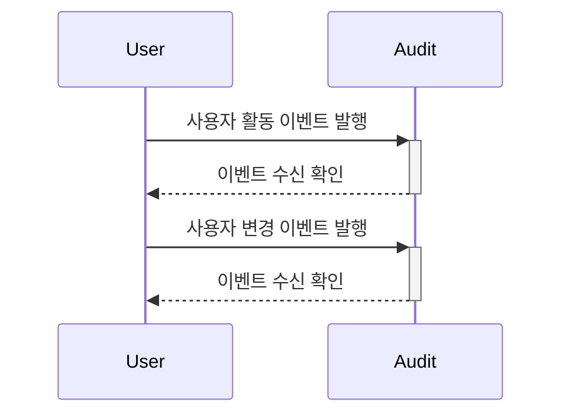
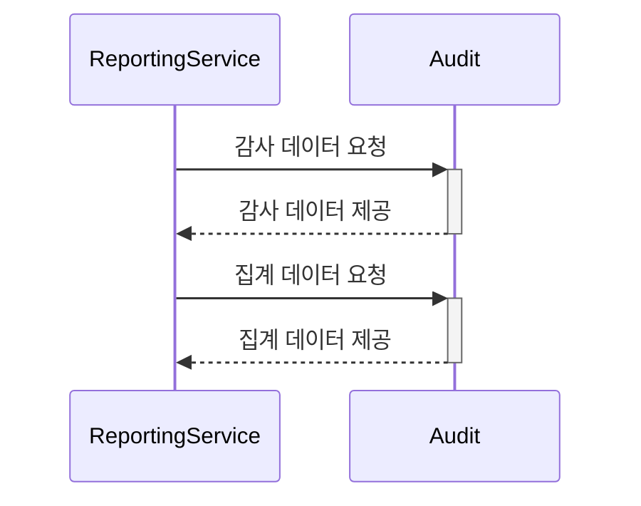
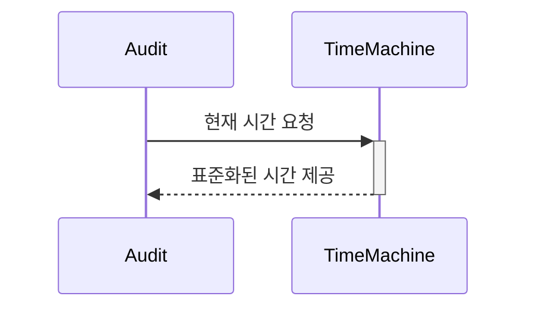
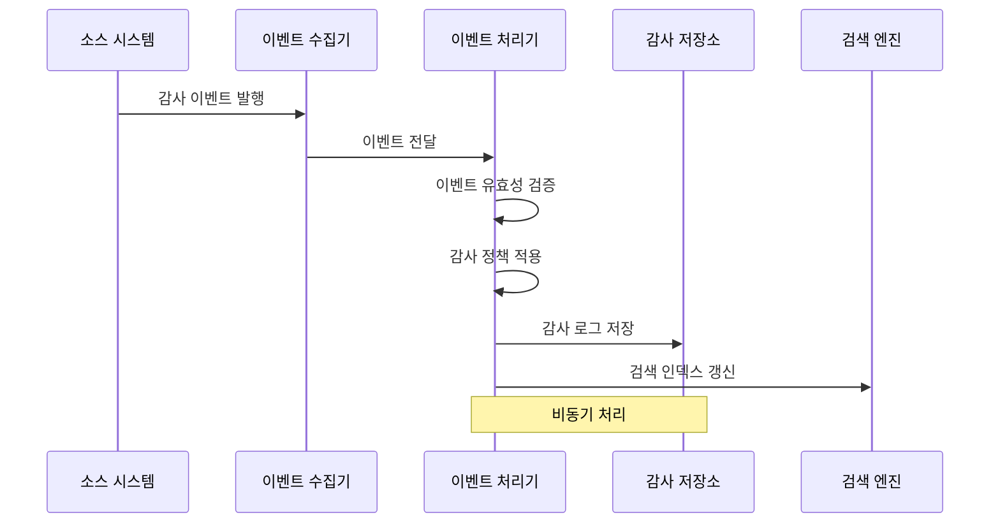

# Audit 바운디드 컨텍스트

## 1. 컨텍스트 정의
Audit 도메인은 시스템 내 중요 활동과 변경사항을 기록하고 추적하는 바운디드 컨텍스트입니다. 규제 준수, 보안 모니터링, 문제 해결 및 사용자 활동 추적을 위한 감사 로그를 관리합니다.

### 1.1 주요 책임
- 시스템 활동 로깅 및 기록
- 감사 데이터 수집 및 저장
- 감사 로그 검색 및 조회
- 감사 정책 관리
- 감사 데이터 보존 및 아카이빙

### 1.2 비책임 범위
- 사용자 인증 및 권한 부여
- 비즈니스 로직 처리
- 실시간 모니터링 및 알림 (알림만 제공, 모니터링은 별도 서비스)
- 데이터 백업 및 복구

### 1.3 도메인 용어
- **감사 로그(Audit Log)**: 시스템 활동에 대한 공식 기록
- **감사 추적(Audit Trail)**: 연관된 활동의 시간순 기록
- **이벤트 소스(Event Source)**: 감사 이벤트의 발생지
- **액터(Actor)**: 활동을 수행한 주체 (사용자 또는 시스템)
- **타겟(Target)**: 활동의 대상이 된 자원
- **액션(Action)**: 수행된 활동 유형 (생성, 수정, 삭제 등)
- **감사 정책(Audit Policy)**: 무엇을 기록할지 정의하는 규칙
- **보존 정책(Retention Policy)**: 감사 데이터 보존 기간 및 조건
- **아카이빙(Archiving)**: 오래된 감사 데이터의 저비용 저장소 이전
- **감사 이벤트(Audit Event)**: 감사 대상이 되는 시스템 이벤트
- **상관 ID(Correlation ID)**: 관련 이벤트를 그룹화하는 식별자
- **이벤트 심각도(Severity)**: 이벤트의 중요도 수준 (INFO, WARNING, ERROR)
- **컴플라이언스(Compliance)**: 규제 요구사항 준수 여부
- **감사 증적(Evidence)**: 감사 목적으로 수집된 증거 자료

## 2. 하위 컨텍스트

### 2.1 활동 로깅 컨텍스트 (Activity Logging Context)
사용자 및 시스템 활동 기록을 담당합니다.

#### 책임
- 사용자 로그인/로그아웃 이벤트 기록
- 시스템 작업 및 API 호출 기록
- 권한 변경 이벤트 기록
- 감사 이벤트 유효성 검증

#### 정책 및 규칙
1. **로깅 정책**
   - 모든 보안 관련 이벤트는 필수 기록
   - 개인정보 보호를 위한 데이터 마스킹 적용
   - 타임스탬프는 TimeMachine 서비스 활용

2. **이벤트 필터링 정책**
   - 시스템 내부 디버그 이벤트는 제외
   - 대용량 데이터는 요약 정보만 저장
   - 중복 이벤트 제거 메커니즘 적용

### 2.2 변경 추적 컨텍스트 (Change Tracking Context)
데이터 변경사항 기록을 담당합니다.

#### 책임
- 데이터 생성/수정/삭제 이벤트 기록
- 이전/이후 상태 차이 기록
- 변경 이력 관리
- 변경 원인 추적

#### 정책 및 규칙
1. **변경 추적 정책**
   - 민감 데이터는 변경 전후 상태 모두 기록
   - 대용량 객체는 차이점만 기록
   - 시스템 변경은 승인자 정보 포함

2. **데이터 형식 정책**
   - JSON 형식으로 변경 데이터 저장
   - 중요 필드 변경은 강조 표시
   - 암호화된 필드는 '*****'로 표시

### 2.3 보존 관리 컨텍스트 (Retention Management Context)
감사 데이터의 보존 및 아카이빙을 담당합니다.

#### 책임
- 보존 정책 관리
- 만료된 데이터 아카이빙
- 데이터 삭제 및 정리
- 컴플라이언스 보존 요구사항 준수

#### 정책 및 규칙
1. **보존 정책**
   - 기본 보존 기간은 1년
   - 규정 준수 데이터는 최소 5년 보존
   - 법적 보존(legal hold) 요청 시 삭제 방지

2. **아카이빙 정책**
   - 90일(TBD) 이상된 데이터는 콜드 스토리지로 이동
   - 아카이빙 시 색인 정보 유지
   - 분기별 아카이빙 작업 수행

## 3. 컨텍스트 경계

### 3.1 상류 컨텍스트 (Upstream)
1. **User 도메인**
   - 관계: Customer/Supplier
   - 사용자 식별 정보 및 인증 이벤트 제공
   - 인터페이스: 이벤트 기반 통합 (사용자 활동 이벤트)

2. **Auth 도메인**
   - 관계: Customer/Supplier
   - 인증 및 권한 부여 이벤트 제공
   - 인터페이스: 이벤트 기반 통합 (인증/권한 이벤트)

3. **TimeMachine 도메인**
   - 관계: Conformist
   - 시스템 시간 표준 제공
   - 인터페이스: 서비스 호출 (getCurrentTime)

### 3.2 하류 컨텍스트 (Downstream)
1. **보고 서비스**
   - 관계: Customer/Supplier
   - 감사 데이터 소비 및 보고서 생성
   - 인터페이스: REST API (감사 로그 조회)

2. **알림 서비스**
   - 관계: Published Language
   - 보안 이벤트 발생 시 알림 전송
   - 인터페이스: 이벤트 발행 (보안 감사 이벤트)

### 3.3 파트너십 컨텍스트 (Partnership)
1. **보안 도메인**
   - 관계: Partnership
   - 보안 이벤트 공유 및 협업
   - 인터페이스: 양방향 이벤트 교환

### 3.4 외부 시스템
1. **로그 분석 시스템**
   - 대시보드 및 고급 분석 기능
   - 이상 탐지 및 패턴 인식
   - 인터페이스: 데이터 내보내기 API

2. **규제 보고 시스템**
   - 규제 기관 요구사항 준수 보고
   - 인터페이스: 정기 보고서 생성 API

## 4. 컨텍스트 매핑

### 4.1 User 도메인과의 관계 (Customer-Supplier)

### 4.2 보고 서비스와의 관계 (Customer-Supplier)

### 4.3 TimeMachine 도메인과의 관계 (Conformist)

### 4.4 이벤트 수집 흐름

## 5. 도메인 이벤트

### 5.1 발행하는 이벤트
- **AuditLogCreated**: 새로운 감사 로그 생성
- **AuditLogQueried**: 감사 로그 조회 발생
- **AuditPolicyChanged**: 감사 정책 변경
- **RetentionPolicyApplied**: 보존 정책 적용
- **DataArchived**: 데이터 아카이빙 완료
- **ComplianceReportGenerated**: 컴플라이언스 보고서 생성
- **SecurityEventDetected**: 보안 이벤트 탐지
- **AnomalyDetected**: 비정상 패턴 탐지
- **DataPurged**: 만료 데이터 삭제 완료
- **AuditSystemHealthChanged**: 감사 시스템 상태 변경

### 5.2 구독하는 이벤트
- **UserAuthenticated**: 사용자 인증 완료
- **UserCreated**: 새 사용자 생성
- **UserUpdated**: 사용자 정보 업데이트
- **ResourceAccessed**: 리소스 접근 발생
- **ResourceModified**: 리소스 변경 발생
- **PermissionChanged**: 권한 변경 발생
- **SystemConfigChanged**: 시스템 설정 변경
- **DataMigrated**: 데이터 마이그레이션 완료
- **TimeMachineTimeChanged**: 시스템 시간 변경
- **ComplianceRequirementChanged**: 컴플라이언스 요구사항 변경

## 6. 감사 로그 기록 규칙

### 6.1 일반 규칙
1. 모든 감사 로그는 반드시 타임스탬프를 포함해야 함
2. 모든 감사 로그는 최소한 이벤트 소스, 액션 타입을 포함해야 함
3. 민감한 개인정보는 감사 로그에 저장하지 않음
4. 모든 감사 로그는 생성 후 변경 불가 (불변성 유지)

### 6.2 데이터 보존 규칙
1. 기본 보존 기간은 1년으로 설정
2. 규정 준수가 필요한 감사 데이터는 최소 5년간 보존
3. 보존 기간이 만료된 데이터는 자동 아카이빙 후 삭제
4. 법적 보존(legal hold) 설정된 데이터는 기간과 무관하게 보존

### 6.3 접근 제어 규칙
1. 감사 로그 조회는 권한이 있는 사용자만 가능
2. 감사 정책 변경은 관리자 권한이 필요
3. 감사 로그는 생성 후 변경 불가 (불변성 유지)
4. 민감한 보안 이벤트는 보안 담당자만 접근 가능

## 7. 외부 시스템 통합

### 7.1 이벤트 수집기
- GCP Pub/Sub 기반 이벤트 스트림 수집
- 다양한 소스로부터 감사 이벤트 수집
- 분산 처리를 통한 확장성 제공
- 이벤트 버퍼링 및 재시도 메커니즘

### 7.2 저장소
- BigQuery 타임시리즈 테이블 사용
- 고성능 쓰기 및 쿼리 최적화
- 데이터 파티셔닝을 통한 성능 확보
- 콜드/핫 스토리지 계층화

### 7.3 검색 엔진
- Elasticsearch 인덱싱
- 고급 검색 기능 제공
- 데이터 분석 및 집계 지원
- 실시간 검색 최적화

## 8. 기술 스택
- NestJS (백엔드 서비스)
- TypeScript (개발 언어)
- GCP Pub/Sub (이벤트 메시징)
- BigQuery (데이터 저장소)
- Elasticsearch (검색 및 인덱싱)
- Redis (캐싱 및 임시 데이터)
- Node.js (클라이언트 라이브러리)
- Terraform (인프라 관리)
- Docker (컨테이너화)
- Kubernetes (배포 및 확장성)

## 9. 변경 이력
| 버전 | 날짜 | 작성자 | 변경 내용 |
|-----|------|--------|-----------|
| 0.1.0 | 2025-03-19 | bok@weltcorp.com | 최초 작성 |