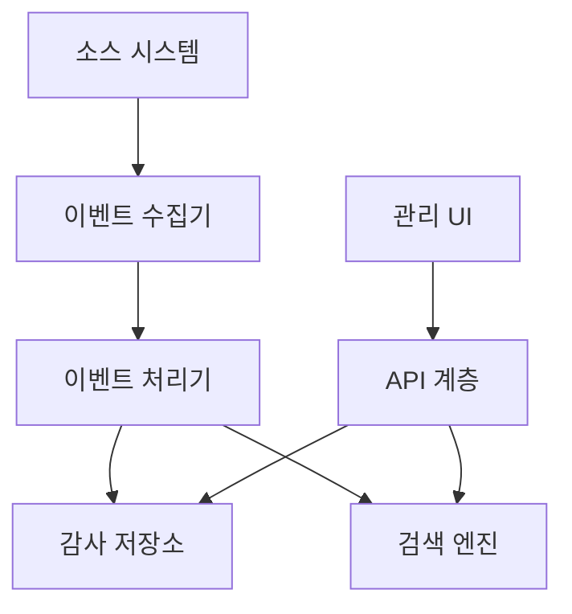

# Audit 구현 가이드

## 아키텍처 개요

### 구성 요소


## 모듈 구조
- `@audit/core`: 핵심 도메인 모델 및 인터페이스
- `@audit/api`: REST API 구현
- `@audit/collector`: 이벤트 수집 모듈
- `@audit/processor`: 이벤트 처리 모듈
- `@audit/storage`: 저장소 구현
- `@audit/search`: 검색 모듈

## 기술 스택
- 언어: TypeScript
- 프레임워크: NestJS
- 메시징: Google Pub/Sub
- 데이터베이스: Google BigQuery
- 검색 엔진: Elasticsearch (필요시)

## 핵심 컴포넌트 구현

### 1. 도메인 모델
```typescript
// @audit/core/domain/model/audit-log.model.ts
export class AuditLog {
  id: string;
  timestamp: Date;
  eventType: string;
  source: string;
  actor?: ActorReference;
  target?: TargetReference;
  action: string;
  details?: Record<string, any>;
  metadata: AuditMetadata;
  status: AuditStatus;

  constructor(data: Partial<AuditLog>) {
    Object.assign(this, data);
    this.validate();
  }

  private validate(): void {
    if (!this.timestamp) throw new Error('Timestamp is required');
    if (!this.eventType) throw new Error('Event type is required');
    if (!this.source) throw new Error('Source is required');
    if (!this.actor && !this.target) {
      throw new Error('At least one of actor or target must be provided');
    }
  }
}

export enum AuditStatus {
  SUCCESS = 'SUCCESS',
  FAILURE = 'FAILURE'
}

export interface ActorReference {
  type: ActorType;
  id: string;
  name?: string;
  attributes?: Record<string, string>;
}

export enum ActorType {
  USER = 'USER',
  SYSTEM = 'SYSTEM',
  SERVICE = 'SERVICE'
}

export interface TargetReference {
  type: TargetType;
  id: string;
  name?: string;
  resourceType?: string;
  attributes?: Record<string, string>;
}

export enum TargetType {
  USER = 'USER',
  RESOURCE = 'RESOURCE',
  SYSTEM = 'SYSTEM'
}

export interface AuditMetadata {
  correlationId?: string;
  requestId?: string;
  ipAddress?: string;
  userAgent?: string;
  sessionId?: string;
}
```

### 2. 서비스 계층
```typescript
// @audit/core/domain/service/audit.service.ts
import { Injectable } from '@nestjs/common';
import { AuditLog } from '../model/audit-log.model';
import { AuditLogRepository } from '../repository/audit-log.repository';
import { AuditLogRequest } from '../dto/audit-log-request.dto';
import { AuditLogQuery } from '../dto/audit-log-query.dto';
import { TimeMachineService } from '@time-machine/client';

@Injectable()
export class AuditService {
  constructor(
    private readonly auditLogRepository: AuditLogRepository,
    private readonly timeMachineService: TimeMachineService
  ) {}

  async createAuditLog(request: AuditLogRequest): Promise<AuditLog> {
    const now = await this.timeMachineService.getCurrentDate();
    
    const auditLog = new AuditLog({
      ...request,
      timestamp: request.timestamp || now,
      id: this.generateId()
    });
    
    return this.auditLogRepository.save(auditLog);
  }

  async queryAuditLogs(query: AuditLogQuery): Promise<AuditLog[]> {
    return this.auditLogRepository.search(query);
  }

  async getAuditTrail(correlationId: string): Promise<AuditLog[]> {
    return this.auditLogRepository.findByCorrelationId(correlationId);
  }

  private generateId(): string {
    return Date.now().toString() + Math.random().toString(36).substring(2, 15);
  }
}
```

### 3. 리포지토리 계층
```typescript
// @audit/core/domain/repository/audit-log.repository.ts
import { Injectable } from '@nestjs/common';
import { AuditLog } from '../model/audit-log.model';
import { AuditLogQuery } from '../dto/audit-log-query.dto';

export interface AuditLogRepository {
  save(auditLog: AuditLog): Promise<AuditLog>;
  search(query: AuditLogQuery): Promise<AuditLog[]>;
  findByCorrelationId(correlationId: string): Promise<AuditLog[]>;
}

// @audit/storage/repository/bigquery-audit-log.repository.ts
import { Injectable } from '@nestjs/common';
import { BigQuery } from '@google-cloud/bigquery';
import { AuditLog } from '@audit/core/domain/model/audit-log.model';
import { AuditLogQuery } from '@audit/core/domain/dto/audit-log-query.dto';
import { AuditLogRepository } from '@audit/core/domain/repository/audit-log.repository';

@Injectable()
export class BigQueryAuditLogRepository implements AuditLogRepository {
  constructor(private readonly bigQuery: BigQuery) {}

  async save(auditLog: AuditLog): Promise<AuditLog> {
    const dataset = this.bigQuery.dataset('de');
    const table = dataset.table('audit_logs');
    
    await table.insert({
      id: auditLog.id,
      timestamp: auditLog.timestamp,
      event_type: auditLog.eventType,
      source: auditLog.source,
      actor: auditLog.actor,
      target: auditLog.target,
      action: auditLog.action,
      details: JSON.stringify(auditLog.details),
      metadata: JSON.stringify(auditLog.metadata),
      status: auditLog.status
    });
    
    return auditLog;
  }

  async search(query: AuditLogQuery): Promise<AuditLog[]> {
    // BigQuery 쿼리 구현
    const sqlQuery = this.buildSearchQuery(query);
    const [rows] = await this.bigQuery.query(sqlQuery);
    
    return rows.map(row => this.mapRowToAuditLog(row));
  }

  async findByCorrelationId(correlationId: string): Promise<AuditLog[]> {
    const sqlQuery = `
      SELECT * FROM \`dtx-data.de.audit_logs\`
      WHERE JSON_EXTRACT(metadata, '$.correlationId') = @correlationId
      ORDER BY timestamp ASC
    `;
    
    const options = {
      query: sqlQuery,
      params: { correlationId }
    };
    
    const [rows] = await this.bigQuery.query(options);
    return rows.map(row => this.mapRowToAuditLog(row));
  }

  private buildSearchQuery(query: AuditLogQuery): any {
    // 검색 쿼리 생성 로직 구현
  }

  private mapRowToAuditLog(row: any): AuditLog {
    return new AuditLog({
      id: row.id,
      timestamp: new Date(row.timestamp),
      eventType: row.event_type,
      source: row.source,
      actor: row.actor ? JSON.parse(row.actor) : undefined,
      target: row.target ? JSON.parse(row.target) : undefined,
      action: row.action,
      details: row.details ? JSON.parse(row.details) : undefined,
      metadata: row.metadata ? JSON.parse(row.metadata) : {},
      status: row.status
    });
  }
}
```

### 4. 컨트롤러 계층
```typescript
// @audit/api/controller/audit-log.controller.ts
import { Controller, Get, Post, Body, Query, Param, UseGuards } from '@nestjs/common';
import { ApiTags, ApiOperation, ApiResponse } from '@nestjs/swagger';
import { AuditService } from '@audit/core/domain/service/audit.service';
import { CreateAuditLogDto } from '../dto/create-audit-log.dto';
import { SearchAuditLogDto } from '../dto/search-audit-log.dto';
import { AuditLogResponseDto } from '../dto/audit-log-response.dto';
import { JwtAuthGuard } from '@auth/api/guard/jwt-auth.guard';
import { RolesGuard } from '@auth/api/guard/roles.guard';
import { Roles } from '@auth/api/decorator/roles.decorator';

@ApiTags('audit')
@Controller('v1/audit-logs')
@UseGuards(JwtAuthGuard, RolesGuard)
export class AuditLogController {
  constructor(private readonly auditService: AuditService) {}

  @Post()
  @ApiOperation({ summary: '감사 로그 생성' })
  @ApiResponse({ status: 201, type: AuditLogResponseDto })
  @Roles('AUDIT_ADMIN', 'SYSTEM_ADMIN')
  async create(@Body() createDto: CreateAuditLogDto): Promise<AuditLogResponseDto> {
    const auditLog = await this.auditService.createAuditLog(createDto);
    return new AuditLogResponseDto(auditLog);
  }

  @Get()
  @ApiOperation({ summary: '감사 로그 검색' })
  @ApiResponse({ status: 200, type: [AuditLogResponseDto] })
  @Roles('AUDIT_VIEWER', 'AUDIT_ADMIN', 'SYSTEM_ADMIN')
  async search(@Query() searchDto: SearchAuditLogDto): Promise<AuditLogResponseDto[]> {
    const auditLogs = await this.auditService.queryAuditLogs(searchDto);
    return auditLogs.map(log => new AuditLogResponseDto(log));
  }

  @Get('trail/:correlationId')
  @ApiOperation({ summary: '감사 추적 조회' })
  @ApiResponse({ status: 200, type: [AuditLogResponseDto] })
  @Roles('AUDIT_VIEWER', 'AUDIT_ADMIN', 'SYSTEM_ADMIN')
  async getAuditTrail(@Param('correlationId') correlationId: string): Promise<AuditLogResponseDto[]> {
    const auditLogs = await this.auditService.getAuditTrail(correlationId);
    return auditLogs.map(log => new AuditLogResponseDto(log));
  }
}
```

### 5. 이벤트 수집기
```typescript
// @audit/collector/service/event-collector.service.ts
import { Injectable, OnModuleInit } from '@nestjs/common';
import { PubSub, Subscription } from '@google-cloud/pubsub';
import { AuditService } from '@audit/core/domain/service/audit.service';
import { AuditPolicyService } from '@audit/core/domain/service/audit-policy.service';
import { AuditLogRequest } from '@audit/core/domain/dto/audit-log-request.dto';
import { Logger } from '@nestjs/common';

@Injectable()
export class EventCollectorService implements OnModuleInit {
  private subscription: Subscription;
  private readonly logger = new Logger(EventCollectorService.name);

  constructor(
    private readonly pubSub: PubSub,
    private readonly auditService: AuditService,
    private readonly policyService: AuditPolicyService
  ) {}

  async onModuleInit() {
    this.subscription = this.pubSub.subscription('audit-events');
    this.startListening();
  }

  private startListening() {
    this.subscription.on('message', async (message) => {
      try {
        const eventData = JSON.parse(message.data.toString());
        
        // 이벤트 정책 검증
        if (await this.policyService.shouldCollectEvent(eventData.eventType, eventData.source)) {
          const auditRequest = this.mapToAuditRequest(eventData);
          await this.auditService.createAuditLog(auditRequest);
        }
        
        message.ack();
      } catch (error) {
        this.logger.error(`Error processing audit event: ${error.message}`, error.stack);
        message.nack();
      }
    });

    this.subscription.on('error', (error) => {
      this.logger.error(`Subscription error: ${error.message}`, error.stack);
    });
  }

  private mapToAuditRequest(eventData: any): AuditLogRequest {
    return {
      eventType: eventData.eventType,
      source: eventData.source,
      actor: eventData.actor,
      target: eventData.target,
      action: eventData.action,
      details: eventData.details,
      metadata: {
        correlationId: eventData.correlationId,
        requestId: eventData.requestId,
        ipAddress: eventData.ipAddress,
        userAgent: eventData.userAgent,
        sessionId: eventData.sessionId
      },
      status: eventData.status || 'SUCCESS'
    };
  }
}
```

### 6. 보존 정책 처리
```typescript
// @audit/processor/service/retention.service.ts
import { Injectable, Logger } from '@nestjs/common';
import { Cron } from '@nestjs/schedule';
import { BigQuery } from '@google-cloud/bigquery';
import { AuditPolicyService } from '@audit/core/domain/service/audit-policy.service';
import { TimeMachineService } from '@time-machine/client';

@Injectable()
export class RetentionService {
  private readonly logger = new Logger(RetentionService.name);

  constructor(
    private readonly bigQuery: BigQuery,
    private readonly policyService: AuditPolicyService,
    private readonly timeMachineService: TimeMachineService
  ) {}

  @Cron('0 1 * * *') // 매일 01:00에 실행
  async purgeExpiredData() {
    try {
      const policies = await this.policyService.getAllPolicies();
      const now = await this.timeMachineService.getCurrentDate();
      
      for (const policy of policies) {
        if (!policy.enabled) continue;
        
        const retentionDate = new Date(now);
        retentionDate.setMilliseconds(
          retentionDate.getMilliseconds() - policy.retentionPeriod
        );
        
        const sqlQuery = `
          DELETE FROM \`dtx-data.de.audit_logs\`
          WHERE event_type IN UNNEST(@eventTypes)
          AND source IN UNNEST(@sources)
          AND timestamp < @retentionDate
        `;
        
        const [job] = await this.bigQuery.createQueryJob({
          query: sqlQuery,
          params: {
            eventTypes: Array.from(policy.eventTypes),
            sources: Array.from(policy.sources),
            retentionDate: retentionDate.toISOString()
          }
        });
        
        await job.promise();
        const [metadata] = await job.getMetadata();
        
        this.logger.log(
          `Purged expired data for policy ${policy.name}: ${metadata.statistics.numDmlAffectedRows} rows affected`
        );
      }
    } catch (error) {
      this.logger.error(`Error purging expired data: ${error.message}`, error.stack);
    }
  }
}
```

## 배포 전략

### 인프라 구성
- Google Cloud Platform 기반 배포
- Google Cloud Run 활용
- BigQuery를 통한 데이터 스토리지 및 분석
- Pub/Sub을 통한 이벤트 수집

### 확장성 전략
- 이벤트 수집기 수평 확장
- BigQuery의 자동 확장 활용
- 샤딩을 통한 데이터 액세스 최적화

### 모니터링 전략
- Cloud Monitoring을 통한 시스템 모니터링
- 주요 지표:
  - 이벤트 수집 속도
  - 쿼리 응답 시간
  - 오류율
  - 디스크 사용량

## 변경 이력
| 버전 | 날짜 | 작성자 | 변경 내용 |
|-----|---|-----|-----|
| 0.1.0 | 2025-03-19 | bok@weltcorp.com | 최초 작성 |