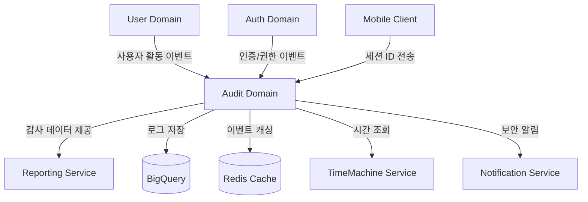

# Audit 도메인 개요

## 1. 소개
Audit 도메인은 시스템 내 중요 활동과 변경사항을 기록하고 추적하는 핵심 도메인입니다. 규제 준수, 보안 모니터링, 문제 해결 및 사용자 활동 추적을 위한 감사 로그를 관리하며, 이벤트 기반 아키텍처를 통해 시스템 전반의 보안 감사와 데이터 변경 추적을 제공합니다.

## 2. 유비쿼터스 언어 (Ubiquitous Language)
- **감사 로그(Audit Log)**: 시스템 내 발생한 주요 이벤트의 기록
- **이벤트 소스(Event Source)**: 감사 대상이 되는 시스템 컴포넌트
- **감사 추적(Audit Trail)**: 연속된 감사 로그를 통한 활동 추적
- **감사 정책(Audit Policy)**: 어떤 이벤트를 기록할지 정의하는 규칙
- **액터(Actor)**: 활동을 수행한 주체 (사용자 또는 시스템)
- **타겟(Target)**: 활동의 대상이 된 자원
- **액션(Action)**: 수행된 활동 유형 (생성, 수정, 삭제 등)
- **보존 정책(Retention Policy)**: 감사 데이터 보존 기간 및 조건
- **아카이빙(Archiving)**: 오래된 감사 데이터의 저비용 저장소 이전
- **감사 이벤트(Audit Event)**: 감사 대상이 되는 시스템 이벤트
- **상관 ID(Correlation ID)**: 관련 이벤트를 그룹화하는 식별자
- **이벤트 심각도(Severity)**: 이벤트의 중요도 수준 (INFO, WARNING, ERROR)
- **세션 ID(Session ID)**: 클라이언트에서 생성한 고유 세션 식별자로, 연속된 사용자 활동 추적에 사용

> 상세 도메인 모델은 [도메인 모델](domain-model.md) 문서를 참조하세요.

## 3. 주요 기능
1. **활동 로깅**
   - 사용자 인증 및 권한 변경 이벤트 기록
   - API 호출 및 데이터 접근 추적
   - 시스템 설정 변경 추적
   - 이벤트 상관관계 분석

2. **변경 추적**
   - 데이터 변경사항(CRUD) 기록
   - 이전/이후 상태 기록
   - 이력 관리 및 버전 추적
   - 변경 사유 추적

3. **감사 정책 관리**
   - 로깅 대상 이벤트 설정
   - 보존 기간 관리
   - 민감 정보 마스킹 정책
   - 컴플라이언스 규정 매핑

4. **보존 및 아카이빙**
   - 데이터 보존 정책 적용
   - 만료 데이터 아카이빙
   - 데이터 삭제 및 정리
   - 법적 보존(Legal Hold) 지원

5. **클라이언트 세션 추적**
   - Mobile 클라이언트 세션 ID 기반 활동 추적
   - JWT 기반 인증 환경에서의 세션 관리
   - 사용자 세션별 감사 로그 조회
   - 세션 기반 이상 행동 탐지

> 기능별 상세 구현은 [구현 가이드](implementation.md) 문서를 참조하세요.

## 4. 핵심 정책 및 규칙
- 타임스탬프는 TimeMachine 서비스 활용 필수
- 감사 로그는 생성 후 수정 불가(불변성)
- 개인정보는 마스킹 처리 필수
- 기본 데이터 보존 기간: 1년
- 규제 관련 데이터 보존 기간: 최소 5년
- 클라이언트 세션 ID는 헤더(X-Session-ID)를 통해 전달
- 클라이언트 세션은 4시간 이상 비활성 시 만료 처리

> 전체 정책 및 규칙은 [비즈니스 규칙](business-rules.md) 문서를 참조하세요.

## 5. 기술 스택
- GCP Pub/Sub (이벤트 수집)
- GCP BigQuery (데이터 저장소)
- Redis (캐싱 및 임시 데이터)
- NestJS (백엔드 서비스)
- TypeScript (개발 언어)

## 6. 외부 시스템 연동

> 시스템 통합에 대한 상세 내용은 [바운디드 컨텍스트](bounded-context.md) 문서를 참조하세요.

## 7. 핵심 요구사항
- 이벤트 수집 지연: p95 < 100ms
- 쿼리 응답 시간: p95 < 500ms
- 데이터 불변성 보장
- 높은 내구성(Durability)
- 규제 준수 (GDPR, HIPAA 등)
- 클라이언트 세션 기반 추적성 보장

> 기술적 세부 사항은 `technical-spec/` 디렉토리의 문서들을 참조하세요.

## 8. 관련 문서
- [도메인 모델](domain-model.md) - 도메인 엔티티, 값 객체, 서비스 정의
- [바운디드 컨텍스트](bounded-context.md) - 다른 도메인과의 관계
- [비즈니스 규칙](business-rules.md) - 상세 정책 및 규칙
- [구현 가이드](implementation.md) - 주요 기능 구현 방법 및 코드 예제
- [기술 명세](technical-spec/) - 구현 세부사항
  - [이벤트 수집](technical-spec/event-collection.md)
  - [데이터 저장 및 검색](technical-spec/data-storage.md)
  - [보존 관리](technical-spec/retention-management.md)
  - [클라이언트 통합](technical-spec/client-integration.md)
  - [보안](technical-spec/security.md)
  - [성능](technical-spec/performance.md)

## 9. 변경 이력
| 버전 | 날짜 | 작성자 | 변경 내용 |
|-----|------|--------|-----------|
| 0.1.0 | 2025-03-19 | bok@weltcorp.com | 최초 작성 |