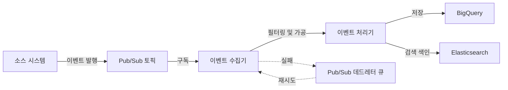

# Audit 이벤트 수집 기술 명세

## 1. 개요
Audit 도메인의 핵심 기능 중 하나는 시스템 전반에서 발생하는 감사 이벤트를 효율적으로 수집하는 것입니다. 이 문서에서는 Google Cloud Pub/Sub을 활용한 이벤트 수집 아키텍처와 구현 방법에 대해 설명합니다.

## 2. 이벤트 수집 아키텍처

### 2.1 아키텍처 개요



### 2.2 주요 컴포넌트

#### 2.2.1 소스 시스템
- 감사 이벤트를 발생시키는 모든 애플리케이션 및 서비스
- 표준화된 이벤트 형식으로 이벤트 발행
- 각 소스 시스템에는 클라이언트 라이브러리 제공

#### 2.2.2 Pub/Sub 토픽
- 이벤트 스트림을 관리하는 중앙 메시징 허브
- 높은 신뢰성과 확장성 제공
- 이벤트 타입별 분리된 토픽 구성 가능

#### 2.2.3 이벤트 수집기
- Pub/Sub 구독을 통해 이벤트 수신
- 이벤트 유효성 검증 및 필터링
- 처리 실패 시 데드레터 큐로 이동

#### 2.2.4 이벤트 처리기
- 이벤트 정규화 및 강화
- 보존 정책 적용
- 스토리지 및 검색 엔진으로 데이터 전송

## 3. 이벤트 모델

### 3.1 표준 이벤트 형식
```json
{
  "eventType": "USER_LOGIN",
  "source": "auth-service",
  "timestamp": "2023-01-01T12:34:56.789Z",
  "actor": {
    "type": "USER",
    "id": "user-123",
    "name": "John Doe",
    "attributes": {
      "email": "john@example.com",
      "role": "ADMIN"
    }
  },
  "target": {
    "type": "RESOURCE",
    "id": "resource-456",
    "name": "User Profile",
    "resourceType": "PROFILE",
    "attributes": {
      "department": "IT"
    }
  },
  "action": "LOGIN",
  "details": {
    "loginMethod": "PASSWORD",
    "ipAddress": "192.168.1.1",
    "userAgent": "Mozilla/5.0..."
  },
  "correlationId": "corr-789",
  "requestId": "req-abc",
  "sessionId": "sess-def"
}
```

### 3.2 필수 및 선택 필드
| 필드 | 필수 여부 | 설명 |
|-----|-----|-----|
| eventType | 필수 | 이벤트 유형 식별자 |
| source | 필수 | 이벤트 발생 소스 |
| timestamp | 필수 | 이벤트 발생 시간 (ISO 8601 형식) |
| actor | 선택* | 이벤트 발생 주체 (*actor 또는 target 중 하나는 필수) |
| target | 선택* | 이벤트 대상 (*actor 또는 target 중 하나는 필수) |
| action | 필수 | 수행된 작업 |
| details | 선택 | 이벤트 상세 정보 (자유 형식) |
| correlationId | 선택 | 연관 이벤트 추적을 위한 ID |
| requestId | 선택 | 원본 요청 ID |
| sessionId | 선택 | 사용자 세션 ID |

### 3.3 이벤트 유형 분류
- **사용자 활동**: USER_LOGIN, USER_LOGOUT, USER_PROFILE_VIEW
- **데이터 변경**: DATA_CREATE, DATA_UPDATE, DATA_DELETE
- **권한 변경**: PERMISSION_GRANT, PERMISSION_REVOKE, ROLE_CHANGE
- **시스템 이벤트**: SERVICE_START, SERVICE_STOP, CONFIG_CHANGE
- **보안 이벤트**: LOGIN_FAILURE, ACCESS_DENIED, SUSPICIOUS_ACTIVITY

## 4. 이벤트 수집 구현

### 4.1 Pub/Sub 토픽 설정
```terraform
resource "google_pubsub_topic" "audit_events" {
  name = "audit-events"
  
  message_retention_duration = "604800s"  # 7일
  
  labels = {
    domain = "audit"
  }
}

resource "google_pubsub_subscription" "audit_events_subscription" {
  name  = "audit-events-subscription"
  topic = google_pubsub_topic.audit_events.name
  
  ack_deadline_seconds = 20
  
  message_retention_duration = "604800s"  # 7일
  retain_acked_messages = true
  
  expiration_policy {
    ttl = "" # 무기한 유지
  }
  
  # 데드레터 설정
  dead_letter_policy {
    dead_letter_topic     = google_pubsub_topic.audit_events_dlq.id
    max_delivery_attempts = 5
  }
  
  # 재시도 설정
  retry_policy {
    minimum_backoff = "10s"
    maximum_backoff = "600s"  # 최대 10분
  }
}

resource "google_pubsub_topic" "audit_events_dlq" {
  name = "audit-events-dlq"
  
  message_retention_duration = "1209600s"  # 14일
  
  labels = {
    domain = "audit"
  }
}
```

### 4.2 이벤트 수집기 구현
```typescript
@Injectable()
export class EventCollectorService implements OnModuleInit, OnModuleDestroy {
  private subscription: Subscription;
  private readonly logger = new Logger(EventCollectorService.name);
  private isProcessing = true;

  constructor(
    private readonly pubSubClient: PubSub,
    private readonly auditService: AuditService,
    private readonly policyService: AuditPolicyService,
    private readonly monitoringService: MonitoringService,
  ) {}

  async onModuleInit() {
    this.logger.log('Initializing Audit Event Collector');
    this.subscription = this.pubSubClient.subscription('audit-events-subscription');
    
    // 이벤트 메시지 핸들러 등록
    this.subscription.on('message', this.handleMessage.bind(this));
    this.subscription.on('error', this.handleError.bind(this));
    
    // 처리 상태 모니터링 시작
    this.monitoringService.startProcessingRateMonitoring();
  }

  async onModuleDestroy() {
    this.logger.log('Stopping Audit Event Collector');
    this.isProcessing = false;
    
    // 기존 메시지 처리 완료를 위한 대기
    await new Promise(resolve => setTimeout(resolve, 5000));
    
    // Subscription 정리
    this.subscription.removeAllListeners();
  }

  private async handleMessage(message: Message) {
    if (!this.isProcessing) {
      return message.nack();
    }

    try {
      // 메시지 처리 시작 기록
      this.monitoringService.recordMessageReceived();
      
      // 메시지 데이터 파싱
      const eventData = JSON.parse(message.data.toString());
      
      // 기본 유효성 검증
      if (!this.validateEvent(eventData)) {
        this.logger.warn(`Invalid event format: ${message.id}`, { eventData });
        message.ack();
        this.monitoringService.recordInvalidEvent();
        return;
      }
      
      // 이벤트 정책 검증
      if (await this.policyService.shouldCollectEvent(eventData.eventType, eventData.source)) {
        // 감사 로그 생성
        const auditLogRequest = this.mapToAuditLogRequest(eventData);
        await this.auditService.createAuditLog(auditLogRequest);
        this.monitoringService.recordSuccessfulProcessing();
      }
      
      // 처리 완료, 메시지 승인
      message.ack();
    } catch (error) {
      this.logger.error(`Error processing message ${message.id}: ${error.message}`, error.stack);
      this.monitoringService.recordFailedProcessing();
      
      // 처리 실패, 메시지 거부 (자동으로 재시도 또는 DLQ로 이동)
      message.nack();
    }
  }

  private handleError(error: Error) {
    this.logger.error(`Subscription error: ${error.message}`, error.stack);
    this.monitoringService.recordSubscriptionError();
  }

  private validateEvent(event: any): boolean {
    return (
      event &&
      typeof event.eventType === 'string' &&
      typeof event.source === 'string' &&
      (event.timestamp && Date.parse(event.timestamp)) &&
      typeof event.action === 'string' &&
      (event.actor || event.target)
    );
  }

  private mapToAuditLogRequest(event: any): AuditLogRequest {
    return {
      eventType: event.eventType,
      source: event.source,
      timestamp: new Date(event.timestamp),
      actor: event.actor,
      target: event.target,
      action: event.action,
      details: event.details,
      metadata: {
        correlationId: event.correlationId,
        requestId: event.requestId,
        ipAddress: event.details?.ipAddress,
        userAgent: event.details?.userAgent,
        sessionId: event.sessionId
      },
      status: 'SUCCESS'
    };
  }
}
```

### 4.3 클라이언트 라이브러리
```typescript
// @audit/client/audit-client.ts
export class AuditClient {
  constructor(
    private readonly pubSubClient: PubSub,
    private readonly topicName: string = 'audit-events',
    private readonly defaultSource: string,
  ) {}

  /**
   * 감사 이벤트를 발행합니다.
   */
  async publishEvent(event: AuditEventDto): Promise<string> {
    try {
      // 필수 필드 검증
      this.validateEvent(event);
      
      // 소스가 없는 경우 기본값 사용
      const finalEvent = {
        ...event,
        source: event.source || this.defaultSource,
        timestamp: event.timestamp || new Date().toISOString()
      };
      
      // 이벤트 발행
      const messageId = await this.pubSubClient
        .topic(this.topicName)
        .publish(Buffer.from(JSON.stringify(finalEvent)));
      
      return messageId;
    } catch (error) {
      // 로깅 및 예외 처리
      console.error(`Error publishing audit event: ${error.message}`);
      throw new Error(`Failed to publish audit event: ${error.message}`);
    }
  }

  /**
   * 사용자 활동 이벤트를 생성합니다.
   */
  async logUserActivity(
    userId: string,
    userName: string,
    action: string,
    targetId?: string,
    targetType?: string,
    details?: Record<string, any>,
  ): Promise<string> {
    return this.publishEvent({
      eventType: 'USER_ACTIVITY',
      action: action,
      actor: {
        type: 'USER',
        id: userId,
        name: userName
      },
      target: targetId ? {
        type: targetType || 'RESOURCE',
        id: targetId
      } : undefined,
      details: details,
      correlationId: getCurrentCorrelationId(),
      requestId: getCurrentRequestId(),
      sessionId: getCurrentSessionId()
    });
  }

  /**
   * 데이터 변경 이벤트를 생성합니다.
   */
  async logDataChange(
    userId: string,
    action: string,
    resourceType: string,
    resourceId: string,
    resourceName?: string,
    before?: any,
    after?: any
  ): Promise<string> {
    return this.publishEvent({
      eventType: 'DATA_CHANGE',
      action: action,
      actor: {
        type: 'USER',
        id: userId
      },
      target: {
        type: 'RESOURCE',
        id: resourceId,
        name: resourceName,
        resourceType: resourceType
      },
      details: {
        before: before,
        after: after
      },
      correlationId: getCurrentCorrelationId(),
      requestId: getCurrentRequestId()
    });
  }

  private validateEvent(event: AuditEventDto): void {
    if (!event.eventType) {
      throw new Error('Event type is required');
    }
    
    if (!event.action) {
      throw new Error('Action is required');
    }
    
    if (!event.actor && !event.target) {
      throw new Error('At least one of actor or target must be provided');
    }
  }
}
```

## 5. 오류 처리 및 재시도

### 5.1 메시지 재시도 정책
- 초기 실패 시 10초 후 재시도
- 지수 백오프 적용 (최대 10분)
- 최대 5회 재시도 후 DLQ로 이동
- DLQ 메시지는 14일간 보존

### 5.2 데드레터 큐 처리 전략
```typescript
@Injectable()
export class DeadLetterProcessor {
  private readonly logger = new Logger(DeadLetterProcessor.name);

  constructor(
    private readonly pubSubClient: PubSub,
    private readonly auditService: AuditService,
    private readonly notificationService: NotificationService
  ) {}

  @Cron('0 */1 * * *') // 1시간마다 실행
  async processDLQ() {
    this.logger.log('Processing audit events dead letter queue');
    
    const subscription = this.pubSubClient.subscription('audit-events-dlq-subscription');
    
    // DLQ에서 최대 1000개 메시지 처리
    const messages = await this.pullMessages(subscription, 1000);
    this.logger.log(`Found ${messages.length} messages in DLQ`);
    
    if (messages.length > 50) {
      // 많은 메시지가 DLQ에 있는 경우 알림
      await this.notificationService.sendAlert(
        'AUDIT_DLQ_HIGH',
        `High number of messages in audit DLQ: ${messages.length}`
      );
    }
    
    let processedCount = 0;
    let failedCount = 0;
    
    for (const message of messages) {
      try {
        const eventData = JSON.parse(message.data.toString());
        
        // 메시지 실패 원인 분석 및 로깅
        const failureReason = this.analyzeFailureReason(eventData, message.attributes);
        this.logger.debug(`DLQ message failure reason: ${failureReason}`);
        
        // 특정 유형의 오류만 수동 처리
        if (this.canBeReprocessed(failureReason)) {
          // 수정된 이벤트로 다시 처리
          const correctedEvent = this.correctEvent(eventData, failureReason);
          await this.auditService.createAuditLog(
            this.mapToAuditLogRequest(correctedEvent)
          );
          processedCount++;
        } else {
          // 처리할 수 없는 이벤트는 오류 로그 생성
          await this.auditService.createErrorLog(
            eventData, 
            `Failed to process: ${failureReason}`
          );
          failedCount++;
        }
        
        // 처리 완료, 메시지 승인
        message.ack();
      } catch (error) {
        this.logger.error(
          `Error processing DLQ message ${message.id}: ${error.message}`, 
          error.stack
        );
        // 처리 실패, 메시지 유지
        message.nack();
        failedCount++;
      }
    }
    
    this.logger.log(`DLQ processing completed: ${processedCount} processed, ${failedCount} failed`);
  }

  private async pullMessages(subscription: Subscription, maxMessages: number): Promise<Message[]> {
    return new Promise((resolve, reject) => {
      const messages: Message[] = [];
      
      const messageHandler = (message: Message) => {
        messages.push(message);
        
        if (messages.length >= maxMessages) {
          subscription.removeListener('message', messageHandler);
          subscription.removeListener('error', errorHandler);
          resolve(messages);
        }
      };
      
      const errorHandler = (error: Error) => {
        subscription.removeListener('message', messageHandler);
        subscription.removeListener('error', errorHandler);
        reject(error);
      };
      
      // 제한 시간 설정 (1분)
      const timeout = setTimeout(() => {
        subscription.removeListener('message', messageHandler);
        subscription.removeListener('error', errorHandler);
        resolve(messages);
      }, 60000);
      
      subscription.on('message', messageHandler);
      subscription.on('error', errorHandler);
    });
  }

  private analyzeFailureReason(event: any, attributes: {[key: string]: string}): string {
    // 실패 원인 분석 로직
    // ...
    return 'UNKNOWN_ERROR';
  }

  private canBeReprocessed(failureReason: string): boolean {
    // 재처리 가능한 오류 유형 판단
    return ['TEMPORARY_SERVICE_FAILURE', 'CONNECTION_ERROR'].includes(failureReason);
  }

  private correctEvent(event: any, failureReason: string): any {
    // 이벤트 수정 로직
    // ...
    return event;
  }

  private mapToAuditLogRequest(event: any): AuditLogRequest {
    // 이벤트를 AuditLogRequest로 매핑
    // ...
  }
}
```

## 6. 모니터링 및 경고

### 6.1 주요 모니터링 지표
| 지표 | 설명 | 임계값 |
|-----|-----|-----|
| message_ingestion_rate | 초당 수집된 이벤트 수 | > 10,000 (경고) |
| message_processing_success_rate | 성공적으로 처리된 이벤트 비율 | < 99.9% (경고) |
| message_processing_latency | 이벤트 처리 지연 시간 | > 5초 (경고) |
| dlq_message_count | DLQ 메시지 수 | > 50 (경고) |
| subscription_backlog | 처리 대기 중인 메시지 수 | > 10,000 (경고) |

### 6.2 대시보드 구성
```typescript
@Injectable()
export class MonitoringService {
  private readonly logger = new Logger(MonitoringService.name);
  
  constructor(
    private readonly monitoring: Monitoring,
    private readonly metricPrefix: string = 'audit'
  ) {}

  startProcessingRateMonitoring() {
    // 모니터링 시작 로직
  }

  recordMessageReceived() {
    this.recordMetric('message_received_count', 1);
  }

  recordSuccessfulProcessing() {
    this.recordMetric('message_processing_success_count', 1);
  }

  recordFailedProcessing() {
    this.recordMetric('message_processing_failure_count', 1);
  }

  recordInvalidEvent() {
    this.recordMetric('invalid_event_count', 1);
  }

  recordSubscriptionError() {
    this.recordMetric('subscription_error_count', 1);
  }

  private recordMetric(metricName: string, value: number) {
    try {
      const metricType = `custom.googleapis.com/${this.metricPrefix}/${metricName}`;
      
      this.monitoring.record({
        resource: { type: 'global' },
        metrics: [{
          type: metricType,
          values: [{ int64Value: value }]
        }],
        timestamp: new Date()
      });
    } catch (error) {
      this.logger.error(`Failed to record metric ${metricName}: ${error.message}`);
    }
  }
}
```

## 7. 확장성 및 성능

### 7.1 확장성 고려사항
- Pub/Sub 자동 확장 활용
- 수집기 수평 확장 (복수의 인스턴스)
- 구독자 수 조정으로 처리량 확장

### 7.2 성능 최적화
- 메시지 배치 처리 구현
- 비동기 처리 최대화
- 메모리 사용량 최적화
- 연결 풀링 적용

### 7.3 스케일링 지표
| 지표 | 스케일 아웃 임계값 | 스케일 인 임계값 |
|-----|-----|-----|
| CPU 사용률 | > 70% | < 30% |
| 메모리 사용률 | > 80% | < 40% |
| 메시지 처리 지연 | > 3초 | < 1초 |
| 구독 백로그 | > 5,000 | < 1,000 |

## 8. 보안 고려사항

### 8.1 이벤트 데이터 보호
- 전송 중 암호화 (Google Pub/Sub 기본 제공)
- 필요시 민감 정보 필터링
- 액세스 제어 적용

### 8.2 인증 및 인가
- 서비스 계정 사용
- 최소 권한 원칙 적용
- 토픽 및 구독에 대한 IAM 정책

## 9. 변경 이력
| 버전 | 날짜 | 작성자 | 변경 내용 |
|-----|---|-----|-----|
| 0.1.0 | 2025-03-19 | bok@weltcorp.com | 최초 작성 | 