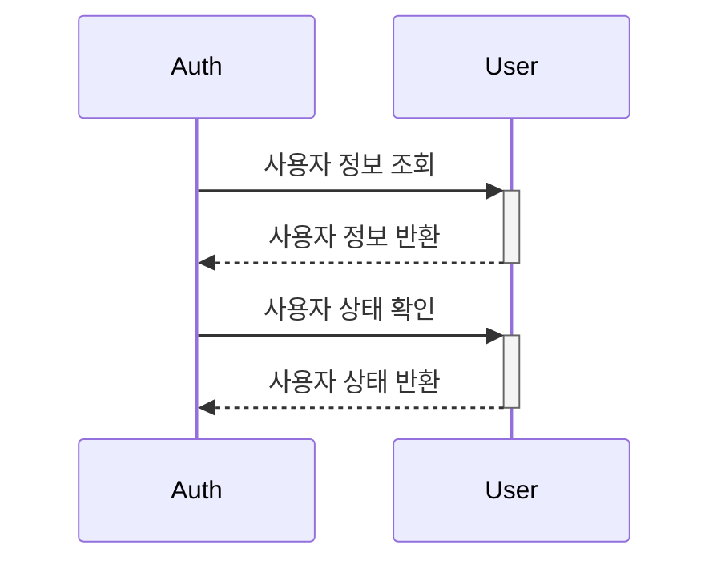
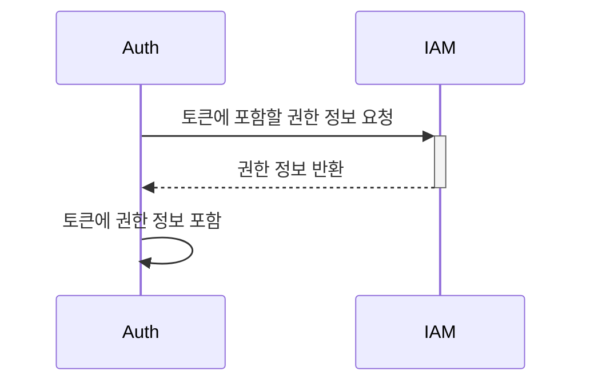
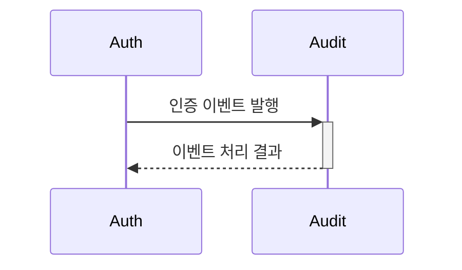

# Auth 바운디드 컨텍스트

## 1. 컨텍스트 정의
Auth 도메인은 사용자 인증, 토큰 관리, 세션 관리를 담당하는 바운디드 컨텍스트입니다.

### 1.1 주요 책임
- 사용자 인증 (Authentication)
- JWT 토큰 관리 (Token Management)
- 세션 관리 (Session Management)
- 보안 정책 관리 (Security Policy Management)
- 다중 인증 관리 (MFA Management)
- 소셜 로그인 연동 (Social Login Integration)

### 1.2 도메인 용어
- **Authentication**: 사용자 신원 확인 절차
- **JWT Token**: JSON Web Token 기반 인증 토큰
- **Refresh Token**: JWT 토큰 갱신을 위한 토큰
- **App Token**: 로그인 전 API 호출을 위한 토큰
- **Session**: 사용자 세션 정보
- **MFA**: Multi-Factor Authentication (다중 인증)
- **Social Login**: 외부 서비스를 통한 인증
- **Security Policy**: 보안 정책 (비밀번호 정책, 세션 정책 등)

## 2. 하위 컨텍스트

### 2.1 인증 컨텍스트 (Authentication Context)
사용자 신원 확인과 토큰 관리를 담당합니다.

#### 책임
- 사용자 로그인/로그아웃 처리
- JWT 토큰 발급 및 검증
- 리프레시 토큰 관리
- 앱 토큰 발급 및 관리
- 다중 인증(MFA) 관리
- 소셜 로그인 처리

#### 정책 및 규칙
1. **인증 정책**
   - 비밀번호 복잡도 요구사항
   - 로그인 시도 제한
   - 세션 타임아웃 설정
   - MFA 적용 규칙

2. **토큰 관리 정책**
   - 토큰 유효기간 설정
   - 토큰 갱신 정책
   - 토큰 폐기 정책

### 2.2 세션 컨텍스트 (Session Context)
사용자 세션 관리를 담당합니다.

#### 책임
- 세션 생성 및 관리
- 세션 만료 처리
- 동시 세션 제어
- 세션 데이터 관리

#### 정책 및 규칙
1. **세션 관리 정책**
   - 세션 유효기간 설정
   - 동시 세션 수 제한
   - 세션 데이터 보안

## 3. 컨텍스트 경계

### 3.1 상위 컨텍스트
- **User Domain**: 사용자 정보 관리
- **IAM Domain**: 권한 및 정책 관리

### 3.2 하위 컨텍스트
- **Access Code Domain**: 일회용 인증 코드 관리
- **Audit Domain**: 보안 감사 로그 관리

### 3.3 외부 시스템
- **OAuth Providers**: 외부 인증 제공자
- **SMTP Server**: 이메일 인증
- **SMS Gateway**: SMS 인증
- **TimeMachine**: 토큰 만료 시간 관리

## 4. 컨텍스트 매핑

### 4.1 User Domain과의 관계 (Customer-Supplier)

### 4.2 IAM Domain과의 관계 (Conformist)

### 4.3 Audit Domain과의 관계 (Published Language)

## 5. 도메인 이벤트

### 5.1 발행하는 이벤트
- **UserAuthenticated**: 사용자 인증 완료
- **UserLoggedOut**: 사용자 로그아웃
- **TokenIssued**: 새로운 토큰 발급
- **TokenRevoked**: 토큰 폐기
- **MfaEnabled**: 다중 인증 활성화
- **MfaDisabled**: 다중 인증 비활성화
- **SessionCreated**: 새로운 세션 생성
- **SessionExpired**: 세션 만료
- **SecurityPolicyUpdated**: 보안 정책 업데이트

### 5.2 구독하는 이벤트
- **UserCreated**: 새로운 사용자 생성
- **UserDeactivated**: 사용자 비활성화
- **SecurityPolicyUpdated**: 보안 정책 변경

## 6. 보안 정책
- JWT 토큰 보안 관리
- 키 로테이션 및 관리
- 토큰 블랙리스트 관리
- 세션 데이터 암호화
- 관리자 권한 분리
- 감사 로그 기록

## 7. 기술 스택
- NestJS
- TypeScript
- PostgreSQL (사용자 인증 정보)
- Redis (토큰 블랙리스트, 세션 관리)
- GCP Pub/Sub (이벤트 메시징)
- JWT (토큰 기반 인증)

## 8. 변경 이력
| 버전 | 날짜 | 작성자 | 변경 내용 |
|-----|------|--------|-----------|
| 0.1.0 | 2025-03-16 | bok@weltcorp.com | 최초 작성 |
| 0.2.0 | 2025-03-17 | bok@weltcorp.com | 컨센트 토큰 관련 내용 추가 |
| 0.3.0 | 2025-03-18 | bok@weltcorp.com | Terms 컨텍스트 내용 통합 및 구조 개선 |
| 0.4.0 | 2025-03-21 | bok@weltcorp.com | 권한 관련 책임을 IAM 도메인으로 이전 |