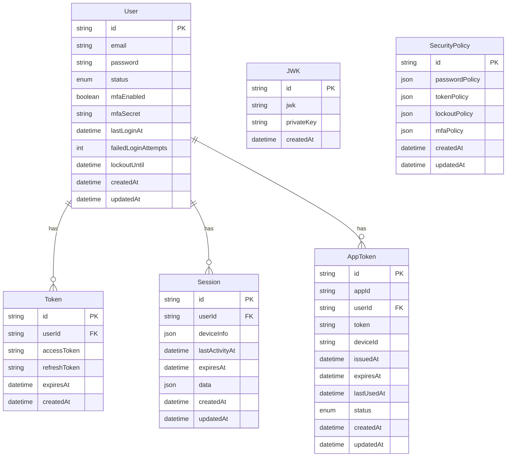

# Auth 도메인 모델

## 1. 엔티티 관계도 (ERD)


## 2. 엔티티

### 2.1 JWK
```typescript
interface JWK {
  id: string;         // 키 식별자
  jwk: string;        // 공개키 정보
  privateKey: string; // 개인키 정보
  createdAt: Date;    // 생성 시간
}
```

### 2.2 User
```typescript
interface User {
  id: string;
  email: string;
  password: string;
  status: UserStatus;
  mfaEnabled: boolean;
  mfaSecret?: string;
  lastLoginAt: Date;
  failedLoginAttempts: number;
  lockoutUntil?: Date;
  createdAt: Date;
  updatedAt: Date;
}

enum UserStatus {
  ACTIVE = 'ACTIVE',
  INACTIVE = 'INACTIVE',
  LOCKED = 'LOCKED',
  PENDING = 'PENDING'
}
```

### 2.3 Token
```typescript
interface Token {
  accessToken: string;
  refreshToken: string;
  expiresAt: Date;
  createdAt: Date;
}
```

### 2.4 SecurityPolicy
```typescript
interface SecurityPolicy {
  id: string;
  passwordPolicy: PasswordPolicy;
  tokenPolicy: TokenPolicy;
  lockoutPolicy: LockoutPolicy;
  mfaPolicy: MfaPolicy;
  createdAt: Date;
  updatedAt: Date;
}
```

### 2.5 AppToken
```typescript
interface AppToken {
  id: string;
  appId: string;
  token: string;
  deviceId: string;
  issuedAt: Date;
  expiresAt: Date;
  lastUsedAt?: Date;
  status: TokenStatus;
  createdAt: Date;
  updatedAt: Date;
}
```

### 2.6 Session
```typescript
interface Session {
  id: string;
  userId: string;
  deviceInfo: DeviceInfo;
  lastActivityAt: Date;
  expiresAt: Date;
  data: Record<string, any>;
  createdAt: Date;
  updatedAt: Date;
}
```

## 3. 값 객체

### 3.1 TokenPayload
```typescript
interface TokenPayload {
  sub: string;           // 주체 (사용자 ID)
  email: string;         // 이메일
  deviceId: string;      // 디바이스 ID
  sessionId: string;     // 세션 ID
  iat: number;           // 발급 시간
  exp: number;           // 만료 시간
}
```

### 3.2 DeviceInfo
```typescript
interface DeviceInfo {
  deviceId: string;
  deviceType: string;
  osType: string;
  osVersion: string;
  browserType?: string;
  browserVersion?: string;
  appVersion?: string;
}
```

### 3.3 PasswordPolicy
```typescript
interface PasswordPolicy {
  minLength: number;
  maxLength: number;
  requireUppercase: boolean;
  requireLowercase: boolean;
  requireNumbers: boolean;
  requireSpecialChars: boolean;
  preventReuseCount: number;
  expirationDays: number;
}
```

### 3.4 TokenPolicy
```typescript
interface TokenPolicy {
  accessTokenTtlMinutes: number;
  refreshTokenTtlDays: number;
  rotateRefreshToken: boolean;
}
```

### 3.5 LockoutPolicy
```typescript
interface LockoutPolicy {
  maxFailedAttempts: number;
  lockoutDurationMinutes: number;
  resetCounterAfterMinutes: number;
}
```

### 3.6 MfaPolicy
```typescript
interface MfaPolicy {
  required: boolean;
  allowedMethods: MfaMethod[];
  gracePeriodMinutes: number;
  rememberDeviceDays: number;
}

enum MfaMethod {
  TOTP = 'TOTP',
  SMS = 'SMS',
  EMAIL = 'EMAIL',
  BIOMETRIC = 'BIOMETRIC'
}
```

### 3.7 AppTokenPayload
```typescript
interface AppTokenPayload {
  sub: string;      // appId
  iat: number;      // 발급 시간
  exp: number;      // 만료 시간
  jti: string;      // 토큰 고유 ID
  deviceId: string; // 암호화된 디바이스 ID
}
```

## 4. 집계 (Aggregates)
- **Token Aggregate**
  - Root: Token
  - Entities: JWK
  - Value Objects: TokenPayload

- **Session Aggregate**
  - Root: Session
  - Value Objects: DeviceInfo

## 5. 도메인 서비스

### 5.1 TokenService
```typescript
interface TokenService {
  createToken(payload: TokenPayload): Promise<Token>;
  validateToken(token: string): Promise<TokenPayload | null>;
  revokeToken(token: string): Promise<void>;
  refreshToken(refreshToken: string): Promise<Token>;
}
```

### 5.2 JWKService
```typescript
interface JWKService {
  createKeyPair(): Promise<JWK>;
  getActiveKey(): Promise<JWK>;
  rotateKeys(): Promise<void>;
  getKeyById(keyId: string): Promise<JWK | null>;
}
```

### 5.3 AuthenticationService
```typescript
interface AuthenticationService {
  login(email: string, password: string, deviceInfo: DeviceInfo): Promise<Token>;
  logout(token: string): Promise<void>;
  refreshToken(refreshToken: string): Promise<Token>;
  validateToken(token: string): Promise<TokenPayload>;
  changePassword(userId: string, oldPassword: string, newPassword: string): Promise<void>;
  setupMfa(userId: string, method: MfaMethod): Promise<void>;
  verifyMfa(userId: string, code: string): Promise<boolean>;
}
```

### 5.4 SecurityPolicyService
```typescript
interface SecurityPolicyService {
  getPolicy(): Promise<SecurityPolicy>;
  updatePolicy(policy: Partial<SecurityPolicy>): Promise<SecurityPolicy>;
  validatePassword(password: string): Promise<boolean>;
  enforcePasswordPolicy(userId: string): Promise<void>;
}
```

### 5.5 AppTokenService
```typescript
interface AppTokenService {
  createAppToken(appId: string, deviceId: string): Promise<AppToken>;
  validateAppToken(token: string): Promise<AppTokenPayload>;
  getAppTokenInfo(appId: string): Promise<AppToken>;
  revokeAppToken(appId: string): Promise<void>;
  decryptDeviceId(encryptedDeviceId: string): Promise<string>;
}
```

### 5.6 SessionService
```typescript
interface SessionService {
  createSession(userId: string, deviceInfo: DeviceInfo): Promise<Session>;
  getSession(sessionId: string): Promise<Session | null>;
  updateSession(sessionId: string, data: Partial<Session>): Promise<Session>;
  deleteSession(sessionId: string): Promise<void>;
  cleanExpiredSessions(): Promise<void>;
}
```

## 6. 도메인 이벤트

### 6.1 토큰 관련 이벤트
```typescript
interface TokenCreatedEvent {
  tokenId: string;
  userId: string;
  expiresAt: Date;
  timestamp: Date;
}

interface TokenRefreshedEvent {
  oldTokenId: string;
  newTokenId: string;
  userId: string;
  timestamp: Date;
}

interface TokenRevokedEvent {
  tokenId: string;
  userId: string;
  reason: string;
  timestamp: Date;
}

interface JWKRotatedEvent {
  oldKeyId: string;
  newKeyId: string;
  timestamp: Date;
}
```

### 6.2 인증 관련 이벤트
```typescript
interface UserAuthenticatedEvent {
  userId: string;
  timestamp: Date;
  deviceInfo: DeviceInfo;
  ipAddress: string;
}

interface UserLoggedOutEvent {
  userId: string;
  token: string;
  timestamp: Date;
}

interface PasswordChangedEvent {
  userId: string;
  timestamp: Date;
  reason: PasswordChangeReason;
}

interface MfaEnabledEvent {
  userId: string;
  method: MfaMethod;
  timestamp: Date;
}

interface MfaDisabledEvent {
  userId: string;
  method: MfaMethod;
  timestamp: Date;
}
```

### 6.3 세션 관련 이벤트
```typescript
interface SessionCreatedEvent {
  sessionId: string;
  userId: string;
  deviceInfo: DeviceInfo;
  timestamp: Date;
}

interface SessionExpiredEvent {
  sessionId: string;
  userId: string;
  timestamp: Date;
}

interface SessionUpdatedEvent {
  sessionId: string;
  userId: string;
  changes: Partial<Session>;
  timestamp: Date;
}
```

### 6.4 보안 관련 이벤트
```typescript
interface SecurityPolicyUpdatedEvent {
  policyId: string;
  changes: Partial<SecurityPolicy>;
  timestamp: Date;
}

interface AccountLockedEvent {
  userId: string;
  reason: LockoutReason;
  duration: number;
  timestamp: Date;
}
```

### 6.5 앱 토큰 관련 이벤트
```typescript
interface AppTokenCreatedEvent {
  appTokenId: string;
  appId: string;
  expiresAt: Date;
  timestamp: Date;
}

interface AppTokenRevokedEvent {
  appTokenId: string;
  appId: string;
  reason: string;
  timestamp: Date;
}

interface AppTokenExpiredEvent {
  appTokenId: string;
  appId: string;
  timestamp: Date;
}
```

## 7. 도메인 규칙

### 7.1 인증 규칙
- 사용자는 동시에 여러 디바이스에서 로그인할 수 있음
- 비밀번호는 보안 정책에 따라 주기적으로 변경되어야 함
- 로그인 실패 횟수가 임계값을 초과하면 계정이 잠김
- JWT 토큰은 발급 시점부터 정해진 시간 동안만 유효
- Refresh 토큰으로 새로운 Access 토큰 발급 가능
- 로그아웃 시 Refresh 토큰은 블랙리스트에 추가됨

### 7.2 토큰 규칙
- Access 토큰은 짧은 유효 기간을 가짐
- Refresh 토큰은 보안 정책에 따라 재발급 가능
- 토큰에는 최소한의 필요 정보만 포함
- 토큰 페이로드는 민감한 정보를 포함하지 않음

### 7.3 앱 토큰 규칙
- 앱 토큰은 모든 API 호출(회원가입, 로그인 포함)에 필요함
- 앱 토큰 발급 시 deviceId는 ChaCha20 알고리즘으로 암호화되어야 함
- 앱 토큰은 발급 시점부터 정해진 시간 동안만 유효함
- 앱 토큰은 관리자 권한으로만 조회 가능

### 7.4 세션 규칙
- 세션은 사용자당 디바이스별로 하나만 유지
- 세션 데이터는 암호화하여 저장
- 세션 만료 시 자동으로 정리
- 세션 데이터는 민감한 정보를 포함하지 않음

## 8. 데이터베이스 스키마

### 8.1 인증 (Authentication)
```sql
CREATE TABLE users (
  id UUID PRIMARY KEY,
  email VARCHAR(255) NOT NULL UNIQUE,
  password VARCHAR(255) NOT NULL,
  status user_status NOT NULL,
  mfa_enabled BOOLEAN DEFAULT FALSE,
  mfa_secret VARCHAR(255),
  last_login_at TIMESTAMP,
  failed_login_attempts INT DEFAULT 0,
  lockout_until TIMESTAMP,
  created_at TIMESTAMP NOT NULL,
  updated_at TIMESTAMP NOT NULL
);

CREATE TABLE jwks (
  id UUID PRIMARY KEY,
  jwk TEXT NOT NULL,
  private_key TEXT NOT NULL,
  created_at TIMESTAMP NOT NULL
);

CREATE TABLE sessions (
  id UUID PRIMARY KEY,
  user_id UUID NOT NULL REFERENCES users(id),
  device_info JSONB NOT NULL,
  last_activity_at TIMESTAMP NOT NULL,
  expires_at TIMESTAMP NOT NULL,
  data JSONB,
  created_at TIMESTAMP NOT NULL,
  updated_at TIMESTAMP NOT NULL
);

CREATE TABLE app_tokens (
  id UUID PRIMARY KEY,
  app_id VARCHAR(255) NOT NULL,
  token TEXT NOT NULL,
  device_id VARCHAR(255) NOT NULL,
  issued_at TIMESTAMP NOT NULL,
  expires_at TIMESTAMP NOT NULL,
  last_used_at TIMESTAMP,
  status token_status NOT NULL,
  created_at TIMESTAMP NOT NULL,
  updated_at TIMESTAMP NOT NULL
);
```

## 9. 변경 이력
| 버전 | 날짜 | 작성자 | 변경 내용 |
|-----|------|--------|-----------|
| 0.1.0 | 2025-03-16 | bok@weltcorp.com | 최초 작성 |
| 0.2.0 | 2025-03-17 | bok@weltcorp.com | 컨센트 토큰 관련 내용 추가 |
| 0.3.0 | 2025-03-18 | bok@weltcorp.com | Terms 컨텍스트 내용 통합 및 구조 개선 |
| 0.4.0 | 2025-03-19 | bok@weltcorp.com | 권한 관련 모델을 IAM 도메인으로 이전