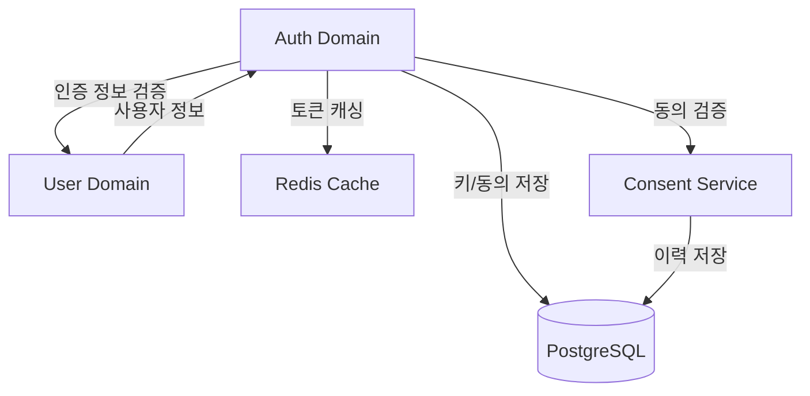

# Auth 도메인 개요

## 1. 소개
인증(Authentication) 도메인은 사용자의 신원을 확인하고 시스템 접근 권한을 관리하는 핵심 도메인입니다. JWT 기반의 토큰 시스템과 컨센트 토큰을 사용하여 안전하고 확장 가능한 인증 및 권한 위임 메커니즘을 제공합니다.

## 2. 유비쿼터스 언어 (Ubiquitous Language)
- **Token**: 사용자 인증 상태를 나타내는 JWT 형식의 문자열
- **Access Token**: 리소스 접근에 사용되는 단기 토큰
- **Refresh Token**: Access Token 갱신에 사용되는 장기 토큰
- **JWK (JSON Web Key)**: 토큰 서명에 사용되는 암호화 키
- **Claims**: 토큰에 포함된 사용자 정보와 권한
- **Authentication**: 사용자 신원 확인 과정
- **Authorization**: 리소스 접근 권한 확인 과정
- **컨센트 토큰 (Consent Token)**: 사용자 동의 기반 권한 위임
- **앱 토큰 (App Token)**: 로그인 전 API 접근을 위한 인증 수단

> 상세 도메인 모델은 [도메인 모델](domain-model.md) 문서를 참조하세요.

## 3. 주요 기능
1. **토큰 관리**
   - Access Token 발급/검증
   - Refresh Token 발급/갱신
   - 토큰 폐기 및 블랙리스트
   - App Token 발급/검증

2. **키 관리**
   - JWK 생성 및 관리
   - 키 로테이션

3. **컨센트 토큰 관리**
   - 동의 기반 권한 위임
   - 범위 기반 접근 제어

4. **앱 인증 관리**
   - 디바이스 ID 기반 인증
   - 앱 권한 관리

> 기능별 상세 구현은 [구현 가이드](implementation.md) 문서를 참조하세요.

## 4. 핵심 정책 및 규칙
- Access Token 유효기간: 30분
- Refresh Token 유효기간: 14일
- 보안을 위한 토큰 재사용 감지 및 차단
- JWK 주기적 교체 (rotation)

> 전체 정책 및 규칙은 [비즈니스 규칙](business-rules.md) 문서를 참조하세요.

## 5. 기술 스택
- JWT (JSON Web Token)
- RSA 암호화
- AES-256-GCM (컨센트 토큰 암호화)
- Redis 캐싱
- PostgreSQL (키 및 동의 이력 저장)

## 6. 외부 시스템 연동

> 시스템 통합에 대한 상세 내용은 [바운디드 컨텍스트](bounded-context.md) 문서를 참조하세요.

## 7. 핵심 요구사항
- 토큰 검증: p95 < 50ms
- 안전한 키 관리
- 컨센트 토큰 암호화
- 24/7 가용성

> 기술적 세부 사항은 `technical-spec/` 디렉토리의 문서들을 참조하세요.

## 8. 관련 문서
- [도메인 모델](domain-model.md) - 도메인 엔티티, 값 객체, 서비스 정의
- [바운디드 컨텍스트](bounded-context.md) - 다른 도메인과의 관계
- [비즈니스 규칙](business-rules.md) - 상세 정책 및 규칙
- [구현 가이드](implementation.md) - 주요 기능 구현 방법 및 코드 예제
- [기술 명세](technical-spec/) - 구현 세부사항
  - [인증](technical-spec/authentication.md)
  - [키 관리](technical-spec/key-management.md)
  - [토큰 관리](technical-spec/token-management.md)
  - [보안](technical-spec/security.md)
  - [성능](technical-spec/performance.md)

## 변경 이력
| 버전 | 날짜 | 작성자 | 변경 내용 |
|------|------|--------|-----------|
| 0.1.0 | 2025-03-16 | bok@weltcorp.com | 최초 작성 |
| 0.2.0 | 2025-03-18 | bok@weltcorp.com | domain.md 내용 통합 |
| 0.3.0 | 2025-03-18 | bok@weltcorp.com | 중복 내용 제거 및 링크 참조 방식으로 변경 |
| 0.4.0 | 2025-03-18 | bok@weltcorp.com | 구현 가이드 문서 추가 및 참조 링크 업데이트 |