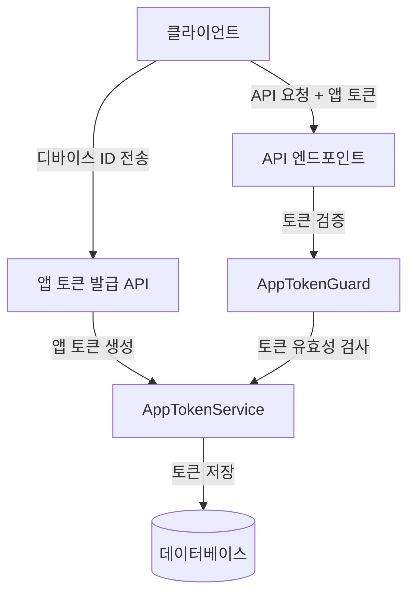

# 앱 토큰 기술 명세

## 1. 개요

앱 토큰(AppToken)은 사용자 로그인 전 API 호출에 필요한 인증 메커니즘을 제공합니다. 이 문서는 Auth 도메인에서 앱 토큰의 기술적 구현 방법과 관련 컴포넌트에 대해 설명합니다.

## 2. 앱 토큰 아키텍처

### 2.1 아키텍처 다이어그램



### 2.2 주요 컴포넌트

1. **AppTokenService**: 앱 토큰 생성, 검증, 관리를 담당하는 서비스
2. **AppTokenGuard**: API 요청에서 앱 토큰을 검증하는 NestJS 가드
3. **AppTokenEntity**: 앱 토큰 정보를 저장하는 데이터베이스 엔티티
4. **AppTokenModule**: 앱 토큰 관련 컴포넌트를 모듈화하는 NestJS 모듈

## 3. 데이터 모델

### 3.1 앱 토큰 엔티티

```typescript
@Entity('app_tokens')
export class AppTokenEntity {
  @PrimaryColumn('uuid')
  id: string;

  @Column()
  appId: string;

  @Column('text')
  token: string;

  @Column('simple-array')
  permissions: string[];

  @Column()
  deviceId: string;

  @Column()
  issuedAt: Date;

  @Column()
  expiresAt: Date;

  @Column({ nullable: true })
  lastUsedAt?: Date;

  @Column({
    type: 'enum',
    enum: TokenStatus,
    default: TokenStatus.ACTIVE,
  })
  status: TokenStatus;

  @CreateDateColumn()
  createdAt: Date;

  @UpdateDateColumn()
  updatedAt: Date;
}

export enum TokenStatus {
  ACTIVE = 'ACTIVE',
  REVOKED = 'REVOKED',
  EXPIRED = 'EXPIRED'
}
```

### 3.2 앱 토큰 페이로드

```typescript
export interface AppTokenPayload {
  sub: string;      // 앱 ID
  jti: string;      // 토큰 ID
  permissions: string[]; // 권한 목록
  deviceId: string; // 디바이스 ID
  iat: number;      // 발급 시간
  exp: number;      // 만료 시간
}
```

## 4. 앱 토큰 라이프사이클

### 4.1 앱 토큰 발급 프로세스

1. 클라이언트가 암호화된 디바이스 ID를 서버에 전송
2. 서버는 디바이스 ID를 복호화하여 유효성 검증
3. 앱 토큰 페이로드 생성 (앱 ID, 권한, 만료 시간 등 포함)
4. JWT 토큰 생성 및 서명
5. 앱 토큰 정보를 데이터베이스에 저장
6. 생성된 앱 토큰을 클라이언트에 반환

### 4.2 앱 토큰 검증 프로세스

1. 클라이언트가 API 요청 시 Authorization 헤더에 앱 토큰 포함
2. AppTokenGuard가 요청에서 토큰 추출
3. JWT 서명 검증
4. 토큰 페이로드에서 토큰 ID(jti) 추출
5. 데이터베이스에서 해당 토큰 정보 조회
6. 토큰 상태 확인 (ACTIVE 상태인지 확인)
7. 토큰 만료 시간 확인
8. 마지막 사용 시간 업데이트
9. 검증 성공 시 요청 객체에 앱 토큰 페이로드 추가

### 4.3 앱 토큰 갱신 프로세스

1. 클라이언트가 만료 예정인 앱 토큰으로 갱신 요청
2. 기존 토큰 검증
3. 새로운 앱 토큰 생성
4. 기존 토큰 상태를 REVOKED로 변경
5. 새로운 앱 토큰 반환

## 5. 보안 고려사항

### 5.1 토큰 보안

1. **JWT 서명**: 앱 토큰은 서버 측 비밀 키로 서명되어 위변조 방지
2. **짧은 만료 시간**: 기본 24시간의 만료 시간 설정으로 토큰 노출 위험 최소화
3. **토큰 저장소**: 발급된 모든 토큰 정보를 데이터베이스에 저장하여 필요 시 즉시 취소 가능
4. **토큰 ID**: 각 토큰에 고유 ID(jti) 부여로 토큰 추적 및 관리 용이

### 5.2 디바이스 ID 보안

1. **암호화**: 디바이스 ID는 ChaCha20 알고리즘으로 암호화하여 저장 및 전송
2. **복호화 제한**: 디바이스 ID 복호화는 서버 측에서만 수행
3. **키 관리**: 암호화 키는 환경 변수로 관리하여 소스 코드 노출 방지

## 6. 에러 처리

| 에러 코드 | HTTP 상태 코드 | 설명 | 대응 방안 |
|----------|--------------|------|----------|
| INVALID_TOKEN | 401 | 유효하지 않은 토큰 | 새로운 앱 토큰 발급 요청 |
| MISSING_TOKEN | 401 | 토큰이 제공되지 않음 | Authorization 헤더에 토큰 포함 |
| TOKEN_EXPIRED | 401 | 토큰이 만료됨 | 새로운 앱 토큰 발급 요청 |
| DEVICE_ID_DECRYPTION_FAILED | 400 | 디바이스 ID 복호화 실패 | 올바른 형식의 암호화된 디바이스 ID 제공 |
| INSUFFICIENT_PERMISSIONS | 403 | 권한 부족 | 필요한 권한을 가진 새 토큰 발급 요청 |

## 7. 성능 최적화

1. **인덱싱**: 토큰 ID와 앱 ID에 인덱스 적용으로 조회 성능 향상
2. **캐싱**: 자주 사용되는 토큰 정보 메모리 캐싱으로 데이터베이스 부하 감소
3. **비동기 처리**: 토큰 검증 및 생성 작업의 비동기 처리로 응답 시간 최소화
4. **배치 처리**: 만료된 토큰 정리 작업을 배치 프로세스로 처리

## 8. 구현 예제

### 8.1 앱 토큰 서비스 구현

```typescript
@Injectable()
export class AppTokenService {
  constructor(
    @InjectRepository(AppTokenEntity)
    private readonly appTokenRepository: Repository<AppTokenEntity>,
    private readonly jwtService: JwtService,
    private readonly configService: ConfigService,
    private readonly cacheManager: Cache,
  ) {}

  async createAppToken(
    appId: string,
    permissions: string[],
    expiresIn: number,
    encryptedDeviceId: string,
  ): Promise<AppToken> {
    // 디바이스 ID 복호화
    const deviceId = this.decryptDeviceId(encryptedDeviceId);
    
    // 토큰 페이로드 생성
    const tokenId = uuidv4();
    const payload: AppTokenPayload = {
      sub: appId,
      jti: tokenId,
      permissions,
      deviceId,
      iat: Math.floor(Date.now() / 1000),
      exp: Math.floor(Date.now() / 1000) + expiresIn,
    };
    
    // JWT 토큰 생성
    const token = this.jwtService.sign(payload, {
      secret: this.configService.get('APP_TOKEN_SECRET'),
    });
    
    // 앱 토큰 저장
    const appToken = new AppTokenEntity();
    appToken.id = tokenId;
    appToken.appId = appId;
    appToken.token = token;
    appToken.permissions = permissions;
    appToken.deviceId = encryptedDeviceId;
    appToken.issuedAt = new Date();
    appToken.expiresAt = new Date(Date.now() + expiresIn * 1000);
    appToken.status = TokenStatus.ACTIVE;
    
    const savedToken = await this.appTokenRepository.save(appToken);
    
    // 캐시에 토큰 정보 저장
    await this.cacheManager.set(
      `app_token:${tokenId}`,
      savedToken,
      { ttl: expiresIn }
    );
    
    return savedToken;
  }

  async validateAppToken(token: string): Promise<AppTokenPayload> {
    try {
      // JWT 토큰 검증
      const payload = this.jwtService.verify<AppTokenPayload>(token, {
        secret: this.configService.get('APP_TOKEN_SECRET'),
      });
      
      // 캐시에서 토큰 정보 조회
      const cachedToken = await this.cacheManager.get<AppTokenEntity>(
        `app_token:${payload.jti}`
      );
      
      let appToken: AppTokenEntity;
      
      if (cachedToken) {
        appToken = cachedToken;
      } else {
        // 데이터베이스에서 토큰 정보 조회
        appToken = await this.appTokenRepository.findOne({
          where: { id: payload.jti },
        });
        
        // 캐시에 토큰 정보 저장
        if (appToken) {
          const ttl = Math.floor((appToken.expiresAt.getTime() - Date.now()) / 1000);
          if (ttl > 0) {
            await this.cacheManager.set(
              `app_token:${payload.jti}`,
              appToken,
              { ttl }
            );
          }
        }
      }
      
      if (!appToken || appToken.status !== TokenStatus.ACTIVE) {
        throw new UnauthorizedException('Invalid token');
      }
      
      // 마지막 사용 시간 업데이트 (5분 간격으로)
      const now = new Date();
      if (!appToken.lastUsedAt || 
          now.getTime() - appToken.lastUsedAt.getTime() > 5 * 60 * 1000) {
        await this.appTokenRepository.update(
          { id: payload.jti },
          { lastUsedAt: now },
        );
        
        // 캐시 업데이트
        appToken.lastUsedAt = now;
        const ttl = Math.floor((appToken.expiresAt.getTime() - now.getTime()) / 1000);
        if (ttl > 0) {
          await this.cacheManager.set(
            `app_token:${payload.jti}`,
            appToken,
            { ttl }
          );
        }
      }
      
      return payload;
    } catch (error) {
      if (error instanceof TokenExpiredError) {
        throw new UnauthorizedException('Token expired');
      }
      throw new UnauthorizedException('Invalid token');
    }
  }

  async getAppTokenInfo(tokenId: string): Promise<AppToken> {
    const appToken = await this.appTokenRepository.findOne({
      where: { id: tokenId },
    });
    
    if (!appToken) {
      throw new NotFoundException('App token not found');
    }
    
    return appToken;
  }

  async revokeAppToken(tokenId: string): Promise<void> {
    await this.appTokenRepository.update(
      { id: tokenId },
      { status: TokenStatus.REVOKED },
    );
    
    // 캐시에서 토큰 정보 삭제
    await this.cacheManager.del(`app_token:${tokenId}`);
  }

  decryptDeviceId(encryptedDeviceId: string): string {
    try {
      // ChaCha20 복호화 구현
      const key = Buffer.from(
        this.configService.get('DEVICE_ID_ENCRYPTION_KEY'),
        'hex',
      );
      
      const data = Buffer.from(encryptedDeviceId, 'base64');
      const nonce = data.slice(0, 12);
      const encryptedData = data.slice(12);
      
      const decipher = createDecipheriv('chacha20', key, nonce);
      const decrypted = Buffer.concat([
        decipher.update(encryptedData),
        decipher.final(),
      ]);
      
      return decrypted.toString('utf8');
    } catch (error) {
      throw new BadRequestException('Device ID decryption failed');
    }
  }
}
```

### 8.2 앱 토큰 컨트롤러 구현

```typescript
@Controller('auth/app-token')
export class AppTokenController {
  constructor(private readonly appTokenService: AppTokenService) {}

  @Post()
  async createAppToken(@Body() createAppTokenDto: CreateAppTokenDto) {
    return this.appTokenService.createAppToken(
      createAppTokenDto.appId,
      createAppTokenDto.permissions,
      createAppTokenDto.expiresIn || 86400, // 기본 24시간
      createAppTokenDto.deviceId,
    );
  }

  @Post('validate')
  @UseGuards(AppTokenGuard)
  async validateAppToken(@Req() request) {
    return {
      valid: true,
      payload: request.appToken,
    };
  }

  @Post('refresh')
  @UseGuards(AppTokenGuard)
  async refreshAppToken(
    @Req() request,
    @Body() refreshAppTokenDto: RefreshAppTokenDto,
  ) {
    // 기존 토큰 취소
    await this.appTokenService.revokeAppToken(request.appToken.jti);
    
    // 새 토큰 발급
    return this.appTokenService.createAppToken(
      request.appToken.sub,
      refreshAppTokenDto.permissions || request.appToken.permissions,
      refreshAppTokenDto.expiresIn || 86400,
      refreshAppTokenDto.deviceId || request.appToken.deviceId,
    );
  }
}
```

## 9. 다른 컴포넌트와의 통합

### 9.1 디바이스 ID 관리와의 통합

앱 토큰 서비스는 [디바이스 ID 관리](./device-id.md) 컴포넌트와 밀접하게 통합됩니다. 디바이스 ID의 암호화 및 복호화 로직은 디바이스 ID 관리 컴포넌트에서 제공하는 기능을 활용합니다.

### 9.2 인증 시스템과의 통합

앱 토큰은 [인증 시스템](./authentication.md)의 일부로, 사용자 로그인 전 API 접근을 위한 인증 메커니즘을 제공합니다. 사용자 로그인 후에는 액세스 토큰으로 대체됩니다.

### 9.3 권한 관리와의 통합

앱 토큰은 [권한 관리](./authorization.md) 시스템과 통합되어 API 접근 권한을 제어합니다. 앱 토큰에 포함된 권한 정보는 권한 관리 시스템에서 정의한 권한 체계를 따릅니다.

## 10. 테스트 전략

### 10.1 단위 테스트

- AppTokenService의 각 메서드에 대한 단위 테스트
- AppTokenGuard의 인증 로직 테스트
- 토큰 생성 및 검증 로직 테스트

### 10.2 통합 테스트

- 실제 데이터베이스와 연동한 토큰 저장 및 조회 테스트
- API 엔드포인트를 통한 토큰 발급 및 검증 테스트
- 토큰 만료 및 갱신 시나리오 테스트

### 10.3 성능 테스트

- 대량의 토큰 발급 및 검증 시 성능 측정
- 캐싱 적용 전후 성능 비교
- 동시 요청 처리 성능 테스트

## 11. 변경 이력

| 버전 | 날짜 | 작성자 | 설명 |
|------|------|--------|------|
| 0.1.0 | 2025-03-16 | bok@weltcorp.com | 최초 작성 | 