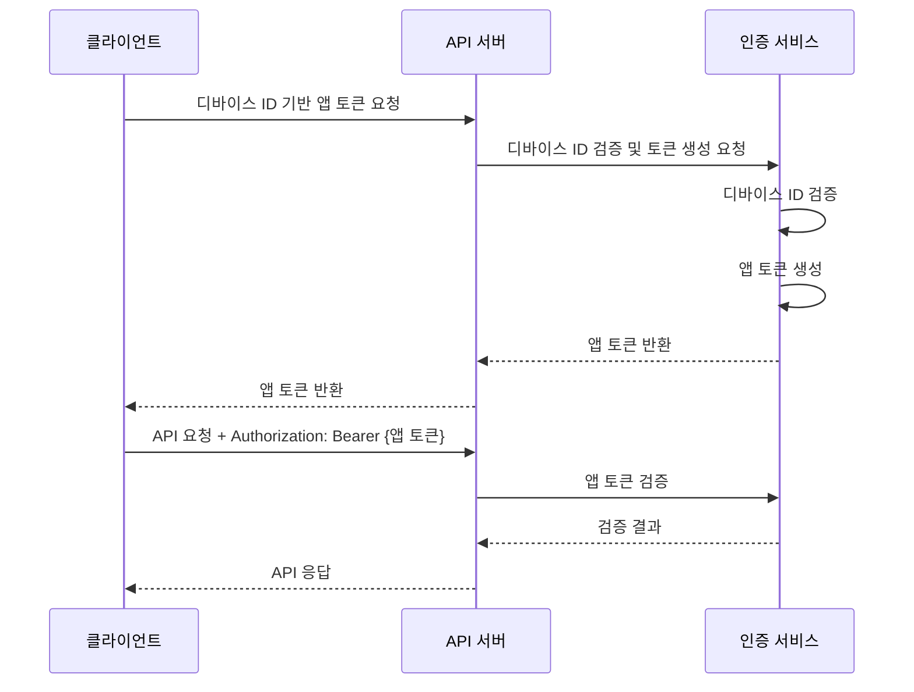
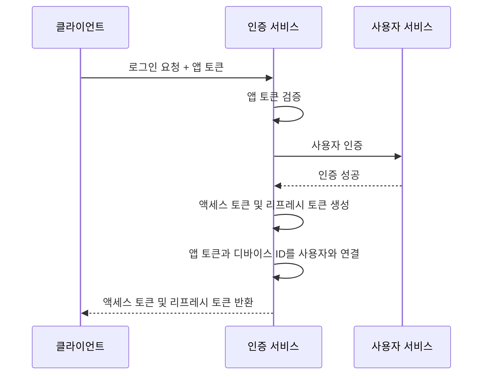

# 인증 기술 명세서

## 1. 인증 서비스 구조

### 1.1 인증 서비스 인터페이스
```typescript
@Injectable()
export class AuthenticationService {
  constructor(
    private readonly userService: UserService,
    private readonly tokenService: TokenService,
    private readonly securityPolicyService: SecurityPolicyService,
    private readonly eventEmitter: EventEmitter2,
  ) {}

  async login(
    email: string, 
    password: string, 
    deviceInfo: DeviceInfo
  ): Promise<AuthResult> {
    // 구현 세부사항
  }

  async validateToken(token: string): Promise<TokenPayload> {
    // 구현 세부사항
  }

  async refreshToken(refreshToken: string): Promise<AuthResult> {
    // 구현 세부사항
  }

  async logout(token: string): Promise<void> {
    // 구현 세부사항
  }

  async changePassword(
    userId: string,
    oldPassword: string,
    newPassword: string
  ): Promise<void> {
    // 구현 세부사항
  }
}
```

### 1.2 인증 결과 DTO
```typescript
export class AuthResult {
  @ApiProperty()
  accessToken: string;

  @ApiProperty()
  refreshToken: string;

  @ApiProperty()
  expiresIn: number;

  @ApiProperty()
  tokenType: string = 'Bearer';

  @ApiProperty({ type: UserDto })
  user: UserDto;
}
```

### 1.3 인증 요청 DTO
```typescript
export class LoginDto {
  @ApiProperty()
  @IsEmail()
  email: string;

  @ApiProperty()
  @IsString()
  @MinLength(8)
  password: string;

  @ApiProperty({ type: DeviceInfoDto })
  @ValidateNested()
  @Type(() => DeviceInfoDto)
  deviceInfo: DeviceInfoDto;
}
```

## 2. 인증 프로세스

### 2.1 로그인 프로세스
```typescript
async login(email: string, password: string, deviceInfo: DeviceInfo): Promise<AuthResult> {
  // 1. 사용자 조회
  const user = await this.userService.findByEmail(email);
  if (!user) {
    throw new UnauthorizedException('Invalid credentials');
  }

  // 2. 계정 상태 확인
  if (user.status !== UserStatus.ACTIVE) {
    throw new UnauthorizedException('Account is not active');
  }

  // 3. 비밀번호 검증
  const isValid = await this.validatePassword(password, user.password);
  if (!isValid) {
    await this.handleFailedLogin(user);
    throw new UnauthorizedException('Invalid credentials');
  }

  // 4. 토큰 발급
  const tokens = await this.tokenService.generateTokens(user, deviceInfo);

  // 5. 이벤트 발행
  this.eventEmitter.emit('user.authenticated', {
    userId: user.id,
    deviceInfo,
    timestamp: new Date(),
  });

  return {
    accessToken: tokens.accessToken,
    refreshToken: tokens.refreshToken,
    expiresIn: tokens.expiresIn,
    tokenType: 'Bearer',
    user: UserDto.fromEntity(user),
  };
}
```

### 2.2 토큰 검증 프로세스
```typescript
async validateToken(token: string): Promise<TokenPayload> {
  // 1. 토큰 디코딩 및 검증
  const payload = await this.tokenService.verifyToken(token);

  // 2. 블랙리스트 확인
  const isBlacklisted = await this.tokenService.isTokenBlacklisted(token);
  if (isBlacklisted) {
    throw new UnauthorizedException('Token has been revoked');
  }

  // 3. 사용자 상태 확인
  const user = await this.userService.findById(payload.sub);
  if (!user || user.status !== UserStatus.ACTIVE) {
    throw new UnauthorizedException('User is not active');
  }

  return payload;
}
```

### 2.3 토큰 갱신 프로세스
```typescript
async refreshToken(refreshToken: string): Promise<AuthResult> {
  // 1. 리프레시 토큰 검증
  const payload = await this.tokenService.verifyRefreshToken(refreshToken);

  // 2. 블랙리스트 확인
  const isBlacklisted = await this.tokenService.isTokenBlacklisted(refreshToken);
  if (isBlacklisted) {
    throw new UnauthorizedException('Refresh token has been revoked');
  }

  // 3. 사용자 조회
  const user = await this.userService.findById(payload.sub);
  if (!user || user.status !== UserStatus.ACTIVE) {
    throw new UnauthorizedException('User is not active');
  }

  // 4. 새로운 토큰 발급
  const tokens = await this.tokenService.generateTokens(user, payload.deviceInfo);

  // 5. 이전 리프레시 토큰 블랙리스트에 추가
  await this.tokenService.blacklistToken(refreshToken);

  return {
    accessToken: tokens.accessToken,
    refreshToken: tokens.refreshToken,
    expiresIn: tokens.expiresIn,
    tokenType: 'Bearer',
    user: UserDto.fromEntity(user),
  };
}
```

## 3. 인증 방식

### 3.1 JWT 기반 인증

### 3.2 앱 토큰 인증

앱 토큰 인증은 사용자 로그인 전 API 호출에 사용되는 인증 방식입니다. 디바이스 ID를 기반으로 발급된 앱 토큰을 사용하여 API에 접근합니다.

#### 3.2.1 앱 토큰 인증 흐름



#### 3.2.2 앱 토큰 인증 구현

앱 토큰 인증은 NestJS 가드를 사용하여 구현됩니다. `AppTokenGuard`는 요청 헤더에서 앱 토큰을 추출하고 검증하는 역할을 담당합니다.

```typescript
@Injectable()
export class AppTokenGuard implements CanActivate {
  constructor(private readonly appTokenService: AppTokenService) {}

  async canActivate(context: ExecutionContext): Promise<boolean> {
    const request = context.switchToHttp().getRequest();
    const token = this.extractTokenFromHeader(request);
    
    if (!token) {
      throw new UnauthorizedException('Missing token');
    }
    
    try {
      const payload = await this.appTokenService.validateAppToken(token);
      request.appToken = payload;
      return true;
    } catch (error) {
      throw new UnauthorizedException('Invalid token');
    }
  }

  private extractTokenFromHeader(request: Request): string | undefined {
    const [type, token] = request.headers.authorization?.split(' ') ?? [];
    return type === 'Bearer' ? token : undefined;
  }
}
```

#### 3.2.3 앱 토큰 사용 예시

컨트롤러에서 앱 토큰 가드를 사용하는 예시:

```typescript
@Controller('api')
export class ApiController {
  constructor(private readonly apiService: ApiService) {}

  @Post('public-endpoint')
  @UseGuards(AppTokenGuard)
  async publicEndpoint(@Req() request, @Body() data: any) {
    // request.appToken에서 앱 토큰 페이로드 접근 가능
    const { deviceId, permissions } = request.appToken;
    
    // 권한 확인
    if (!permissions.includes('required:permission')) {
      throw new ForbiddenException('Insufficient permissions');
    }
    
    return this.apiService.processRequest(data, deviceId);
  }
}
```

#### 3.2.4 앱 토큰과 사용자 인증 연계

사용자가 로그인하면 앱 토큰은 액세스 토큰으로 대체됩니다. 이 과정에서 앱 토큰에 연결된 디바이스 ID는 사용자 계정과 연결됩니다.



자세한 앱 토큰 구현 내용은 [앱 토큰 기술 명세](./app-token.md)를 참조하세요.

## 4. 보안 구현

### 4.1 비밀번호 해싱
```typescript
export class PasswordHasher {
  private readonly SALT_ROUNDS = 12;

  async hash(password: string): Promise<string> {
    return bcrypt.hash(password, this.SALT_ROUNDS);
  }

  async verify(password: string, hash: string): Promise<boolean> {
    return bcrypt.compare(password, hash);
  }
}
```

### 4.2 로그인 실패 처리
```typescript
async handleFailedLogin(user: User): Promise<void> {
  // 1. 실패 횟수 증가
  user.failedLoginAttempts += 1;

  // 2. 잠금 정책 확인
  const policy = await this.securityPolicyService.getLockoutPolicy();
  if (user.failedLoginAttempts >= policy.maxFailedAttempts) {
    user.status = UserStatus.LOCKED;
    user.lockoutUntil = addMinutes(new Date(), policy.lockoutDurationMinutes);
    
    // 3. 잠금 이벤트 발행
    this.eventEmitter.emit('user.locked', {
      userId: user.id,
      reason: 'MAX_LOGIN_ATTEMPTS',
      duration: policy.lockoutDurationMinutes,
      timestamp: new Date(),
    });
  }

  await this.userService.update(user);
}
```

### 4.3 토큰 보안
```typescript
export class TokenSecurityService {
  async validateDeviceInfo(
    tokenPayload: TokenPayload,
    currentDevice: DeviceInfo
  ): Promise<boolean> {
    // 디바이스 정보 변경 감지
    if (!this.isSameDevice(tokenPayload.deviceInfo, currentDevice)) {
      await this.handleSuspiciousActivity(tokenPayload.sub, 'DEVICE_CHANGED');
      return false;
    }
    return true;
  }

  async validateIpAddress(
    tokenPayload: TokenPayload,
    currentIp: string
  ): Promise<boolean> {
    // IP 주소 변경 감지
    if (tokenPayload.ipAddress !== currentIp) {
      const isAllowed = await this.geoIpService.isAllowedIp(currentIp);
      if (!isAllowed) {
        await this.handleSuspiciousActivity(tokenPayload.sub, 'SUSPICIOUS_IP');
        return false;
      }
    }
    return true;
  }
}
```

## 5. 에러 처리

### 5.1 인증 예외
```typescript
export class AuthenticationException extends UnauthorizedException {
  constructor(
    public readonly code: string,
    message: string,
    public readonly details?: any
  ) {
    super({
      code,
      message,
      details,
    });
  }
}

export class InvalidCredentialsException extends AuthenticationException {
  constructor(details?: any) {
    super(
      'INVALID_CREDENTIALS',
      'Invalid email or password',
      details
    );
  }
}

export class AccountLockedException extends AuthenticationException {
  constructor(lockoutUntil: Date) {
    super(
      'ACCOUNT_LOCKED',
      'Account is locked',
      { lockoutUntil }
    );
  }
}
```

### 5.2 에러 응답 형식
```typescript
export interface ErrorResponse {
  status: number;
  code: string;
  message: string;
  details?: any;
  timestamp: string;
}

@Catch(AuthenticationException)
export class AuthExceptionFilter implements ExceptionFilter {
  catch(exception: AuthenticationException, host: ArgumentsHost) {
    const ctx = host.switchToHttp();
    const response = ctx.getResponse<Response>();

    const errorResponse: ErrorResponse = {
      status: exception.getStatus(),
      code: exception.code,
      message: exception.message,
      details: exception.details,
      timestamp: new Date().toISOString(),
    };

    response
      .status(exception.getStatus())
      .json(errorResponse);
  }
}
```

## 6. 모니터링 및 로깅

### 6.1 인증 이벤트 로깅
```typescript
@Injectable()
export class AuthenticationLogger {
  constructor(
    private readonly logger: Logger,
    private readonly metricsService: MetricsService,
  ) {}

  logLoginAttempt(email: string, success: boolean, details?: any): void {
    this.logger.log({
      event: 'LOGIN_ATTEMPT',
      email,
      success,
      details,
      timestamp: new Date(),
    });

    this.metricsService.incrementCounter(
      'auth_login_attempts_total',
      { success: String(success) }
    );
  }

  logTokenValidation(tokenId: string, success: boolean, details?: any): void {
    this.logger.log({
      event: 'TOKEN_VALIDATION',
      tokenId,
      success,
      details,
      timestamp: new Date(),
    });

    this.metricsService.incrementCounter(
      'auth_token_validations_total',
      { success: String(success) }
    );
  }
}
```

### 6.2 성능 메트릭
```typescript
@Injectable()
export class AuthenticationMetrics {
  constructor(
    private readonly metricsService: MetricsService,
  ) {}

  recordLoginDuration(durationMs: number): void {
    this.metricsService.recordHistogram(
      'auth_login_duration_ms',
      durationMs
    );
  }

  recordTokenValidationDuration(durationMs: number): void {
    this.metricsService.recordHistogram(
      'auth_token_validation_duration_ms',
      durationMs
    );
  }

  recordActiveTokenCount(count: number): void {
    this.metricsService.setGauge(
      'auth_active_tokens',
      count
    );
  }
}
```

## 7. 변경 이력
| 버전 | 날짜 | 작성자 | 변경 내용 |
|-----|------|--------|-----------|
| 0.1.0 | 2025-03-16 | bok@weltcorp.com | 최초 작성 |
| 0.2.0 | 2025-03-16 | bok@weltcorp.com | 앱 토큰 인증 관련 내용 추가 |