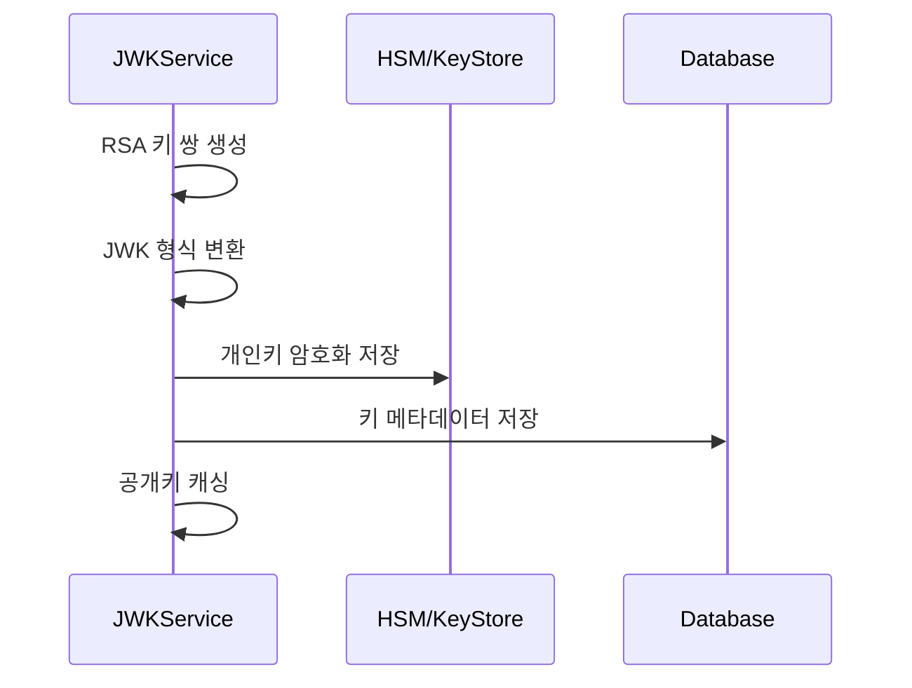
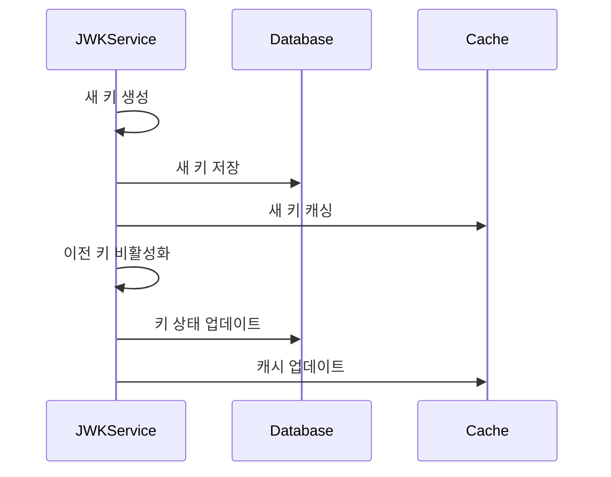

# 키 관리 기술 명세

## 1. JWK (JSON Web Key) 구조

### 공개키
```json
{
  "kty": "RSA",
  "kid": "20240320-1",
  "use": "sig",
  "alg": "RS256",
  "n": "base64_encoded_modulus",
  "e": "AQAB"
}
```

### 개인키
```json
{
  "kty": "RSA",
  "kid": "20240320-1",
  "use": "sig",
  "alg": "RS256",
  "n": "base64_encoded_modulus",
  "e": "AQAB",
  "d": "base64_encoded_private_exponent",
  "p": "base64_encoded_first_prime",
  "q": "base64_encoded_second_prime",
  "dp": "base64_encoded_first_factor_crt",
  "dq": "base64_encoded_second_factor_crt",
  "qi": "base64_encoded_coefficient"
}
```

## 2. 키 생성 프로세스

### 키 생성 흐름


### 키 생성 단계
1. RSA 키 쌍 생성 (2048비트)
2. 키 식별자(kid) 생성
   ```typescript
   function generateKeyId(): string {
     const date = new Date().toISOString().split('T')[0];
     const seq = getSequenceNumber();
     return `${date}-${seq}`;
   }
   ```
3. JWK 형식으로 변환
4. 개인키 암호화
5. 데이터베이스 저장

## 3. 키 로테이션

### 로테이션 정책
1. 90일 주기로 자동 로테이션
2. 만료 30일 전 새 키 생성
3. 이전 키는 30일간 유지
4. 점진적 전환 (Rolling Update)

### 로테이션 프로세스


## 4. 키 저장소

### 데이터베이스 스키마
```sql
CREATE TABLE iam.jwk (
  id SERIAL PRIMARY KEY,
  kid VARCHAR(50) UNIQUE NOT NULL,
  jwk JSONB NOT NULL,
  private_key JSONB NOT NULL,
  created_at TIMESTAMPTZ NOT NULL DEFAULT NOW(),
  expires_at TIMESTAMPTZ NOT NULL,
  status VARCHAR(20) NOT NULL
);

CREATE INDEX idx_jwk_kid ON iam.jwk(kid);
CREATE INDEX idx_jwk_status ON iam.jwk(status);
```

### 캐시 구조
```typescript
interface JWKCache {
  // 활성 키
  'jwk:active': {
    kid: string;
    jwk: JsonWebKey;
    expiresAt: number;
  };

  // 키 메타데이터
  `jwk:${kid}`: {
    status: 'ACTIVE' | 'INACTIVE' | 'EXPIRED';
    expiresAt: number;
  };
}
```

## 5. 키 백업 및 복구

### 백업 정책
1. 일일 자동 백업
2. 암호화된 형태로 저장
3. 버전 관리 적용
4. 접근 제어 적용

### 복구 프로세스
1. 백업 파일 복호화
2. 키 유효성 검증
3. 데이터베이스 복원
4. 캐시 갱신

## 6. 보안 조치

### 키 보호
1. HSM 또는 안전한 키 저장소 사용
2. AES-256으로 개인키 암호화
3. 접근 로그 기록
4. 이상 징후 모니터링

### 접근 제어
```typescript
enum KeyPermission {
  CREATE = 'key:create',
  READ = 'key:read',
  UPDATE = 'key:update',
  DELETE = 'key:delete',
  ROTATE = 'key:rotate'
}

interface KeyAccess {
  userId: string;
  permission: KeyPermission;
  grantedAt: Date;
  expiresAt: Date;
}
```

## 7. 모니터링

### 메트릭스
1. 활성 키 수
2. 키 사용 빈도
3. 로테이션 성공률
4. 키 접근 패턴

### 알림
1. 키 만료 임박
2. 로테이션 실패
3. 비정상 접근 시도
4. 백업 실패

## 8. 에러 처리

### 에러 코드
```typescript
enum KeyError {
  CREATION_FAILED = 'KEY.CREATION_FAILED',
  NOT_FOUND = 'KEY.NOT_FOUND',
  EXPIRED = 'KEY.EXPIRED',
  ROTATION_FAILED = 'KEY.ROTATION_FAILED',
  BACKUP_FAILED = 'KEY.BACKUP_FAILED',
  INVALID_FORMAT = 'KEY.INVALID_FORMAT'
}
```

### 에러 응답
```typescript
interface KeyErrorResponse {
  status: number;
  code: KeyError;
  message: string;
  details?: any;
}
```

## 9. 변경 이력
| 날짜 | 버전 | 설명 | 작성자 |
|------|------|------|--------|
| 2025-03-16 | 0.1 | 최초 작성 | bok@weltcorp.com | 