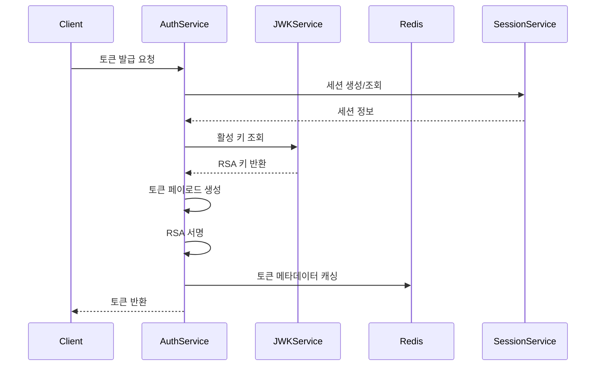
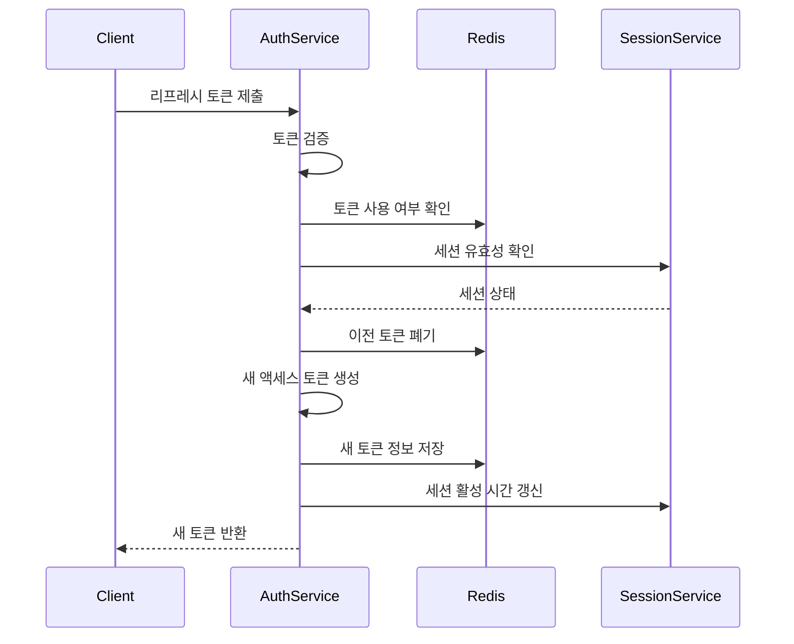

# 토큰 관리 기술 명세

## 1. 토큰 구조

### Access Token
```typescript
interface AccessToken {
  header: {
    alg: 'RS256';
    typ: 'JWT';
    kid: string;      // Key ID
  };
  payload: {
    iss: string;      // Issuer
    sub: string;      // Subject (User ID)
    aud: string[];    // Audience
    exp: number;      // Expiration Time
    iat: number;      // Issued At
    jti: string;      // JWT ID
    type: 'ACCESS';   // Token Type
    sessionId: string; // Session ID
    deviceId: string; // Device ID
  };
  signature: string;  // RSA Signature
}
```

### Refresh Token
```typescript
interface RefreshToken {
  header: {
    alg: 'RS256';
    typ: 'JWT';
    kid: string;
  };
  payload: {
    iss: string;
    sub: string;
    exp: number;
    iat: number;
    jti: string;
    type: 'REFRESH';
    sessionId: string;
  };
  signature: string;
}
```

## 2. 토큰 생성 프로세스

### 2.1 액세스 토큰 생성


### 2.2 리프레시 토큰 생성
1. 세션 ID 생성 또는 기존 세션 조회
2. 리프레시 토큰 페이로드 구성
3. RSA 서명
4. Redis에 토큰 정보 저장
5. 클라이언트에 토큰 반환

## 3. 토큰 검증 프로세스

### 3.1 검증 단계
1. JWT 형식 검증
2. 서명 검증
   ```typescript
   async function verifyToken(token: string): Promise<TokenPayload> {
     const decoded = jwt.decode(token, { complete: true });
     const key = await jwkService.getKey(decoded.header.kid);
     return jwt.verify(token, key.publicKey);
   }
   ```

3. 클레임 검증
   - 만료 시간 확인
   - 발급자 확인
   - 토큰 타입 확인
   - 세션 ID 확인

4. Redis 검증
   - 토큰 폐기 여부 확인
   - 세션 유효성 확인

## 4. 토큰 갱신 프로세스

### 4.1 갱신 흐름


### 4.2 갱신 정책
1. 리프레시 토큰 1회성 사용
2. 이전 액세스 토큰 자동 폐기
3. 새로운 토큰 ID 할당
4. 세션 정보 업데이트

## 5. 토큰 저장 및 캐싱

### 5.1 Redis 저장 구조
```typescript
interface TokenCache {
  jti: string;           // 토큰 ID
  userId: string;        // 사용자 ID
  sessionId: string;     // 세션 ID
  deviceId: string;      // 디바이스 ID
  type: 'ACCESS' | 'REFRESH';
  isRevoked: boolean;    // 폐기 여부
  expiresAt: number;     // 만료 시간
}
```

### 5.2 캐싱 전략
1. 액세스 토큰: 짧은 TTL (15분)
2. 리프레시 토큰: 긴 TTL (7일)
3. 폐기된 토큰: 원본 만료 시간까지 유지

## 6. 보안 고려사항

### 6.1 토큰 보안
1. 강력한 RSA 키 (2048비트 이상)
2. 정기적인 키 로테이션 (24시간)
3. 토큰 ID의 충분한 엔트로피
4. 민감 정보 페이로드 제외

### 6.2 세션 보안
1. 디바이스당 하나의 활성 세션
2. 비정상 패턴 감지 시 세션 종료
3. 장기 미사용 세션 자동 종료
4. 세션 데이터 암호화 저장

## 7. 모니터링 및 알림

### 7.1 모니터링 지표
1. 토큰 발급 수 (초당)
2. 토큰 검증 실패율
3. 토큰 갱신 성공률
4. Redis 응답 시간
5. 키 로테이션 상태

### 7.2 알림 설정
1. 토큰 검증 실패율 > 5%
2. Redis 응답 시간 > 100ms
3. 키 로테이션 실패
4. 비정상적인 토큰 발급 패턴

## 변경 이력

| 버전 | 날짜 | 작성자 | 설명 |
|------|------|--------|------|
| 0.1.0 | 2025-03-15 | bok@weltcorp.com | 최초 작성 |
| 0.2.0 | 2025-03-16 | bok@weltcorp.com | 앱 토큰 관련 내용 추가 |
| 0.3.0 | 2025-03-21 | bok@weltcorp.com | 권한 관련 내용을 IAM 도메인으로 이전 |