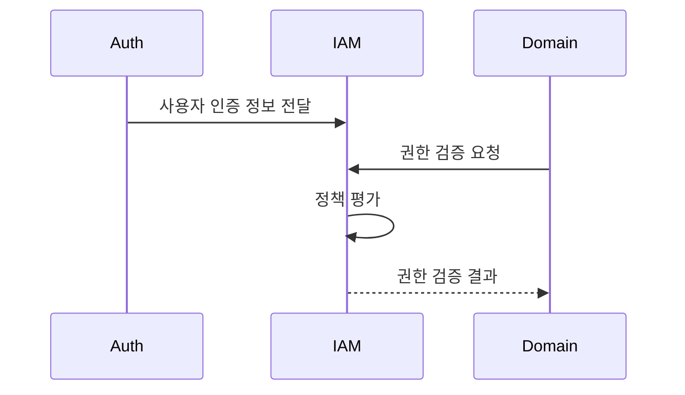
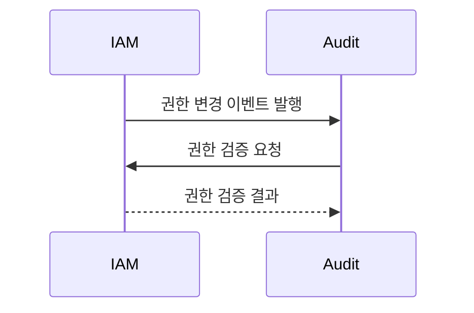

# IAM(Identity and Access Management) 바운디드 컨텍스트

## 1. 컨텍스트 정의
IAM(Identity and Access Management) 도메인은 시스템 전반의 접근 제어와 권한 관리를 담당하는 핵심 도메인입니다. 사용자, 역할, 권한, 정책을 중앙에서 관리하고 다른 도메인들에게 권한 검증 서비스를 제공합니다.

### 1.1 주요 책임
- 권한(Permission) 정의 및 관리
- 역할(Role) 정의 및 관리
- 정책(Policy) 정의 및 관리
- 권한 검증 서비스 제공
- 권한 감사 로그 생성
- 도메인별 권한 모델 통합 관리

### 1.2 비책임 범위
- 사용자 인증 (Auth 도메인 담당)
- 세션 관리 (Auth 도메인 담당)
- 상세 감사 로그 저장 (Audit 도메인 담당)
- 도메인별 비즈니스 로직

### 1.3 도메인 용어
- **Permission**: 특정 리소스나 작업에 대한 접근 권한
- **Role**: 관련된 권한들의 논리적 그룹
- **Policy**: 권한 부여 조건과 제약사항을 정의하는 규칙
- **Principal**: 권한을 부여받는 대상 (사용자, 서비스 계정 등)
- **Resource**: 접근 제어의 대상이 되는 시스템 자원
- **Action**: 리소스에 대해 수행할 수 있는 작업
- **Effect**: 권한 부여(Allow) 또는 거부(Deny)의 결과
- **Scope**: 권한이 적용되는 범위
- **Constraint**: 권한 부여에 대한 추가 제약 조건

## 2. 하위 컨텍스트

### 2.1 권한 관리 (Permission Management)
권한의 생성, 수정, 삭제 및 조회를 담당합니다.

#### 책임
- 권한 CRUD 작업
- 권한 계층 구조 관리
- 권한 메타데이터 관리
- 권한 종속성 관리

#### 정책 및 규칙
1. **권한 명명 규칙**
   - 도메인명_작업_리소스 형식 사용
   - 대문자와 언더스코어만 사용
   - 예: AUDIT_READ_LOGS, USER_MANAGE_ROLES

2. **권한 계층 구조**
   - 상위 권한은 하위 권한을 포함
   - 최대 3단계까지의 계층 허용

### 2.2 역할 관리 (Role Management)
역할 기반 접근 제어(RBAC)를 위한 역할 관리를 담당합니다.

#### 책임
- 역할 CRUD 작업
- 역할-권한 매핑 관리
- 역할 계층 구조 관리
- 기본 역할 관리

#### 정책 및 규칙
1. **역할 정의**
   - 명확한 책임 범위 정의
   - 최소 권한 원칙 준수
   - 역할 간 중복 최소화

2. **역할 할당**
   - 다중 역할 할당 가능
   - 상충되는 역할 할당 방지
   - 임시 역할 할당 지원

### 2.3 정책 관리 (Policy Management)
세부적인 접근 제어 정책을 관리합니다.

#### 책임
- 정책 CRUD 작업
- 정책 평가 및 적용
- 정책 충돌 해결
- 정책 버전 관리

#### 정책 및 규칙
1. **정책 정의**
   - JSON 형식으로 정의
   - 조건부 접근 제어 지원
   - 다중 조건 결합 지원

2. **정책 평가**
   - 명시적 거부 우선
   - 계층적 정책 평가
   - 정책 충돌 해결 규칙

## 3. 컨텍스트 경계

### 3.1 상류 컨텍스트 (Upstream)
1. **Auth 도메인**
   - 관계: 파트너십
   - 사용자 인증 정보 제공
   - 세션 정보 제공
   - 인터페이스: REST API

2. **User 도메인**
   - 관계: 파트너십
   - 사용자 정보 제공
   - 조직 구조 정보 제공
   - 인터페이스: REST API

### 3.2 하류 컨텍스트 (Downstream)
1. **Audit 도메인**
   - 관계: 고객-공급자
   - 권한 검증 서비스 제공
   - 권한 변경 이벤트 제공
   - 인터페이스: REST API, 이벤트

2. **기타 도메인들**
   - 관계: 고객-공급자
   - 권한 검증 서비스 제공
   - 도메인별 권한 정보 제공
   - 인터페이스: REST API

## 4. 컨텍스트 매핑

### 4.1 Auth 도메인과의 관계

### 4.2 Audit 도메인과의 관계

## 5. 도메인 이벤트

### 5.1 발행하는 이벤트
- **PermissionCreated**: 새로운 권한 생성
- **PermissionUpdated**: 권한 정보 수정
- **PermissionDeleted**: 권한 삭제
- **RoleCreated**: 새로운 역할 생성
- **RoleUpdated**: 역할 정보 수정
- **RoleDeleted**: 역할 삭제
- **PolicyCreated**: 새로운 정책 생성
- **PolicyUpdated**: 정책 정보 수정
- **PolicyDeleted**: 정책 삭제
- **PermissionAssigned**: 권한 할당
- **PermissionRevoked**: 권한 회수
- **RoleAssigned**: 역할 할당
- **RoleRevoked**: 역할 회수

### 5.2 구독하는 이벤트
- **UserCreated**: 새로운 사용자 생성
- **UserDeleted**: 사용자 삭제
- **UserStatusChanged**: 사용자 상태 변경
- **OrganizationChanged**: 조직 구조 변경
- **ServiceAccountCreated**: 서비스 계정 생성
- **ServiceAccountDeleted**: 서비스 계정 삭제

## 6. 권한 평가 프로세스

### 6.1 평가 단계
1. 주체(Principal) 식별
2. 적용 가능한 정책 수집
3. 정책 조건 평가
4. 명시적 거부 확인
5. 권한 부여 결정

### 6.2 캐싱 전략
- 권한 평가 결과 캐싱
- 정책 변경 시 캐시 무효화
- 분산 캐시 사용

## 7. 외부 시스템 통합
- LDAP/Active Directory 통합
- OAuth2.0 제공자 통합
- SAML 제공자 통합
- 외부 정책 엔진 통합

## 8. 기술 스택
- NestJS (백엔드 프레임워크)
- TypeScript (프로그래밍 언어)
- PostgreSQL (주 데이터베이스)
- Redis (캐싱)
- RabbitMQ (이벤트 메시징)
- OpenAPI (API 문서화)
- Jest (테스팅)

## 9. 변경 이력
| 버전 | 날짜 | 작성자 | 변경 내용 |
|-----|------|--------|-----------|
| 0.1.0 | 2024-03-19 | bok@weltcorp.com | 최초 작성 | 