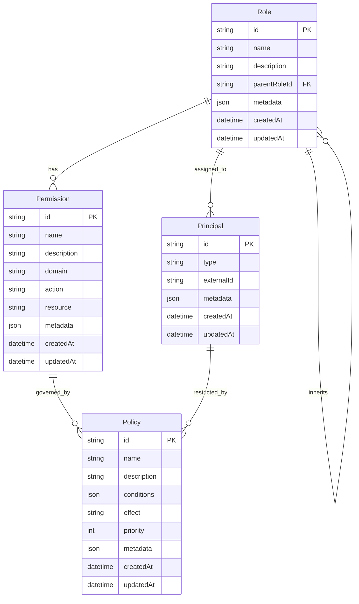

# IAM 도메인 모델

## 1. ERD (Entity Relationship Diagram)



## 2. 핵심 엔티티

### 2.1 Permission (권한)
```prisma
model Permission {
  id          String    @id @default(uuid())
  name        String    // 예: AUDIT_READ_LOGS
  description String
  domain      String    // 예: 'audit', 'user'
  action      String    // 예: 'read', 'write'
  resource    String    // 예: 'logs', 'users'
  metadata    Json?
  roles       Role[]    @relation("RolePermissions")
  createdAt   DateTime  @default(now())
  updatedAt   DateTime  @updatedAt
}
```

### 2.2 Role (역할)
```prisma
model Role {
  id           String      @id @default(uuid())
  name         String      // 예: 'ADMIN', 'USER'
  description  String
  parentRoleId String?
  permissions  Permission[] @relation("RolePermissions")
  principals   Principal[] @relation("PrincipalRoles")
  metadata     Json?
  createdAt    DateTime   @default(now())
  updatedAt    DateTime   @updatedAt
}
```

### 2.3 Policy (정책)
```prisma
model Policy {
  id          String    @id @default(uuid())
  name        String
  description String
  conditions  Json      // PolicyCondition[]
  effect      String    // PolicyEffect: 'ALLOW' | 'DENY'
  priority    Int
  metadata    Json?
  createdAt   DateTime  @default(now())
  updatedAt   DateTime  @updatedAt
}

// TypeScript 타입 정의
interface PolicyCondition {
  type: string;  // 'TimeRange' | 'IPRange' | 'ResourceMatch' | etc.
  parameters: Record<string, any>;
}

enum PolicyEffect {
  ALLOW = 'ALLOW',
  DENY = 'DENY'
}
```

### 2.4 Principal (주체)
```prisma
model Principal {
  id         String    @id @default(uuid())
  type       String    // PrincipalType: 'USER' | 'SERVICE_ACCOUNT'
  externalId String    // User ID or Service Account ID
  roles      Role[]    @relation("PrincipalRoles")
  metadata   Json?
  createdAt  DateTime  @default(now())
  updatedAt  DateTime  @updatedAt
}

// TypeScript 타입 정의
enum PrincipalType {
  USER = 'USER',
  SERVICE_ACCOUNT = 'SERVICE_ACCOUNT'
}
```

## 3. 값 객체

### 3.1 PermissionScope
```typescript
class PermissionScope {
  constructor(
    public readonly domain: string,
    public readonly action: string,
    public readonly resource: string
  ) {}

  toString(): string {
    return `${this.domain}:${this.action}:${this.resource}`;
  }

  static fromString(scope: string): PermissionScope {
    const [domain, action, resource] = scope.split(':');
    return new PermissionScope(domain, action, resource);
  }
}
```

### 3.2 PolicyEvaluation
```typescript
class PolicyEvaluation {
  constructor(
    public readonly allowed: boolean,
    public readonly reason: string,
    public readonly evaluatedPolicies: string[]
  ) {}

  static allow(reason: string, policies: string[]): PolicyEvaluation {
    return new PolicyEvaluation(true, reason, policies);
  }

  static deny(reason: string, policies: string[]): PolicyEvaluation {
    return new PolicyEvaluation(false, reason, policies);
  }
}
```

## 4. 집계

### 4.1 RoleAggregate
```typescript
class RoleAggregate {
  private constructor(
    private readonly role: Role,
    private readonly permissions: Permission[]
  ) {}

  static async create(
    prisma: PrismaService,
    roleId: string
  ): Promise<RoleAggregate> {
    const role = await prisma.role.findUniqueOrThrow({
      where: { id: roleId },
      include: { permissions: true }
    });
    
    return new RoleAggregate(role, role.permissions);
  }

  hasPermission(permissionName: string): boolean {
    return this.permissions.some(p => p.name === permissionName);
  }

  addPermission(permission: Permission): void {
    if (!this.hasPermission(permission.name)) {
      this.permissions.push(permission);
    }
  }

  removePermission(permissionName: string): void {
    const index = this.permissions.findIndex(p => p.name === permissionName);
    if (index !== -1) {
      this.permissions.splice(index, 1);
    }
  }
}
```

### 4.2 PolicyAggregate
```typescript
class PolicyAggregate {
  private constructor(
    private readonly policy: Policy,
    private readonly conditions: PolicyCondition[]
  ) {}

  static async create(
    prisma: PrismaService,
    policyId: string
  ): Promise<PolicyAggregate> {
    const policy = await prisma.policy.findUniqueOrThrow({
      where: { id: policyId }
    });
    return new PolicyAggregate(policy, policy.conditions);
  }

  evaluate(context: PolicyEvaluationContext): PolicyEvaluation {
    for (const condition of this.conditions) {
      if (!this.evaluateCondition(condition, context)) {
        return PolicyEvaluation.deny(
          `Condition ${condition.type} not satisfied`,
          [this.policy.id]
        );
      }
    }

    return PolicyEvaluation.allow(
      'All conditions satisfied',
      [this.policy.id]
    );
  }

  private evaluateCondition(
    condition: PolicyCondition,
    context: PolicyEvaluationContext
  ): boolean {
    // 조건 평가 로직
    return true;
  }
}
```

## 5. 도메인 서비스

### 5.1 PermissionEvaluationService
```typescript
@Injectable()
class PermissionEvaluationService {
  constructor(
    private readonly prisma: PrismaService,
    private readonly eventEmitter: EventEmitter2
  ) {}

  async evaluatePermission(
    principal: Principal,
    permission: Permission,
    context: PolicyEvaluationContext
  ): Promise<PolicyEvaluation> {
    const roles = await this.prisma.role.findMany({
      where: {
        principals: {
          some: { id: principal.id }
        }
      },
      include: {
        permissions: true
      }
    });

    const policies = await this.prisma.policy.findMany({
      where: {
        OR: roles.map(role => ({
          id: { in: role.permissions.map(p => p.id) }
        }))
      }
    });

    let finalEvaluation = PolicyEvaluation.deny(
      'No matching policies',
      []
    );

    for (const policy of policies) {
      const policyAggregate = await PolicyAggregate.create(
        this.prisma,
        policy.id
      );

      const evaluation = policyAggregate.evaluate(context);
      
      if (!evaluation.allowed) {
        return evaluation;  // Explicit deny takes precedence
      }

      finalEvaluation = evaluation;
    }

    return finalEvaluation;
  }
}
```

### 5.2 RoleManagementService
```typescript
@Injectable()
class RoleManagementService {
  constructor(
    private readonly prisma: PrismaService,
    private readonly eventEmitter: EventEmitter2
  ) {}

  async assignPermissionToRole(
    roleId: string,
    permissionId: string
  ): Promise<void> {
    await this.prisma.role.update({
      where: { id: roleId },
      data: {
        permissions: {
          connect: { id: permissionId }
        }
      }
    });
    
    this.eventEmitter.emit('role.permission.assigned', {
      roleId,
      permissionId
    });
  }
}
```

## 6. 도메인 이벤트

### 6.1 PermissionEvents
```typescript
class PermissionCreatedEvent {
  constructor(
    public readonly permissionId: string,
    public readonly name: string,
    public readonly domain: string
  ) {}
}

class PermissionUpdatedEvent {
  constructor(
    public readonly permissionId: string,
    public readonly changes: Partial<Permission>
  ) {}
}

class PermissionDeletedEvent {
  constructor(
    public readonly permissionId: string
  ) {}
}
```

### 6.2 RoleEvents
```typescript
class RoleCreatedEvent {
  constructor(
    public readonly roleId: string,
    public readonly name: string
  ) {}
}

class RolePermissionAssignedEvent {
  constructor(
    public readonly roleId: string,
    public readonly permissionId: string
  ) {}
}

class RolePermissionRevokedEvent {
  constructor(
    public readonly roleId: string,
    public readonly permissionId: string
  ) {}
}
```

## 7. 리포지토리 패턴 (with Prisma)

### 7.1 PermissionRepository
```typescript
@Injectable()
class PermissionRepository {
  constructor(private readonly prisma: PrismaService) {}

  async findById(id: string): Promise<Permission> {
    return this.prisma.permission.findUniqueOrThrow({
      where: { id }
    });
  }

  async findByRoleId(roleId: string): Promise<Permission[]> {
    return this.prisma.permission.findMany({
      where: {
        roles: {
          some: { id: roleId }
        }
      }
    });
  }
}
```

### 7.2 RoleRepository
```typescript
@Injectable()
class RoleRepository {
  constructor(private readonly prisma: PrismaService) {}

  async findById(id: string): Promise<Role> {
    return this.prisma.role.findUniqueOrThrow({
      where: { id }
    });
  }

  async findByPrincipalId(principalId: string): Promise<Role[]> {
    return this.prisma.role.findMany({
      where: {
        principals: {
          some: { id: principalId }
        }
      }
    });
  }
}
```

## 8. 변경 이력
| 버전 | 날짜 | 작성자 | 변경 내용 |
|-----|------|--------|-----------|
| 0.1.0 | 2024-03-19 | bok@weltcorp.com | 최초 작성 |