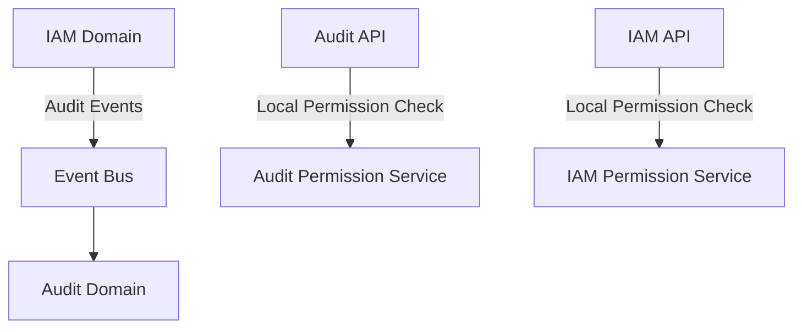

# IAM Audit Integration

## 1. 개요
IAM 도메인의 감사 로깅 통합 명세입니다. 이 문서는 IAM 도메인에서 발생하는 주요 이벤트들을 Audit 도메인으로 전송하는 방법을 설명합니다.

## 2. 순환 참조 방지 전략

### 2.1 권한 검사 분리


1. **로컬 권한 검사**
   - Audit 도메인: 자체 권한 검사 로직 구현 (AuditPermissionService)
   - IAM 도메인: 자체 권한 검사 로직 구현 (IamPermissionService)
   - 각 도메인은 자체적으로 기본 권한 정보를 관리

2. **권한 동기화**
   - IAM 도메인에서 권한 변경 시 이벤트 발행
   - Audit 도메인은 비동기적으로 권한 정보 업데이트
   - 일시적 불일치는 허용 (Eventually Consistent)

### 2.2 이벤트 기반 통합
```typescript
// IAM 도메인의 권한 변경 이벤트
interface PermissionChangedEvent {
  type: 'PERMISSION_CHANGED';
  timestamp: Date;
  changes: {
    domain: 'IAM' | 'AUDIT';
    action: 'CREATE' | 'UPDATE' | 'DELETE';
    permissionId: string;
    details: Record<string, any>;
  };
  metadata: {
    correlationId: string;
    initiator: {
      id: string;
      type: 'USER' | 'SYSTEM';
    };
  };
}

// Audit 도메인의 로컬 권한 관리
@Injectable()
class AuditPermissionService {
  private permissions: Map<string, AuditPermission>;

  async hasPermission(userId: string, action: string): Promise<boolean> {
    const permission = this.permissions.get(action);
    return this.evaluatePermission(userId, permission);
  }

  async handlePermissionChanged(event: PermissionChangedEvent): Promise<void> {
    if (event.changes.domain !== 'AUDIT') return;
    
    // 비동기적으로 로컬 권한 정보 업데이트
    await this.updateLocalPermission(event.changes);
  }
}
```

## 3. 감사 이벤트 발행

### 3.1 이벤트 발행자
```typescript
@Injectable()
class IamAuditEventPublisher {
  constructor(
    private readonly eventBus: EventBus,
    private readonly timeMachine: TimeMachineService
  ) {}

  async publishAuditEvent(event: IamAuditEvent): Promise<void> {
    const timestamp = await this.timeMachine.getCurrentDate();
    
    await this.eventBus.publish('audit.events', {
      source: 'iam',
      timestamp,
      eventType: event.type,
      actor: event.actor,
      target: event.target,
      action: event.action,
      changes: event.changes,
      metadata: {
        domain: 'IAM',
        component: event.component,
        correlationId: event.metadata?.correlationId
      }
    });
  }
}
```

### 3.2 이벤트 구조
```typescript
interface IamAuditEvent {
  type: string;
  component: 'PERMISSION' | 'ROLE' | 'POLICY';
  actor: {
    id: string;
    type: 'USER' | 'SYSTEM';
    name?: string;
  };
  target: {
    id: string;
    type: 'PERMISSION' | 'ROLE' | 'POLICY';
    name: string;
  };
  action: string;
  changes?: {
    before: Record<string, any>;
    after: Record<string, any>;
  };
  metadata?: {
    correlationId?: string;
    reason?: string;
  };
}
```

## 4. 구현 고려사항

### 4.1 권한 캐싱 전략
1. 각 도메인은 자체 권한 캐시 유지
2. 캐시 TTL 설정으로 일시적 불일치 허용
3. 중요 권한 변경은 즉시 캐시 무효화

### 4.2 장애 처리 전략
1. Audit 도메인 장애 시
   - 이벤트를 로컬 큐에 저장
   - 재시도 메커니즘으로 전송 보장
   - 중요 작업은 계속 진행

2. 권한 정보 불일치 시
   - 보수적 접근: 기본적으로 거부
   - 정기적 권한 동기화 작업 수행
   - 불일치 탐지 시 관리자 알림

## 5. 변경 이력
| 버전 | 날짜 | 작성자 | 변경 내용 |
|-----|------|--------|-----------|
| 0.1.0 | 2025-03-19 | bok@weltcorp.com | 최초 작성 |