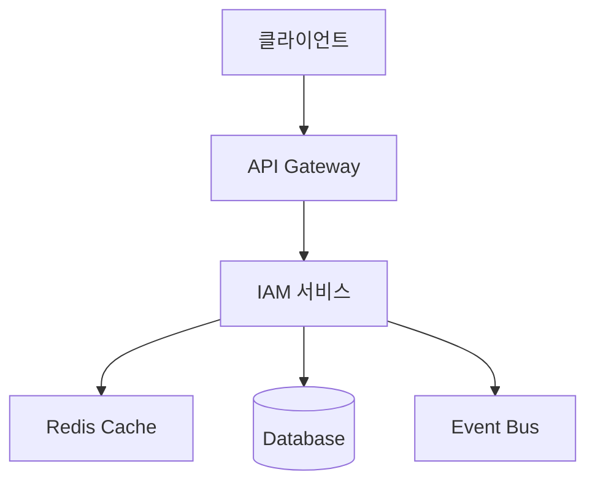
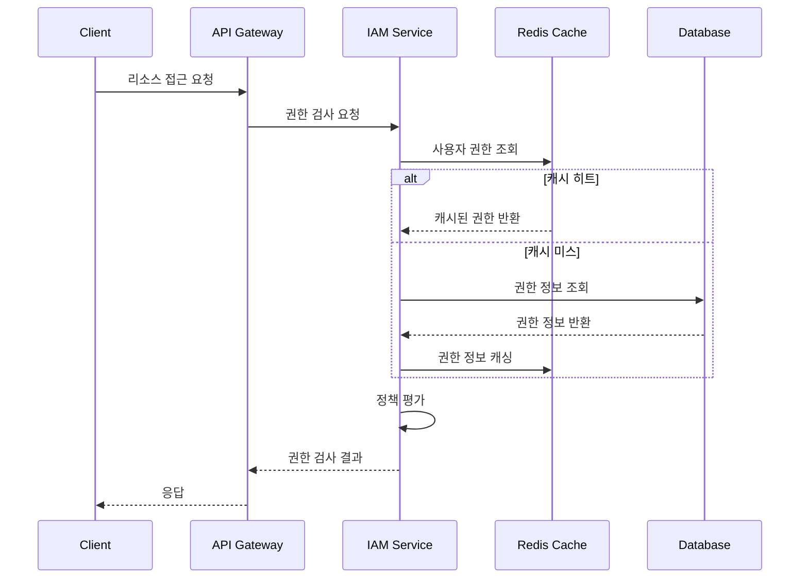

# 권한 관리 기술 명세서

## 1. 권한 관리 시스템 아키텍처

### 1.1 시스템 구성 요소


### 1.2 주요 컴포넌트
1. **권한 평가기 (Permission Evaluator)**
   - 권한 검사 로직 처리
   - 조건부 권한 평가
   - 캐시 계층 관리

2. **정책 관리자 (Policy Manager)**
   - 정책 CRUD 작업
   - 정책 유효성 검증
   - 정책 버전 관리

3. **역할 관리자 (Role Manager)**
   - 역할 계층 구조 관리
   - 역할-권한 매핑
   - 역할 상속 처리

4. **감사 로거 (Audit Logger)**
   - 권한 변경 이력 기록
   - 접근 로그 관리
   - 감사 보고서 생성

## 2. 권한 모델

### 2.1 핵심 엔티티
```typescript
interface Role {
  id: string;
  name: string;
  description: string;
  permissions: Permission[];
  parentRoles: Role[];
  metadata: Record<string, any>;
  createdAt: Date;
  updatedAt: Date;
}

interface Permission {
  id: string;
  name: string;
  description: string;
  resource: string;
  action: PermissionAction;
  conditions?: PolicyCondition[];
  metadata: Record<string, any>;
  createdAt: Date;
  updatedAt: Date;
}

interface Policy {
  id: string;
  name: string;
  description: string;
  effect: PolicyEffect;
  resources: string[];
  actions: PermissionAction[];
  conditions: PolicyCondition[];
  priority: number;
  version: number;
  metadata: Record<string, any>;
  createdAt: Date;
  updatedAt: Date;
}

enum PolicyEffect {
  ALLOW = 'ALLOW',
  DENY = 'DENY'
}

enum PermissionAction {
  CREATE = 'CREATE',
  READ = 'READ',
  UPDATE = 'UPDATE',
  DELETE = 'DELETE',
  EXECUTE = 'EXECUTE'
}

interface PolicyCondition {
  type: ConditionType;
  field: string;
  operator: ConditionOperator;
  value: any;
}

enum ConditionType {
  STRING = 'STRING',
  NUMBER = 'NUMBER',
  DATE = 'DATE',
  BOOLEAN = 'BOOLEAN',
  IP = 'IP',
  TIME = 'TIME'
}

enum ConditionOperator {
  EQUALS = 'EQUALS',
  NOT_EQUALS = 'NOT_EQUALS',
  IN = 'IN',
  NOT_IN = 'NOT_IN',
  GREATER_THAN = 'GREATER_THAN',
  LESS_THAN = 'LESS_THAN',
  BETWEEN = 'BETWEEN',
  PATTERN = 'PATTERN'
}
```

### 2.2 서비스 인터페이스
```typescript
interface AuthorizationService {
  // 권한 검사
  hasPermission(userId: string, resource: string, action: PermissionAction, context?: Record<string, any>): Promise<boolean>;
  evaluatePolicy(userId: string, policy: Policy, context?: Record<string, any>): Promise<boolean>;
  
  // 역할 관리
  assignRole(userId: string, roleId: string): Promise<void>;
  revokeRole(userId: string, roleId: string): Promise<void>;
  getRoles(userId: string): Promise<Role[]>;
  
  // 정책 관리
  createPolicy(policy: CreatePolicyDto): Promise<Policy>;
  updatePolicy(policyId: string, policy: UpdatePolicyDto): Promise<Policy>;
  deletePolicy(policyId: string): Promise<void>;
  
  // 권한 관리
  createPermission(permission: CreatePermissionDto): Promise<Permission>;
  updatePermission(permissionId: string, permission: UpdatePermissionDto): Promise<Permission>;
  deletePermission(permissionId: string): Promise<void>;
}
```

## 3. 권한 평가 프로세스

### 3.1 권한 검사 흐름


### 3.2 정책 평가 알고리즘
```typescript
async evaluatePolicy(userId: string, policy: Policy, context: Record<string, any>): Promise<boolean> {
  // 1. 정책 우선순위 확인
  const higherPriorityPolicies = await this.findHigherPriorityPolicies(policy);
  if (higherPriorityPolicies.some(p => p.effect === PolicyEffect.DENY)) {
    return false;
  }

  // 2. 조건 평가
  const conditionsMatch = await this.evaluateConditions(policy.conditions, context);
  if (!conditionsMatch) {
    return false;
  }

  // 3. 리소스 및 액션 매칭
  const resourceMatch = this.matchResource(policy.resources, context.resource);
  const actionMatch = policy.actions.includes(context.action);
  
  return resourceMatch && actionMatch;
}
```

## 4. 캐싱 전략

### 4.1 캐시 구조
```typescript
interface PermissionCache {
  userId: string;
  permissions: {
    resource: string;
    action: PermissionAction;
    conditions: PolicyCondition[];
  }[];
  roles: {
    id: string;
    name: string;
  }[];
  policies: {
    id: string;
    effect: PolicyEffect;
    priority: number;
  }[];
  lastUpdated: Date;
}
```

### 4.2 캐시 관리
1. **TTL 설정**
   - 사용자 권한: 15분
   - 역할 정보: 30분
   - 정책 정보: 1시간

2. **캐시 무효화 트리거**
   - 역할 할당/해제
   - 권한 변경
   - 정책 수정
   - 사용자 상태 변경

## 5. 감사 로깅

### 5.1 로그 이벤트
```typescript
interface AuthorizationAuditEvent {
  eventId: string;
  eventType: AuthorizationEventType;
  userId: string;
  resource: string;
  action: PermissionAction;
  decision: boolean;
  context: Record<string, any>;
  timestamp: Date;
}

enum AuthorizationEventType {
  PERMISSION_CHECK = 'PERMISSION_CHECK',
  ROLE_ASSIGNED = 'ROLE_ASSIGNED',
  ROLE_REVOKED = 'ROLE_REVOKED',
  POLICY_CREATED = 'POLICY_CREATED',
  POLICY_UPDATED = 'POLICY_UPDATED',
  POLICY_DELETED = 'POLICY_DELETED'
}
```

### 5.2 로그 저장
```typescript
interface AuditLogService {
  logAuthorizationEvent(event: AuthorizationAuditEvent): Promise<void>;
  getAuthorizationEvents(filters: AuditLogFilter): Promise<AuthorizationAuditEvent[]>;
  generateAuditReport(params: AuditReportParams): Promise<AuditReport>;
}
```

## 6. 모니터링 및 알림

### 6.1 모니터링 지표
1. 권한 검사 요청 수 (RPS)
2. 권한 거부율
3. 캐시 히트율
4. 정책 평가 시간
5. 역할 할당 수

### 6.2 알림 설정
1. 권한 거부율 > 10%
2. 캐시 히트율 < 80%
3. 정책 평가 시간 > 100ms
4. 비정상적인 권한 변경 패턴

## 7. 에러 처리

### 7.1 에러 타입
```typescript
class PermissionDeniedError extends Error {
  constructor(
    public readonly userId: string,
    public readonly resource: string,
    public readonly action: PermissionAction,
    public readonly reason: string
  ) {
    super(`Permission denied: ${reason}`);
  }
}

class PolicyValidationError extends Error {
  constructor(
    public readonly policyId: string,
    public readonly violations: string[]
  ) {
    super(`Policy validation failed: ${violations.join(', ')}`);
  }
}

class RoleConflictError extends Error {
  constructor(
    public readonly roleId: string,
    public readonly conflictingRoleId: string,
    public readonly reason: string
  ) {
    super(`Role conflict detected: ${reason}`);
  }
}
```

### 7.2 에러 처리 전략
1. 권한 거부 시 상세 사유 로깅
2. 정책 충돌 자동 감지 및 경고
3. 순환 참조 방지
4. 감사 로그 연계

## 8. 변경 이력

| 버전 | 날짜 | 작성자 | 설명 |
|------|------|--------|------|
| 0.1.0 | 2025-03-16 | bok@weltcorp.com | 최초 작성 |
| 0.2.0 | 2025-03-17 | bok@weltcorp.com | 정책 평가 알고리즘 추가 |
| 0.3.0 | 2025-03-21 | bok@weltcorp.com | Auth 도메인에서 IAM 도메인으로 이전 및 재구성 |