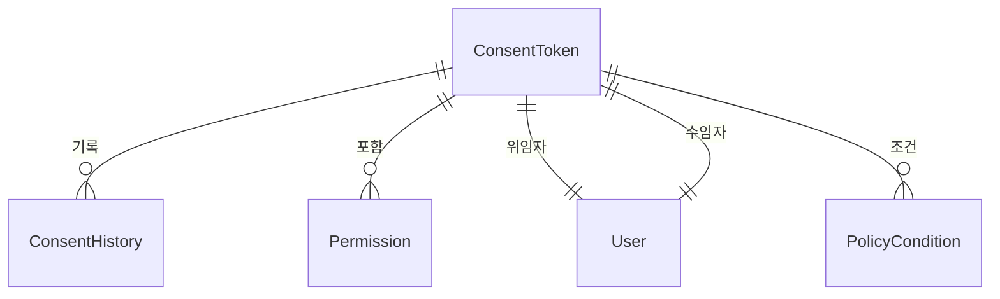
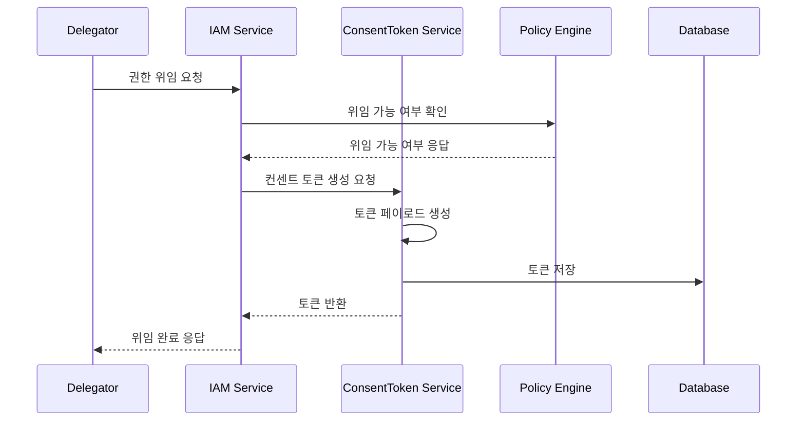

# 컨센트 토큰 기술 명세

## 1. 개요

컨센트 토큰은 사용자의 데이터 접근 권한을 세밀하게 제어하기 위한 메커니즘을 제공합니다. IAM 도메인의 권한 관리 시스템과 통합되어 동적인 권한 위임과 접근 제어를 가능하게 합니다.

### 1.1 주요 기능
1. 세분화된 데이터 접근 권한 제어
2. 시간 제한적 권한 위임
3. 목적 기반 접근 제어
4. 권한 위임 감사 추적
5. 동적 권한 취소

## 2. 토큰 구조

### 2.1 토큰 페이로드
```typescript
interface ConsentTokenPayload {
  jti: string;        // 토큰 고유 ID
  sub: string;        // 사용자 ID
  scope: string[];    // 동의 범위 (IAM 권한 목록)
  purpose: string;    // 동의 목적
  delegator: string;  // 권한 위임자 ID
  delegate: string;   // 권한 수임자 ID
  conditions: PolicyCondition[]; // IAM 정책 조건
  meta: {
    version: string;  // 동의 양식 버전
    locale: string;   // 동의 언어
    platform: string; // 동의한 플랫폼
    context: Record<string, any>; // 추가 컨텍스트
  };
  iat: number;        // 발급 시간
  exp: number;        // 만료 시간
}

interface PolicyCondition {
  type: ConditionType;
  field: string;
  operator: ConditionOperator;
  value: any;
}
```

### 2.2 보안 메커니즘
1. **토큰 서명**: ES256 (ECDSA with SHA-256)
2. **페이로드 암호화**: AES-256-GCM
3. **키 관리**: AWS KMS
4. **권한 검증**: IAM 정책 평가 엔진 통합

## 3. 데이터 모델

### 3.1 엔티티 관계


### 3.2 데이터베이스 스키마
```sql
CREATE TABLE consent_tokens (
  id UUID PRIMARY KEY,
  delegator_id UUID NOT NULL,
  delegate_id UUID NOT NULL,
  scope JSONB NOT NULL,
  purpose VARCHAR(100) NOT NULL,
  conditions JSONB NOT NULL,
  token TEXT NOT NULL,
  issued_at TIMESTAMP NOT NULL,
  expires_at TIMESTAMP NOT NULL,
  metadata JSONB,
  is_revoked BOOLEAN DEFAULT FALSE,
  revocation_reason VARCHAR(200),
  created_at TIMESTAMP NOT NULL DEFAULT CURRENT_TIMESTAMP,
  updated_at TIMESTAMP NOT NULL DEFAULT CURRENT_TIMESTAMP,
  FOREIGN KEY (delegator_id) REFERENCES users(id),
  FOREIGN KEY (delegate_id) REFERENCES users(id)
);

CREATE INDEX idx_consent_tokens_delegator ON consent_tokens(delegator_id);
CREATE INDEX idx_consent_tokens_delegate ON consent_tokens(delegate_id);
CREATE INDEX idx_consent_tokens_token ON consent_tokens(token);
CREATE INDEX idx_consent_tokens_expires_at ON consent_tokens(expires_at);

CREATE TABLE consent_history (
  id UUID PRIMARY KEY,
  consent_token_id UUID NOT NULL,
  action VARCHAR(50) NOT NULL,
  actor_id UUID NOT NULL,
  details JSONB NOT NULL,
  created_at TIMESTAMP NOT NULL DEFAULT CURRENT_TIMESTAMP,
  FOREIGN KEY (consent_token_id) REFERENCES consent_tokens(id)
);

CREATE INDEX idx_consent_history_token_id ON consent_history(consent_token_id);
CREATE INDEX idx_consent_history_created_at ON consent_history(created_at);
```

## 4. 권한 위임 프로세스

### 4.1 위임 흐름


### 4.2 권한 평가 통합
```typescript
@Injectable()
class ConsentTokenEvaluator {
  constructor(
    private readonly policyEngine: PolicyEngine,
    private readonly consentTokenRepository: ConsentTokenRepository,
  ) {}

  async evaluateAccess(
    tokenId: string,
    resource: string,
    action: string,
    context: Record<string, any>
  ): Promise<boolean> {
    const token = await this.consentTokenRepository.findById(tokenId);
    if (!token || token.isRevoked) {
      return false;
    }

    // 1. 기본 검증
    if (!this.validateBasicConstraints(token)) {
      return false;
    }

    // 2. 스코프 검증
    if (!this.validateScope(token, resource, action)) {
      return false;
    }

    // 3. 정책 조건 평가
    return this.policyEngine.evaluateConditions(token.conditions, context);
  }

  private validateBasicConstraints(token: ConsentToken): boolean {
    const now = new Date();
    return token.issuedAt <= now && token.expiresAt > now;
  }

  private validateScope(
    token: ConsentToken,
    resource: string,
    action: string
  ): boolean {
    return token.scope.some(scope => 
      this.matchScope(scope, `${resource}:${action}`)
    );
  }
}
```

## 5. 캐싱 전략

### 5.1 캐시 구조
```typescript
interface ConsentTokenCache {
  tokenId: string;
  delegatorId: string;
  delegateId: string;
  scope: string[];
  conditions: PolicyCondition[];
  isValid: boolean;
  expiresAt: number;
}

// Redis 캐시 키 구조
const CACHE_KEYS = {
  tokenValidation: (tokenId: string) => `consent:validation:${tokenId}`,
  delegatorTokens: (userId: string) => `consent:delegator:${userId}`,
  delegateTokens: (userId: string) => `consent:delegate:${userId}`,
};
```

### 5.2 캐시 관리
1. **TTL 설정**
   - 토큰 검증 결과: 5분
   - 사용자별 토큰 목록: 15분
   - 정책 평가 결과: 10분

2. **캐시 무효화 트리거**
   - 토큰 취소
   - 토큰 만료
   - 권한 변경
   - 정책 수정

## 6. 감사 및 모니터링

### 6.1 감사 로깅
```typescript
interface ConsentAuditEvent {
  eventId: string;
  eventType: ConsentEventType;
  tokenId: string;
  delegatorId: string;
  delegateId: string;
  action: string;
  resource: string;
  decision: boolean;
  context: Record<string, any>;
  timestamp: Date;
}

enum ConsentEventType {
  TOKEN_CREATED = 'TOKEN_CREATED',
  TOKEN_USED = 'TOKEN_USED',
  TOKEN_REVOKED = 'TOKEN_REVOKED',
  ACCESS_DENIED = 'ACCESS_DENIED',
  POLICY_VIOLATED = 'POLICY_VIOLATED'
}
```

### 6.2 모니터링 지표
1. **성능 메트릭**
   - 토큰 생성 처리 시간
   - 권한 평가 응답 시간
   - 캐시 히트율
   - 동시 처리 토큰 수

2. **보안 메트릭**
   - 권한 거부율
   - 비정상 접근 시도
   - 토큰 취소율
   - 정책 위반 횟수

### 6.3 알림 구성
1. 높은 권한 거부율 (>10%)
2. 비정상적인 토큰 생성 패턴
3. 중요 리소스 접근 시도
4. 정책 위반 발생

## 7. 운영 관리

### 7.1 토큰 정리 작업
```typescript
@Injectable()
class ConsentTokenCleanupJob {
  @Cron('0 0 * * * *') // 매시간
  async cleanup() {
    // 만료된 토큰 처리
    await this.handleExpiredTokens();
    
    // 취소된 토큰 정리
    await this.cleanupRevokedTokens();
    
    // 캐시 정리
    await this.cleanupCache();
  }
}
```

### 7.2 통계 수집
```typescript
@Injectable()
class ConsentTokenAnalytics {
  @Cron('0 0 0 * * *') // 매일
  async generateDailyStats() {
    const stats = await this.aggregateStats();
    await this.storeStats(stats);
    await this.notifyStakeholders(stats);
  }
}
```

## 8. 변경 이력

| 버전 | 날짜 | 작성자 | 변경 내용 |
|-----|------|--------|-----------|
| 0.1.0 | 2025-03-17 | bok@weltcorp.com | 최초 작성 |