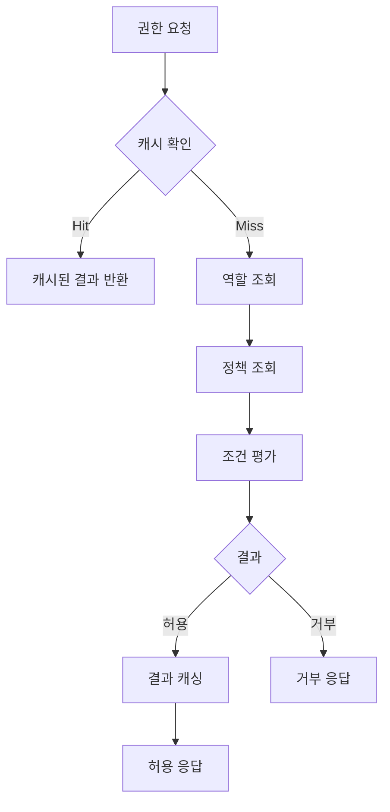

# Permission Evaluation

## 1. 개요
권한 평가 시스템의 기술적 구현에 대한 명세입니다.

## 2. 권한 평가 알고리즘

### 2.1 평가 프로세스


### 2.2 평가 우선순위
1. 명시적 거부 정책
2. 역할 기반 권한
3. 상속된 역할의 권한
4. 기본 거부 (명시적 허용 없을 경우)

### 2.3 조건 평가
```typescript
interface PolicyCondition {
  type: ConditionType;
  parameters: Record<string, any>;
  evaluate(context: EvaluationContext): Promise<boolean>;
}

enum ConditionType {
  TIME_RANGE = 'TIME_RANGE',
  IP_RANGE = 'IP_RANGE',
  RESOURCE_MATCH = 'RESOURCE_MATCH',
  ATTRIBUTE_BASED = 'ATTRIBUTE_BASED'
}
```

## 3. 캐싱 전략

### 3.1 캐시 계층
- L1: 인메모리 캐시 (Node.js 프로세스)
- L2: 분산 캐시 (Redis)

### 3.2 캐시 키 구조
```typescript
interface CacheKey {
  principal: string;    // 사용자/서비스 ID
  resource: string;     // 리소스 식별자
  action: string;      // 수행하려는 동작
  context?: string;    // 선택적 컨텍스트 해시
}

// 예시: user:123:logs:read:context-hash
const cacheKey = `${principal}:${resource}:${action}:${contextHash}`;
```

### 3.3 캐시 무효화 트리거
- 역할 변경 시
- 권한 변경 시
- 정책 변경 시
- 주기적 TTL (15분)

## 4. 성능 최적화

### 4.1 데이터베이스 쿼리
```typescript
@Injectable()
class PermissionRepository {
  async findEffectivePermissions(userId: string): Promise<Permission[]> {
    return this.prisma.permission.findMany({
      where: {
        roles: {
          some: {
            principals: {
              some: {
                id: userId
              }
            }
          }
        }
      },
      include: {
        policies: true
      },
      // 복합 인덱스: role_principals_permissions
      orderBy: {
        priority: 'desc'
      }
    });
  }
}
```

### 4.2 벌크 작업 최적화
```typescript
@Injectable()
class PermissionEvaluationService {
  async evaluateBulk(
    principal: Principal,
    requests: PermissionRequest[]
  ): Promise<PermissionResponse[]> {
    // 1. 권한/역할 정보 일괄 조회
    const [permissions, roles] = await Promise.all([
      this.loadPermissions(principal),
      this.loadRoles(principal)
    ]);

    // 2. 병렬 평가 처리
    return Promise.all(
      requests.map(request =>
        this.evaluateSingle(request, permissions, roles)
      )
    );
  }
}
```

### 4.3 인덱스 전략
```sql
-- 역할-권한 조회 최적화
CREATE INDEX idx_role_permissions ON role_permissions (role_id, permission_id);

-- 주체-역할 조회 최적화
CREATE INDEX idx_principal_roles ON principal_roles (principal_id, role_id);

-- 정책 조회 최적화
CREATE INDEX idx_policy_priority ON policies (priority DESC);
```

## 5. 모니터링

### 5.1 성능 메트릭스
- 평가 응답 시간 (p95, p99)
- 캐시 히트율
- DB 쿼리 실행 시간
- 벌크 작업 처리량

### 5.2 알림 설정
- 평가 응답 시간 > 100ms
- 캐시 히트율 < 80%
- 에러율 > 1%
- 벌크 작업 지연 > 1초

## 6. 에러 처리

### 6.1 에러 유형
```typescript
export class PermissionEvaluationError extends Error {
  constructor(
    public readonly code: PermissionErrorCode,
    public readonly details: Record<string, any>
  ) {
    super(`Permission evaluation failed: ${code}`);
  }
}

export enum PermissionErrorCode {
  INVALID_PRINCIPAL = 'INVALID_PRINCIPAL',
  INVALID_RESOURCE = 'INVALID_RESOURCE',
  POLICY_EVALUATION_FAILED = 'POLICY_EVALUATION_FAILED',
  CACHE_ERROR = 'CACHE_ERROR',
  DATABASE_ERROR = 'DATABASE_ERROR'
}
```

### 6.2 복구 전략
- 캐시 오류: L2 캐시로 페일오버
- DB 오류: 읽기 전용 모드로 전환
- 평가 오류: 보수적 접근 (거부)

## 7. 변경 이력
| 버전 | 날짜 | 작성자 | 변경 내용 |
|-----|------|--------|-----------|
| 0.1.0 | 2025-03-19 | bok@weltcorp.com | 최초 작성 | 