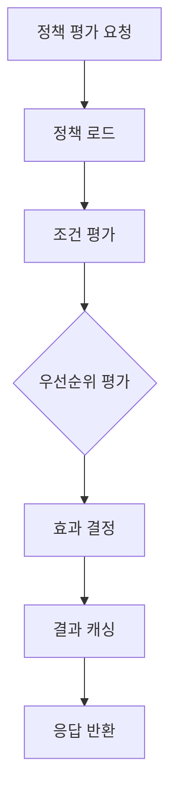

# Policy Enforcement

## 1. 개요
정책 평가 및 적용 시스템의 기술적 구현에 대한 명세입니다.

## 2. 정책 평가 엔진

### 2.1 평가 프로세스


### 2.2 정책 구조
```typescript
interface Policy {
  id: string;
  name: string;
  description: string;
  effect: PolicyEffect;
  priority: number;
  conditions: PolicyCondition[];
  resources: string[];
  actions: string[];
  principals: string[];
  metadata: Record<string, any>;
}

enum PolicyEffect {
  ALLOW = 'ALLOW',
  DENY = 'DENY'
}
```

### 2.3 조건 평가기
```typescript
@Injectable()
class PolicyConditionEvaluator {
  private readonly evaluators = new Map<string, ConditionEvaluator>();

  constructor() {
    this.registerDefaultEvaluators();
  }

  async evaluateConditions(
    conditions: PolicyCondition[],
    context: EvaluationContext
  ): Promise<boolean> {
    for (const condition of conditions) {
      const evaluator = this.evaluators.get(condition.type);
      if (!evaluator) {
        throw new UnknownConditionTypeError(condition.type);
      }

      const result = await evaluator.evaluate(condition, context);
      if (!result) return false;
    }

    return true;
  }

  private registerDefaultEvaluators(): void {
    this.evaluators.set('TimeRange', new TimeRangeEvaluator());
    this.evaluators.set('IPRange', new IPRangeEvaluator());
    this.evaluators.set('ResourceMatch', new ResourceMatchEvaluator());
    this.evaluators.set('AttributeBased', new AttributeBasedEvaluator());
  }
}
```

## 3. 정책 우선순위

### 3.1 우선순위 규칙
1. 명시적 DENY (priority: 1000)
2. 리소스 특정 정책 (priority: 500-999)
3. 역할 기반 정책 (priority: 100-499)
4. 기본 정책 (priority: 1-99)

### 3.2 우선순위 처리
```typescript
@Injectable()
class PolicyPriorityResolver {
  async resolvePolicyDecision(
    policies: Policy[],
    context: EvaluationContext
  ): Promise<PolicyDecision> {
    // 1. 우선순위별 정렬
    const sortedPolicies = this.sortByPriority(policies);
    
    // 2. 명시적 DENY 검사
    const explicitDeny = sortedPolicies.find(
      p => p.effect === PolicyEffect.DENY &&
      p.priority >= 1000
    );
    
    if (explicitDeny) {
      return {
        allowed: false,
        reason: 'EXPLICIT_DENY',
        policy: explicitDeny
      };
    }

    // 3. 순차적 평가
    for (const policy of sortedPolicies) {
      const matches = await this.evaluatePolicy(policy, context);
      if (matches) {
        return {
          allowed: policy.effect === PolicyEffect.ALLOW,
          reason: policy.effect === PolicyEffect.ALLOW ? 'EXPLICIT_ALLOW' : 'DENY',
          policy
        };
      }
    }

    // 4. 기본 거부
    return {
      allowed: false,
      reason: 'NO_MATCHING_POLICY',
      policy: null
    };
  }
}
```

## 4. 정책 조건

### 4.1 시간 기반 조건
```typescript
class TimeRangeEvaluator implements ConditionEvaluator {
  async evaluate(
    condition: PolicyCondition,
    context: EvaluationContext
  ): Promise<boolean> {
    const { start, end, timezone } = condition.parameters;
    const currentTime = context.timestamp || new Date();
    
    return isWithinTimeRange(currentTime, {
      start,
      end,
      timezone
    });
  }
}
```

### 4.2 IP 기반 조건
```typescript
class IPRangeEvaluator implements ConditionEvaluator {
  async evaluate(
    condition: PolicyCondition,
    context: EvaluationContext
  ): Promise<boolean> {
    const { allowedRanges, deniedRanges } = condition.parameters;
    const clientIP = context.clientIP;

    // 명시적 거부 먼저 확인
    if (deniedRanges?.some(range => 
      isIPInRange(clientIP, range)
    )) {
      return false;
    }

    // 허용 범위 확인
    return allowedRanges.some(range =>
      isIPInRange(clientIP, range)
    );
  }
}
```

### 4.3 리소스 매칭 조건
```typescript
class ResourceMatchEvaluator implements ConditionEvaluator {
  async evaluate(
    condition: PolicyCondition,
    context: EvaluationContext
  ): Promise<boolean> {
    const { patterns } = condition.parameters;
    const resource = context.resource;

    return patterns.some(pattern =>
      this.matchResourcePattern(resource, pattern)
    );
  }

  private matchResourcePattern(
    resource: string,
    pattern: string
  ): boolean {
    // 와일드카드 지원
    // 예: "projects/*" matches "projects/123"
    const regex = new RegExp(
      '^' + pattern.replace(/\*/g, '[^/]+') + '$'
    );
    return regex.test(resource);
  }
}
```

## 5. 성능 최적화

### 5.1 캐싱 전략
```typescript
interface PolicyCacheKey {
  principal: string;
  resource: string;
  action: string;
  contextHash: string;
}

@Injectable()
class PolicyDecisionCache {
  constructor(
    private readonly redis: Redis,
    private readonly config: CacheConfig
  ) {}

  async getCachedDecision(
    key: PolicyCacheKey
  ): Promise<PolicyDecision | null> {
    const cacheKey = this.buildKey(key);
    const cached = await this.redis.get(cacheKey);
    return cached ? JSON.parse(cached) : null;
  }

  async cacheDecision(
    key: PolicyCacheKey,
    decision: PolicyDecision
  ): Promise<void> {
    const cacheKey = this.buildKey(key);
    await this.redis.set(
      cacheKey,
      JSON.stringify(decision),
      'EX',
      this.config.ttl
    );
  }
}
```

### 5.2 벌크 평가
```typescript
@Injectable()
class BulkPolicyEvaluator {
  async evaluateBulk(
    requests: PolicyEvaluationRequest[]
  ): Promise<PolicyDecision[]> {
    // 1. 캐시 확인
    const [cached, uncached] = await this.partitionCached(requests);

    // 2. 미캐시 요청 평가
    const evaluated = await Promise.all(
      uncached.map(req => this.evaluatePolicy(req))
    );

    // 3. 결과 병합
    return this.mergeResults(cached, evaluated);
  }
}
```

## 6. 모니터링

### 6.1 메트릭스
- 정책 평가 응답 시간 (p95, p99)
- 정책별 평가 횟수
- 조건별 평가 시간
- 캐시 히트율

### 6.2 알림 설정
- 평가 시간 > 50ms
- 캐시 히트율 < 90%
- 평가 실패율 > 0.1%
- 동시 평가 요청 > 1000/s

## 7. 감사 로깅

> **참고**: 모든 로깅은 [공통 로깅 표준](/docs/infrastructure/logging-standards.md)을 준수해야 합니다. 여기서는 정책 평가와 관련된 주요 로깅 정보만 정의합니다.

### 7.1 주요 로깅 이벤트
```typescript
// 정책 평가
logger.info({
  event: 'POLICY_EVALUATED',
  request_id: string,
  principal: string,
  resource: string,
  action: string,
  decision: 'ALLOW' | 'DENY' | 'ERROR',
  evaluated_policies: string[],
  evaluation_time_ms: number,
  metadata: {
    context_attributes: Record<string, any>
  }
});

// 정책 평가 오류
logger.error({
  event: 'POLICY_EVALUATION_ERROR',
  request_id: string,
  principal: string,
  resource: string,
  action: string,
  error: {
    code: string,
    message: string,
    details: any
  },
  metadata: {
    context_attributes: Record<string, any>
  }
});

// 정책 평가 거부
logger.warn({
  event: 'POLICY_EVALUATION_DENIED',
  request_id: string,
  principal: string,
  resource: string,
  action: string,
  reason: string,
  policy_id: string,
  metadata: {
    context_attributes: Record<string, any>
  }
});
```

### 7.2 로그 저장
```typescript
@Injectable()
class PolicyEvaluationLogger {
  constructor(
    private readonly logger: LoggerService,
    private readonly auditService: AuditService,
  ) {}

  async logEvaluation(evaluationResult: PolicyEvaluationResult): void {
    // 로깅 표준에 맞게 정보 기록
    this.logger.info({
      event: 'POLICY_EVALUATED',
      request_id: evaluationResult.requestId,
      principal: evaluationResult.principal,
      resource: evaluationResult.resource,
      action: evaluationResult.action,
      decision: evaluationResult.decision,
      evaluated_policies: evaluationResult.evaluatedPolicies,
      evaluation_time_ms: evaluationResult.evaluationTime,
      metadata: {
        context_attributes: evaluationResult.context
      }
    });

    // 감사 서비스로 이벤트 전송
    await this.auditService.send({
      domain: 'IAM',
      component: 'PolicyEnforcement',
      action: 'EVALUATE',
      resource_id: evaluationResult.resource,
      actor_id: evaluationResult.principal,
      result: evaluationResult.decision,
      metadata: {
        policies: evaluationResult.evaluatedPolicies,
        context: evaluationResult.context,
        request_id: evaluationResult.requestId
      }
    });
  }
}
```

## 8. 변경 이력
| 버전 | 날짜 | 작성자 | 변경 내용 |
|-----|------|--------|-----------|
| 0.1.0 | 2025-03-19 | bok@weltcorp.com | 최초 작성 | 
| 0.2.0 | 2025-03-20 | bok@weltcorp.com | 공통 로깅 표준 참조로 변경 | 