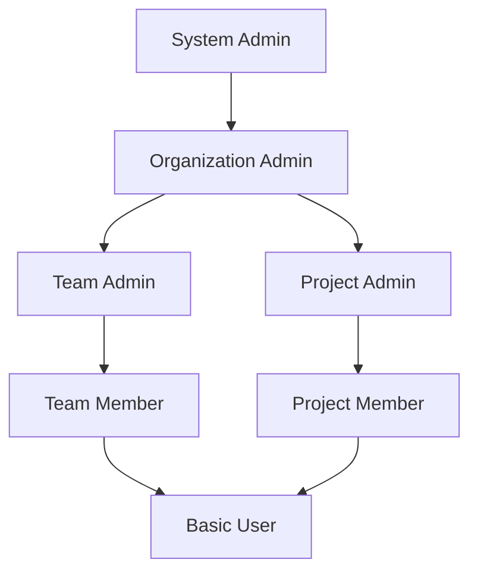

# Role Management

## 1. 개요
역할 관리 시스템의 기술적 구현에 대한 명세입니다.

## 2. 역할 계층 구조

### 2.1 계층 모델


### 2.2 상속 규칙
```typescript
interface RoleHierarchy {
  roleId: string;
  parentRoleId: string | null;
  inheritedPermissions: boolean;  // 권한 상속 여부
  depth: number;                  // 계층 깊이
  path: string[];                // 상속 경로
}

// 예시: /system-admin/org-admin/team-admin
const rolePath = role.path.join('/');
```

### 2.3 순환 참조 방지
```typescript
@Injectable()
class RoleHierarchyValidator {
  validate(roleId: string, parentRoleId: string): boolean {
    // 1. 직접 순환 체크
    if (roleId === parentRoleId) {
      return false;
    }

    // 2. 간접 순환 체크
    const parentPath = await this.getRolePath(parentRoleId);
    return !parentPath.includes(roleId);
  }

  private async getRolePath(roleId: string): string[] {
    const role = await this.prisma.role.findUnique({
      where: { id: roleId },
      include: { parent: true }
    });
    
    return role.parent 
      ? [...await this.getRolePath(role.parent.id), roleId]
      : [roleId];
  }
}
```

## 3. 역할 동기화

### 3.1 동기화 전략
```typescript
@Injectable()
class RoleSyncService {
  constructor(
    private readonly prisma: PrismaService,
    private readonly eventEmitter: EventEmitter2,
    private readonly cacheManager: CacheManager
  ) {}

  async syncRoleHierarchy(roleId: string): Promise<void> {
    // 1. 락 획득
    const lock = await this.lockManager.acquire(`role-sync:${roleId}`);
    
    try {
      // 2. 현재 상태 조회
      const role = await this.prisma.role.findUnique({
        where: { id: roleId },
        include: {
          permissions: true,
          childRoles: true
        }
      });

      // 3. 하위 역할 동기화
      await this.syncChildRoles(role);

      // 4. 캐시 무효화
      await this.invalidateRoleCache(roleId);

      // 5. 이벤트 발행
      this.eventEmitter.emit('role.hierarchy.synced', {
        roleId,
        timestamp: new Date()
      });
    } finally {
      // 6. 락 해제
      await lock.release();
    }
  }
}
```

### 3.2 캐시 무효화
```typescript
interface RoleCacheKey {
  type: 'permissions' | 'hierarchy' | 'members';
  roleId: string;
}

class RoleCacheManager {
  private readonly keyPrefix = 'role:';
  private readonly ttl = 900; // 15분

  async invalidateRoleCache(roleId: string): Promise<void> {
    const patterns = [
      `${this.keyPrefix}permissions:${roleId}:*`,
      `${this.keyPrefix}hierarchy:${roleId}:*`,
      `${this.keyPrefix}members:${roleId}:*`
    ];

    await Promise.all(
      patterns.map(pattern => this.cacheManager.del(pattern))
    );
  }
}
```

## 4. 역할 할당

### 4.1 할당 규칙
```typescript
interface RoleAssignment {
  principalId: string;
  roleId: string;
  assignerId: string;
  expiresAt?: Date;
  constraints?: RoleConstraint[];
}

interface RoleConstraint {
  type: 'TimeRange' | 'IPRange' | 'ResourceScope';
  parameters: Record<string, any>;
}
```

### 4.2 할당 검증
```typescript
@Injectable()
class RoleAssignmentValidator {
  async validate(
    assignment: RoleAssignment
  ): Promise<ValidationResult> {
    // 1. 할당자 권한 검증
    const canAssign = await this.checkAssignerPermission(
      assignment.assignerId,
      assignment.roleId
    );
    
    if (!canAssign) {
      return {
        isValid: false,
        error: 'INSUFFICIENT_PERMISSION'
      };
    }

    // 2. 제약조건 검증
    const constraintsValid = this.validateConstraints(
      assignment.constraints
    );
    
    if (!constraintsValid) {
      return {
        isValid: false,
        error: 'INVALID_CONSTRAINTS'
      };
    }

    return { isValid: true };
  }
}
```

## 5. 성능 최적화

### 5.1 데이터베이스 인덱스
```sql
-- 역할 계층 조회 최적화
CREATE INDEX idx_role_hierarchy ON roles (parent_role_id);

-- 역할 할당 조회 최적화
CREATE INDEX idx_role_assignments ON role_assignments (principal_id, role_id);

-- 만료된 할당 조회 최적화
CREATE INDEX idx_role_assignment_expiry ON role_assignments (expires_at)
WHERE expires_at IS NOT NULL;
```

### 5.2 벌크 작업
```typescript
@Injectable()
class RoleBulkOperationService {
  async assignRolesToPrincipals(
    assignments: RoleAssignment[]
  ): Promise<BulkOperationResult> {
    // 1. 검증
    const validations = await Promise.all(
      assignments.map(a => this.validator.validate(a))
    );

    // 2. 트랜잭션으로 일괄 처리
    return this.prisma.$transaction(async (tx) => {
      const results = await Promise.all(
        assignments
          .filter((_, i) => validations[i].isValid)
          .map(assignment =>
            tx.roleAssignment.create({
              data: this.mapToEntity(assignment)
            })
          )
      );

      return this.mapToBulkResult(results, validations);
    });
  }
}
```

## 6. 모니터링

### 6.1 메트릭스
- 역할별 할당된 사용자 수
- 역할 계층 깊이
- 역할 동기화 소요 시간
- 캐시 히트율

### 6.2 알림 설정
- 역할 계층 깊이 > 10
- 동기화 시간 > 5초
- 할당 실패율 > 1%
- 캐시 히트율 < 85%

## 7. 감사 로깅

> **참고**: 모든 로깅은 [공통 로깅 표준](/docs/infrastructure/logging-standards.md)을 준수해야 합니다. 여기서는 역할 관리와 관련된 주요 로깅 정보만 정의합니다.

### 7.1 주요 로깅 이벤트
```typescript
// 역할 할당
logger.info({
  event: 'ROLE_ASSIGNED',
  role_id: string,
  principal_id: string,
  assigner_id: string,
  metadata: {
    organization_id: string,
    expiration_date: string // ISO 날짜 형식 (있는 경우)
  }
});

// 역할 회수
logger.info({
  event: 'ROLE_REVOKED',
  role_id: string,
  principal_id: string,
  revoke_id: string,
  reason: string,
  metadata: {
    organization_id: string
  }
});

// 역할 수정
logger.info({
  event: 'ROLE_MODIFIED',
  role_id: string,
  modifier_id: string,
  changes: {
    // 변경된 필드와 값
  }
});
```

### 7.2 로그 저장
```typescript
@Injectable()
class RoleAuditLogger {
  constructor(
    private readonly logger: LoggerService,
    private readonly auditService: AuditService,
  ) {}

  async logAssignment(
    roleId: string, 
    principalId: string, 
    assignerId: string, 
    metadata: Record<string, any>
  ): void {
    // 로깅 표준에 맞게 정보 기록
    this.logger.info({
      event: 'ROLE_ASSIGNED',
      role_id: roleId,
      principal_id: principalId,
      assigner_id: assignerId,
      metadata
    });

    // 감사 서비스로 이벤트 전송
    await this.auditService.send({
      domain: 'IAM',
      component: 'RoleManagement',
      action: 'ASSIGN',
      resource_id: roleId,
      actor_id: assignerId,
      target_id: principalId,
      metadata
    });
  }
}
```

## 8. 변경 이력
| 버전 | 날짜 | 작성자 | 변경 내용 |
|-----|------|--------|-----------|
| 0.1.0 | 2025-03-19 | bok@weltcorp.com | 최초 작성 | 
| 0.2.0 | 2025-03-20 | bok@weltcorp.com | 공통 로깅 표준 참조로 변경 |