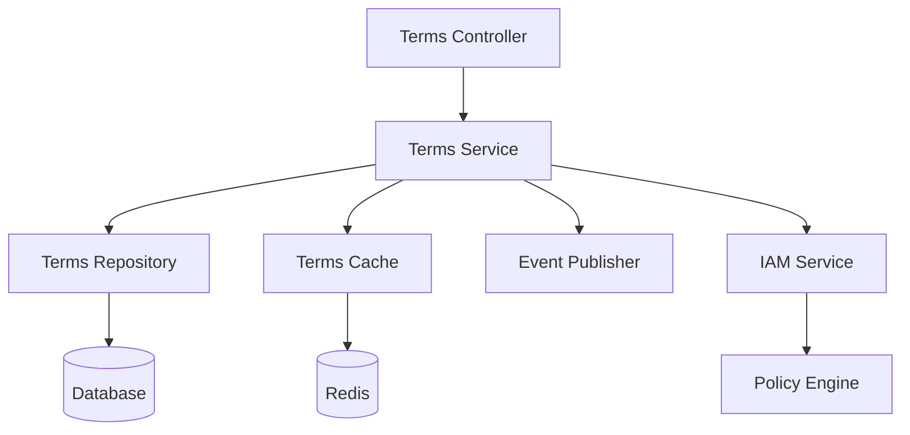

# 약관 관리 기술 명세서

## 1. 개요
약관 관리 시스템은 IAM 도메인의 일부로서, 서비스의 약관을 관리하고 사용자의 약관 동의를 처리하는 기능을 제공합니다. 약관 동의는 권한 관리와 통합되어 사용자의 접근 권한을 제어하는 데 활용됩니다.

### 1.1 주요 기능
1. 약관 버전 관리
2. 약관 동의 처리
3. 권한 연계 관리
4. 동의 이력 추적
5. 약관 정책 관리

## 2. 시스템 아키텍처

### 2.1 컴포넌트 구조


### 2.2 데이터 모델
```typescript
interface Term {
  id: string;
  version: string;        // Semantic Versioning
  type: TermType;
  title: string;
  content: string;
  isRequired: boolean;
  status: TermStatus;
  validFrom: Date;
  validUntil: Date;
  requiredPermissions: Permission[];
  metadata: Record<string, any>;
  createdAt: Date;
  updatedAt: Date;
}

interface TermAgreement {
  id: string;
  userId: string;
  termId: string;
  version: string;
  isAgreed: boolean;
  agreedAt: Date;
  revokedAt?: Date;
  metadata: {
    deviceInfo: DeviceInfo;
    ipAddress: string;
    userAgent: string;
    locale: string;
  };
  createdAt: Date;
  updatedAt: Date;
}

enum TermType {
  SERVICE = 'SERVICE',           // 서비스 이용약관
  PRIVACY = 'PRIVACY',          // 개인정보 처리방침
  MARKETING = 'MARKETING',      // 마케팅 정보 수신
  DATA_ANALYSIS = 'DATA_ANALYSIS', // 데이터 분석 동의
  THIRD_PARTY = 'THIRD_PARTY'   // 제3자 제공 동의
}

enum TermStatus {
  DRAFT = 'DRAFT',         // 초안
  ACTIVE = 'ACTIVE',       // 활성
  INACTIVE = 'INACTIVE',   // 비활성
  EXPIRED = 'EXPIRED'      // 만료
}
```

### 2.3 데이터베이스 스키마
```sql
CREATE TABLE terms (
  id UUID PRIMARY KEY,
  version VARCHAR(20) NOT NULL,
  type term_type NOT NULL,
  title TEXT NOT NULL,
  content TEXT NOT NULL,
  is_required BOOLEAN NOT NULL DEFAULT FALSE,
  status term_status NOT NULL,
  valid_from TIMESTAMP NOT NULL,
  valid_until TIMESTAMP,
  required_permissions JSONB,
  metadata JSONB,
  created_at TIMESTAMP NOT NULL DEFAULT CURRENT_TIMESTAMP,
  updated_at TIMESTAMP NOT NULL DEFAULT CURRENT_TIMESTAMP
);

CREATE TABLE term_agreements (
  id UUID PRIMARY KEY,
  user_id UUID NOT NULL,
  term_id UUID NOT NULL,
  version VARCHAR(20) NOT NULL,
  is_agreed BOOLEAN NOT NULL,
  agreed_at TIMESTAMP NOT NULL,
  revoked_at TIMESTAMP,
  metadata JSONB,
  created_at TIMESTAMP NOT NULL DEFAULT CURRENT_TIMESTAMP,
  updated_at TIMESTAMP NOT NULL DEFAULT CURRENT_TIMESTAMP,
  FOREIGN KEY (user_id) REFERENCES users(id),
  FOREIGN KEY (term_id) REFERENCES terms(id)
);

CREATE INDEX idx_terms_type_status ON terms(type, status);
CREATE INDEX idx_terms_valid_from ON terms(valid_from);
CREATE INDEX idx_term_agreements_user ON term_agreements(user_id);
CREATE INDEX idx_term_agreements_term ON term_agreements(term_id);
```

## 3. 권한 연계 관리

### 3.1 약관-권한 매핑
```typescript
@Injectable()
class TermPermissionManager {
  constructor(
    private readonly policyEngine: PolicyEngine,
    private readonly termRepository: TermRepository,
    private readonly iamService: IAMService,
  ) {}

  async evaluateTermPermissions(
    userId: string,
    termId: string
  ): Promise<boolean> {
    const term = await this.termRepository.findById(termId);
    if (!term.requiredPermissions?.length) {
      return true;
    }

    return this.policyEngine.evaluatePermissions(
      userId,
      term.requiredPermissions
    );
  }

  async updateUserPermissions(
    userId: string,
    termAgreement: TermAgreement
  ): Promise<void> {
    const term = await this.termRepository.findById(termAgreement.termId);
    
    if (termAgreement.isAgreed) {
      await this.grantTermPermissions(userId, term);
    } else {
      await this.revokeTermPermissions(userId, term);
    }
  }
}
```

### 3.2 동의 기반 권한 제어
```typescript
@Injectable()
class TermBasedAccessControl {
  async validateAccess(
    userId: string,
    resource: string,
    action: string
  ): Promise<boolean> {
    // 1. 리소스에 필요한 약관 조회
    const requiredTerms = await this.getRequiredTerms(resource, action);
    
    // 2. 사용자의 약관 동의 상태 확인
    const agreements = await this.getTermAgreements(userId, requiredTerms);
    
    // 3. 필수 약관 동의 여부 검증
    return this.validateRequiredAgreements(agreements, requiredTerms);
  }

  private async validateRequiredAgreements(
    agreements: TermAgreement[],
    requiredTerms: Term[]
  ): Promise<boolean> {
    return requiredTerms.every(term => 
      agreements.some(agreement => 
        agreement.termId === term.id &&
        agreement.isAgreed &&
        !agreement.revokedAt
      )
    );
  }
}
```

## 4. 약관 버전 관리

### 4.1 버전 관리 전략
```typescript
@Injectable()
class TermVersionManager {
  async createNewVersion(term: CreateTermDto): Promise<Term> {
    // 1. 버전 유효성 검증
    this.validateVersion(term.version);
    
    // 2. 기존 버전 처리
    await this.handleExistingVersions(term.type);
    
    // 3. 새 버전 생성
    const newTerm = await this.termRepository.create({
      ...term,
      status: TermStatus.DRAFT,
      validFrom: new Date(),
    });
    
    // 4. 이벤트 발행
    await this.eventEmitter.emit('term.version.created', {
      termId: newTerm.id,
      version: newTerm.version,
      type: newTerm.type,
    });
    
    return newTerm;
  }

  async activateVersion(termId: string): Promise<void> {
    const term = await this.termRepository.findById(termId);
    
    // 1. 기존 활성 버전 비활성화
    await this.deactivateExistingVersions(term.type);
    
    // 2. 새 버전 활성화
    await this.termRepository.update(termId, {
      status: TermStatus.ACTIVE,
      validFrom: new Date(),
    });
    
    // 3. 캐시 갱신
    await this.cacheManager.invalidatePattern(`term:${term.type}:*`);
  }
}
```

## 5. 감사 및 컴플라이언스

### 5.1 감사 로깅
```typescript
interface TermAuditEvent {
  eventId: string;
  eventType: TermEventType;
  termId: string;
  userId?: string;
  action: string;
  metadata: {
    version: string;
    type: TermType;
    deviceInfo?: DeviceInfo;
    ipAddress?: string;
  };
  timestamp: Date;
}

enum TermEventType {
  TERM_CREATED = 'TERM_CREATED',
  TERM_UPDATED = 'TERM_UPDATED',
  TERM_ACTIVATED = 'TERM_ACTIVATED',
  TERM_DEACTIVATED = 'TERM_DEACTIVATED',
  AGREEMENT_CREATED = 'AGREEMENT_CREATED',
  AGREEMENT_REVOKED = 'AGREEMENT_REVOKED'
}
```

### 5.2 컴플라이언스 보고
```typescript
@Injectable()
class TermComplianceReporter {
  async generateComplianceReport(
    params: ComplianceReportParams
  ): Promise<ComplianceReport> {
    const report = {
      summary: await this.generateSummary(params),
      details: await this.generateDetails(params),
      statistics: await this.generateStatistics(params),
      recommendations: await this.generateRecommendations(params),
    };

    await this.storeReport(report);
    return report;
  }

  private async generateSummary(
    params: ComplianceReportParams
  ): Promise<ComplianceSummary> {
    return {
      totalUsers: await this.getUserCount(),
      agreementRates: await this.calculateAgreementRates(),
      requiredTermsCompliance: await this.checkRequiredTermsCompliance(),
      recentChanges: await this.getRecentTermChanges(),
    };
  }
}
```

## 6. 성능 최적화

### 6.1 캐싱 전략
1. **약관 캐싱**
   - 활성 약관 전체 캐싱 (TTL: 1시간)
   - 버전별, 언어별 캐싱
   - 캐시 무효화 이벤트 기반 갱신

2. **동의 상태 캐싱**
   - 사용자별 필수 약관 동의 상태 캐싱 (TTL: 15분)
   - 권한 검증 결과 캐싱 (TTL: 5분)

### 6.2 성능 모니터링
1. **주요 메트릭**
   - 약관 조회 응답 시간
   - 동의 처리 시간
   - 권한 검증 시간
   - 캐시 히트율

2. **알림 설정**
   - 응답 시간 > 100ms
   - 캐시 히트율 < 80%
   - 오류율 > 1%
   - 동의 실패율 > 5%

## 7. 변경 이력

| 버전 | 날짜 | 작성자 | 변경 내용 |
|-----|------|--------|-----------|
| 0.1.0 | 2025-03-16 | bok@weltcorp.com | 최초 작성 |
| 0.2.0 | 2025-03-19 | bok@weltcorp.com | IAM 도메인 통합 및 권한 연계 기능 추가 | 