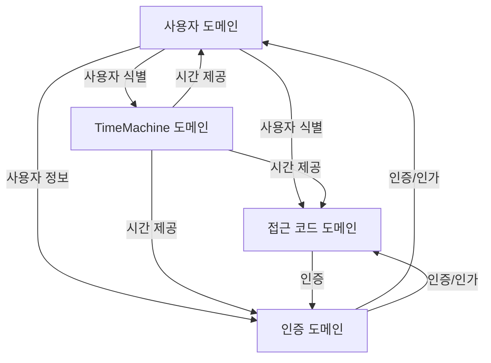

# 도메인 모델 개요

## 도메인 구조

현재 시스템은 다음과 같은 주요 도메인으로 구성되어 있습니다:

### 1. 사용자 도메인 (User Domain)
사용자 관리, 권한 관리를 담당하는 핵심 도메인입니다.

#### 주요 개념
- 사용자 (User)
- 권한 (Authorization)
- 계정 생명주기 (Account Lifecycle)
- 사용자 주기 (User Cycle)
- 프로필 (Profile)

#### 책임
- 사용자 정보 관리
- 계정 상태 관리
- 사용자 주기 관리
- 사용자 프로필 관리

#### 관련 문서
- [사용자 도메인 개요](./user/overview.md)
- [사용자 도메인 모델](./user/domain-model.md)
- [사용자 바운디드 컨텍스트](./user/bounded-context.md)
- [사용자 비즈니스 규칙](./user/business-rules.md)

### 2. 인증 도메인 (Auth Domain)
사용자 인증, 인가, 토큰 관리 및 동의 기반 권한 위임을 담당하는 핵심 도메인입니다.

#### 주요 개념
- 토큰 (Token)
- 인증 (Authentication)
- 인가 (Authorization)
- 키 관리 (Key Management)
- 컨센트 토큰 (Consent Token)
- 앱 토큰 (App Token)

#### 책임
- 토큰 발급 및 검증
- 사용자 인증 및 인가
- 키 관리 및 로테이션
- 동의 기반 권한 위임
- 앱 인증 관리

#### 관련 문서
- [인증 도메인 개요](./auth/overview.md)
- [인증 도메인 모델](./auth/domain-model.md)
- [인증 바운디드 컨텍스트](./auth/bounded-context.md)
- [인증 비즈니스 규칙](./auth/business-rules.md)
- [인증 기술 명세](./auth/technical-spec/authentication.md)
- [앱 토큰 기술 명세](./auth/technical-spec/app-token.md)

### 3. 시간 도메인 (TimeMachine Domain)
시스템 전체의 시간을 중앙에서 관리하는 핵심 인프라 도메인입니다.

#### 주요 개념
- TimeMachine
- TimeContext (사용자/디바이스별 시간)
- TimeOffset (시간 오프셋)
- 시간 동기화

#### 책임
- 중앙 집중식 시간 관리
- 사용자별 시간 관리
- 시간 설정 및 조회
- 시간대(Timezone) 처리
- 시스템 시간 오버라이드

#### 관련 문서
- [시간 도메인 개요](./time-machine/overview.md)
- [시간 도메인 모델](./time-machine/domain-model.md)
- [시간 바운디드 컨텍스트](./time-machine/bounded-context.md)
- [시간 기술 명세](./time-machine/technical-spec/time-management.md)

### 4. 접근 코드 도메인 (Access Code Domain)
사용자 인증을 위한 접근 코드 관리를 담당하는 도메인입니다.

#### 주요 개념
- AccessCode (접근 코드)
- TreatmentPeriod (치료 기간)
- CodeStatus (코드 상태)
- TimeMachineOptions (시간 제어 옵션)

#### 책임
- 접근 코드 생성 및 관리
- 코드 유효성 검증
- 만료 처리
- 이메일 전송 관리
- GDPR 준수

#### 관련 문서
- [접근 코드 도메인 개요](./access-code/overview.md)
- [접근 코드 도메인 모델](./access-code/domain-model.md)
- [접근 코드 바운디드 컨텍스트](./access-code/bounded-context.md)
- [접근 코드 비즈니스 규칙](./access-code/business-rules.md)

## 도메인 간 관계

## 도메인 규칙

### 공통 규칙
1. 모든 도메인은 명확한 경계를 가져야 함
2. 도메인 간 통신은 정의된 인터페이스를 통해서만 이루어져야 함
3. 각 도메인은 자체적인 데이터 모델을 가짐
4. 모든 시간 관련 처리는 TimeMachine을 통해 수행

### 사용자 도메인 규칙
1. 모든 사용자는 고유한 식별자를 가져야 함
2. 권한은 역할 기반으로 관리되어야 함
3. 사용자 주기는 명확한 상태 전이를 가져야 함

### 인증 도메인 규칙
1. 모든 토큰은 JWT 형식을 사용해야 함
2. 토큰 서명에는 RSA 키를 사용해야 함
3. 키는 주기적으로 로테이션되어야 함
4. 앱 토큰은 모든 API 호출에 필요함
5. 컨센트 토큰은 암호화되어 저장되어야 함

### TimeMachine 도메인 규칙
1. 시스템 시간 직접 사용 금지 (new Date(), Date.now() 등)
2. 모든 시간 조회는 TimeMachine 서비스를 통해 수행
3. 시간은 사용자/디바이스별로 독립적으로 관리 가능
4. 외부 라이브러리의 시간 의존성도 TimeMachine으로 오버라이드

### 접근 코드 도메인 규칙
1. 모든 접근 코드는 고유해야 함
2. 코드는 지정된 기간 동안만 유효
3. 사용된 코드는 재사용 불가
4. 만료된 코드는 자동으로 처리
5. GDPR 관련 개인정보는 적절히 관리

## 성능 요구사항

### 인증 도메인
- 토큰 발급: p95 < 100ms
- 토큰 검증: p95 < 50ms
- 동시 처리: 100 TPS 이상
- 컨센트 토큰 검증: p95 < 30ms

### TimeMachine 도메인
- API 응답 시간: p95 < 100ms
- 시간 정확도: ±1초 이내
- 동시 요청 처리: 100 TPS

### 접근 코드 도메인
- 코드 생성: p95 < 200ms
- 검증 응답: p95 < 100ms
- 일괄 처리: 초당 50건 이상

## 모니터링 요구사항

### 인증 도메인
- 토큰 발급/검증 성공률
- 키 로테이션 상태
- 토큰 만료/폐기 비율
- 비정상 패턴 탐지

### TimeMachine 도메인
- 시간 동기화 상태
- 시간 지연/편차
- API 응답 시간
- 에러 발생 빈도

### 접근 코드 도메인
- 코드 생성/사용/만료 비율
- 이메일 전송 성공률
- API 응답 시간
- 에러 발생 빈도

## 확장 계획

### 단기 계획 (2024 Q2)
1. 사용자 도메인
   - 다중 역할 지원
   - 사용자 주기 관리 개선
   - 프로필 관리 기능 강화

2. 인증 도메인
   - OAuth 인증 추가
   - OAuth2.0 통합
   - MFA (Multi-Factor Authentication) 지원
   - 키 관리 자동화 개선
   - 컨센트 토큰 관리 고도화

3. TimeMachine 도메인
   - 시간대(Timezone) 지원 강화
   - 배치 작업 시간 제어 기능
   - 분산 환경 동기화 개선

4. 접근 코드 도메인
   - 대량 코드 생성 최적화
   - 이메일 전송 시스템 개선
   - GDPR 컴플라이언스 강화

### 장기 계획 (2024 Q3-Q4)
1. 인증 도메인
   - FIDO2 지원
   - 생체 인증 통합
   - Zero Trust 아키텍처 적용
   - 동의 관리 대시보드 구축
2. 알림 도메인 추가
3. 결제 도메인 추가
4. 통계 도메인 추가
5. 감사(Audit) 도메인 추가

## API 문서 참조
각 도메인의 API 문서는 다음 링크에서 확인할 수 있습니다:

- [사용자 API 문서](../api/user/)
- [인증 API 문서](../api/auth/)
- [시간 API 문서](../api/time-machine/)
- [접근 코드 API 문서](../api/access-code/)

## 변경 이력
| 버전 | 날짜 | 작성자 | 변경 내용 |
|------|------|--------|-----------|
| 0.1.0 | 2025-03-16 | bok@weltcorp.com | 최초 작성 |
| 0.2.0 | 2025-03-17 | bok@weltcorp.com | Auth 도메인 추가 |
| 0.2.1 | 2025-03-17 | bok@weltcorp.com | 도메인 문서 링크 추가 |