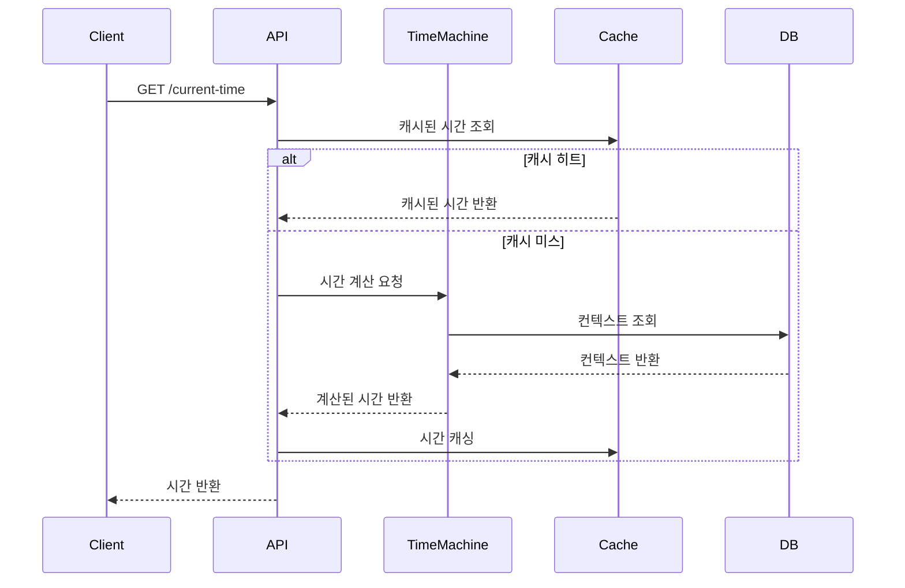
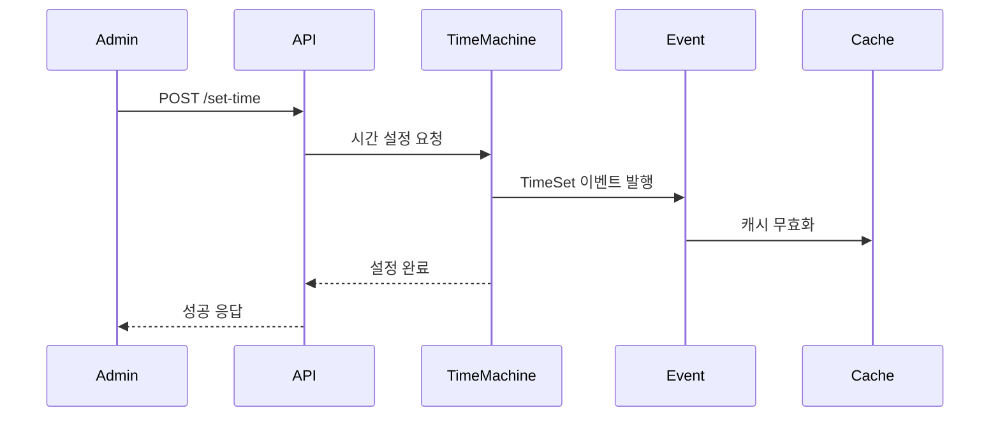

# TimeMachine 도메인 API 명세

## 1. 개요
TimeMachine API는 시스템 전반에서 사용되는 시간을 중앙에서 관리하고 제어하기 위한 인터페이스를 제공합니다.

## 2. 공통 사항

### 2.1 기본 URL
```
https://api.example.com/v1/time-machine
```

### 2.2 공통 응답 형식
```typescript
interface SuccessResponse<T> {
  status: number;
  data: T;
}

interface ErrorResponse {
  status: number;
  code: number;
  message: string;
  detail?: string;
}
```

### 2.3 인증
모든 관리자 API는 JWT 토큰 인증이 필요합니다:
```
Authorization: Bearer {token}
```

## 3. API 엔드포인트

### 3.1 현재 시간 조회 API

#### 요청 (Request)
```http
GET /v1/time-machine/current-time
Content-Type: application/json
```

Query Parameters:
```typescript
{
  userId?: number;        // 사용자 ID (로그인 사용자)
  deviceId?: string;      // 디바이스 ID (비로그인 사용자)
  timezone?: string;      // 시간대 (예: 'Asia/Seoul')
}
```

#### 응답 (Response)
```json
{
  "status": 200,
  "data": {
    "currentTime": "2024-03-20T09:00:00.000Z",
    "timezone": "Asia/Seoul",
    "offset": 32400000
  }
}
```

### 3.2 시간 설정 API

#### 요청 (Request)
```http
POST /v1/time-machine/set-time
Content-Type: application/json
Authorization: Bearer {admin_token}
```

```json
{
  "userId": 123,
  "targetTime": "2024-03-20T09:00:00.000Z",
  "offsetMs": 3600000,
  "reason": "테스트 목적"
}
```

#### 응답 (Response)
```json
{
  "status": 200,
  "data": {
    "appliedTime": "2024-03-20T09:00:00.000Z",
    "offset": 3600000,
    "userId": 123
  }
}
```

### 3.3 시간 컨텍스트 조회 API

#### 요청 (Request)
```http
GET /v1/time-machine/context/{userId}
Content-Type: application/json
Authorization: Bearer {admin_token}
```

#### 응답 (Response)
```json
{
  "status": 200,
  "data": {
    "userId": 123,
    "baseTime": "2024-03-20T09:00:00.000Z",
    "offset": 3600000,
    "timezone": "Asia/Seoul",
    "lastModified": "2024-03-20T08:00:00.000Z"
  }
}
```

### 3.4 배치 작업 시간 설정 API

#### 요청 (Request)
```http
POST /v1/time-machine/batch-time
Content-Type: application/json
Authorization: Bearer {admin_token}
```

```json
{
  "batchId": "BATCH_001",
  "targetTime": "2024-03-20T09:00:00.000Z",
  "duration": 3600000,
  "description": "일괄 처리 작업"
}
```

#### 응답 (Response)
```json
{
  "status": 200,
  "data": {
    "batchId": "BATCH_001",
    "startTime": "2024-03-20T09:00:00.000Z",
    "endTime": "2024-03-20T10:00:00.000Z",
    "status": "ACTIVE"
  }
}
```

## 4. 에러 코드

### 4.1 도메인 에러 코드
```typescript
enum TimeMachineErrorCode {
  // 컨트롤러 레이어 (1001-1099)
  INVALID_REQUEST = 1001,
  UNAUTHORIZED = 1002,
  INSUFFICIENT_PERMISSIONS = 1003,
  
  // 서비스 레이어 (1101-1199)
  INVALID_TIME = 1101,
  CONTEXT_NOT_FOUND = 1102,
  TIME_SYNC_FAILED = 1103,
  INVALID_OFFSET = 1104,
  
  // 리포지토리 레이어 (1201-1299)
  DATABASE_ERROR = 1201,
  CACHE_ERROR = 1202
}
```

### 4.2 에러 응답 예시
```json
{
  "status": 400,
  "code": 1101,
  "message": "INVALID_TIME",
  "detail": "설정하려는 시간이 유효하지 않습니다."
}
```

## 5. 도메인 이벤트

### 5.1 이벤트 목록
| 이벤트 이름 | 설명 | 구독자 |
|------------|------|--------|
| TimeSet | 시간 설정 완료 | Monitoring Service |
| TimeContextChanged | 컨텍스트 변경 | Cache Service |
| TimeSyncRequired | 동기화 필요 | Sync Service |

### 5.2 이벤트 페이로드 예시
```typescript
interface TimeSetEvent {
  userId: number;
  oldTime: Date;
  newTime: Date;
  reason: string;
}

interface TimeContextChangedEvent {
  userId: number;
  contextId: string;
  changes: {
    offset?: number;
    timezone?: string;
  };
}
```

## 6. API 사용 흐름

### 6.1 시간 조회 흐름


### 6.2 시간 설정 흐름


## 7. 모니터링 및 알림

### 7.1 모니터링 지표
- 시간 조회 응답 시간
- 캐시 히트율
- 시간 설정 빈도
- 에러 발생 횟수

### 7.2 알림 설정
- 응답 시간 임계치 초과
- 동기화 실패
- 비정상적인 시간 설정 시도

## 변경 이력

| 버전 | 날짜 | 작성자 | 변경 내용 |
|------|------|--------|-----------|
| 0.1.0 | 2025-03-16 | bok@weltcorp.com | 최초 작성 |