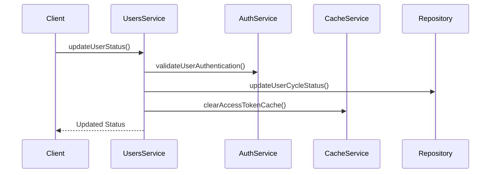
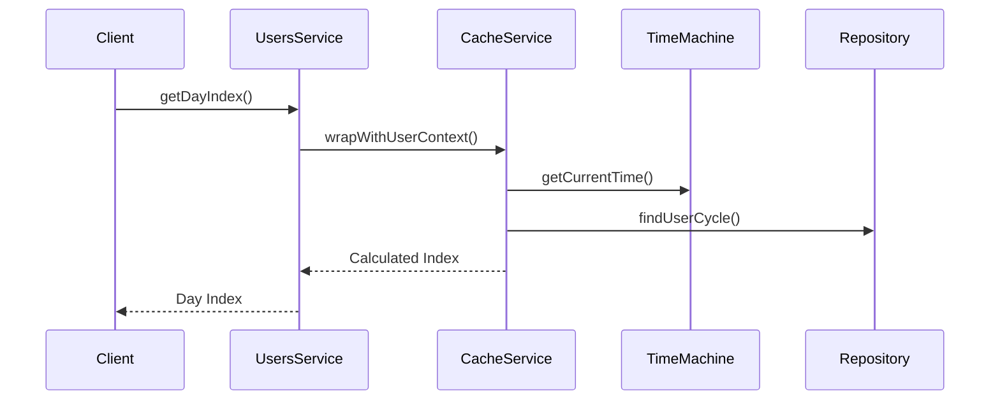
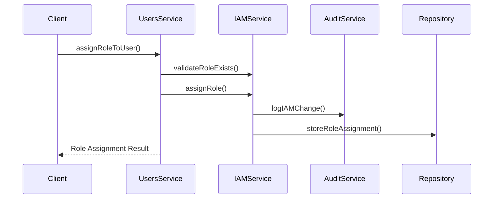
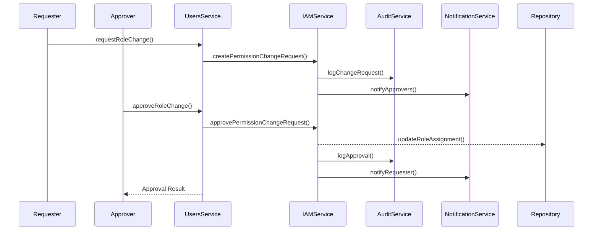

# 사용자 도메인 바운디드 컨텍스트

## 1. 컨텍스트 경계

### 1.1 책임 영역
- 사용자 계정 관리
- 치료 주기 관리
- 접근 코드 관리
- 사용자별 시간 관리
- 알림 토큰 관리
- IAM 권한 매핑 관리

### 1.2 제외 영역
- 인증/인가 처리 (Auth 도메인으로 위임)
- 알림 발송 (Notification 도메인으로 위임)
- 데이터 분석 (Analytics 도메인으로 위임)
- IAM 권한 정의 및 관리 (IAM 도메인으로 위임)
- 감사 로깅 (Audit 도메인으로 위임)

## 2. 외부 시스템 통합

### 2.1 Auth 도메인
```typescript
interface AuthDomainService {
  // 사용자 인증 상태 확인
  validateUserAuthentication(userId: number): Promise<boolean>;
  
  // 사용자 권한 확인
  checkUserPermissions(userId: number, requiredPermissions: string[]): Promise<boolean>;
}
```

### 2.2 TimeMachine 서비스
```typescript
interface TimeMachineRepository {
  getCurrentTime(userId: number): Promise<number>;
  isEnabled(userId: number): Promise<boolean>;
  getRealworldCurrentTimestamp(): number;
}
```

### 2.3 모바일 데이터스토어
```typescript
interface UserMobileDatastoreService {
  getUserFcmToken(userId: number): Promise<string | null>;
  getUserDeviceId(userId: number): Promise<string | null>;
  isNewRtibUser(userId: number): Promise<boolean>;
  getUserOs(userId: number): Promise<OS | null>;
}
```

### 2.4 캐시 서비스
```typescript
interface CacheService {
  wrapWithUserContext<T>(
    type: CacheType,
    resource: CacheResource,
    identifier: CacheIdentifier,
    userId: number,
    invalidationContexts: UserContextId[],
    dataLoader: () => Promise<T>,
    ttlSeconds: number
  ): Promise<T>;

  clearByUserContext(contextId: UserContextId, userId: number): Promise<void>;
  clearByKey(key: string): Promise<void>;
}
```

### 2.5 PubSub 서비스
```typescript
interface PubsubService {
  publishUserContext(
    userId: number,
    userCycleId: number,
    contextId: UserContextId
  ): Promise<void>;
}
```

### 2.6 IAM 서비스
```typescript
interface IAMService {
  // 사용자 역할 조회
  getUserRoles(userId: number): Promise<Role[]>;
  
  // 사용자 권한 조회
  getUserPermissions(userId: number): Promise<Permission[]>;
  
  // 역할 할당
  assignRole(userId: number, roleId: string, options?: RoleAssignmentOptions): Promise<boolean>;
  
  // 역할 회수
  revokeRole(userId: number, roleId: string): Promise<boolean>;
  
  // 임시 권한 부여
  grantTemporaryPermission(userId: number, permissionId: string, durationMinutes: number): Promise<boolean>;
  
  // 사용자의 특정 리소스 접근 권한 확인
  canAccessResource(userId: number, resourceType: string, resourceId: string, action: string): Promise<boolean>;
  
  // 권한 변경 요청 생성
  createPermissionChangeRequest(
    requesterId: number,
    userId: number,
    roleId: string,
    operation: 'ASSIGN' | 'REVOKE',
    reason: string
  ): Promise<string>;
  
  // 권한 변경 요청 승인/거부
  approvePermissionChangeRequest(requestId: string, approverId: number, approved: boolean): Promise<boolean>;
}

interface Role {
  id: string;
  name: string;
  description: string;
  permissions: Permission[];
  scope?: RoleScope;
}

interface Permission {
  id: string;
  name: string;
  description: string;
  resource: string;
  action: string;
}

interface RoleScope {
  organizationId?: string;
  teamId?: string;
  siteId?: number;
}

interface RoleAssignmentOptions {
  expiresAt?: Date;
  scope?: RoleScope;
  requiredApproval?: boolean;
}
```

## 3. 이벤트 흐름

### 3.1 사용자 상태 변경


### 3.2 일자 인덱스 계산


### 3.3 IAM 역할 할당 및 권한 검증


### 3.4 권한 변경 요청 및 승인


## 4. 유비쿼터스 언어

### 4.1 핵심 용어
| 용어 | 설명 | 예시 |
|------|------|------|
| User Account | 사용자의 기본 계정 정보 | 이메일, 이름, 상태 등 |
| User Cycle | 사용자의 치료 주기 | 시작일, 종료일, 라운드 등 |
| Access Code | 사용자 등록용 코드 | "abcd1234" |
| Day Index | 치료 시작일 기준 경과 일수 | 1일차, 2일차 등 |
| Role | IAM 역할 | ADMIN, AUDITOR, USER 등 |
| Permission | 권한 | READ_USER_DATA, WRITE_AUDIT_LOG 등 |
| Role Assignment | 역할 할당 | 사용자에게 특정 역할 부여 |
| Approval Workflow | 승인 워크플로우 | 권한 변경 요청 및 승인 과정 |

### 4.2 상태 용어
| 상태 | 설명 | 전이 조건 |
|------|------|-----------|
| ACTIVE | 활성 상태 | 초기 상태 |
| EXPIRED | 만료 상태 | 치료기간 + 사용기간 초과 |
| BANNED | 차단 상태 | 관리자 수동 처리 |
| PENDING_APPROVAL | 승인 대기 중 | 권한 요청이 이루어짐 |
| APPROVED | 승인됨 | 권한 요청이 승인됨 |
| REJECTED | 거부됨 | 권한 요청이 거부됨 |

## 5. 기술 스택

### 5.1 프레임워크 및 라이브러리
- NestJS: 백엔드 프레임워크
- TypeScript: 프로그래밍 언어
- Redis: 캐시 저장소
- PostgreSQL: 주 데이터베이스

### 5.2 외부 서비스
- TimeMachine: 시간 관리
- FCM: 푸시 알림
- PubSub: 이벤트 발행/구독

## 6. 변경 이력
| 버전 | 날짜 | 작성자 | 변경 내용 |
|-----|------|--------|-----------|
| 0.1.0 | 2025-03-16 | bok@weltcorp.com | 최초 작성 |
| 0.2.0 | 2025-03-20 | bok@weltcorp.com | IAM 통합 기능 추가 | 