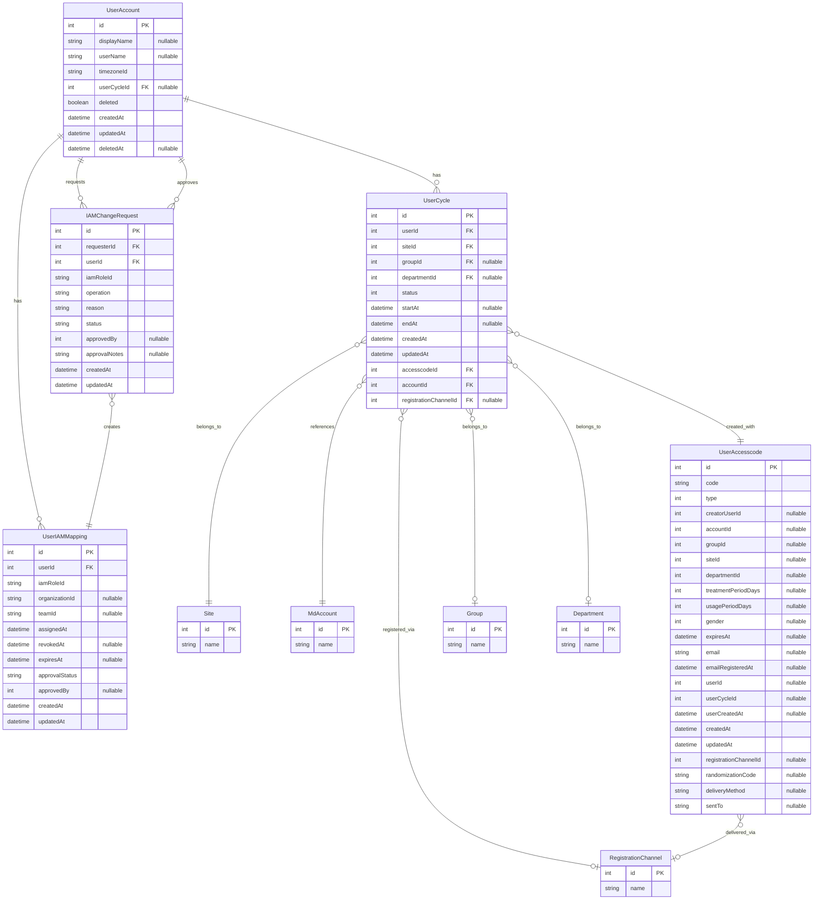

# 사용자 도메인 모델

## 1. 개요
사용자 도메인은 사용자 계정, 치료 주기, 접근 코드 관리를 담당하는 핵심 도메인입니다.

## 2. 도메인 ERD


## 3. 엔티티

### UserAccount
```typescript
interface UserAccount {
  id: number;                            // Primary Key, Auto-increment
  displayName?: string;                  // VARCHAR(100), 표시 이름
  userName?: string;                     // VARCHAR(30), 사용자명 (영문소문자, 숫자, _, -)
  timezoneId: string;                   // VARCHAR(30), Default: "Asia/Seoul"
  userCycleId?: number;                 // Foreign Key to user_cycle
  deleted: boolean;                     // Default: false
  createdAt: Date;                      // Timestamptz(6), Default: now()
  updatedAt: Date;                      // Timestamptz(6), Default: now()
  deletedAt?: Date;                     // Timestamptz(6), Nullable
}

/**
 * 제약조건:
 * 1. displayName:
 *    - 최대 길이: 100자
 *    - 허용 문자: 한글, 영문, 숫자, 공백
 *    - 입력 형식: 앞뒤 공백 제거
 * 
 * 2. userName:
 *    - 최소 길이: 3자
 *    - 최대 길이: 30자
 *    - 허용 문자: 영문 소문자, 숫자, 밑줄(_), 하이픈(-)
 *    - 시작 문자: 영문 소문자만 허용
 *    - 고유성 보장 필요
 * 
 * 3. timezoneId:
 *    - IANA 타임존 데이터베이스 기준 유효성 검증
 *    - 잘못된 타임존 입력 시 기본값(Asia/Seoul) 사용
 */
```

### UserCycle
```typescript
interface UserCycle {
  id: number;                // Primary Key
  userId: number;           // Foreign Key to UserAccount
  siteId: number;          // Foreign Key to Site
  groupId?: number;        // Foreign Key to Group
  departmentId?: number;   // Foreign Key to Department
  accountId: number;       // Foreign Key to MdAccount
  accesscodeId: number;    // Foreign Key to UserAccesscode
  registrationChannelId?: number; // Foreign Key to RegistrationChannel
  status: UserCycleStatus; // 주기 상태
  startAt: Date;           // 시작일시
  endAt?: Date;           // 종료일시
  createdAt: Date;        // 생성일시
  updatedAt: Date;        // 수정일시
  lastStatusChangeReason?: string; // 마지막 상태 변경 사유
}

enum UserCycleStatus {
  PENDING = 0,    // 대기 중
  ACTIVE = 1,     // 활성 상태
  COMPLETED = 2,  // 완료됨
  SUSPENDED = 3,  // 일시 중지
  CANCELLED = 4   // 취소됨
}

/**
 * 제약조건:
 * 1. 시간 관련:
 *    - startAt은 현재 시간보다 이전일 수 없음
 *    - endAt이 있는 경우 startAt보다 이후여야 함
 *    - COMPLETED 상태로 변경 시 endAt은 필수
 * 
 * 2. 상태 전이:
 *    - PENDING -> ACTIVE: 시작 시간 도달 시
 *    - ACTIVE -> COMPLETED: 종료 시간 도달 시
 *    - ACTIVE -> SUSPENDED: 관리자 조치 시
 *    - SUSPENDED -> ACTIVE: 관리자 조치 시
 *    - ANY -> CANCELLED: 관리자 조치 시
 *    - COMPLETED, CANCELLED 상태에서는 다른 상태로 전이 불가
 * 
 * 3. 중복 방지:
 *    - 동일 사용자의 동일 사이트 내 중복 활성 주기 불가
 *    - 삭제된 사이트에 새로운 주기 생성 불가
 *    - 만료된 액세스 코드로 주기 생성 불가
 * 
 * 4. 권한:
 *    - 주기 생성은 유효한 액세스 코드 필요
 *    - 상태 변경은 관리자 또는 소유자만 가능
 *    - 주기 조회는 소유자 또는 관련 사이트 관리자만 가능
 */
```

#### UserAccesscode
```typescript
interface UserAccesscode {
  id: number;
  code: string;
  type: AccesscodeType;
  siteId: number;
  registrationChannelId: RegistrationChannelId;
  deliveryMethod: DeliveryMethod;
  expiresAt: Date;
  creatorUserId: number;
  accountId: number;
  groupId: number;
  treatmentPeriodDays: number;
  usagePeriodDays: number;
  departmentId?: number;
  gender?: string;
  email?: string;
  createdAt: Date;
  updatedAt: Date;
  randomizationCode?: string;
  sentTo?: string;
}
```

### UserIAMMapping
```typescript
interface UserIAMMapping {
  id: number;                 // Primary Key
  userId: number;             // Foreign Key to UserAccount
  iamRoleId: string;          // IAM 역할 ID
  organizationId?: string;    // 조직 ID (범위 제한용)
  teamId?: string;            // 팀 ID (범위 제한용)
  assignedAt: Date;           // 역할 할당 시간
  revokedAt?: Date;           // 역할 회수 시간
  expiresAt?: Date;           // 역할 만료 시간
  approvalStatus: UserIAMApprovalStatus; // 승인 상태
  approvedBy?: number;        // 승인자 ID
  createdAt: Date;            // 생성 시간
  updatedAt: Date;            // 수정 시간
}

enum UserIAMApprovalStatus {
  PENDING = 'PENDING',       // 승인 대기
  APPROVED = 'APPROVED',     // 승인됨
  REJECTED = 'REJECTED'      // 거부됨
}

/**
 * 제약조건:
 * 1. 역할 할당:
 *    - 사용자 계정이 활성 상태여야 함
 *    - 이미 동일한 역할이 할당된 경우 중복 할당 불가
 *    - 승인 상태가 APPROVED인 경우에만 유효함
 * 
 * 2. 역할 만료:
 *    - expiresAt이 설정된 경우 해당 시간 이후 자동 만료
 *    - 만료된 역할은 재할당 가능
 * 
 * 3. 역할 회수:
 *    - 회수된 역할(revokedAt이 설정됨)은 더 이상 유효하지 않음
 *    - 회수 사유는 감사 로그에 기록
 */
```

### IAMChangeRequest
```typescript
interface IAMChangeRequest {
  id: number;                 // Primary Key
  requesterId: number;        // 요청자 ID
  userId: number;             // 대상 사용자 ID
  iamRoleId: string;          // IAM 역할 ID
  operation: IAMOperation;    // 작업 유형
  reason: string;             // 요청 사유
  status: IAMRequestStatus;   // 요청 상태
  approvedBy?: number;        // 승인자 ID
  approvalNotes?: string;     // 승인/거부 메모
  createdAt: Date;            // 생성 시간
  updatedAt: Date;            // 수정 시간
}

enum IAMOperation {
  ASSIGN = 'ASSIGN',          // 역할 할당
  REVOKE = 'REVOKE'           // 역할 회수
}

enum IAMRequestStatus {
  PENDING = 'PENDING',        // 대기 중
  APPROVED = 'APPROVED',      // 승인됨
  REJECTED = 'REJECTED',      // 거부됨
  EXPIRED = 'EXPIRED'         // 만료됨
}

/**
 * 제약조건:
 * 1. 요청 생성:
 *    - 요청자는 권한 변경 요청 생성 권한이 있어야 함
 *    - 사유(reason)는 필수 항목
 * 
 * 2. 승인 프로세스:
 *    - 승인자와 요청자는 동일인이 아니어야 함
 *    - 승인자는 해당 역할 승인 권한이 있어야 함
 *    - 승인 상태 변경 시 감사 로깅 필요
 * 
 * 3. 자동 만료:
 *    - 요청 후 특정 기간(기본 7일) 내 처리되지 않으면 자동 만료
 */
```

## 3. 값 객체

### CycleStatus
```typescript
interface CycleStatusChange {
  fromStatus: UserCycleStatus;
  toStatus: UserCycleStatus;
  changedAt: Date;
  reason: string;
}
```

### IAMRole
```typescript
interface IAMRole {
  id: string;
  name: string;
  description: string;
  permissions: IAMPermission[];
  scopeType?: IAMScopeType;
  scopeDefinition?: object;
  isSystemRole: boolean;
  createdAt: Date;
  updatedAt: Date;
}

enum IAMScopeType {
  GLOBAL = 'GLOBAL',           // 전역 범위
  ORGANIZATION = 'ORGANIZATION', // 조직 범위
  TEAM = 'TEAM',               // 팀 범위
  SITE = 'SITE',               // 사이트 범위
  RESOURCE = 'RESOURCE'        // 특정 리소스 범위
}

/**
 * 값 객체 특성:
 * - 불변성: 역할 정보는 변경 불가능, 새 역할로 대체
 * - 교체성: 동일한 속성을 가진 두 역할은 동일하게 취급
 * - 자가 유효성 검증: 필수 속성 누락 여부 등 자체 검증
 */
```

### IAMPermission
```typescript
interface IAMPermission {
  id: string;
  name: string;
  resource: string;
  action: string;
  description: string;
}

/**
 * 값 객체 특성:
 * - 불변성: 권한 정보는 변경 불가능
 * - 단일 책임: 특정 리소스에 대한 특정 액션만 표현
 * - 조합 가능성: 여러 권한을 조합하여 역할 구성
 */
```

## 4. 데이터베이스 스키마

### UserAccount 모델
```typescript
// Prisma 모델 정의
model UserAccount {
  id          Int       @id @default(autoincrement())
  displayName String?   @map("display_name") @db.VarChar(255)
  userName    String?   @map("user_name") @db.VarChar(100)
  timezoneId  String    @default("Asia/Seoul") @map("timezone_id") @db.VarChar(30)
  userCycleId Int?      @map("user_cycle_id")
  createdAt   DateTime  @default(now()) @map("created_at") @db.Timestamptz()
  updatedAt   DateTime  @default(now()) @map("updated_at") @db.Timestamptz()
  deleted     Boolean   @default(false)
  deletedAt   DateTime? @map("deleted_at") @db.Timestamptz()
  
  userCycle   UserCycle? @relation(fields: [userCycleId], references: [id], onDelete: SetNull)
  iamMappings UserIAMMapping[]
  
  @@index([timezoneId], name: "idx_user_account_timezone")
  @@index([userCycleId], name: "idx_user_account_cycle")
  @@map("user_account")
  @@schema("private")
}
```

### UserCycle 모델
```typescript
// Prisma 모델 정의
model UserCycle {
  id                  Int       @id @default(autoincrement())
  userId              Int       @map("user_id")
  groupId             Int?      @map("group_id")
  siteId              Int       @map("site_id")
  departmentId        Int?      @map("department_id")
  status              Int
  startAt             DateTime? @map("start_at") @db.Timestamptz()
  endAt               DateTime? @map("end_at") @db.Timestamptz()
  createdAt           DateTime  @default(now()) @map("created_at") @db.Timestamptz()
  updatedAt           DateTime  @default(now()) @map("updated_at") @db.Timestamptz()
  accesscodeId        Int       @map("accesscode_id")
  accountId           Int       @map("account_id")
  registrationChannelId Int?    @map("registration_channel_id")
  
  site                Site      @relation(fields: [siteId], references: [id])
  accesscode          UserAccesscode @relation(fields: [accesscodeId], references: [id])
  account             MdAccount @relation(fields: [accountId], references: [id])
  userAccounts        UserAccount[]
  
  @@index([status, startAt], name: "idx_user_cycle_status")
  @@map("user_cycle")
  @@schema("private")
}
```

### UserAccesscode 모델
```typescript
// Prisma 모델 정의
model UserAccesscode {
  id                  Int       @id @default(autoincrement())
  code                String    @db.VarChar(255)
  type                Int       @default(1)
  creatorUserId       Int?      @map("creator_user_id")
  accountId           Int?      @map("account_id")
  groupId             Int?      @map("group_id")
  siteId              Int?      @map("site_id")
  departmentId        Int?      @map("department_id")
  treatmentPeriodDays Int?      @map("treatment_period_days")
  usagePeriodDays     Int?      @map("usage_period_days")
  gender              Int?
  expiresAt           DateTime? @map("expires_at") @db.Timestamptz()
  email               String?   @db.VarChar(255)
  emailRegisteredAt   DateTime? @map("email_registered_at") @db.Timestamptz()
  userId              Int?      @map("user_id")
  userCycleId         Int?      @map("user_cycle_id")
  userCreatedAt       DateTime? @map("user_created_at") @db.Timestamptz()
  createdAt           DateTime  @default(now()) @map("created_at") @db.Timestamptz()
  updatedAt           DateTime  @default(now()) @map("updated_at") @db.Timestamptz()
  registrationChannelId Int?    @map("registration_channel_id")
  randomizationCode   String?   @map("randomization_code") @db.VarChar(100)
  deliveryMethod      String?   @map("delivery_method") @db.VarChar(50)
  sentTo              String?   @map("sent_to") @db.VarChar(255)
  
  registrationChannel RegistrationChannel? @relation(fields: [registrationChannelId], references: [id])
  userCycles          UserCycle[]
  
  @@index([code], name: "idx_user_accesscode_code")
  @@index([email], name: "idx_user_accesscode_email")
  @@map("user_accesscode")
  @@schema("private")
}
```

### UserIAMMapping 모델
```typescript
// Prisma 모델 정의
model UserIAMMapping {
  id            Int       @id @default(autoincrement())
  userId        Int       @map("user_id")
  iamRoleId     String    @map("iam_role_id") @db.VarChar(100)
  organizationId String?   @map("organization_id") @db.VarChar(100)
  teamId        String?   @map("team_id") @db.VarChar(100)
  assignedAt    DateTime  @default(now()) @map("assigned_at") @db.Timestamptz()
  revokedAt     DateTime? @map("revoked_at") @db.Timestamptz()
  expiresAt     DateTime? @map("expires_at") @db.Timestamptz()
  approvalStatus String    @default("APPROVED") @map("approval_status") @db.VarChar(20)
  approvedBy    Int?      @map("approved_by")
  createdAt     DateTime  @default(now()) @map("created_at") @db.Timestamptz()
  updatedAt     DateTime  @default(now()) @map("updated_at") @db.Timestamptz()
  
  user          UserAccount @relation(fields: [userId], references: [id], onDelete: Cascade)
  
  @@index([userId], name: "idx_user_iam_mapping_user")
  @@index([iamRoleId], name: "idx_user_iam_mapping_role")
  @@index([organizationId], name: "idx_user_iam_mapping_org")
  @@map("user_iam_mapping")
  @@schema("private")
}
```

## 5. 집계

### UserCycleAggregate
```typescript
class UserCycleAggregate {
  private cycle: UserCycle;
  private statusHistory: CycleStatusChange[];

  constructor(cycle: UserCycle) {
    this.cycle = cycle;
    this.statusHistory = [];
  }

  // 주기 활성화
  activate(): void {
    if (this.cycle.status !== UserCycleStatus.PENDING) {
      throw new Error('Only pending cycles can be activated');
    }
    this.changeStatus(UserCycleStatus.ACTIVE, 'Cycle started');
  }

  // 주기 완료
  complete(): void {
    if (this.cycle.status !== UserCycleStatus.ACTIVE) {
      throw new Error('Only active cycles can be completed');
    }
    this.changeStatus(UserCycleStatus.COMPLETED, 'Cycle completed');
  }

  // 주기 일시 중지
  suspend(reason: string): void {
    if (this.cycle.status !== UserCycleStatus.ACTIVE) {
      throw new Error('Only active cycles can be suspended');
    }
    this.changeStatus(UserCycleStatus.SUSPENDED, reason);
  }

  // 주기 취소
  cancel(reason: string): void {
    if (this.cycle.status === UserCycleStatus.CANCELLED) {
      throw new Error('Cycle is already cancelled');
    }
    this.changeStatus(UserCycleStatus.CANCELLED, reason);
  }

  private changeStatus(newStatus: UserCycleStatus, reason: string): void {
    const change: CycleStatusChange = {
      fromStatus: this.cycle.status,
      toStatus: newStatus,
      changedAt: new Date(),
      reason
    };
    this.statusHistory.push(change);
    this.cycle.status = newStatus;
    this.cycle.updatedAt = change.changedAt;
  }
}
```

### UserIAMAggregate
```typescript
class UserIAMAggregate {
  private userId: number;
  private mappings: UserIAMMapping[];
  private changeRequests: IAMChangeRequest[];
  
  constructor(userId: number, mappings: UserIAMMapping[], changeRequests: IAMChangeRequest[]) {
    this.userId = userId;
    this.mappings = mappings;
    this.changeRequests = changeRequests;
  }
  
  // 유효한 역할 목록 조회
  getActiveRoles(): { roleId: string, scope?: any }[] {
    const now = new Date();
    return this.mappings
      .filter(mapping => 
        mapping.approvalStatus === UserIAMApprovalStatus.APPROVED &&
        !mapping.revokedAt &&
        (!mapping.expiresAt || mapping.expiresAt > now)
      )
      .map(mapping => ({
        roleId: mapping.iamRoleId,
        scope: {
          organizationId: mapping.organizationId,
          teamId: mapping.teamId
        }
      }));
  }
  
  // 역할 할당 요청
  requestRoleAssignment(roleId: string, requesterId: number, reason: string, scope?: any): IAMChangeRequest {
    // 중복 요청 확인
    const pendingRequests = this.changeRequests.filter(req => 
      req.iamRoleId === roleId && 
      req.operation === IAMOperation.ASSIGN &&
      req.status === IAMRequestStatus.PENDING
    );
    
    if (pendingRequests.length > 0) {
      throw new Error('이미 동일한 역할에 대한 요청이 진행 중입니다.');
    }
    
    // 새 요청 생성 (실제 구현에서는 ID 생성 등 추가 로직 포함)
    return {
      id: 0, // 임시 ID
      requesterId,
      userId: this.userId,
      iamRoleId: roleId,
      operation: IAMOperation.ASSIGN,
      reason,
      status: IAMRequestStatus.PENDING,
      createdAt: new Date(),
      updatedAt: new Date()
    };
  }
  
  // 역할 회수 요청
  requestRoleRevocation(roleId: string, requesterId: number, reason: string): IAMChangeRequest {
    // 현재 할당된 역할인지 확인
    const activeMapping = this.mappings.find(mapping => 
      mapping.iamRoleId === roleId &&
      mapping.approvalStatus === UserIAMApprovalStatus.APPROVED &&
      !mapping.revokedAt
    );
    
    if (!activeMapping) {
      throw new Error('사용자에게 해당 역할이 할당되어 있지 않습니다.');
    }
    
    // 새 요청 생성
    return {
      id: 0, // 임시 ID
      requesterId,
      userId: this.userId,
      iamRoleId: roleId,
      operation: IAMOperation.REVOKE,
      reason,
      status: IAMRequestStatus.PENDING,
      createdAt: new Date(),
      updatedAt: new Date()
    };
  }
  
  // 요청 승인
  approveRequest(requestId: number, approverId: number, notes?: string): void {
    const request = this.changeRequests.find(req => req.id === requestId);
    if (!request) {
      throw new Error('요청을 찾을 수 없습니다.');
    }
    
    if (request.status !== IAMRequestStatus.PENDING) {
      throw new Error('대기 중인 요청만 승인할 수 있습니다.');
    }
    
    if (request.requesterId === approverId) {
      throw new Error('요청자와 승인자가 동일할 수 없습니다.');
    }
    
    request.status = IAMRequestStatus.APPROVED;
    request.approvedBy = approverId;
    request.approvalNotes = notes;
    request.updatedAt = new Date();
    
    // 요청에 따른 작업 수행
    if (request.operation === IAMOperation.ASSIGN) {
      this.assignRole(request.iamRoleId, approverId);
    } else if (request.operation === IAMOperation.REVOKE) {
      this.revokeRole(request.iamRoleId, approverId);
    }
  }
  
  // 역할 할당 (내부 메서드)
  private assignRole(roleId: string, approvedBy: number): void {
    const newMapping: UserIAMMapping = {
      id: 0, // 임시 ID
      userId: this.userId,
      iamRoleId: roleId,
      assignedAt: new Date(),
      approvalStatus: UserIAMApprovalStatus.APPROVED,
      approvedBy,
      createdAt: new Date(),
      updatedAt: new Date()
    };
    
    this.mappings.push(newMapping);
  }
  
  // 역할 회수 (내부 메서드)
  private revokeRole(roleId: string, revokedBy: number): void {
    const mapping = this.mappings.find(m => 
      m.iamRoleId === roleId && 
      !m.revokedAt && 
      m.approvalStatus === UserIAMApprovalStatus.APPROVED
    );
    
    if (mapping) {
      mapping.revokedAt = new Date();
      mapping.updatedAt = new Date();
    }
  }
}
```

## 6. 리포지토리

### UserIAMRepository
```typescript
interface UserIAMRepository {
  // 사용자 IAM 정보 조회
  findByUserId(userId: number): Promise<UserIAMAggregate>;
  
  // 역할 매핑 저장
  saveMapping(mapping: UserIAMMapping): Promise<UserIAMMapping>;
  
  // 역할 매핑 일괄 저장
  saveMappings(mappings: UserIAMMapping[]): Promise<UserIAMMapping[]>;
  
  // 변경 요청 저장
  saveChangeRequest(request: IAMChangeRequest): Promise<IAMChangeRequest>;
  
  // 변경 요청 상태 업데이트
  updateRequestStatus(requestId: number, status: IAMRequestStatus, approverId?: number, notes?: string): Promise<IAMChangeRequest>;
  
  // 사용자별 유효한 역할 목록 조회
  findActiveRolesByUserId(userId: number): Promise<UserIAMMapping[]>;
  
  // 만료된 역할 자동 처리
  processExpiredRoles(): Promise<number>;
  
  // 대기 중인 변경 요청 목록 조회
  findPendingRequests(criteria?: { approverId?: number, roleId?: string }): Promise<IAMChangeRequest[]>;
}
```

## 6. 서비스

### UserIAMService
```typescript
interface UserIAMService {
  // 사용자의 역할 목록 조회
  getUserRoles(userId: number): Promise<IAMRole[]>;
  
  // 사용자의 권한 목록 조회
  getUserPermissions(userId: number): Promise<IAMPermission[]>;
  
  // 사용자의 리소스 접근 권한 확인
  hasPermission(userId: number, resourceType: string, resourceId: string, action: string): Promise<boolean>;
  
  // 역할 할당 요청
  requestRoleAssignment(
    requesterId: number,
    userId: number,
    roleId: string,
    reason: string,
    options?: {
      expiresAt?: Date,
      organizationId?: string,
      teamId?: string
    }
  ): Promise<IAMChangeRequest>;
  
  // 역할 회수 요청
  requestRoleRevocation(
    requesterId: number,
    userId: number,
    roleId: string,
    reason: string
  ): Promise<IAMChangeRequest>;
  
  // 요청 승인/거부
  processRequest(
    requestId: number,
    approverId: number,
    approved: boolean,
    notes?: string
  ): Promise<IAMChangeRequest>;
  
  // 내 승인 대기 요청 목록
  getMyPendingApprovals(approverId: number): Promise<IAMChangeRequest[]>;
  
  // 사용자 역할 이력 조회
  getUserRoleHistory(userId: number): Promise<UserIAMMapping[]>;
  
  // 임시 권한 부여
  grantTemporaryPermission(
    granterId: number,
    userId: number,
    permissionId: string,
    durationMinutes: number,
    reason: string
  ): Promise<boolean>;
}
```

## 7. 이벤트

### IAMEvents
```typescript
// 역할 할당됨
interface IAMRoleAssignedEvent {
  type: 'IAM_ROLE_ASSIGNED';
  userId: number;
  roleId: string;
  assignedBy: number;
  timestamp: Date;
  expiresAt?: Date;
  scope?: {
    organizationId?: string;
    teamId?: string;
  };
}

// 역할 회수됨
interface IAMRoleRevokedEvent {
  type: 'IAM_ROLE_REVOKED';
  userId: number;
  roleId: string;
  revokedBy: number;
  timestamp: Date;
  reason?: string;
}

// 변경 요청 생성됨
interface IAMChangeRequestCreatedEvent {
  type: 'IAM_CHANGE_REQUEST_CREATED';
  requestId: number;
  requesterId: number;
  userId: number;
  roleId: string;
  operation: IAMOperation;
  timestamp: Date;
}

// 변경 요청 승인/거부됨
interface IAMChangeRequestProcessedEvent {
  type: 'IAM_CHANGE_REQUEST_PROCESSED';
  requestId: number;
  approverId: number;
  approved: boolean;
  timestamp: Date;
  notes?: string;
}

// 권한 검증 실패
interface IAMPermissionDeniedEvent {
  type: 'IAM_PERMISSION_DENIED';
  userId: number;
  resourceType: string;
  resourceId?: string;
  action: string;
  timestamp: Date;
  requestContext?: any;
}
```

## 8. 비즈니스 규칙

### 7.1 일자 계산 규칙

#### 일자 인덱스 계산
```typescript
/**
 * 일자 인덱스 계산 규칙:
 * 1. 시작일 기준으로 현재까지의 일수를 계산
 * 2. 타임존 고려사항:
 *    - 모든 계산은 사용자의 현지 시간 기준
 *    - 일자 변경 시점은 현지 시간 00:00
 *    - 사용자 타임존이 변경되면 일자 인덱스 재계산
 * 3. 계산식:
 *    - startDateStr = toDateString(userCycle.startAt)
 *    - currentDateStr = toDateString(currentTime)
 *    - diffDays = (currentDate - startDate) / millisecondsInDay
 *    - dayIndex = diffDays + 1
 * 4. 제약사항:
 *    - 음수 일자 인덱스는 허용되지 않음
 *    - 시작일이 미래인 경우 BadRequestException
 *    - 중지 기간은 일자 계산에서 제외
 */

interface DayIndexCalculationResult {
  dayIndex: number;         // 현재 일자 인덱스
  totalDays: number;        // 전체 경과 일수
  activeDays: number;       // 실제 활성 상태였던 일수
  suspendedDays: number;    // 중지 상태였던 일수
  remainingDays?: number;   // 남은 일수 (종료일이 설정된 경우)
}
```

### 7.2 상태 전이 규칙
```typescript
const ALLOWED_STATUS_TRANSITIONS = {
  [UserCycleStatus.PENDING]: [
    UserCycleStatus.ACTIVE,
    UserCycleStatus.CANCELLED
  ],
  [UserCycleStatus.ACTIVE]: [
    UserCycleStatus.COMPLETED,
    UserCycleStatus.SUSPENDED
  ],
  [UserCycleStatus.SUSPENDED]: [
    UserCycleStatus.ACTIVE,
    UserCycleStatus.CANCELLED
  ],
  [UserCycleStatus.COMPLETED]: [],  // 완료된 주기는 상태 변경 불가
  [UserCycleStatus.CANCELLED]: []   // 취소된 주기는 상태 변경 불가
};

interface StatusTransitionValidation {
  isValid: boolean;
  requiredFields: string[];  // 상태 변경 시 필요한 필드들
  allowedRoles: string[];    // 상태 변경이 허용된 역할들
}
```

### 7.3 캐시 관리 규칙
```typescript
/**
 * 캐시 관리 규칙:
 * 1. 캐시 키 구조:
 *    - 활성 주기: user:{userId}:active-cycle
 *    - 주기 상태: cycle:{cycleId}:status
 *    - 일자 인덱스: cycle:{cycleId}:day-index
 * 
 * 2. TTL 설정:
 *    - 활성 주기: 5분
 *    - 주기 상태: 1분
 *    - 일자 인덱스: 1시간
 * 
 * 3. 캐시 무효화 트리거:
 *    - 주기 상태 변경 시
 *    - 사용자 타임존 변경 시
 *    - 일자 변경 시점(00:00)
 */
```

### 7.4 사용자 상태 관리

#### 상태 전이 규칙
```typescript
/**
 * 상태 전이 규칙:
 * 1. ACTIVE -> EXPIRED:
 *    - 조건: 치료 기간(THERAPY_PERIOD_DAYS) + 사용 기간(IN_USE_DAYS) 초과
 *    - 작업:
 *      - 캐시 삭제
 *      - 푸시 토큰 정리
 *      - USER_ACCOUNT_UPDATED 이벤트 발행
 * 
 * 2. ACTIVE -> BANNED:
 *    - 조건: 관리자 수동 처리
 *    - 작업:
 *      - 접근 토큰 캐시 삭제
 *      - 사용자 컨텍스트 캐시 삭제
 *      - USER_SIGN_OUT 이벤트 발행
 * 
 * 3. EXPIRED/BANNED -> ACTIVE: 불가
 */

const Schedule = {
  THERAPY_PERIOD_DAYS: 42,  // 6주
  IN_USE_DAYS: 30          // 30일
};
```

### 7.5 접근 코드 관리

#### 접근 코드 생성 규칙
```typescript
/**
 * 접근 코드 생성 규칙:
 * 1. 형식: 8자리 (4글자 + 4숫자)
 *    - 문자: a-z (소문자)
 *    - 숫자: 0-9
 *    - 문자와 숫자 무작위 배치
 * 
 * 2. 생성 프로세스:
 *    - 최대 시도 횟수: 10회
 *    - 각 시도마다 중복 체크
 *    - 실패 시 에러: AuthErrorCodes.ACCESSCODE_GENERATION_FAILED
 * 
 * 3. 타입별 설정:
 */
const ACCESSCODE_CONFIG = {
  OCR: {
    creator_user_id: 0,
    account_id: 1,
    group_id: 1,
    registration_channel_id: RegistrationChannelId.OCR,
    treatment_period_days: 42,
    usage_period_days: 30
  },
  CONNECT_DTX: {
    creator_user_id: 0,
    account_id: 1,
    group_id: 1,
    registration_channel_id: RegistrationChannelId.CONNECT_DTX,
    treatment_period_days: 42,
    usage_period_days: 30
  }
};
```

## 9. 에러 처리

### 8.1 에러 코드 범위
```typescript
/**
 * 에러 코드 범위:
 * - 컨트롤러 계층: 1001-1099
 * - 서비스 계층: 1101-1199
 * - 리포지토리 계층: 1201-1299
 */

enum AuthErrorCodes {
  ACCESSCODE_GENERATION_FAILED = 1101,
  MAX_RETRY_EXCEEDED = 1102,
  INVALID_ACCESSCODE_TYPE = 1103,
  DUPLICATE_ACCESSCODE = 1104
}

enum RepositoryErrorCodes {
  STORAGE_IO_ERROR = 1201
}
```

### 8.2 에러 처리 전략
```typescript
/**
 * 에러 처리 전략:
 * 1. 도메인 에러:
 *    - DomainError로 래핑
 *    - 상세 컨텍스트 포함
 * 
 * 2. 외부 시스템 에러:
 *    - 적절한 HTTP 상태 코드 매핑
 *    - 재시도 정책 적용
 * 
 * 3. 데이터베이스 에러:
 *    - 트랜잭션 롤백
 *    - 중복 키 처리
 */
```

## 10. 모니터링

### 9.1 로깅 포인트
```typescript
/**
 * 주요 로깅 포인트:
 * 1. 사용자 상태 변경
 * 2. 접근 코드 생성 실패
 * 3. 캐시 무효화
 * 4. 외부 시스템 통신 오류
 * 
 * 참고: 모든 로깅은 공통 로깅 표준(/docs/infrastructure/logging-standards.md)을 준수해야 합니다.
 * 
 * 예시:
 * // 사용자 상태 변경
 * logger.info({
 *   event: 'USER_STATUS_CHANGED',
 *   user_id: string,
 *   status: {
 *     from: string,
 *     to: string
 *   },
 *   reason: string,
 *   metadata: {
 *     organization_id: string
 *   }
 * });
 * 
 * // 접근 코드 생성 실패
 * logger.warn({
 *   event: 'ACCESS_CODE_GENERATION_FAILED',
 *   user_id: string,
 *   error: {
 *     code: string,
 *     message: string
 *   },
 *   metadata: {
 *     attempt: number,
 *     reason: string
 *   }
 * });
 */
```

### 9.2 메트릭스
```typescript
/**
 * 수집 메트릭스:
 * 1. 성능:
 *    - API 응답 시간
 *    - 캐시 히트율
 *    - DB 쿼리 시간
 * 
 * 2. 비즈니스:
 *    - 활성 사용자 수
 *    - 만료된 사용자 수
 *    - 접근 코드 생성 성공률
 * 
 * 3. 시스템:
 *    - 메모리 사용량
 *    - CPU 사용률
 *    - 에러율
 */
```

## 11. 외부 도메인 의존성

### 11.1 Auth 도메인 의존성

사용자 도메인은 인증 및 인가 관련 기능을 위해 Auth 도메인에 의존합니다.

#### 11.1.1 앱 토큰 의존성

사용자 도메인은 API 인증을 위해 Auth 도메인의 앱 토큰 기능을 활용합니다. 앱 토큰 모델 및 서비스에 대한 자세한 내용은 [Auth 도메인의 앱 토큰 기술 명세](../auth/technical-spec/app-token.md)를 참조하세요.

```typescript
// Auth 도메인의 앱 토큰 페이로드 타입 참조
import { AppTokenPayload } from '@auth/domain/model/app-token.model';

// 사용자 도메인에서 앱 토큰 활용 예시
export class UserService {
  constructor(private readonly authService: AuthService) {}
  
  async createUser(userData: CreateUserDto, appToken: AppTokenPayload): Promise<User> {
    // 앱 토큰의 디바이스 ID를 활용하여 사용자 생성
    const { deviceId } = appToken;
    
    // 사용자 생성 로직
    // ...
    
    // Auth 도메인의 서비스를 통해 디바이스와 사용자 연결
    await this.authService.linkDeviceToUser(deviceId, user.id);
    
    return user;
  }
}
```

## 변경 이력

| 버전 | 날짜 | 작성자 | 변경 내용 |
|-----|------|--------|-----------|
| 0.1.0 | 2025-03-16 | bok@weltcorp.com | 최초 작성 |
| 0.2.0 | 2025-03-20 | bok@weltcorp.com | 공통 로깅 표준 참조로 변경 |