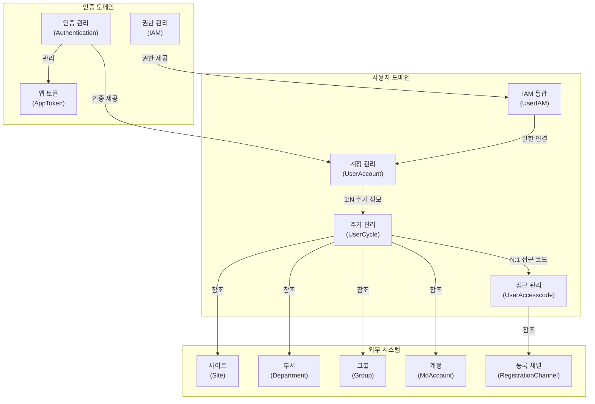
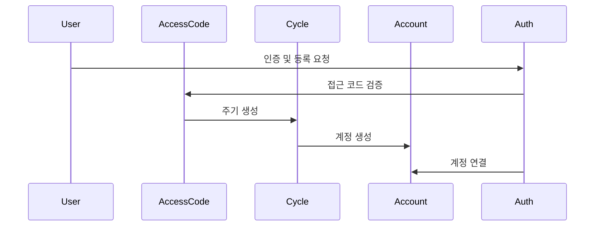
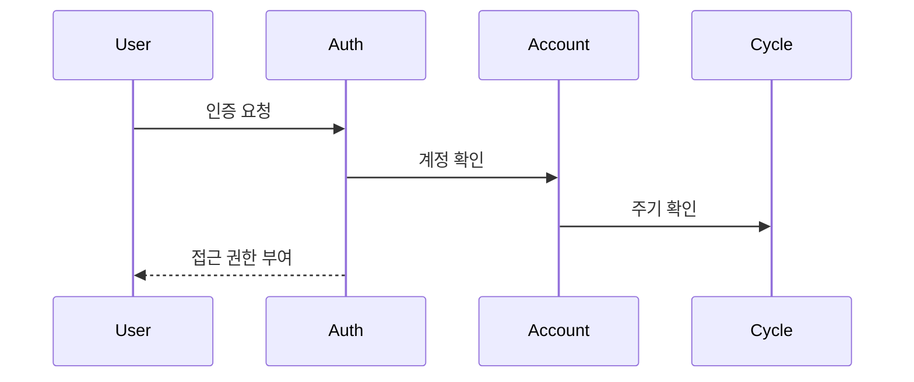
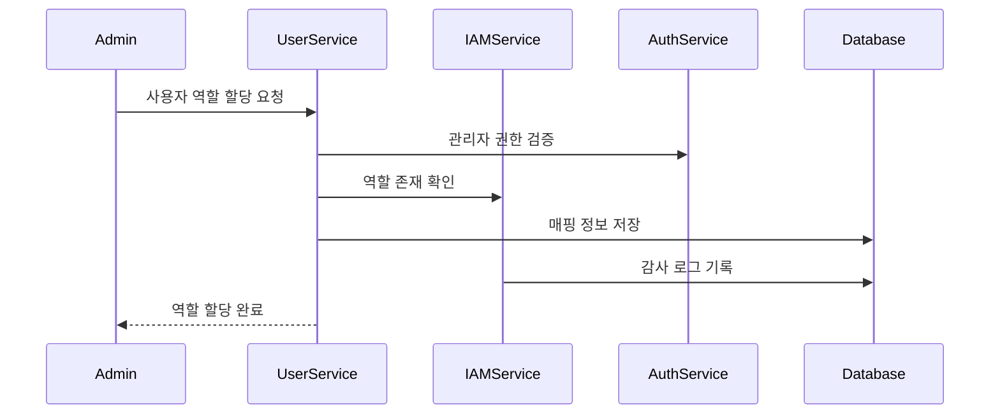

# 사용자 도메인 정의

## 개요
사용자 도메인은 SleepQ 서비스의 핵심 도메인으로, 사용자의 계정 관리, 계정 상태 관리, 그리고 서비스 이용 주기를 관리합니다.

## 도메인 컨텍스트 맵



## 공통 용어 정의 (Ubiquitous Language)

### 1. 핵심 개념
- **사용자 계정 (UserAccount)**
  - 정의: 서비스를 사용하는 개별 사용자의 기본 정보
  - 속성: 표시 이름, 사용자명, 타임존 등
  - 책임: 사용자 식별 및 기본 정보 관리

- **사용자 주기 (UserCycle)**
  - 정의: 사용자의 서비스 이용 기간과 상태를 관리
  - 속성: 시작일, 종료일, 상태
  - 책임: 서비스 이용 기간 및 상태 관리

- **접근 코드 (UserAccesscode)**
  - 정의: SleepQ 서비스 접근을 위한 코드
  - 속성: 코드, 타입, 만료일, 사용 상태
  - 책임: 서비스 초기 접근 제어 및 사용자 등록 과정 관리

- **IAM 통합 (UserIAM)**
  - 정의: 사용자의 IAM 권한과 사용자 계정을 연결하는 통합 계층
  - 속성: 역할, 권한, 사용자 ID
  - 책임: 사용자 권한 매핑 및 관리

### 2. 외부 도메인 의존성
- **인증 도메인 (Auth Domain)**
  - 정의: 사용자 인증 및 인가를 담당하는 도메인
  - 책임: 로그인, 토큰 관리, 권한 검증
  - 관계: 사용자 도메인은 인증 도메인의 서비스를 활용하여 사용자 인증 및 API 접근 제어

- **IAM 시스템 (Identity and Access Management)**
  - 정의: 사용자의 권한과 접근 제어를 관리하는 시스템
  - 책임: 역할 관리, 권한 부여, 접근 제어, 감사 로깅
  - 관계: 사용자 도메인은 IAM 시스템을 통해 사용자별 권한 정보를 관리하고 접근 제어를 수행

### 3. 상태 및 이벤트

#### 상태 정의
- **계정 상태**
  - ACTIVE: 활성 상태
  - INACTIVE: 비활성 상태
  - SUSPENDED: 일시 중지 상태
  - DELETED: 삭제됨

- **주기 상태**
  - ACTIVE: 활성 상태
  - EXPIRED: 만료됨
  - SUSPENDED: 일시 중지됨
  - TERMINATED: 종료됨

- **IAM 역할 상태**
  - ASSIGNED: 할당됨
  - REVOKED: 회수됨
  - EXPIRED: 만료됨
  - PENDING_APPROVAL: 승인 대기 중

#### 주요 이벤트
- **계정 관련**
  - 계정 생성됨 (AccountCreated)
  - 계정 업데이트됨 (AccountUpdated)
  - 계정 삭제됨 (AccountDeleted)

- **주기 관련**
  - 주기 시작됨 (CycleStarted)
  - 주기 만료됨 (CycleExpired)
  - 주기 종료됨 (CycleTerminated)

- **접근 코드 관련**
  - 접근 코드 생성됨 (AccesscodeCreated)
  - 접근 코드 사용됨 (AccesscodeUsed)

- **IAM 관련**
  - IAM 역할 할당됨 (IAMRoleAssigned)
  - IAM 역할 회수됨 (IAMRoleRevoked)
  - IAM 권한 변경됨 (IAMPermissionChanged)
  - IAM 접근 요청됨 (IAMAccessRequested)
  - IAM 접근 승인됨 (IAMAccessApproved)
  - IAM 접근 거부됨 (IAMAccessDenied)

## 도메인 간 상호작용

### 1. 주요 워크플로우

#### 사용자 등록 프로세스


#### 인증 프로세스


#### IAM 역할 할당 프로세스


### 2. 도메인 간 제약사항

#### 계정 관련 제약사항
- **계정-인증 관계**
  - 계정은 인증 도메인에서 관리하는 인증 정보와 연결됨
  - 인증 정보는 인증 도메인에서 관리

- **계정-주기 관계**
  - 주기 정보 없이 계정 생성 가능
  - 주기 삭제 시 계정은 유지

- **계정-IAM 관계**
  - IAM 역할은 활성 상태의 계정에만 할당 가능
  - 계정 삭제 시 연결된 모든 IAM 역할 자동 회수
  - 역할 할당은 적절한 승인 과정 필요

#### 주기 및 접근 코드 제약사항
- **주기-접근코드 관계**
  - 유효한 접근 코드로만 주기 생성 가능
  - 접근 코드는 재사용 불가

## 데이터베이스 스키마

### 1. 사용자 계정 (UserAccount)
```prisma
model UserAccount {
  id          Int       @id @default(autoincrement())
  displayName String?   @map("display_name") @db.VarChar(255)
  userName    String?   @map("user_name") @db.VarChar(100)
  timezoneId  String    @default("Asia/Seoul") @map("timezone_id") @db.VarChar(30)
  userCycleId Int?      @map("user_cycle_id")
  createdAt   DateTime  @default(now()) @map("created_at") @db.Timestamptz()
  updatedAt   DateTime  @default(now()) @map("updated_at") @db.Timestamptz()
  deleted     Boolean   @default(false)
  deletedAt   DateTime? @map("deleted_at") @db.Timestamptz()
  
  userCycle   UserCycle? @relation(fields: [userCycleId], references: [id], onDelete: SetNull)
  iamMappings UserIAMMapping[]
  
  @@index([timezoneId], name: "idx_user_account_timezone")
  @@index([userCycleId], name: "idx_user_account_cycle")
  @@map("user_account")
  @@schema("private")
}
```

### 2. 사용자 주기 (UserCycle)
```prisma
model UserCycle {
  id                  Int       @id @default(autoincrement())
  userId              Int       @map("user_id")
  groupId             Int?      @map("group_id")
  siteId              Int       @map("site_id")
  departmentId        Int?      @map("department_id")
  status              Int
  startAt             DateTime? @map("start_at") @db.Timestamptz()
  endAt               DateTime? @map("end_at") @db.Timestamptz()
  createdAt           DateTime  @default(now()) @map("created_at") @db.Timestamptz()
  updatedAt           DateTime  @default(now()) @map("updated_at") @db.Timestamptz()
  accesscodeId        Int       @map("accesscode_id")
  accountId           Int       @map("account_id")
  registrationChannelId Int?    @map("registration_channel_id")
  
  site                Site      @relation(fields: [siteId], references: [id])
  accesscode          UserAccesscode @relation(fields: [accesscodeId], references: [id])
  account             MdAccount @relation(fields: [accountId], references: [id])
  userAccounts        UserAccount[]
  
  @@index([status, startAt], name: "idx_user_cycle_status")
  @@map("user_cycle")
  @@schema("private")
}
```

### 3. 접근 코드 (UserAccesscode)
```prisma
model UserAccesscode {
  id                  Int       @id @default(autoincrement())
  code                String    @db.VarChar(255)
  type                Int       @default(1)
  creatorUserId       Int?      @map("creator_user_id")
  accountId           Int?      @map("account_id")
  groupId             Int?      @map("group_id")
  siteId              Int?      @map("site_id")
  departmentId        Int?      @map("department_id")
  treatmentPeriodDays Int?      @map("treatment_period_days")
  usagePeriodDays     Int?      @map("usage_period_days")
  gender              Int?
  expiresAt           DateTime? @map("expires_at") @db.Timestamptz()
  email               String?   @db.VarChar(255)
  emailRegisteredAt   DateTime? @map("email_registered_at") @db.Timestamptz()
  userId              Int?      @map("user_id")
  userCycleId         Int?      @map("user_cycle_id")
  userCreatedAt       DateTime? @map("user_created_at") @db.Timestamptz()
  createdAt           DateTime  @default(now()) @map("created_at") @db.Timestamptz()
  updatedAt           DateTime  @default(now()) @map("updated_at") @db.Timestamptz()
  registrationChannelId Int?    @map("registration_channel_id")
  randomizationCode   String?   @map("randomization_code") @db.VarChar(100)
  deliveryMethod      String?   @map("delivery_method") @db.VarChar(50)
  sentTo              String?   @map("sent_to") @db.VarChar(255)
  
  registrationChannel RegistrationChannel? @relation(fields: [registrationChannelId], references: [id])
  userCycles          UserCycle[]
  
  @@index([code], name: "idx_user_accesscode_code")
  @@index([email], name: "idx_user_accesscode_email")
  @@map("user_accesscode")
  @@schema("private")
}
```

### 4. IAM 통합 (UserIAM)
```prisma
model UserIAMMapping {
  id            Int       @id @default(autoincrement())
  userId        Int       @map("user_id")
  iamRoleId     String    @map("iam_role_id") @db.VarChar(100)
  organizationId String?   @map("organization_id") @db.VarChar(100)
  teamId        String?   @map("team_id") @db.VarChar(100)
  assignedAt    DateTime  @default(now()) @map("assigned_at") @db.Timestamptz()
  revokedAt     DateTime? @map("revoked_at") @db.Timestamptz()
  expiresAt     DateTime? @map("expires_at") @db.Timestamptz()
  approvalStatus String    @default("APPROVED") @map("approval_status") @db.VarChar(20)
  approvedBy    Int?      @map("approved_by")
  createdAt     DateTime  @default(now()) @map("created_at") @db.Timestamptz()
  updatedAt     DateTime  @default(now()) @map("updated_at") @db.Timestamptz()
  
  user          UserAccount @relation(fields: [userId], references: [id], onDelete: Cascade)
  
  @@index([userId], name: "idx_user_iam_mapping_user")
  @@index([iamRoleId], name: "idx_user_iam_mapping_role")
  @@index([organizationId], name: "idx_user_iam_mapping_org")
  @@map("user_iam_mapping")
  @@schema("private")
}
```

## 도메인별 문서 참조
- [사용자 계정 요구사항](./user-account.md)
- [사용자 주기 요구사항](./user-cycle.md)
- [접근 코드 요구사항](./user-access.md)
- [IAM 통합 요구사항](./technical-spec/user-iam.md)

## 확장성 고려사항

### 1. 마이크로서비스 전환 준비
- 각 하위 도메인은 독립적인 서비스로 분리 가능하도록 설계
- 도메인 간 명확한 경계와 인터페이스 정의
- 이벤트 기반 통신 준비

### 2. 새로운 기능 확장
- 사용자 프로필 확장 가능성
- 새로운 접근 제어 방식 추가
- 사용자 주기 관리 기능 확장
- IAM 권한 위임 및 임시 접근 기능
- 조직/팀 계층 구조 기반 권한 관리

### 3. 데이터 마이그레이션
- 스키마 변경에 대한 마이그레이션 전략
- 데이터 정합성 유지 방안
- 하위 호환성 보장 방안 

## 변경 이력
| 버전 | 날짜 | 작성자 | 변경 내용 |
|-----|------|--------|-----------|
| 0.1.0 | 2025-03-16 | bok@weltcorp.com | 최초 작성 |
| 0.2.0 | 2025-03-20 | bok@weltcorp.com | IAM 통합 내용 추가 | 