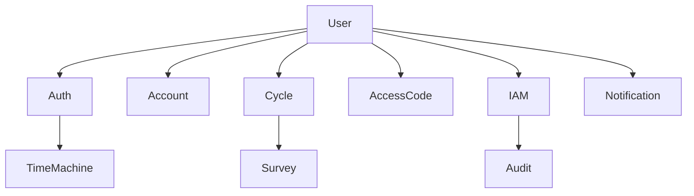

# User 도메인 요구사항

## 1. 기능 요구사항

### 1.1 사용자 관리
1. 사용자 등록
   - AccessCode를 통한 환자 등록
   - 관리자에 의한 의사/직원 등록
   - 이메일 인증 필수

2. 사용자 정보 관리
   - 프로필 정보 수정
   - 비밀번호 변경
   - 계정 비활성화/삭제

3. 사용자 조회
   - ID/이메일로 사용자 검색
   - 필터링 및 페이지네이션
   - 상세 정보 조회

### 1.2 인증/인가
1. 로그인
   - 이메일/비밀번호 로그인
   - AccessCode 기반 임시 로그인
   - JWT 토큰 발급

2. 권한 관리
   - 역할 기반 접근 제어(RBAC)
   - 권한 그룹 관리
   - 권한 위임 기능

### 1.3 계정 관리
1. 계정 설정
   - 계정 정보 관리
   - 사용자 그룹 관리
   - 부서/직책 관리

2. 계정 정책
   - 비밀번호 정책 설정
   - 접근 제한 정책
   - 세션 관리 정책

### 1.4 사용자 주기 관리
1. 주기 생성
   - 치료 시작 시 주기 생성
   - 치료 기간 설정
   - 주기별 설문 설정

2. 주기 모니터링
   - 주기 진행 상태 추적
   - 설문 응답 현황
   - 알림 설정

### 1.5 IAM 통합 관리
1. 역할 할당 및 관리
   - 사용자에게 IAM 역할 할당
   - 역할 할당 이력 추적
   - 역할 만료 시간 설정
   - 역할 회수 기능

2. 권한 요청 및 승인
   - 권한 변경 요청 생성
   - 승인 워크플로우 관리
   - 승인자 지정 및 알림
   - 요청 상태 추적

3. 조직 기반 권한 관리
   - 조직/팀 단위 권한 범위 지정
   - 조직 계층 구조 기반 권한 상속
   - 특정 리소스에 대한 접근 제어
   - 임시 권한 부여 기능

4. 권한 검증 및 적용
   - 사용자 세션에 권한 정보 포함
   - API별 권한 검증
   - 권한 기반 UI 요소 노출/숨김
   - 다중 역할 지원

## 2. 비기능 요구사항

### 2.1 성능 요구사항
1. 응답 시간
   - 로그인: 1초 이내
   - 사용자 조회: 500ms 이내
   - 프로필 수정: 2초 이내

2. 처리량
   - 동시 접속자: 최대 10,000명
   - 초당 로그인 요청: 100건
   - 초당 조회 요청: 1,000건

### 2.2 보안 요구사항
1. 데이터 보안
   - 비밀번호 해시화 (bcrypt)
   - 민감 정보 암호화
   - 개인정보 보호법 준수

2. 접근 보안
   - HTTPS 필수
   - CORS 정책 설정
   - Rate Limiting 적용

### 2.3 가용성 요구사항
- 서비스 가용성: 99.9%
- 백업 및 복구 계획
- 장애 복구 시간: 10분 이내

### 2.4 IAM 요구사항
1. 보안
   - 권한 변경은 감사 로그 기록 필수
   - 중요 역할은 다중 승인 필요
   - 권한 검증 실패 이벤트 로깅

2. 확장성
   - 새로운 역할 유형 추가 용이성
   - 대량 사용자 권한 관리 지원
   - 권한 변경 배치 처리 지원

3. 규정 준수
   - GDPR 요구사항 준수
   - 권한 분리 원칙 적용
   - 최소 권한 원칙 준수
   - 주기적 권한 검토 지원

## 3. 구현 우선순위

### 3.1 Phase 1 - MVP (1개월)
- 기본 사용자 등록/인증
- 프로필 관리
- 기본 권한 관리

### 3.2 Phase 2 - 확장 (2개월)
- 고급 권한 관리
- 계정 정책 관리
- 사용자 주기 관리
- 기본 IAM 역할 연동

### 3.3 Phase 3 - 고도화 (3개월)
- 성능 최적화
- 고급 보안 기능
- 통계 및 분석
- 고급 IAM 기능 (승인 워크플로우, 임시 권한)

## 4. 바운디드 컨텍스트

### 4.1 컨텍스트 맵

### 4.2 컨텍스트 간 관계
- User ↔ Auth: 인증/인가 처리
- User ↔ Account: 소속 기관 관리
- User ↔ Cycle: 치료 주기 관리
- User ↔ AccessCode: 사용자 등록 인증
- User ↔ IAM: 사용자 권한 관리
- IAM ↔ Audit: 권한 변경 감사 로깅
- Auth ↔ TimeMachine: 토큰 만료 시간 관리
- Cycle ↔ Survey: 주기별 설문 관리

## 5. 변경 이력
| 버전 | 날짜 | 작성자 | 변경 내용 |
|------|------|--------|-----------|
| 0.1.0 | 2025-03-16 | bok@weltcorp.com | 최초 작성 |
| 0.2.0 | 2025-03-20 | bok@weltcorp.com | IAM 통합 요구사항 추가 |