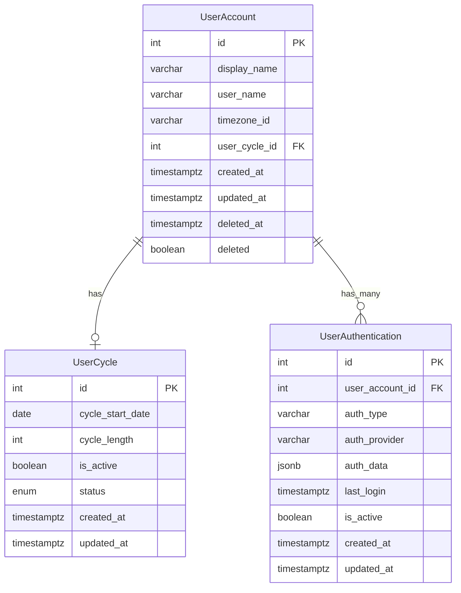
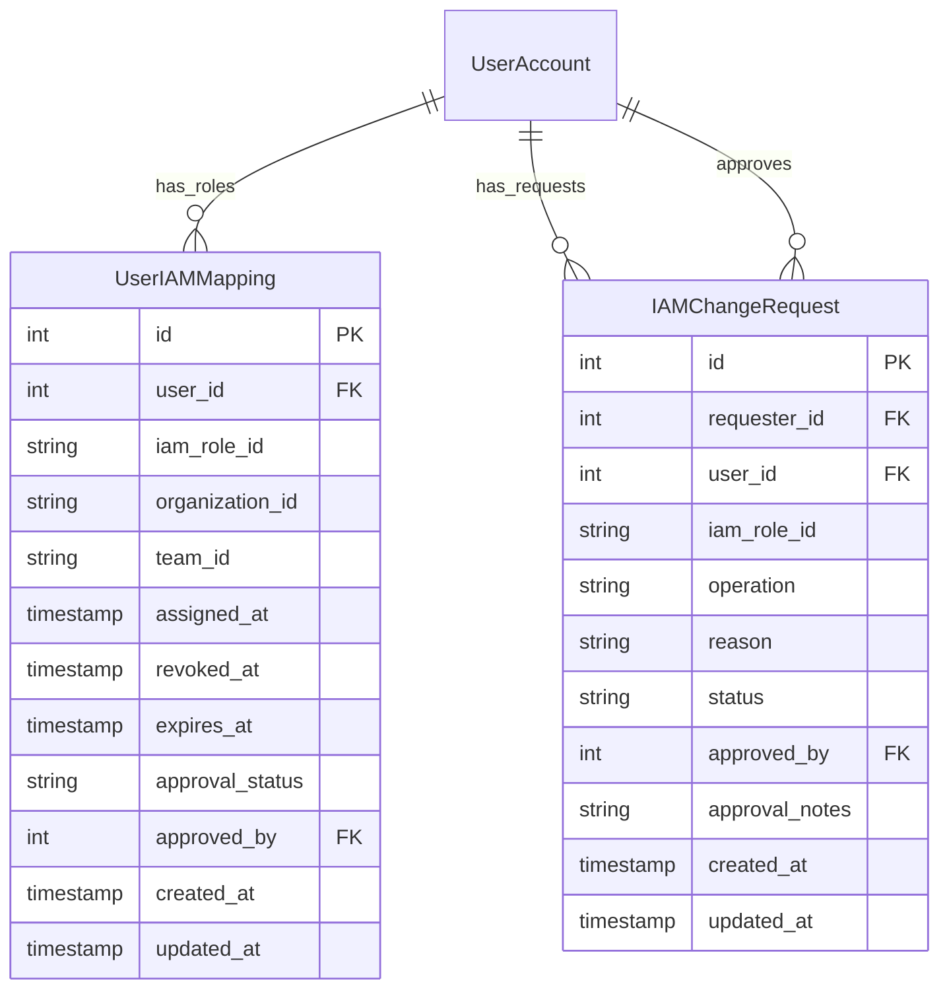

# 사용자 계정 시스템 요구사항

## 개요
사용자 계정 관리를 위한 데이터 모델 및 기능 요구사항을 정의합니다. 이 시스템은 사용자의 기본 정보, 인증 관리를 포함합니다.

## 기능 요구사항

### 1. 사용자 계정 기본 정보
- 각 사용자는 고유한 ID를 가져야 함 (자동 증가 정수)
- 사용자 표시 이름(display_name) 관리 (선택적)
  - 최대 길이: 100자
  - 허용 문자: 한글, 영문, 숫자, 공백
  - 입력 형식: 앞뒤 공백 제거
- 사용자명(user_name) 관리 (선택적)
  - 최소 길이: 3자
  - 최대 길이: 30자
  - 허용 문자: 영문 소문자, 숫자, 밑줄(_), 하이픈(-)
  - 시작 문자: 영문 소문자만 허용
  - 고유성 보장 필요
- 타임존 설정 관리
  - 기본값: Asia/Seoul
  - IANA 타임존 데이터베이스 기준 유효성 검증
  - 잘못된 타임존 입력 시 기본값 사용
- 사용자 주기(cycle) 관리 (선택적)
  - 주기 시작일
  - 주기 길이 (일 단위)
  - 주기 상태 (활성/비활성)

### 2. 계정 상태 관리
- 계정 생성 시간 기록
  - UTC 기준 timestamptz 사용
  - 자동 생성
- 계정 수정 시간 기록
  - UTC 기준 timestamptz 사용
  - 모든 필드 수정 시 자동 갱신
- 계정 삭제 상태 관리 (soft delete)
  - deleted 필드로 삭제 여부 표시
  - 실제 데이터는 보존
  - 삭제된 계정 복구 기능 지원
- 계정 삭제 시간 기록
  - UTC 기준 timestamptz 사용
  - soft delete 시점 기록

### 3. 연관 기능
- 사용자 인증 정보 관리 (user_authentication)
  - 다중 인증 방식 지원
    - 이메일/패스워드
    - OAuth 2.0
    - SAML
  - 인증 이력 관리
  - 세션 관리
  - 보안 설정 (2FA, IP 제한 등)
- 사용자 주기 정보 관리 (user_cycle)
  - 주기 시작일
  - 주기 길이
  - 주기 상태
  - 주기 이력 관리

## 데이터베이스 스키마 요구사항

### 테이블 구조
- 스키마 이름: private
- 테이블 이름: user_account

### 필드 정의
1. **기본 정보**
   - id: Int (Primary Key, Auto-increment)
   - display_name: String (Nullable, VARCHAR(100))
   - user_name: String (Nullable, VARCHAR(30))
   - timezone_id: String (Default: "Asia/Seoul", VARCHAR(30))
   - user_cycle_id: Int (Foreign Key to user_cycle, Nullable)

2. **시간 관리**
   - created_at: DateTime (Default: now(), Timestamptz(6))
   - updated_at: DateTime (Default: now(), Timestamptz(6))
   - deleted_at: DateTime (Nullable, Timestamptz(6))

3. **상태 관리**
   - deleted: Boolean (Default: false)

### 인덱스
- timezone_id에 대한 인덱스 (idx_user_account_timezone)
- user_name에 대한 유니크 인덱스 (idx_user_account_user_name_unique)
- deleted 상태에 대한 인덱스 (idx_user_account_deleted)

### 관계 정의
1. user_cycle (1:1)
   - 참조 키: user_cycle_id
   - 동작: NoAction (삭제/수정)
   - 제약조건: 
     - 순환 참조 방지
     - 주기 정보 삭제 시 user_cycle_id null 처리

2. user_authentication (1:N)
   - 역방향 관계
   - 제약조건:
     - 계정 삭제 시 인증 정보도 함께 삭제 처리
     - 최소 1개 이상의 인증 방식 필요

## 구현 시 고려사항

### **보안**:
1. 민감 정보 조회 시 별도 권한 검증 필요
   - Role 기반 접근 제어
   - 2차 인증 필요
   - 접근 토큰 발급 및 관리

### **성능**:
1. timezone_id 검색을 위한 인덱스 활용
   - 복합 인덱스 고려 (timezone_id + deleted)
   - 인덱스 사용률 모니터링
2. 삭제된 계정 조회 시 성능 최적화
   - deleted 필드 인덱스 활용
   - 삭제된 데이터 아카이빙 정책 수립
3. 캐시 전략
   - 사용자 기본 정보 캐시
   - 인증 정보 캐시
   - Redis 활용

### **데이터 정합성**:
1. 사용자 주기 정보 변경 시 관련 데이터 동기화
   - 트랜잭션 처리
   - 이벤트 기반 동기화
   - 변경 이력 관리
2. 동시성 제어
   - 낙관적 락 구현
   - 버전 관리
   - 충돌 해결 전략

### **확장성**:
1. 추가 사용자 정보 필드 확장 가능성
   - 스키마 변경 관리
   - 마이그레이션 전략
   - 하위 호환성 유지
2. 인증 방식 추가 지원
   - 플러그인 아키텍처 설계
   - 인증 프로바이더 인터페이스 정의
   - 설정 관리
3. 다국어 지원
   - 사용자 선호 언어 설정
   - 타임존별 현지화
   - 메시지 번역 관리

### **모니터링 및 알림**:
1. 계정 활동 모니터링
   - 로그인 시도 횟수
   - 비정상 접근 탐지
   - 사용 패턴 분석
2. 시스템 건강도 모니터링
   - 데이터베이스 성능
   - API 응답 시간
   - 에러율 추적
3. 알림 시스템
   - 보안 이벤트 알림
   - 시스템 이상 알림
   - 사용자 활동 알림

## 데이터베이스 모델 (ERD)



## 5. 외부 도메인 통합

### 5.1 Auth 도메인 통합

사용자 계정은 Auth 도메인의 인증 및 인가 서비스와 통합됩니다. 특히 앱 토큰 및 사용자 인증 관련 기능은 Auth 도메인에서 제공하는 서비스를 활용합니다.

#### 5.1.1 앱 토큰 활용

사용자 계정 관련 API는 Auth 도메인에서 제공하는 앱 토큰 인증 메커니즘을 활용합니다. 앱 토큰 구현에 대한 자세한 내용은 [Auth 도메인의 앱 토큰 기술 명세](../../auth/technical-spec/app-token.md)를 참조하세요.

```typescript
@Injectable()
export class UserAccountService {
  constructor(
    @InjectRepository(UserAccountEntity)
    private readonly userAccountRepository: Repository<UserAccountEntity>,
    private readonly authService: AuthService, // Auth 도메인의 서비스 주입
  ) {}

  async createUserAccount(createUserDto: CreateUserDto, appToken: AppTokenPayload): Promise<UserAccount> {
    // 앱 토큰에서 디바이스 ID 추출
    const { deviceId } = appToken;
    
    // 사용자 계정 생성
    const userAccount = new UserAccountEntity();
    userAccount.displayName = createUserDto.displayName;
    userAccount.userName = createUserDto.userName;
    userAccount.timezoneId = createUserDto.timezoneId || 'Asia/Seoul';
    
    // 사용자 계정 저장
    const savedAccount = await this.userAccountRepository.save(userAccount);
    
    // Auth 도메인의 서비스를 통해 디바이스와 사용자 연결
    await this.authService.linkDeviceToUser(deviceId, savedAccount.id);
    
    return savedAccount;
  }
}
```

### 5.2 IAM 도메인 통합

사용자 계정은 IAM 도메인과 통합되어 권한 관리와 역할 기반 접근 제어를 제공합니다. 사용자 계정 도메인은 IAM 역할 매핑 정보를 관리하고, IAM 시스템과의 동기화를 담당합니다.

#### 5.2.1 사용자-IAM 역할 매핑

사용자와 IAM 역할 간의 매핑 정보는 별도의 테이블에서 관리됩니다:

```typescript
@Injectable()
export class UserIAMService {
  constructor(
    @InjectRepository(UserIAMMappingEntity)
    private readonly userIAMMappingRepository: Repository<UserIAMMappingEntity>,
    private readonly iamSystemService: IAMSystemService, // IAM 시스템 서비스 주입
  ) {}

  async assignRoleToUser(
    userId: number,
    roleId: string,
    options?: {
      organizationId?: string,
      teamId?: string,
      expiresAt?: Date
    }
  ): Promise<UserIAMMapping> {
    // IAM 시스템에 역할 할당 요청
    await this.iamSystemService.validateAndAssignRole(userId, roleId, options);
    
    // 로컬 매핑 정보 생성
    const mapping = new UserIAMMappingEntity();
    mapping.userId = userId;
    mapping.iamRoleId = roleId;
    mapping.organizationId = options?.organizationId;
    mapping.teamId = options?.teamId;
    mapping.assignedAt = new Date();
    mapping.expiresAt = options?.expiresAt;
    mapping.approvalStatus = UserIAMApprovalStatus.APPROVED;
    
    // 매핑 정보 저장
    return this.userIAMMappingRepository.save(mapping);
  }
  
  async getUserRoles(userId: number): Promise<IAMRole[]> {
    // 사용자의 활성 역할 매핑 가져오기
    const mappings = await this.userIAMMappingRepository.find({
      where: {
        userId,
        revokedAt: IsNull(),
        expiresAt: MoreThan(new Date()),
        approvalStatus: UserIAMApprovalStatus.APPROVED
      }
    });
    
    // IAM 시스템에서 역할 상세 정보 조회
    return this.iamSystemService.getRoleDetails(
      mappings.map(mapping => mapping.iamRoleId)
    );
  }
  
  async revokeRole(userId: number, roleId: string, reason: string): Promise<void> {
    // IAM 시스템에 역할 회수 요청
    await this.iamSystemService.revokeRole(userId, roleId, reason);
    
    // 로컬 매핑 정보 업데이트
    await this.userIAMMappingRepository.update(
      { userId, iamRoleId: roleId, revokedAt: IsNull() },
      { revokedAt: new Date() }
    );
  }
}
```

#### 5.2.2 IAM 이벤트 구독

사용자 계정 시스템은 IAM 시스템에서 발생하는 이벤트를 구독하여 역할 및 권한 변경 사항을 실시간으로 반영합니다:

```typescript
@Injectable()
export class IAMEventSubscriber {
  constructor(
    @InjectRepository(UserIAMMappingEntity)
    private readonly userIAMMappingRepository: Repository<UserIAMMappingEntity>,
    private readonly eventService: EventBusService,
  ) {
    this.subscribeToEvents();
  }
  
  private subscribeToEvents(): void {
    // IAM 역할 할당 이벤트 구독
    this.eventService.subscribe('iam.role.assigned', this.handleRoleAssigned.bind(this));
    
    // IAM 역할 회수 이벤트 구독
    this.eventService.subscribe('iam.role.revoked', this.handleRoleRevoked.bind(this));
    
    // IAM 역할 변경 이벤트 구독
    this.eventService.subscribe('iam.role.changed', this.handleRoleChanged.bind(this));
  }
  
  private async handleRoleAssigned(event: IAMRoleAssignedEvent): Promise<void> {
    const { userId, roleId, organizationId, teamId, expiresAt } = event;
    
    // 로컬 매핑 정보 생성 또는 업데이트
    const existingMapping = await this.userIAMMappingRepository.findOne({
      where: {
        userId,
        iamRoleId: roleId,
        revokedAt: IsNull()
      }
    });
    
    if (existingMapping) {
      // 기존 매핑 업데이트
      await this.userIAMMappingRepository.update(
        { id: existingMapping.id },
        {
          organizationId,
          teamId,
          expiresAt,
          updatedAt: new Date()
        }
      );
    } else {
      // 새 매핑 생성
      const mapping = new UserIAMMappingEntity();
      mapping.userId = userId;
      mapping.iamRoleId = roleId;
      mapping.organizationId = organizationId;
      mapping.teamId = teamId;
      mapping.assignedAt = new Date();
      mapping.expiresAt = expiresAt;
      mapping.approvalStatus = UserIAMApprovalStatus.APPROVED;
      
      await this.userIAMMappingRepository.save(mapping);
    }
  }
  
  private async handleRoleRevoked(event: IAMRoleRevokedEvent): Promise<void> {
    const { userId, roleId } = event;
    
    // 로컬 매핑 정보 업데이트
    await this.userIAMMappingRepository.update(
      { userId, iamRoleId: roleId, revokedAt: IsNull() },
      { revokedAt: new Date(), updatedAt: new Date() }
    );
  }
  
  private async handleRoleChanged(event: IAMRoleChangedEvent): Promise<void> {
    // 역할 변경 이벤트 처리 로직
  }
}
```

## 6. 데이터베이스 모델 확장 (IAM 통합)

### 6.1 IAM 관련 테이블 구조

IAM 통합을 위해 추가되는 테이블 구조는 다음과 같습니다:



### 6.2 데이터베이스 관계 정의

1. UserAccount와 UserIAMMapping (1:N)
   - 한 사용자는 여러 IAM 역할을 가질 수 있음
   - 외래 키: UserIAMMapping.user_id → UserAccount.id
   - 삭제 시 동작: Cascade (사용자 삭제 시 모든 역할 매핑도 삭제)

2. UserAccount와 IAMChangeRequest (1:N, 두 가지 관계)
   - 요청자 관계: IAMChangeRequest.requester_id → UserAccount.id
   - 대상자 관계: IAMChangeRequest.user_id → UserAccount.id
   - 승인자 관계: IAMChangeRequest.approved_by → UserAccount.id
   - 삭제 시 동작: 요청자 관계는 유지, 대상자 관계는 Cascade

### 6.3 인덱스 정의

1. UserIAMMapping 테이블 인덱스
   - 사용자별 역할 조회를 위한 인덱스: (user_id, revoked_at, expires_at)
   - 역할별 사용자 조회를 위한 인덱스: (iam_role_id, approval_status)
   - 조직별 역할 조회를 위한 인덱스: (organization_id, team_id)

2. IAMChangeRequest 테이블 인덱스
   - 요청 상태별 조회를 위한 인덱스: (status)
   - 사용자별 요청 조회를 위한 인덱스: (user_id)
   - 요청자별 조회를 위한 인덱스: (requester_id)

## 7. 접근 제어 및 권한 관리

### 7.1 계정 접근 권한 모델

IAM 통합에 따른 사용자 계정 접근 권한 모델은 다음과 같습니다:

```typescript
enum AccountPermission {
  READ = 'account:read',                  // 계정 조회
  CREATE = 'account:create',              // 계정 생성
  UPDATE = 'account:update',              // 계정 수정
  DELETE = 'account:delete',              // 계정 삭제
  MANAGE_AUTH = 'account:manage-auth',    // 인증 정보 관리
  MANAGE_CYCLES = 'account:manage-cycles', // 주기 정보 관리
  MANAGE_IAM = 'account:manage-iam'       // IAM 역할 관리
}

// IAM 역할과 계정 권한 매핑
const ROLE_PERMISSIONS = {
  'SYSTEM_ADMIN': [
    AccountPermission.READ,
    AccountPermission.CREATE,
    AccountPermission.UPDATE,
    AccountPermission.DELETE,
    AccountPermission.MANAGE_AUTH,
    AccountPermission.MANAGE_CYCLES,
    AccountPermission.MANAGE_IAM
  ],
  'ACCOUNT_ADMIN': [
    AccountPermission.READ,
    AccountPermission.CREATE,
    AccountPermission.UPDATE,
    AccountPermission.MANAGE_AUTH,
    AccountPermission.MANAGE_CYCLES
  ],
  'IAM_ADMIN': [
    AccountPermission.READ,
    AccountPermission.MANAGE_IAM
  ],
  'ACCOUNT_MANAGER': [
    AccountPermission.READ,
    AccountPermission.UPDATE,
    AccountPermission.MANAGE_CYCLES
  ],
  'USER': [
    AccountPermission.READ
  ]
};
```

### 7.2 권한 검증 구현

계정 관련 작업 시 사용자의 권한 검증은 다음과 같이 구현됩니다:

```typescript
@Injectable()
export class AccountPermissionService {
  constructor(
    private readonly userIAMService: UserIAMService,
    private readonly cacheService: CacheService
  ) {}
  
  async hasPermission(
    userId: number,
    permission: AccountPermission,
    targetUserId?: number
  ): Promise<boolean> {
    // 자신의 계정에 대한 기본 권한 확인
    if (userId === targetUserId && this.isSelfManagementPermission(permission)) {
      return true;
    }
    
    // 캐시된 권한 확인
    const cacheKey = `user:${userId}:permissions`;
    const cachedPermissions = await this.cacheService.get<AccountPermission[]>(cacheKey);
    
    if (cachedPermissions) {
      return cachedPermissions.includes(permission);
    }
    
    // IAM 서비스에서 사용자 역할 조회
    const roles = await this.userIAMService.getUserRoles(userId);
    
    // 역할에 따른 권한 확인
    const permissions = this.getPermissionsFromRoles(roles);
    
    // 권한 캐싱 (5분)
    await this.cacheService.set(cacheKey, permissions, 5 * 60);
    
    return permissions.includes(permission);
  }
  
  private isSelfManagementPermission(permission: AccountPermission): boolean {
    // 자신의 계정에 대해 허용되는 권한
    return [
      AccountPermission.READ,
      AccountPermission.UPDATE
    ].includes(permission);
  }
  
  private getPermissionsFromRoles(roles: IAMRole[]): AccountPermission[] {
    // 중복 제거를 위해 Set 사용
    const permissionSet = new Set<AccountPermission>();
    
    for (const role of roles) {
      const permissions = ROLE_PERMISSIONS[role.id];
      if (permissions) {
        permissions.forEach(permission => permissionSet.add(permission));
      }
    }
    
    return Array.from(permissionSet);
  }
}
```

### 7.3 API 엔드포인트 권한 제어

NestJS 컨트롤러에서의 권한 검증 데코레이터 구현:

```typescript
@Controller('v1/accounts')
export class UserAccountController {
  constructor(
    private readonly userAccountService: UserAccountService,
    private readonly accountPermissionService: AccountPermissionService
  ) {}
  
  @Get()
  @RequirePermission(AccountPermission.READ)
  async getAllAccounts(): Promise<UserAccount[]> {
    return this.userAccountService.findAll();
  }
  
  @Get(':id')
  async getAccount(
    @Param('id') id: number,
    @CurrentUser() currentUser: UserContext
  ): Promise<UserAccount> {
    // 자신의 계정이거나 계정 조회 권한이 있는 경우 허용
    const hasPermission = 
      currentUser.id === id || 
      await this.accountPermissionService.hasPermission(
        currentUser.id, 
        AccountPermission.READ,
        id
      );
    
    if (!hasPermission) {
      throw new ForbiddenException('계정 조회 권한이 없습니다.');
    }
    
    return this.userAccountService.findById(id);
  }
  
  @Post()
  @RequirePermission(AccountPermission.CREATE)
  async createAccount(@Body() dto: CreateUserAccountDto): Promise<UserAccount> {
    return this.userAccountService.create(dto);
  }
  
  @Patch(':id/roles')
  @RequirePermission(AccountPermission.MANAGE_IAM)
  async assignRole(
    @Param('id') userId: number,
    @Body() dto: AssignRoleDto,
    @CurrentUser() currentUser: UserContext
  ): Promise<void> {
    await this.userIAMService.requestRoleAssignment(
      currentUser.id,
      userId,
      dto.roleId,
      dto.reason,
      dto.options
    );
  }
}
```

## 8. 데이터 보안 규정 준수

### 8.1 데이터 호스팅 위치
- DiGA 및 GDPR 규제 준수를 위한 독일 리전 사용
  - PostgreSQL 데이터베이스: europe-west3(프랑크푸르트) 리전 설정
    - 사용자 계정 정보, 프로필 데이터, 사용자 주기 데이터 등 저장
    - 개인식별정보에 대한 특별 보호 및 데이터 최소화 원칙 적용
    - 백업 및 복제본도 동일 리전 내에서만 유지
  - Redis(Memorystore): europe-west3 리전 인스턴스 사용
    - 사용자 세션 정보, 일시적 캐싱 데이터 저장
    - 개인식별정보 포함 가능성이 있어 독일 리전 필수
  - 데이터 처리 작업의 지역적 제한
    - 사용자 데이터 처리는 독일 리전 내에서만 수행
    - 국경 간 데이터 이전 방지 메커니즘 구현
- 리전 구성 검증
  - 인프라 배포 시 리전 설정 자동 검증
  - 정기적인 규정 준수 감사 수행
  - 규정 위반 시 즉시 시정 조치 및 보고

## 변경 이력
| 버전 | 날짜 | 작성자 | 변경 내용 |
|------|------|--------|-----------|
| 0.1.0 | 2025-03-16 | bok@weltcorp.com | 최초 작성 |
| 0.2.0 | 2025-03-19 | bok@weltcorp.com | DiGA 및 GDPR 규제 준수를 위한 데이터 호스팅 위치 관련 내용 추가 |
| 0.3.0 | 2025-03-22 | bok@weltcorp.com | IAM 통합 관련 내용 추가 및 접근 제어 모델 세부 정의 |
