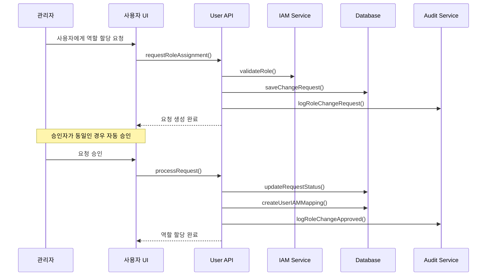
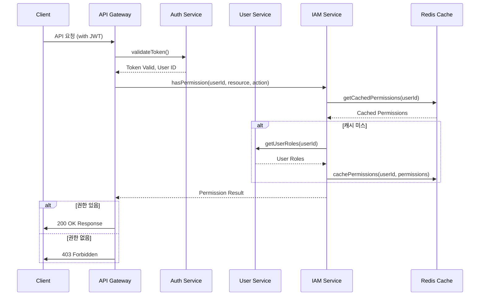

# IAM 통합 요구사항

## 1. 개요
사용자 도메인과 IAM 시스템 간의 통합을 통해 사용자에게 적절한 권한을 할당하고 관리하는 기능을 제공합니다. 이 문서는 사용자 도메인이 IAM 시스템과 어떻게 통합되는지, 그리고 관련 기술적 구현 내용을 정의합니다.

## 2. 주요 기능 요구사항

### 2.1 역할 할당 및 관리
- 관리자는 사용자에게 IAM 역할을 할당할 수 있어야 한다.
- 시스템은 사용자에게 할당된 모든 역할의 이력을 유지해야 한다.
- 역할 할당 시 만료 기간을 설정할 수 있어야 한다.
- 관리자는 사용자의 역할을 회수할 수 있어야 한다.
- 중요 역할의 할당/회수는 승인 워크플로우를 거쳐야 한다.

### 2.2 권한 요청 및 승인
- 사용자는 특정 역할에 대한 접근 권한을 요청할 수 있어야 한다.
- 권한 요청 시 사유를 반드시 제공해야 한다.
- 승인자는 권한 요청을 승인하거나 거부할 수 있어야 한다.
- 승인/거부 시 메모를 추가할 수 있어야 한다.
- 요청자와 승인자는 요청 상태에 대한 알림을 받아야 한다.

### 2.3 조직 기반 권한 관리
- 역할은 조직/팀 범위로 제한할 수 있어야 한다.
- 관리자는 자신의 조직 범위 내에서만 역할을 할당할 수 있어야 한다.
- 사용자는 여러 조직의 서로 다른 역할을 가질 수 있어야 한다.
- 조직 계층 구조에 따라 권한이 상속되어야 한다.

### 2.4 권한 검증 및 적용
- 시스템은 API 호출 시 사용자의 권한을 검증해야 한다.
- 권한 검증 실패 시 적절한 오류 메시지와 함께 거부해야 한다.
- 모든 권한 검증은 감사 로그로 기록되어야 한다.
- UI 요소는 사용자의 권한에 따라 동적으로 표시/숨김 처리해야 한다.

## 3. 기술적 구현

### 3.1 엔티티 및 값 객체

#### UserIAMMapping 엔티티
```typescript
interface UserIAMMapping {
  id: number;                 // Primary Key
  userId: number;             // Foreign Key to UserAccount
  iamRoleId: string;          // IAM 역할 ID
  organizationId?: string;    // 조직 ID (범위 제한용)
  teamId?: string;            // 팀 ID (범위 제한용)
  assignedAt: Date;           // 역할 할당 시간
  revokedAt?: Date;           // 역할 회수 시간
  expiresAt?: Date;           // 역할 만료 시간
  approvalStatus: UserIAMApprovalStatus; // 승인 상태
  approvedBy?: number;        // 승인자 ID
  createdAt: Date;            // 생성 시간
  updatedAt: Date;            // 수정 시간
}

enum UserIAMApprovalStatus {
  PENDING = 'PENDING',       // 승인 대기
  APPROVED = 'APPROVED',     // 승인됨
  REJECTED = 'REJECTED'      // 거부됨
}
```

#### IAMChangeRequest 엔티티
```typescript
interface IAMChangeRequest {
  id: number;                 // Primary Key
  requesterId: number;        // 요청자 ID
  userId: number;             // 대상 사용자 ID
  iamRoleId: string;          // IAM 역할 ID
  operation: IAMOperation;    // 작업 유형
  reason: string;             // 요청 사유
  status: IAMRequestStatus;   // 요청 상태
  approvedBy?: number;        // 승인자 ID
  approvalNotes?: string;     // 승인/거부 메모
  createdAt: Date;            // 생성 시간
  updatedAt: Date;            // 수정 시간
}

enum IAMOperation {
  ASSIGN = 'ASSIGN',          // 역할 할당
  REVOKE = 'REVOKE'           // 역할 회수
}

enum IAMRequestStatus {
  PENDING = 'PENDING',        // 대기 중
  APPROVED = 'APPROVED',      // 승인됨
  REJECTED = 'REJECTED',      // 거부됨
  EXPIRED = 'EXPIRED'         // 만료됨
}
```

#### IAMRole 값 객체
```typescript
interface IAMRole {
  id: string;
  name: string;
  description: string;
  permissions: IAMPermission[];
  scopeType?: IAMScopeType;
  scopeDefinition?: object;
  isSystemRole: boolean;
  createdAt: Date;
  updatedAt: Date;
}

enum IAMScopeType {
  GLOBAL = 'GLOBAL',           // 전역 범위
  ORGANIZATION = 'ORGANIZATION', // 조직 범위
  TEAM = 'TEAM',               // 팀 범위
  SITE = 'SITE',               // 사이트 범위
  RESOURCE = 'RESOURCE'        // 특정 리소스 범위
}
```

### 3.2 데이터베이스 스키마

#### 역할 매핑 테이블
```prisma
model UserIAMMapping {
  id            Int       @id @default(autoincrement())
  userId        Int       @map("user_id")
  iamRoleId     String    @map("iam_role_id") @db.VarChar(100)
  organizationId String?   @map("organization_id") @db.VarChar(100)
  teamId        String?   @map("team_id") @db.VarChar(100)
  assignedAt    DateTime  @default(now()) @map("assigned_at") @db.Timestamptz()
  revokedAt     DateTime? @map("revoked_at") @db.Timestamptz()
  expiresAt     DateTime? @map("expires_at") @db.Timestamptz()
  approvalStatus String    @default("APPROVED") @map("approval_status") @db.VarChar(20)
  approvedBy    Int?      @map("approved_by")
  createdAt     DateTime  @default(now()) @map("created_at") @db.Timestamptz()
  updatedAt     DateTime  @default(now()) @map("updated_at") @db.Timestamptz()
  
  user          UserAccount @relation(fields: [userId], references: [id], onDelete: Cascade)
  
  @@index([userId], name: "idx_user_iam_mapping_user")
  @@index([iamRoleId], name: "idx_user_iam_mapping_role")
  @@index([organizationId], name: "idx_user_iam_mapping_org")
  @@map("user_iam_mapping")
  @@schema("private")
}
```

#### 권한 변경 요청 테이블
```prisma
model IAMChangeRequest {
  id            Int       @id @default(autoincrement())
  requesterId   Int       @map("requester_id")
  userId        Int       @map("user_id")
  iamRoleId     String    @map("iam_role_id") @db.VarChar(100)
  operation     String    @map("operation") @db.VarChar(20)
  reason        String    @map("reason") @db.Text
  status        String    @default("PENDING") @map("status") @db.VarChar(20)
  approvedBy    Int?      @map("approved_by")
  approvalNotes String?   @map("approval_notes") @db.Text
  createdAt     DateTime  @default(now()) @map("created_at") @db.Timestamptz()
  updatedAt     DateTime  @default(now()) @map("updated_at") @db.Timestamptz()

  user          UserAccount @relation(fields: [userId], references: [id], onDelete: Cascade, name: "targetUser")
  requester     UserAccount @relation(fields: [requesterId], references: [id], name: "requesterUser")
  
  @@index([userId], name: "idx_iam_change_request_user")
  @@index([status], name: "idx_iam_change_request_status")
  @@index([requesterId], name: "idx_iam_change_request_requester")
  @@map("iam_change_request")
  @@schema("private")
}
```

### 3.3 API 및 인터페이스

#### UserIAMService 인터페이스
```typescript
interface UserIAMService {
  // 사용자의 역할 목록 조회
  getUserRoles(userId: number): Promise<IAMRole[]>;
  
  // 사용자의 권한 목록 조회
  getUserPermissions(userId: number): Promise<IAMPermission[]>;
  
  // 사용자의 리소스 접근 권한 확인
  hasPermission(userId: number, resourceType: string, resourceId: string, action: string): Promise<boolean>;
  
  // 역할 할당 요청
  requestRoleAssignment(
    requesterId: number,
    userId: number,
    roleId: string,
    reason: string,
    options?: {
      expiresAt?: Date,
      organizationId?: string,
      teamId?: string
    }
  ): Promise<IAMChangeRequest>;
  
  // 역할 회수 요청
  requestRoleRevocation(
    requesterId: number,
    userId: number,
    roleId: string,
    reason: string
  ): Promise<IAMChangeRequest>;
  
  // 요청 승인/거부
  processRequest(
    requestId: number,
    approverId: number,
    approved: boolean,
    notes?: string
  ): Promise<IAMChangeRequest>;
  
  // 내 승인 대기 요청 목록
  getMyPendingApprovals(approverId: number): Promise<IAMChangeRequest[]>;
  
  // 사용자 역할 이력 조회
  getUserRoleHistory(userId: number): Promise<UserIAMMapping[]>;
  
  // 임시 권한 부여
  grantTemporaryPermission(
    granterId: number,
    userId: number,
    permissionId: string,
    durationMinutes: number,
    reason: string
  ): Promise<boolean>;
}
```

#### REST API 엔드포인트
```
GET /api/v1/users/{userId}/roles
POST /api/v1/users/{userId}/roles
DELETE /api/v1/users/{userId}/roles/{roleId}
POST /api/v1/iam/requests
GET /api/v1/iam/requests
PUT /api/v1/iam/requests/{requestId}/approve
PUT /api/v1/iam/requests/{requestId}/reject
POST /api/v1/iam/check-permission
```

### 3.4 이벤트 흐름

#### 역할 할당 워크플로우


#### 권한 검증 흐름


## 4. 보안 고려사항

### 4.1 접근 제어
- 모든 IAM 관련 API는 JWT 인증 필수
- 역할 할당/회수 API는 관리자 권한으로 제한
- 권한 요청 승인은 승인자 권한 필수
- 일정 시간(30분) 내 연속 5회 이상 권한 검증 실패 시 계정 잠금 고려

### 4.2 감사 로깅
- 모든 권한 변경은 감사 로그에 기록
- 감사 로그에 필수 포함 정보:
  - 요청자 ID 및 IP
  - 대상 사용자 ID
  - 변경된 역할 정보
  - 작업 유형 (할당/회수)
  - 타임스탬프
  - 사유

### 4.3 데이터 보호
- 권한 정보는 민감 데이터로 취급
- 데이터베이스 열 수준 암호화 고려
- 권한 정보는 필요한 컴포넌트에만 노출

## 5. 비기능적 요구사항

### 5.1 성능
- 권한 검증은 200ms 이내에 완료되어야 한다(95 percentile).
- 시스템은 동시에 1000개의 권한 검증 요청을 처리할 수 있어야 한다.
- 역할 할당/회수는 500ms 이내에 완료되어야 한다.

### 5.2 확장성
- 시스템은 100만 사용자, 각 사용자당 평균 5개의 역할을 지원해야 한다.
- 초당 최대 10,000건의 권한 검증을 처리할 수 있어야 한다.
- 권한 데이터는 캐싱을 통해 빠른 접근이 가능해야 한다.

### 5.3 보안
- 모든 역할 변경은 다중 요소 인증(MFA)을 통해 승인되어야 한다.
- 관리자 역할 할당은 감사 추적을 위해 별도 로그에 기록되어야 한다.
- 권한 검증 실패는 보안 모니터링 시스템에 실시간으로 알려야 한다.
- 과도한 권한 요청은 자동으로 차단되어야 한다.

### 5.4 가용성
- IAM 시스템은 99.99% 가용성을 유지해야 한다.
- 오프라인 권한 검증을 위한 백업 메커니즘이 있어야 한다.
- 시스템은 IAM 서비스 장애 시에도 제한된 기능으로 운영되어야 한다.

## 6. 구현 로드맵

### 6.1 Phase 1: 기본 통합 (2주)
- IAM 서비스 연동
- 기본 역할 할당 및 회수 기능
- 데이터베이스 스키마 설계

### 6.2 Phase 2: 권한 검증 (2주)
- 권한 검증 구현
- 캐싱 메커니즘 구현
- API 게이트웨이 통합

### 6.3 Phase 3: 승인 워크플로우 (3주)
- 권한 요청 및 승인 프로세스
- 알림 통합
- 감사 로깅 연동

### 6.4 Phase 4: 고급 기능 (3주)
- 임시 권한 기능
- 조직 기반 권한 관리
- UI 통합

## 7. 테스트 전략

### 7.1 단위 테스트
- 권한 검증 로직
- 승인 워크플로우 상태 전이
- 캐싱 메커니즘

### 7.2 통합 테스트
- IAM 서비스 연동
- 권한 변경 감사 로깅
- API 통합 테스트

### 7.3 성능 테스트
- 권한 검증 성능 (1ms 이내)
- 대량 권한 처리 성능 (초당 1,000건)
- 캐시 효율성 테스트

## 8. 변경 이력
| 버전 | 날짜 | 작성자 | 변경 내용 |
|------|------|--------|-----------|
| 0.1.0 | 2025-03-20 | bok@weltcorp.com | 최초 작성 |
| 0.2.0 | 2025-03-20 | bok@weltcorp.com | 기술적 구현 상세화 및 테스트 전략 추가 | 