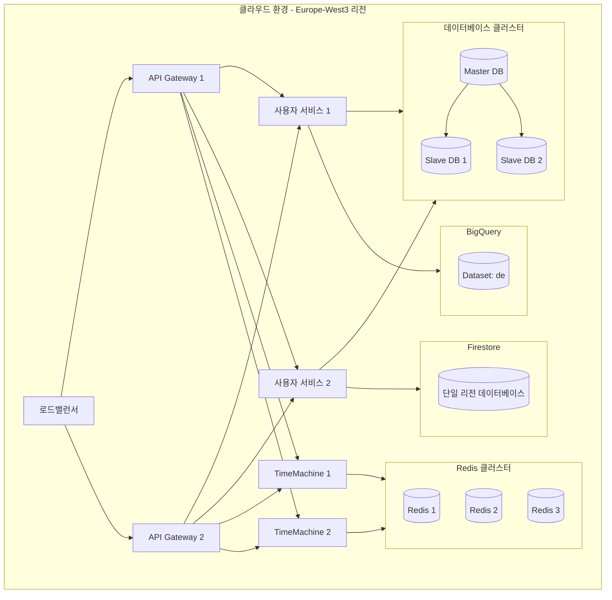
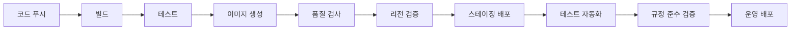

# 인프라 배포 구성

## 개요
이 문서는 시스템의 인프라 구성과 배포 프로세스를 설명합니다. 모든 프로덕션 데이터는 DiGA 및 GDPR 규제 준수를 위해 독일 리전(europe-west3, 프랑크푸르트)에서 호스팅됩니다.

## 인프라 구성도



## 컴포넌트 구성

### 1. 쿠버네티스 클러스터
- 노드 구성
  - 마스터 노드: 3대
  - 워커 노드: 최소 5대
- 리소스 할당
  - API Gateway: 2-4 pods
  - 사용자 서비스: 3-6 pods
  - TimeMachine: 2-4 pods
- 리전 설정
  - 클러스터 리전: europe-west3 (프랑크푸르트)
  - 노드 위치: europe-west3-a, europe-west3-b, europe-west3-c (멀티 AZ)

### 2. 데이터베이스
- PostgreSQL 클러스터
  - Master: 1대
  - Slave: 2대
  - 리전: europe-west3 (프랑크푸르트)
- 백업 정책
  - 전체 백업: 일 1회
  - 증분 백업: 시간당
  - 보관 기간: 30일
  - 백업 리전: europe-west3 (프랑크푸르트)

### 3. 캐시
- Redis 클러스터
  - 노드: 3대
  - 복제본: 각 1개
  - 리전: europe-west3 (프랑크푸르트)
- 메모리 구성
  - 각 노드: 16GB
  - maxmemory-policy: allkeys-lru

### 4. 빅데이터 저장소
- BigQuery
  - 프로젝트: dtx-data
  - 데이터셋: de
  - 위치: europe-west3 (프랑크푸르트)
- Firestore
  - 모드: Native
  - 위치: europe-west3 (프랑크푸르트, 단일 리전 설정)
- Cloud Storage
  - 버킷 위치: europe-west3 (프랑크푸르트)
  - 스토리지 클래스: Standard

## 배포 프로세스

### 1. CI/CD 파이프라인


### 2. 배포 전략
- 무중단 배포 (Rolling Update)
- 블루/그린 배포
- 카나리 배포

### 3. 환경 구성
- 개발 환경
  - 리전: 개발자 선택 (개인정보 처리 시 europe-west3 필수)
- 스테이징 환경
  - 리전: europe-west3 (프랑크푸르트) 권장
- 운영 환경
  - 리전: europe-west3 (프랑크푸르트) 필수

### 4. 리전 검증 프로세스
```bash
#!/bin/bash

# 환경 변수 가져오기
ENV_TYPE=$1
GCP_PROJECT=$2

# 리전 검증 함수
verify_region() {
  resource_type=$1
  resource_name=$2
  expected_region="europe-west3"
  
  # 리소스 타입에 따른 리전 확인
  case $resource_type in
    "gke")
      actual_region=$(gcloud container clusters describe $resource_name --project $GCP_PROJECT --format="value(location)")
      ;;
    "sql")
      actual_region=$(gcloud sql instances describe $resource_name --project $GCP_PROJECT --format="value(region)")
      ;;
    "redis")
      actual_region=$(gcloud redis instances describe $resource_name --project $GCP_PROJECT --format="value(region)")
      ;;
    "bigquery")
      actual_region=$(bq show --project_id $GCP_PROJECT --format=json $resource_name | jq -r '.location')
      ;;
    "firestore")
      actual_region=$(gcloud firestore databases describe --project $GCP_PROJECT --format="value(locationId)")
      ;;
    *)
      echo "Unknown resource type: $resource_type"
      return 1
      ;;
  esac
  
  # 프로덕션 환경에서 리전 검증
  if [ "$ENV_TYPE" == "production" ] && [ "$actual_region" != "$expected_region" ]; then
    echo "ERROR: $resource_type $resource_name is in $actual_region, but should be in $expected_region"
    return 1
  fi
  
  return 0
}

# 모든 리소스 리전 검증
verify_all_regions() {
  # GKE 클러스터 검증
  verify_region "gke" "dta-cluster" || return 1
  
  # Cloud SQL 인스턴스 검증 
  verify_region "sql" "dta-postgres" || return 1
  
  # Redis 인스턴스 검증
  verify_region "redis" "dta-redis" || return 1
  
  # BigQuery 데이터셋 검증
  verify_region "bigquery" "de" || return 1
  
  # Firestore 데이터베이스 검증
  verify_region "firestore" "default" || return 1
  
  echo "All resources are in the correct region"
  return 0
}

# 검증 실행
verify_all_regions
exit_code=$?

# 프로덕션 환경에서 검증 실패 시 배포 중지
if [ "$ENV_TYPE" == "production" ] && [ $exit_code -ne 0 ]; then
  echo "Deployment aborted: DiGA/GDPR region compliance check failed"
  exit 1
fi

exit $exit_code
```

## 모니터링 구성

### 1. 메트릭스
- Prometheus + Grafana
  - 시스템 메트릭스
  - 애플리케이션 메트릭스
  - 비즈니스 메트릭스
  - 리전 규정 준수 메트릭스

### 2. 로깅
- ELK Stack
  - 로그 수집: Filebeat
  - 로그 처리: Logstash
  - 로그 저장: Elasticsearch (europe-west3)
  - 로그 시각화: Kibana
- 규정 준수 로깅
  - 리전 변경 감사 로그
  - 데이터 액세스 로그
  - 규정 위반 이벤트 로그

### 3. 알림
- 알림 채널
  - 이메일
  - Slack
  - SMS
- 알림 정책
  - 심각도 기반
  - 에스컬레이션 정책
  - 규정 준수 위반 즉시 알림

## 보안 구성

### 1. 네트워크 보안
- VPC 구성
- 서브넷 분리
- 보안 그룹 설정
- WAF 적용

### 2. 접근 제어
- IAM 정책
- RBAC 구성
- 서비스 계정 관리
- 지역별 액세스 제한

### 3. 암호화
- 통신 암호화 (TLS)
- 데이터 암호화 (at rest)
- 키 관리 (KMS, europe-west3 리전)

### 4. 데이터 규정 준수
- 개인정보 암호화 및 가명화
- 리전 간 데이터 이동 제한
- 데이터 삭제 및 보존 정책
- 개인정보 액세스 감사

## 재해 복구

### 1. 백업 전략
- 데이터베이스 백업
  - 백업 리전: europe-west3 또는 EU 내 리전
  - 교차 리전 복제 제한
- 설정 백업
- 로그 백업

### 2. 복구 절차
- RTO: 1시간
- RPO: 5분
- 복구 우선순위
- 복구 테스트 계획
- 복구 시 리전 규정 준수 검증

## 운영 가이드

### 1. 스케일링
- Auto Scaling 정책
- 수동 스케일링 절차
- 리소스 모니터링
- 리전 제약 고려한 확장

### 2. 문제 해결
- 문제 해결 가이드
- 로그 분석 방법
- 에스컬레이션 절차
- 리전 규정 준수 체크리스트

### 3. 리전 규정 준수 점검
- 정기적인 리전 설정 감사
- 리전 이탈 항목 자동 감지
- 리전 정책 위반 대응 절차
- 규정 준수 보고서 생성

## 변경 이력
| 날짜 | 버전 | 설명 | 작성자 |
|------|------|------|--------|
| 2025-03-16 | 0.1.0 | 최초 작성 | bok@weltcorp.com | 
| 2025-03-19 | 0.1.0 | DiGA 및 GDPR 규제 준수를 위한 데이터 호스팅 위치 관련 내용 추가 | bok@weltcorp.com | 